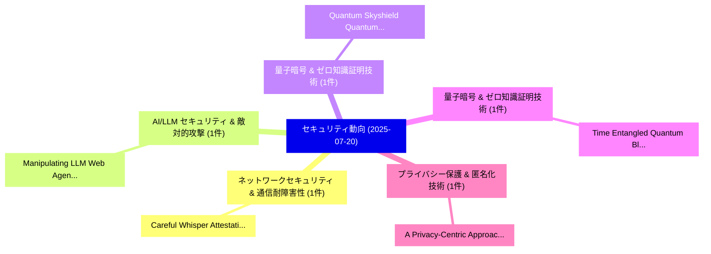

# 📅 02_daily: 日次エグゼクティブサマリー報告書 (2025-07-20)

**集計日時**: 2026-10-02 23:05:33 UTC  
**対象日付**: 2025-07-20  
**本日収集論文数**: 11 件  

---

## 💡 主要セキュリティ動向・脅威インサイト (Executive Insights)

本日の収集論文（計 11 件）において、以下の重点セキュリティ領域で活発な研究動向が確認されました：
- **ネットワークセキュリティ & 通信耐障害性** (1 件): 注目論文として 「Careful Whisper: Attestation f...」 等が発表され、実務防御および攻撃検証の進展が見られます。
- **AI/LLM セキュリティ & 敵対的攻撃** (1 件): 注目論文として 「Manipulating LLM Web Agents wi...」 等が発表され、実務防御および攻撃検証の進展が見られます。
- **量子暗号 & ゼロ知識証明技術** (1 件): 注目論文として 「Quantum Skyshield: Quantum Key...」 等が発表され、実務防御および攻撃検証の進展が見られます。
- **量子暗号 & ゼロ知識証明技術** (1 件): 注目論文として 「Time Entangled Quantum Blockch...」 等が発表され、実務防御および攻撃検証の進展が見られます。
- **プライバシー保護 & 匿名化技術** (1 件): 注目論文として 「A Privacy-Centric Approach: Sc...」 等が発表され、実務防御および攻撃検証の進展が見られます。

### 🗺️ 技術・脅威トピックマインドマップ

---

## 📌 日次セキュリティ論文一覧 (日本語表形式)

| No | arXiv ID | 論文タイトル (日本語訳) | 重要キーワード | 構造化エグゼクティブ要約 (背景・提案・影響) | 脅威分類 | 詳細リンク |
|---|---|---|---|---|---|---|
| 1 | `2507.14796v1` | [Careful Whisper: Attestation for peer-to-peer Confidential Computing networks（セキュリティ分析論文）](../../okf/papers/2025-07-20/2507.14796.md) | `Careful Whisper`, `Confidential Computing`, `Gustavo Petri` | 【提案】概要 (Overview & Key Finding) 本論文「Careful Whisper: Attestation for peer-to-peer Confident...。実証評価により経営層・セキュリティ管理者向け推奨アクション (E... | `cs.CR` | [arXiv](https://arxiv.org/abs/2507.14796v1) &#124; [OKF](../../okf/papers/2025-07-20/2507.14796.md) |
| 2 | `2507.14799v1` | [Manipulating LLM Web Agents with Indirect Prompt Injection Attack via HTML Accessibility Tree（セキュリティ分析論文）](../../okf/papers/2025-07-20/2507.14799.md) | `Indirect Prompt Injection Attack`, `Web Agents`, `Accessibility Tree` | 【提案】概要 (Overview & Key Finding) 本論文「Manipulating LLM Web Agents with Indirect プロンプトインジェクション...。実証評価により経営層・セキュリティ管理者向け推奨アクション (E... | `cs.CR` | [arXiv](https://arxiv.org/abs/2507.14799v1) &#124; [OKF](../../okf/papers/2025-07-20/2507.14799.md) |
| 3 | `2507.14822v1` | [Quantum Skyshield: Quantum Key Distribution and Post-Quantum Authentication for Low-Altitude Wireless Networks in Adverse Skies（セキュリティ分析論文）](../../okf/papers/2025-07-20/2507.14822.md) | `Quantum Key Distribution`, `Altitude Wireless Networks`, `Quantum Skyshield` | 【提案】概要 (Overview & Key Finding) 本論文「量子 Skyshield: 量子鍵配送 and Post-量子 Authentication for Low-...。実証評価により経営層・セキュリティ管理者向け推奨アクション (E... | `cs.CR` | [arXiv](https://arxiv.org/abs/2507.14822v1) &#124; [OKF](../../okf/papers/2025-07-20/2507.14822.md) |
| 4 | `2507.14839v5` | [Time Entangled Quantum Blockchain with Phase Encoding for Classical Data（セキュリティ分析論文）](../../okf/papers/2025-07-20/2507.14839.md) | `Time Entangled Quantum Blockchain`, `Phase Encoding`, `Classical Data` | 【提案】概要 (Overview & Key Finding) 本論文「Time Entangled 量子 Blockchain with Phase Encoding for Cl...。実証評価により経営層・セキュリティ管理者向け推奨アクション (E... | `cs.CR` | [arXiv](https://arxiv.org/abs/2507.14839v5) &#124; [OKF](../../okf/papers/2025-07-20/2507.14839.md) |
| 5 | `2507.14853v2` | [A Privacy-Centric Approach: Scalable and Secure 連合学習 Enabled by Hybrid Homomorphic Encryption](../../okf/papers/2025-07-20/2507.14853.md) | `Hybrid Homomorphic Encryption`, `Secure Federated Learning Enabled`, `Khoa Nguyen` | 【提案】概要 (Overview & Key Finding) 本論文「A Privacy-Centric Approach: Scalable and Secure 連合学習 En...。実証評価により経営層・セキュリティ管理者向け推奨アクション (E... | `cs.CR` | [arXiv](https://arxiv.org/abs/2507.14853v2) &#124; [OKF](../../okf/papers/2025-07-20/2507.14853.md) |
| 6 | `2507.14893v3` | [A Compact Post-quantum Strong Designated Verifier Signature Scheme from Isogenies（セキュリティ分析論文）](../../okf/papers/2025-07-20/2507.14893.md) | `Strong Designated Verifier Signature Scheme`, `Compact Post`, `Post-quantum Strong` | 【提案】概要 (Overview & Key Finding) 本論文「A Compact Post-量子 Strong Designated Verifier Signature ...。実証評価により経営層・セキュリティ管理者向け推奨アクション (E... | `cs.CR` | [arXiv](https://arxiv.org/abs/2507.14893v3) &#124; [OKF](../../okf/papers/2025-07-20/2507.14893.md) |
| 7 | `2507.14985v1` | [Metaverse Security and Privacy Research: A Systematic Review（セキュリティ分析論文）](../../okf/papers/2025-07-20/2507.14985.md) | `Metaverse Security`, `Privacy Research`, `Systematic Review` | 【提案】概要 (Overview & Key Finding) 本論文「Metaverse Security and Privacy Research: A Systematic R...。実証評価により経営層・セキュリティ管理者向け推奨アクション (E... | `cs.CR` | [arXiv](https://arxiv.org/abs/2507.14985v1) &#124; [OKF](../../okf/papers/2025-07-20/2507.14985.md) |
| 8 | `2507.14987v1` | [AlphaAlign: Incentivizing Safety Alignment with Extremely Simplified Reinforcement Learning（セキュリティ分析論文）](../../okf/papers/2025-07-20/2507.14987.md) | `Incentivizing Safety Alignment`, `Extremely Simplified Reinforcement Learning`, `Extremely Simplified Reinfor` | 【提案】概要 (Overview & Key Finding) 本論文「AlphaAlign: Incentivizing Safety Alignment with Extreme...。実証評価により経営層・セキュリティ管理者向け推奨アクション (E... | `cs.CR` | [arXiv](https://arxiv.org/abs/2507.14987v1) &#124; [OKF](../../okf/papers/2025-07-20/2507.14987.md) |
| 9 | `2507.15058v1` | [LibLMFuzz: LLM-Augmented Fuzz Target Generation for Black-box Libraries（セキュリティ分析論文）](../../okf/papers/2025-07-20/2507.15058.md) | `Augmented Fuzz Target Generation`, `LLM-Augmented Fuzz`, `Black-box Libraries` | 【提案】概要 (Overview & Key Finding) 本論文「LibLMFuzz: LLM-Augmented Fuzz Target Generation for Bla...。実証評価によりHastings - **公開日。 | `cs.CR` | [arXiv](https://arxiv.org/abs/2507.15058v1) &#124; [OKF](../../okf/papers/2025-07-20/2507.15058.md) |
| 10 | `2507.15101v1` | [Frame-level Temporal Difference Learning for Partial Deepfake Speech Detection（セキュリティ分析論文）](../../okf/papers/2025-07-20/2507.15101.md) | `Partial Deepfake Speech Detection`, `Temporal Difference Learning`, `Frame-level Temporal` | 【提案】概要 (Overview & Key Finding) 本論文「Frame-level Temporal Difference Learning for Partial De...。実証評価により経営層・セキュリティ管理者向け推奨アクション (E... | `cs.CR` | [arXiv](https://arxiv.org/abs/2507.15101v1) &#124; [OKF](../../okf/papers/2025-07-20/2507.15101.md) |
| 11 | `2507.15112v4` | [Distributional Machine Unlearning via Selective Data Removal（セキュリティ分析論文）](../../okf/papers/2025-07-20/2507.15112.md) | `Distributional Machine Unlearning`, `Selective Data Removal`, `Youssef Allouah` | 【提案】概要 (Overview & Key Finding) 本論文「Distributional Machine Unlearning via Selective Data Re...。実証評価により経営層・セキュリティ管理者向け推奨アクション (E... | `cs.CR` | [arXiv](https://arxiv.org/abs/2507.15112v4) &#124; [OKF](../../okf/papers/2025-07-20/2507.15112.md) |

