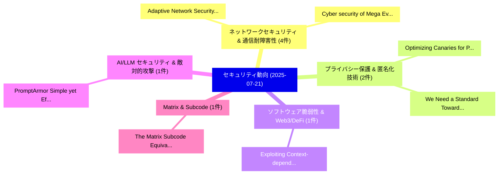

# 📅 02_daily: 日次エグゼクティブサマリー報告書 (2025-07-21)

**集計日時**: 2026-10-02 23:05:33 UTC  
**対象日付**: 2025-07-21  
**本日収集論文数**: 19 件  

---

## 💡 主要セキュリティ動向・脅威インサイト (Executive Insights)

本日の収集論文（計 19 件）において、以下の重点セキュリティ領域で活発な研究動向が確認されました：
- **ネットワークセキュリティ & 通信耐障害性** (4 件): 注目論文として 「Adaptive Network Security Poli...」、「Cyber security of Mega Events:...」 等が発表され、実務防御および攻撃検証の進展が見られます。
- **プライバシー保護 & 匿名化技術** (2 件): 注目論文として 「Optimizing Canaries for Privac...」、「"We Need a Standard": Toward a...」 等が発表され、実務防御および攻撃検証の進展が見られます。
- **ソフトウェア脆弱性 & Web3/DeFi** (1 件): 注目論文として 「Exploiting Context-dependent D...」 等が発表され、実務防御および攻撃検証の進展が見られます。
- **AI/LLM セキュリティ & 敵対的攻撃** (1 件): 注目論文として 「PromptArmor: Simple yet Effect...」 等が発表され、実務防御および攻撃検証の進展が見られます。
- **Matrix & Subcode** (1 件): 注目論文として 「The Matrix Subcode Equivalence...」 等が発表され、実務防御および攻撃検証の進展が見られます。

### 🗺️ 技術・脅威トピックマインドマップ

---

## 📌 日次セキュリティ論文一覧 (日本語表形式)

| No | arXiv ID | 論文タイトル (日本語訳) | 重要キーワード | 構造化エグゼクティブ要約 (背景・提案・影響) | 脅威分類 | 詳細リンク |
|---|---|---|---|---|---|---|
| 1 | `2507.15163v4` | [Adaptive Network Security Policies via Belief Aggregation and Rollout（セキュリティ分析論文）](../../okf/papers/2025-07-21/2507.15163.md) | `Adaptive Network Security Policies`, `Belief Aggregation`, `Kim Hammar` | 【提案】概要 (Overview & Key Finding) 本論文「Adaptive Network Security Policies via Belief Aggregati...。実証評価によりLupu, Dimi。 | `cs.CR` | [arXiv](https://arxiv.org/abs/2507.15163v4) &#124; [OKF](../../okf/papers/2025-07-21/2507.15163.md) |
| 2 | `2507.15214v1` | [Exploiting Context-dependent Duration Features for Voice Anonymization Attack Systems（セキュリティ分析論文）](../../okf/papers/2025-07-21/2507.15214.md) | `Voice Anonymization Attack Systems`, `Exploiting Context`, `Duration Features` | 【提案】概要 (Overview & Key Finding) 本論文「Exploiting Context-dependent Duration Features for Voic...。実証評価により経営層・セキュリティ管理者向け推奨アクション (E... | `cs.CR` | [arXiv](https://arxiv.org/abs/2507.15214v1) &#124; [OKF](../../okf/papers/2025-07-21/2507.15214.md) |
| 3 | `2507.15219v1` | [PromptArmor: Simple yet Effective Prompt Injection Defenses（セキュリティ分析論文）](../../okf/papers/2025-07-21/2507.15219.md) | `Effective Prompt Injection Defenses`, `William Yang Wang`, `Tianneng Shi` | 【提案】概要 (Overview & Key Finding) 本論文「PromptArmor: Simple yet Effective プロンプトインジェクション Defense...。実証評価により経営層・セキュリティ管理者向け推奨アクション (E... | `cs.CR` | [arXiv](https://arxiv.org/abs/2507.15219v1) &#124; [OKF](../../okf/papers/2025-07-21/2507.15219.md) |
| 4 | `2507.15377v1` | [The Matrix Subcode Equivalence problem and its application to signature with MPC-in-the-Head（セキュリティ分析論文）](../../okf/papers/2025-07-21/2507.15377.md) | `Magali Bardet`, `Charles Brion`, `Philippe Gaborit` | 【提案】概要 (Overview & Key Finding) 本論文「The Matrix Subcode Equivalence problem and its applicat...。実証評価により経営層・セキュリティ管理者向け推奨アクション (E... | `cs.CR` | [arXiv](https://arxiv.org/abs/2507.15377v1) &#124; [OKF](../../okf/papers/2025-07-21/2507.15377.md) |
| 5 | `2507.15393v1` | [PiMRef: Detecting and Explaining Ever-evolving Spear Phishing Emails with Knowledge Base Invariants（セキュリティ分析論文）](../../okf/papers/2025-07-21/2507.15393.md) | `Spear Phishing Emails`, `Knowledge Base Invariants`, `Explaining Ever` | 【提案】概要 (Overview & Key Finding) 本論文「PiMRef: Detecting and Explaining Ever-evolving Spear Ph...。実証評価により経営層・セキュリティ管理者向け推奨アクション (E... | `cs.CR` | [arXiv](https://arxiv.org/abs/2507.15393v1) &#124; [OKF](../../okf/papers/2025-07-21/2507.15393.md) |
| 6 | `2507.15419v1` | [PhishIntentionLLM: Uncovering Phishing Website Intentions through Multi-Agent Retrieval-Augmented Generation（セキュリティ分析論文）](../../okf/papers/2025-07-21/2507.15419.md) | `Uncovering Phishing Website Intentions`, `Agent Retrieval`, `Augmented Generation` | 【提案】概要 (Overview & Key Finding) 本論文「PhishIntentionLLM: Uncovering Phishing Website Intentio...。実証評価により経営層・セキュリティ管理者向け推奨アクション (E... | `cs.CR` | [arXiv](https://arxiv.org/abs/2507.15419v1) &#124; [OKF](../../okf/papers/2025-07-21/2507.15419.md) |
| 7 | `2507.15449v1` | [Crypta multivariate CCZ schemeの分析](../../okf/papers/2025-07-21/2507.15449.md) | `Alessio Caminata`, `Elisa Gorla`, `Madison Mabe` | 【提案】概要 (Overview & Key Finding) 本論文「Crypta multivariate CCZ schemeの分析」（原題: Cryptanalysis of...。実証評価により経営層・セキュリティ管理者向け推奨アクション (E... | `cs.CR` | [arXiv](https://arxiv.org/abs/2507.15449v1) &#124; [OKF](../../okf/papers/2025-07-21/2507.15449.md) |
| 8 | `2507.15613v1` | [Multi-Stage Prompt Inference Attacks on Enterprise LLM Systems（セキュリティ分析論文）](../../okf/papers/2025-07-21/2507.15613.md) | `Stage Prompt Inference Attacks`, `Multi-Stage Prompt`, `Andrii Balashov` | 【提案】概要 (Overview & Key Finding) 本論文「Multi-Stage Prompt Inference Attacks on Enterprise LLM ...。実証評価により経営層・セキュリティ管理者向け推奨アクション (E... | `cs.CR` | [arXiv](https://arxiv.org/abs/2507.15613v1) &#124; [OKF](../../okf/papers/2025-07-21/2507.15613.md) |
| 9 | `2507.15660v1` | [Cyber security of Mega Events: A Case Study of the Digital Infrastructure for MahaKumbh 2025 -- A 45 days Mega Event of 600 Million Footfallsのセキュリティ強化](../../okf/papers/2025-07-21/2507.15660.md) | `Mega Events`, `Digital Infrastructure`, `Mega Event` | 【提案】概要 (Overview & Key Finding) 本論文「Cyber security of Mega Events: A Case Study of the Digi...。実証評価により経営層・セキュリティ管理者向け推奨アクション (E... | `cs.CR` | [arXiv](https://arxiv.org/abs/2507.15660v1) &#124; [OKF](../../okf/papers/2025-07-21/2507.15660.md) |
| 10 | `2507.15818v1` | [The Capacity of Semantic Private Information Retrieval with Colluding Servers（セキュリティ分析論文）](../../okf/papers/2025-07-21/2507.15818.md) | `Semantic Private Information Retrieval`, `Colluding Servers`, `Mohamed Nomeir` | 【提案】概要 (Overview & Key Finding) 本論文「The Capacity of Semantic Private Information Retrieval ...。実証評価により経営層・セキュリティ管理者向け推奨アクション (E... | `cs.CR` | [arXiv](https://arxiv.org/abs/2507.15818v1) &#124; [OKF](../../okf/papers/2025-07-21/2507.15818.md) |
| 11 | `2507.15836v1` | [Optimizing Canaries for Privacy Auditing with Metagradient Descent（セキュリティ分析論文）](../../okf/papers/2025-07-21/2507.15836.md) | `Optimizing Canaries`, `Privacy Auditing`, `Metagradient Descent` | 【提案】概要 (Overview & Key Finding) 本論文「Optimizing Canaries for Privacy Auditing with Metagradi...。実証評価により経営層・セキュリティ管理者向け推奨アクション (E... | `cs.CR` | [arXiv](https://arxiv.org/abs/2507.15836v1) &#124; [OKF](../../okf/papers/2025-07-21/2507.15836.md) |
| 12 | `2507.15984v1` | [BACFuzz: Exposing the Silence on Broken Access Control Vulnerabilities in Web Applications（セキュリティ分析論文）](../../okf/papers/2025-07-21/2507.15984.md) | `Broken Access Control Vulnerabilities`, `Web Applications`, `Putu Arya Dharmaadi` | 【提案】概要 (Overview & Key Finding) 本論文「BACFuzz: Exposing the Silence on Broken アクセス制御 Vulnerab...。実証評価により経営層・セキュリティ管理者向け推奨アクション (E... | `cs.CR` | [arXiv](https://arxiv.org/abs/2507.15984v1) &#124; [OKF](../../okf/papers/2025-07-21/2507.15984.md) |
| 13 | `2507.15997v1` | ["We Need a Standard": Toward an Expert-Informed Privacy Label for Differential Privacy（セキュリティ分析論文）](../../okf/papers/2025-07-21/2507.15997.md) | `Informed Privacy Label`, `Differential Privacy`, `Expert-Informed Privacy` | 【提案】概要 (Overview & Key Finding) 本論文「"We Need a Standard": Toward an Expert-Informed Privacy...。実証評価により経営層・セキュリティ管理者向け推奨アクション (E... | `cs.CR` | [arXiv](https://arxiv.org/abs/2507.15997v1) &#124; [OKF](../../okf/papers/2025-07-21/2507.15997.md) |
| 14 | `2507.16040v1` | [Blocklisted Oblivious Pseudorandom Functions（セキュリティ分析論文）](../../okf/papers/2025-07-21/2507.16040.md) | `Blocklisted Oblivious Pseudorandom Functions`, `Xinyuan Zhang`, `Anrin Chakraborti` | 【提案】概要 (Overview & Key Finding) 本論文「Blocklisted Oblivious Pseudorandom Functions（セキュリティ分析論文...。実証評価により経営層・セキュリティ管理者向け推奨アクション (E... | `cs.CR` | [arXiv](https://arxiv.org/abs/2507.16040v1) &#124; [OKF](../../okf/papers/2025-07-21/2507.16040.md) |
| 15 | `2507.16045v2` | [Chameleon Channels: Measuring YouTube Accounts Repurposed for Deception and Profit（セキュリティ分析論文）](../../okf/papers/2025-07-21/2507.16045.md) | `Chameleon Channels`, `Accounts Repurposed`, `Manoel Horta Ribeiro` | 【提案】概要 (Overview & Key Finding) 本論文「Chameleon Channels: Measuring YouTube Accounts Repurpos...。実証評価により経営層・セキュリティ管理者向け推奨アクション (E... | `cs.CR` | [arXiv](https://arxiv.org/abs/2507.16045v2) &#124; [OKF](../../okf/papers/2025-07-21/2507.16045.md) |
| 16 | `2507.16060v1` | [MFAz: Historical Access Based Multi-Factor Authorization（セキュリティ分析論文）](../../okf/papers/2025-07-21/2507.16060.md) | `Historical Access Based Multi`, `Factor Authorization`, `Multi-Factor Authorization` | 【提案】概要 (Overview & Key Finding) 本論文「MFAz: Historical Access Based Multi-Factor Authorizatio...。実証評価により経営層・セキュリティ管理者向け推奨アクション (E... | `cs.CR` | [arXiv](https://arxiv.org/abs/2507.16060v1) &#124; [OKF](../../okf/papers/2025-07-21/2507.16060.md) |
| 17 | `2507.16852v1` | [SynthCTI: LLM-Driven Synthetic CTI Generation to enhance MITRE Technique Mapping（セキュリティ分析論文）](../../okf/papers/2025-07-21/2507.16852.md) | `Driven Synthetic`, `Technique Mapping`, `LLM-Driven Synthetic` | 【提案】概要 (Overview & Key Finding) 本論文「SynthCTI: LLM-Driven Synthetic CTI Generation to enhanc...。実証評価により経営層・セキュリティ管理者向け推奨アクション (E... | `cs.CR` | [arXiv](https://arxiv.org/abs/2507.16852v1) &#124; [OKF](../../okf/papers/2025-07-21/2507.16852.md) |
| 18 | `2507.21128v2` | [Security study based on the Chatgptplugin system: ldentifying Security Vulnerabilities（セキュリティ分析論文）](../../okf/papers/2025-07-21/2507.21128.md) | `Security Vulnerabilities`, `Ruomai Ren`, `Raw Meta` | 【提案】概要 (Overview & Key Finding) 本論文「Security study based on the Chatgptplugin system: ldent...。実証評価により経営層・セキュリティ管理者向け推奨アクション (E... | `cs.CR` | [arXiv](https://arxiv.org/abs/2507.21128v2) &#124; [OKF](../../okf/papers/2025-07-21/2507.21128.md) |
| 19 | `2508.00874v1` | [Implementasi dan Pengujian Polimorfisme pada Malware Menggunakan Dasar Payload Metasploit Framework（セキュリティ分析論文）](../../okf/papers/2025-07-21/2508.00874.md) | `Pengujian Polimorfisme`, `Luqman Muhammad Zagi`, `Raw Meta` | 【提案】概要 (Overview & Key Finding) 本論文「Implementasi dan Pengujian Polimorfisme pada マルウェア Meng...。実証評価により経営層・セキュリティ管理者向け推奨アクション (E... | `cs.CR` | [arXiv](https://arxiv.org/abs/2508.00874v1) &#124; [OKF](../../okf/papers/2025-07-21/2508.00874.md) |

