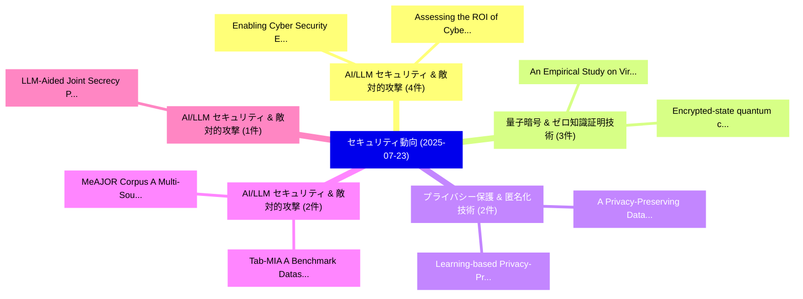

# 📅 02_daily: 日次エグゼクティブサマリー報告書 (2025-07-23)

**集計日時**: 2026-10-02 23:05:34 UTC  
**対象日付**: 2025-07-23  
**本日収集論文数**: 29 件  

---

## 💡 主要セキュリティ動向・脅威インサイト (Executive Insights)

本日の収集論文（計 29 件）において、以下の重点セキュリティ領域で活発な研究動向が確認されました：
- **AI/LLM セキュリティ & 敵対的攻撃** (4 件): 注目論文として 「Enabling Cyber Security Educat...」、「Assessing the ROI of Cyber Thr...」 等が発表され、実務防御および攻撃検証の進展が見られます。
- **量子暗号 & ゼロ知識証明技術** (3 件): 注目論文として 「An Empirical Study on Virtual ...」、「Encrypted-state quantum compil...」 等が発表され、実務防御および攻撃検証の進展が見られます。
- **プライバシー保護 & 匿名化技術** (2 件): 注目論文として 「A Privacy-Preserving Data Coll...」、「Learning-based Privacy-Preserv...」 等が発表され、実務防御および攻撃検証の進展が見られます。
- **AI/LLM セキュリティ & 敵対的攻撃** (2 件): 注目論文として 「Tab-MIA: A Benchmark Dataset f...」、「MeAJOR Corpus: A Multi-Source ...」 等が発表され、実務防御および攻撃検証の進展が見られます。
- **AI/LLM セキュリティ & 敵対的攻撃** (1 件): 注目論文として 「LLM-Aided Joint Secrecy Precod...」 等が発表され、実務防御および攻撃検証の進展が見られます。

### 🗺️ 技術・脅威トピックマインドマップ

---

## 📌 日次セキュリティ論文一覧 (日本語表形式)

| No | arXiv ID | 論文タイトル (日本語訳) | 重要キーワード | 構造化エグゼクティブ要約 (背景・提案・影響) | 脅威分類 | 詳細リンク |
|---|---|---|---|---|---|---|
| 1 | `2507.17180v1` | [A Privacy-Preserving Data Collection Method for Diversified Statistical Analysis（セキュリティ分析論文）](../../okf/papers/2025-07-23/2507.17180.md) | `Privacy-Preserving Data`, `Hao Jiang`, `Quan Zhou` | 【提案】概要 (Overview & Key Finding) 本論文「A Privacy-Preserving Data Collection Method for Diversi...。実証評価により経営層・セキュリティ管理者向け推奨アクション (E... | `cs.CR` | [arXiv](https://arxiv.org/abs/2507.17180v1) &#124; [OKF](../../okf/papers/2025-07-23/2507.17180.md) |
| 2 | `2507.17188v4` | [LLM-Aided Joint Secrecy Precoding and Trajectory for RSMA-Based Heterogeneous UAV Networks（セキュリティ分析論文）](../../okf/papers/2025-07-23/2507.17188.md) | `Aided Joint Secrecy Precoding`, `LLM-Aided Joint`, `Based Heterogeneous` | 【提案】概要 (Overview & Key Finding) 本論文「LLM-Aided Joint Secrecy Precoding and Trajectory for RS...。実証評価により経営層・セキュリティ管理者向け推奨アクション (E... | `cs.CR` | [arXiv](https://arxiv.org/abs/2507.17188v4) &#124; [OKF](../../okf/papers/2025-07-23/2507.17188.md) |
| 3 | `2507.17199v1` | [Threshold-Protected Searchable Sharing: Privacy Preserving Aggregated-ANN Search for Collaborative RAG（セキュリティ分析論文）](../../okf/papers/2025-07-23/2507.17199.md) | `Protected Searchable Sharing`, `Privacy Preserving Aggregated`, `Threshold-Protected Searchable` | 【提案】概要 (Overview & Key Finding) 本論文「Threshold-Protected Searchable Sharing: Privacy Preserv...。実証評価により経営層・セキュリティ管理者向け推奨アクション (E... | `cs.CR` | [arXiv](https://arxiv.org/abs/2507.17199v1) &#124; [OKF](../../okf/papers/2025-07-23/2507.17199.md) |
| 4 | `2507.17259v1` | [Tab-MIA: A Benchmark Dataset for Membership Inference Attacks on Tabular Data in LLMs（セキュリティ分析論文）](../../okf/papers/2025-07-23/2507.17259.md) | `Membership Inference Attacks`, `Benchmark Dataset`, `Tabular Data` | 【提案】概要 (Overview & Key Finding) 本論文「Tab-MIA: A Benchmark Dataset for Membership Inference A...。実証評価により経営層・セキュリティ管理者向け推奨アクション (E... | `cs.CR` | [arXiv](https://arxiv.org/abs/2507.17259v1) &#124; [OKF](../../okf/papers/2025-07-23/2507.17259.md) |
| 5 | `2507.17324v2` | [An Empirical Study on Virtual Reality Software Security Weaknesses（セキュリティ分析論文）](../../okf/papers/2025-07-23/2507.17324.md) | `Virtual Reality Software Security Weaknesses`, `Yifan Xu`, `Jinfu Chen` | 【提案】概要 (Overview & Key Finding) 本論文「An Empirical Study on Virtual Reality Software Security...。実証評価により経営層・セキュリティ管理者向け推奨アクション (E... | `cs.CR` | [arXiv](https://arxiv.org/abs/2507.17324v2) &#124; [OKF](../../okf/papers/2025-07-23/2507.17324.md) |
| 6 | `2507.17385v2` | [A Zero-overhead Flow for Security Closure（セキュリティ分析論文）](../../okf/papers/2025-07-23/2507.17385.md) | `Security Closure`, `Zero-overhead Flow`, `Mohammad Eslami` | 【提案】概要 (Overview & Key Finding) 本論文「A Zero-overhead Flow for Security Closure（セキュリティ分析論文）」（...。実証評価により経営層・セキュリティ管理者向け推奨アクション (E... | `cs.CR` | [arXiv](https://arxiv.org/abs/2507.17385v2) &#124; [OKF](../../okf/papers/2025-07-23/2507.17385.md) |
| 7 | `2507.17491v2` | [Active Attack Resilience in 5G: A New Take on Authentication and Key Agreement（セキュリティ分析論文）](../../okf/papers/2025-07-23/2507.17491.md) | `Active Attack Resilience`, `New Take`, `Key Agreement` | 【提案】概要 (Overview & Key Finding) 本論文「Active Attack Resilience in 5G: A New Take on Authentic...。実証評価により経営層・セキュリティ管理者向け推奨アクション (E... | `cs.CR` | [arXiv](https://arxiv.org/abs/2507.17491v2) &#124; [OKF](../../okf/papers/2025-07-23/2507.17491.md) |
| 8 | `2507.17516v2` | [Frequency Estimation of Correlated Multi-attribute Data under Local Differential Privacy（セキュリティ分析論文）](../../okf/papers/2025-07-23/2507.17516.md) | `Local Differential Privacy`, `Frequency Estimation`, `Correlated Multi` | 【提案】概要 (Overview & Key Finding) 本論文「Frequency Estimation of Correlated Multi-attribute Data...。実証評価により経営層・セキュリティ管理者向け推奨アクション (E... | `cs.CR` | [arXiv](https://arxiv.org/abs/2507.17516v2) &#124; [OKF](../../okf/papers/2025-07-23/2507.17516.md) |
| 9 | `2507.17518v1` | [Enabling Cyber Security Education through Digital Twins and Generative AI（セキュリティ分析論文）](../../okf/papers/2025-07-23/2507.17518.md) | `Enabling Cyber Security Education`, `Digital Twins`, `Vita Santa Barletta` | 【提案】概要 (Overview & Key Finding) 本論文「Enabling Cyber Security Education through Digital Twins...。実証評価により経営層・セキュリティ管理者向け推奨アクション (E... | `cs.CR` | [arXiv](https://arxiv.org/abs/2507.17518v1) &#124; [OKF](../../okf/papers/2025-07-23/2507.17518.md) |
| 10 | `2507.17577v1` | [Boosting Ray Search Procedure of Hard-label Attacks with Transfer-based Priors（セキュリティ分析論文）](../../okf/papers/2025-07-23/2507.17577.md) | `Boosting Ray Search Procedure`, `Hard-label Attacks`, `Transfer-based Priors` | 【提案】概要 (Overview & Key Finding) 本論文「Boosting Ray Search Procedure of Hard-label Attacks wit...。実証評価により経営層・セキュリティ管理者向け推奨アクション (E... | `cs.CR` | [arXiv](https://arxiv.org/abs/2507.17577v1) &#124; [OKF](../../okf/papers/2025-07-23/2507.17577.md) |
| 11 | `2507.17589v2` | [Encrypted-state quantum compilation scheme based on quantum circuit obfuscation for quantum cloud platforms（セキュリティ分析論文）](../../okf/papers/2025-07-23/2507.17589.md) | `Encrypted-state quantum`, `Chenyi Zhang`, `Tao Shang` | 【提案】概要 (Overview & Key Finding) 本論文「Encrypted-state 量子 compilation scheme based on 量子 circu...。実証評価により経営層・セキュリティ管理者向け推奨アクション (E... | `cs.CR` | [arXiv](https://arxiv.org/abs/2507.17589v2) &#124; [OKF](../../okf/papers/2025-07-23/2507.17589.md) |
| 12 | `2507.17628v2` | [Assessing the ROI of Cyber Threat Intelligence: An Operational and Financial Evaluation Framework（セキュリティ分析論文）](../../okf/papers/2025-07-23/2507.17628.md) | `Cyber Threat Intelligence`, `Cyber Threat Intelligenc`, `Matteo Strada` | 【提案】概要 (Overview & Key Finding) 本論文「Assessing the ROI of Cyber 脅威 Intelligence: An Operatio...。実証評価により経営層・セキュリティ管理者向け推奨アクション (E... | `cs.CR` | [arXiv](https://arxiv.org/abs/2507.17628v2) &#124; [OKF](../../okf/papers/2025-07-23/2507.17628.md) |
| 13 | `2507.17655v2` | [HSM and TPM Failures in Cloud: A Real-World Taxonomy and Emerging Defenses（セキュリティ分析論文）](../../okf/papers/2025-07-23/2507.17655.md) | `World Taxonomy`, `Emerging Defenses`, `Real-World Taxonomy` | 【提案】概要 (Overview & Key Finding) 本論文「HSM and TPM Failures in Cloud: A Real-World Taxonomy an...。実証評価により経営層・セキュリティ管理者向け推奨アクション (E... | `cs.CR` | [arXiv](https://arxiv.org/abs/2507.17655v2) &#124; [OKF](../../okf/papers/2025-07-23/2507.17655.md) |
| 14 | `2507.17691v2` | [CASCADE: LLM-Powered JavaScript Deobfuscator at Google（セキュリティ分析論文）](../../okf/papers/2025-07-23/2507.17691.md) | `LLM-Powered JavaScript`, `Shan Jiang`, `Pranoy Kovuri` | 【提案】概要 (Overview & Key Finding) 本論文「CASCADE: LLM-Powered JavaScript Deobfuscator at Google（...。実証評価により経営層・セキュリティ管理者向け推奨アクション (E... | `cs.CR` | [arXiv](https://arxiv.org/abs/2507.17691v2) &#124; [OKF](../../okf/papers/2025-07-23/2507.17691.md) |
| 15 | `2507.17712v1` | [Quantum Software Security Challenges within Shared Quantum Computing Environments（セキュリティ分析論文）](../../okf/papers/2025-07-23/2507.17712.md) | `Quantum Software Security Challenges`, `Shared Quantum Computing Environments`, `Samuel Ovaskainen` | 【提案】概要 (Overview & Key Finding) 本論文「量子 Software Security Challenges within Shared 量子 Comput...。実証評価により経営層・セキュリティ管理者向け推奨アクション (E... | `cs.CR` | [arXiv](https://arxiv.org/abs/2507.17712v1) &#124; [OKF](../../okf/papers/2025-07-23/2507.17712.md) |
| 16 | `2507.17736v2` | [Symmetric Private Information Retrieval (SPIR) on Graph-Based Replicated Systems（セキュリティ分析論文）](../../okf/papers/2025-07-23/2507.17736.md) | `Symmetric Private Information Retrieval`, `Based Replicated Systems`, `Graph-Based Replicated` | 【提案】概要 (Overview & Key Finding) 本論文「Symmetric Private Information Retrieval (SPIR) on Graph...。実証評価により経営層・セキュリティ管理者向け推奨アクション (E... | `cs.CR` | [arXiv](https://arxiv.org/abs/2507.17736v2) &#124; [OKF](../../okf/papers/2025-07-23/2507.17736.md) |
| 17 | `2507.17850v1` | [Performance Evaluation and Threat Mitigation in Large-scale 5G Core Deployment（セキュリティ分析論文）](../../okf/papers/2025-07-23/2507.17850.md) | `Threat Mitigation`, `Core Deployment`, `Large-scale 5G` | 【提案】概要 (Overview & Key Finding) 本論文「Performance Evaluation and 脅威 Mitigation in Large-scale...。実証評価により経営層・セキュリティ管理者向け推奨アクション (E... | `cs.CR` | [arXiv](https://arxiv.org/abs/2507.17850v1) &#124; [OKF](../../okf/papers/2025-07-23/2507.17850.md) |
| 18 | `2507.17888v1` | [Learning to Locate: GNN-Powered Vulnerability Path Discovery in Open Source Code（セキュリティ分析論文）](../../okf/papers/2025-07-23/2507.17888.md) | `Powered Vulnerability Path Discovery`, `Open Source Code`, `GNN-Powered Vulnerability` | 【提案】概要 (Overview & Key Finding) 本論文「Learning to Locate: GNN-Powered 脆弱性 Path Discovery in O...。実証評価により経営層・セキュリティ管理者向け推奨アクション (E... | `cs.CR` | [arXiv](https://arxiv.org/abs/2507.17888v1) &#124; [OKF](../../okf/papers/2025-07-23/2507.17888.md) |
| 19 | `2507.17895v1` | [Lower Bounds for Public-Private Learning under Distribution Shift（セキュリティ分析論文）](../../okf/papers/2025-07-23/2507.17895.md) | `Lower Bounds`, `Private Learning`, `Distribution Shift` | 【提案】概要 (Overview & Key Finding) 本論文「Lower Bounds for Public-Private Learning under Distribu...。実証評価により経営層・セキュリティ管理者向け推奨アクション (E... | `cs.CR` | [arXiv](https://arxiv.org/abs/2507.17895v1) &#124; [OKF](../../okf/papers/2025-07-23/2507.17895.md) |
| 20 | `2507.17956v1` | [Formal Verification of the Safegcd Implementation（セキュリティ分析論文）](../../okf/papers/2025-07-23/2507.17956.md) | `Formal Verification`, `Safegcd Implementation`, `Andrew Poelstra` | 【提案】概要 (Overview & Key Finding) 本論文「Formal Verification of the Safegcd Implementation（セキュリテ...。実証評価により経営層・セキュリティ管理者向け推奨アクション (E... | `cs.CR` | [arXiv](https://arxiv.org/abs/2507.17956v1) &#124; [OKF](../../okf/papers/2025-07-23/2507.17956.md) |
| 21 | `2507.17962v1` | [TimelyHLS: LLM-Based Timing-Aware and Architecture-Specific FPGA HLS Optimization（セキュリティ分析論文）](../../okf/papers/2025-07-23/2507.17962.md) | `Based Timing`, `LLM-Based Timing`, `Architecture-Specific FPGA` | 【提案】概要 (Overview & Key Finding) 本論文「TimelyHLS: LLM-Based Timing-Aware and Architecture-Spec...。実証評価により経営層・セキュリティ管理者向け推奨アクション (E... | `cs.CR` | [arXiv](https://arxiv.org/abs/2507.17962v1) &#124; [OKF](../../okf/papers/2025-07-23/2507.17962.md) |
| 22 | `2507.17978v2` | [MeAJOR Corpus: A Multi-Source Dataset for Phishing Email Detection（セキュリティ分析論文）](../../okf/papers/2025-07-23/2507.17978.md) | `Phishing Email Detection`, `Source Dataset`, `Multi-Source Dataset` | 【提案】概要 (Overview & Key Finding) 本論文「MeAJOR Corpus: A Multi-Source Dataset for Phishing Emai...。実証評価により経営層・セキュリティ管理者向け推奨アクション (E... | `cs.CR` | [arXiv](https://arxiv.org/abs/2507.17978v2) &#124; [OKF](../../okf/papers/2025-07-23/2507.17978.md) |
| 23 | `2507.18657v3` | [VGS-ATD: Robust Distributed Learning for Multi-Label Medical Image Classification Under Heterogeneous and Imbalanced Conditions（セキュリティ分析論文）](../../okf/papers/2025-07-23/2507.18657.md) | `Robust Distributed Learning`, `Imbalanced Conditions`, `Multi-Label Medical` | 【提案】概要 (Overview & Key Finding) 本論文「VGS-ATD: Robust Distributed Learning for Multi-Label Me...。実証評価により経営層・セキュリティ管理者向け推奨アクション (E... | `cs.CR` | [arXiv](https://arxiv.org/abs/2507.18657v3) &#124; [OKF](../../okf/papers/2025-07-23/2507.18657.md) |
| 24 | `2507.21139v1` | [Learning-based Privacy-Preserving Graph Publishing Against Sensitive Link Inference Attacks（セキュリティ分析論文）](../../okf/papers/2025-07-23/2507.21139.md) | `Learning-based Privacy`, `Yucheng Wu`, `Yuncong Yang` | 【提案】概要 (Overview & Key Finding) 本論文「Learning-based Privacy-Preserving Graph Publishing Agai...。実証評価により経営層・セキュリティ管理者向け推奨アクション (E... | `cs.CR` | [arXiv](https://arxiv.org/abs/2507.21139v1) &#124; [OKF](../../okf/papers/2025-07-23/2507.21139.md) |
| 25 | `2507.21142v1` | [Privacy Artifact ConnecTor (PACT): Embedding Enterprise Artifacts for Compliance AI Agents（セキュリティ分析論文）](../../okf/papers/2025-07-23/2507.21142.md) | `Embedding Enterprise Artifacts`, `Privacy Artifact`, `Chenhao Fang` | 【提案】概要 (Overview & Key Finding) 本論文「Privacy Artifact ConnecTor (PACT): Embedding Enterprise...。実証評価により経営層・セキュリティ管理者向け推奨アクション (E... | `cs.CR` | [arXiv](https://arxiv.org/abs/2507.21142v1) &#124; [OKF](../../okf/papers/2025-07-23/2507.21142.md) |
| 26 | `2507.21145v1` | [Leveraging Trustworthy AI for Automotive Security in Multi-Domain Operations: a Responsive Human-AI Multi-Domain Task Force for Cyber Social Securityに向けて](../../okf/papers/2025-07-23/2507.21145.md) | `Domain Task Force`, `Leveraging Trustworthy`, `Automotive Security` | 【提案】概要 (Overview & Key Finding) 本論文「Leveraging Trustworthy AI for Automotive Security in Mu...。実証評価により経営層・セキュリティ管理者向け推奨アクション (E... | `cs.CR` | [arXiv](https://arxiv.org/abs/2507.21145v1) &#124; [OKF](../../okf/papers/2025-07-23/2507.21145.md) |
| 27 | `2507.21146v1` | [Unifying Quantitative Security Benchmarking for Multi Agent Systemsに向けて](../../okf/papers/2025-07-23/2507.21146.md) | `Towards Unifying Quantitative Security Benchmarking`, `Unifying Quantitative Security Benchmarking`, `Multi Agent Systems` | 【提案】概要 (Overview & Key Finding) 本論文「Unifying Quantitative Security Benchmarking for Multi A...。実証評価により経営層・セキュリティ管理者向け推奨アクション (E... | `cs.CR` | [arXiv](https://arxiv.org/abs/2507.21146v1) &#124; [OKF](../../okf/papers/2025-07-23/2507.21146.md) |
| 28 | `2507.21150v1` | [WaveVerify: A Novel Audio Watermarking Framework for Media Authentication and Combatting Deepfakes（セキュリティ分析論文）](../../okf/papers/2025-07-23/2507.21150.md) | `Media Authentication`, `Combatting Deepfakes`, `Aditya Pujari` | 【提案】概要 (Overview & Key Finding) 本論文「WaveVerify: A Novel Audio Watermarking Framework for Me...。実証評価により経営層・セキュリティ管理者向け推奨アクション (E... | `cs.CR` | [arXiv](https://arxiv.org/abs/2507.21150v1) &#124; [OKF](../../okf/papers/2025-07-23/2507.21150.md) |
| 29 | `2508.03714v1` | ["Think First, Verify Always": Training Humans to Face AI Risks（セキュリティ分析論文）](../../okf/papers/2025-07-23/2508.03714.md) | `Think First`, `Verify Always`, `Training Humans` | 【提案】概要 (Overview & Key Finding) 本論文「"Think First, Verify Always": Training Humans to Face A...。実証評価により経営層・セキュリティ管理者向け推奨アクション (E... | `cs.CR` | [arXiv](https://arxiv.org/abs/2508.03714v1) &#124; [OKF](../../okf/papers/2025-07-23/2508.03714.md) |

