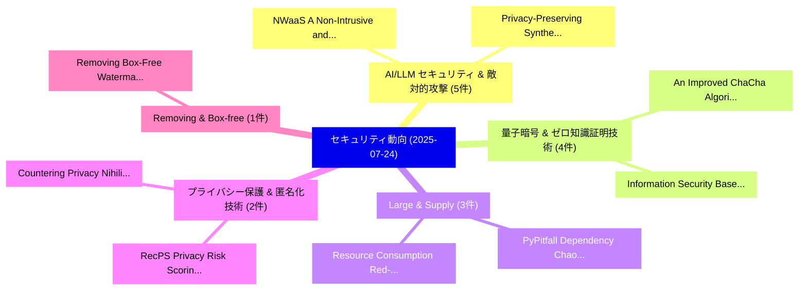

# 📅 02_daily: 日次エグゼクティブサマリー報告書 (2025-07-24)

**集計日時**: 2026-10-02 23:05:34 UTC  
**対象日付**: 2025-07-24  
**本日収集論文数**: 25 件  

---

## 💡 主要セキュリティ動向・脅威インサイト (Executive Insights)

本日の収集論文（計 25 件）において、以下の重点セキュリティ領域で活発な研究動向が確認されました：
- **AI/LLM セキュリティ & 敵対的攻撃** (5 件): 注目論文として 「NWaaS: A Non-Intrusive and Pri...」、「Privacy-Preserving Synthetic R...」 等が発表され、実務防御および攻撃検証の進展が見られます。
- **量子暗号 & ゼロ知識証明技術** (4 件): 注目論文として 「An Improved ChaCha Algorithm B...」、「Information Security Based on ...」 等が発表され、実務防御および攻撃検証の進展が見られます。
- **Large & Supply** (3 件): 注目論文として 「Resource Consumption Red-Teami...」、「PyPitfall: Dependency Chaos an...」 等が発表され、実務防御および攻撃検証の進展が見られます。
- **プライバシー保護 & 匿名化技術** (2 件): 注目論文として 「Countering Privacy Nihilism（セキ...」、「RecPS: Privacy Risk Scoring fo...」 等が発表され、実務防御および攻撃検証の進展が見られます。
- **Removing & Box-free** (1 件): 注目論文として 「Removing Box-Free Watermarks f...」 等が発表され、実務防御および攻撃検証の進展が見られます。

### 🗺️ 技術・脅威トピックマインドマップ

---

## 📌 日次セキュリティ論文一覧 (日本語表形式)

| No | arXiv ID | 論文タイトル (日本語訳) | 重要キーワード | 構造化エグゼクティブ要約 (背景・提案・影響) | 脅威分類 | 詳細リンク |
|---|---|---|---|---|---|---|
| 1 | `2507.18034v1` | [Removing Box-Free Watermarks for Image-to-Image Models via Query-Based Reverse Engineering（セキュリティ分析論文）](../../okf/papers/2025-07-24/2507.18034.md) | `Based Reverse Engineering`, `Removing Box`, `Free Watermarks` | 【提案】概要 (Overview & Key Finding) 本論文「Removing Box-Free Watermarks for Image-to-Image Models ...。実証評価により経営層・セキュリティ管理者向け推奨アクション (E... | `cs.CR` | [arXiv](https://arxiv.org/abs/2507.18034v1) &#124; [OKF](../../okf/papers/2025-07-24/2507.18034.md) |
| 2 | `2507.18036v2` | [NWaaS: A Non-Intrusive and Privacy-Preserving Watermarking-as-a-Service System with Adaptive Resource Scheduling（セキュリティ分析論文）](../../okf/papers/2025-07-24/2507.18036.md) | `Adaptive Resource Scheduling`, `Preserving Watermarking`, `Service System` | 【提案】概要 (Overview & Key Finding) 本論文「NWaaS: A Non-Intrusive and Privacy-Preserving Watermark...。実証評価により経営層・セキュリティ管理者向け推奨アクション (E... | `cs.CR` | [arXiv](https://arxiv.org/abs/2507.18036v2) &#124; [OKF](../../okf/papers/2025-07-24/2507.18036.md) |
| 3 | `2507.18037v2` | [Your ATs to Ts: MITRE ATT&CK Attack Technique to P-SSCRM Task Mapping（セキュリティ分析論文）](../../okf/papers/2025-07-24/2507.18037.md) | `Attack Technique`, `Task Mapping`, `P-SSCRM Task` | 【提案】概要 (Overview & Key Finding) 本論文「Your ATs to Ts: MITRE ATT&CK Attack Technique to P-SSCR...。実証評価により経営層・セキュリティ管理者向け推奨アクション (E... | `cs.CR` | [arXiv](https://arxiv.org/abs/2507.18037v2) &#124; [OKF](../../okf/papers/2025-07-24/2507.18037.md) |
| 4 | `2507.18053v2` | [Resource Consumption Red-Teaming for Large Vision-Language Models（セキュリティ分析論文）](../../okf/papers/2025-07-24/2507.18053.md) | `Resource Consumption Red`, `Large Vision`, `Language Models` | 【提案】概要 (Overview & Key Finding) 本論文「Resource Consumption Red-Teaming for Large Vision-Langu...。実証評価により経営層・セキュリティ管理者向け推奨アクション (E... | `cs.CR` | [arXiv](https://arxiv.org/abs/2507.18053v2) &#124; [OKF](../../okf/papers/2025-07-24/2507.18053.md) |
| 5 | `2507.18055v1` | [Privacy-Preserving Synthetic Review Generation with Diverse Writing Styles Using LLMs（セキュリティ分析論文）](../../okf/papers/2025-07-24/2507.18055.md) | `Preserving Synthetic Review Generation`, `Diverse Writing Styles Using`, `Privacy-Preserving Synthetic` | 【提案】概要 (Overview & Key Finding) 本論文「Privacy-Preserving Synthetic Review Generation with Div...。実証評価により経営層・セキュリティ管理者向け推奨アクション (E... | `cs.CR` | [arXiv](https://arxiv.org/abs/2507.18055v1) &#124; [OKF](../../okf/papers/2025-07-24/2507.18055.md) |
| 6 | `2507.18072v1` | [C-AAE: Compressively Anonymizing Autoencoders for Privacy-Preserving Activity Recognition in Healthcare Sensor Streams（セキュリティ分析論文）](../../okf/papers/2025-07-24/2507.18072.md) | `Compressively Anonymizing Autoencoders`, `Preserving Activity Recognition`, `Healthcare Sensor Streams` | 【提案】概要 (Overview & Key Finding) 本論文「C-AAE: Compressively Anonymizing Autoencoders for Priva...。実証評価により経営層・セキュリティ管理者向け推奨アクション (E... | `cs.CR` | [arXiv](https://arxiv.org/abs/2507.18072v1) &#124; [OKF](../../okf/papers/2025-07-24/2507.18072.md) |
| 7 | `2507.18075v1` | [PyPitfall: Dependency Chaos and Software Supply Chain Vulnerabilities in Python（セキュリティ分析論文）](../../okf/papers/2025-07-24/2507.18075.md) | `Software Supply Chain Vulnerabilities`, `Dependency Chaos`, `Jacob Mahon` | 【提案】概要 (Overview & Key Finding) 本論文「PyPitfall: Dependency Chaos and Software Supply Chain V...。実証評価により経営層・セキュリティ管理者向け推奨アクション (E... | `cs.CR` | [arXiv](https://arxiv.org/abs/2507.18075v1) &#124; [OKF](../../okf/papers/2025-07-24/2507.18075.md) |
| 8 | `2507.18105v1` | [Understanding the Supply Chain and Risks of Large Language Model Applications（セキュリティ分析論文）](../../okf/papers/2025-07-24/2507.18105.md) | `Large Language Model Applications`, `Supply Chain`, `Large Language Model Applic` | 【提案】概要 (Overview & Key Finding) 本論文「Understanding the Supply Chain and Risks of Large Langu...。実証評価により経営層・セキュリティ管理者向け推奨アクション (E... | `cs.CR` | [arXiv](https://arxiv.org/abs/2507.18105v1) &#124; [OKF](../../okf/papers/2025-07-24/2507.18105.md) |
| 9 | `2507.18157v1` | [An Improved ChaCha Algorithm Based on Quantum Random Number（セキュリティ分析論文）](../../okf/papers/2025-07-24/2507.18157.md) | `Quantum Random Number`, `Algorithm Based`, `Chao Liu` | 【提案】概要 (Overview & Key Finding) 本論文「An Improved ChaCha Algorithm Based on 量子 Random Number（...。実証評価により経営層・セキュリティ管理者向け推奨アクション (E... | `cs.CR` | [arXiv](https://arxiv.org/abs/2507.18157v1) &#124; [OKF](../../okf/papers/2025-07-24/2507.18157.md) |
| 10 | `2507.18215v2` | [Information Security Based on LLM Approaches: A Review（セキュリティ分析論文）](../../okf/papers/2025-07-24/2507.18215.md) | `Information Security Based`, `Chang Gong`, `Zhongwen Li` | 【提案】概要 (Overview & Key Finding) 本論文「Information Security Based on LLM Approaches: A Review（...。実証評価により経営層・セキュリティ管理者向け推奨アクション (E... | `cs.CR` | [arXiv](https://arxiv.org/abs/2507.18215v2) &#124; [OKF](../../okf/papers/2025-07-24/2507.18215.md) |
| 11 | `2507.18249v1` | [Auto-SGCR: Automated Generation of Smart Grid Cyber Range Using IEC 61850 Standard Models（セキュリティ分析論文）](../../okf/papers/2025-07-24/2507.18249.md) | `Smart Grid Cyber Range Using`, `Automated Generation`, `Standard Models` | 【提案】概要 (Overview & Key Finding) 本論文「Auto-SGCR: Automated Generation of Smart Grid Cyber Ran...。実証評価により経営層・セキュリティ管理者向け推奨アクション (E... | `cs.CR` | [arXiv](https://arxiv.org/abs/2507.18249v1) &#124; [OKF](../../okf/papers/2025-07-24/2507.18249.md) |
| 12 | `2507.18253v1` | [Countering Privacy Nihilism（セキュリティ分析論文）](../../okf/papers/2025-07-24/2507.18253.md) | `Countering Privacy Nihilism`, `Severin Engelmann`, `Helen Nissenbaum` | 【提案】概要 (Overview & Key Finding) 本論文「Countering Privacy Nihilism（セキュリティ分析論文）」（原題: Countering...。実証評価により経営層・セキュリティ管理者向け推奨アクション (E... | `cs.CR` | [arXiv](https://arxiv.org/abs/2507.18253v1) &#124; [OKF](../../okf/papers/2025-07-24/2507.18253.md) |
| 13 | `2507.18289v1` | [Scheduzz: Constraint-based Fuzz Driver Generation with Dual Scheduling（セキュリティ分析論文）](../../okf/papers/2025-07-24/2507.18289.md) | `Fuzz Driver Generation`, `Dual Scheduling`, `Constraint-based Fuzz` | 【提案】概要 (Overview & Key Finding) 本論文「Scheduzz: Constraint-based Fuzz Driver Generation with ...。実証評価により経営層・セキュリティ管理者向け推奨アクション (E... | `cs.CR` | [arXiv](https://arxiv.org/abs/2507.18289v1) &#124; [OKF](../../okf/papers/2025-07-24/2507.18289.md) |
| 14 | `2507.18302v1` | [LoRA-Leak: Membership Inference Attacks Against LoRA Fine-tuned Language Models（セキュリティ分析論文）](../../okf/papers/2025-07-24/2507.18302.md) | `Language Models`, `Fine-tuned Language`, `Delong Ran` | 【提案】概要 (Overview & Key Finding) 本論文「LoRA-Leak: Membership Inference Attacks Against LoRA Fi...。実証評価により経営層・セキュリティ管理者向け推奨アクション (E... | `cs.CR` | [arXiv](https://arxiv.org/abs/2507.18302v1) &#124; [OKF](../../okf/papers/2025-07-24/2507.18302.md) |
| 15 | `2507.18313v2` | [Regression-aware Continual Learning for Android マルウェア検出](../../okf/papers/2025-07-24/2507.18313.md) | `Continual Learning`, `Regression-aware Continual`, `Android Malware Detection` | 【提案】概要 (Overview & Key Finding) 本論文「Regression-aware Continual Learning for Android マルウェア検出...。実証評価により経営層・セキュリティ管理者向け推奨アクション (E... | `cs.CR` | [arXiv](https://arxiv.org/abs/2507.18313v2) &#124; [OKF](../../okf/papers/2025-07-24/2507.18313.md) |
| 16 | `2507.18360v1` | [Conformidade com os Requisitos Legais de Privacidade de Dados: Um Estudo sobre Técnicas de Anonimização（セキュリティ分析論文）](../../okf/papers/2025-07-24/2507.18360.md) | `Requisitos Legais`, `Um Estudo`, `Luiz Fernando Nunes` | 【提案】概要 (Overview & Key Finding) 本論文「Conformidade com os Requisitos Legais de Privacidade de...。実証評価により経営層・セキュリティ管理者向け推奨アクション (E... | `cs.CR` | [arXiv](https://arxiv.org/abs/2507.18360v1) &#124; [OKF](../../okf/papers/2025-07-24/2507.18360.md) |
| 17 | `2507.18365v4` | [RecPS: Privacy Risk Scoring for Recommender Systems（セキュリティ分析論文）](../../okf/papers/2025-07-24/2507.18365.md) | `Privacy Risk Scoring`, `Recommender Systems`, `Yuechun Gu` | 【提案】概要 (Overview & Key Finding) 本論文「RecPS: Privacy Risk Scoring for Recommender Systems（セキュ...。実証評価により経営層・セキュリティ管理者向け推奨アクション (E... | `cs.CR` | [arXiv](https://arxiv.org/abs/2507.18365v4) &#124; [OKF](../../okf/papers/2025-07-24/2507.18365.md) |
| 18 | `2507.18478v1` | [Scout: Leveraging 大規模言語モデル for Rapid Digital Evidence Discovery](../../okf/papers/2025-07-24/2507.18478.md) | `Rapid Digital Evidence Discovery`, `Leveraging Large Language Models`, `Shariq Murtuza` | 【提案】概要 (Overview & Key Finding) 本論文「Scout: Leveraging 大規模言語モデル for Rapid Digital Evidence D...。実証評価により経営層・セキュリティ管理者向け推奨アクション (E... | `cs.CR` | [arXiv](https://arxiv.org/abs/2507.18478v1) &#124; [OKF](../../okf/papers/2025-07-24/2507.18478.md) |
| 19 | `2507.18631v2` | [Layer-Aware Representation Filtering: Purifying Finetuning Data to Preserve LLM Safety Alignment（セキュリティ分析論文）](../../okf/papers/2025-07-24/2507.18631.md) | `Aware Representation Filtering`, `Purifying Finetuning Data`, `Layer-Aware Representation` | 【提案】概要 (Overview & Key Finding) 本論文「Layer-Aware Representation Filtering: Purifying Finetun...。実証評価により経営層・セキュリティ管理者向け推奨アクション (E... | `cs.CR` | [arXiv](https://arxiv.org/abs/2507.18631v2) &#124; [OKF](../../okf/papers/2025-07-24/2507.18631.md) |
| 20 | `2507.18774v1` | [Bridging Cloud Convenience and Protocol Transparency: A Hybrid Architecture for Ethereum Node Operations on Amazon Managed Blockchain（セキュリティ分析論文）](../../okf/papers/2025-07-24/2507.18774.md) | `Bridging Cloud Convenience`, `Ethereum Node Operations`, `Amazon Managed Blockchain` | 【提案】概要 (Overview & Key Finding) 本論文「Bridging Cloud Convenience and Protocol Transparency: A...。実証評価により経営層・セキュリティ管理者向け推奨アクション (E... | `cs.CR` | [arXiv](https://arxiv.org/abs/2507.18774v1) &#124; [OKF](../../okf/papers/2025-07-24/2507.18774.md) |
| 21 | `2507.18801v2` | [Resolving Indirect Calls in Binary Code via Cross-Reference Augmented Graph Neural Networks（セキュリティ分析論文）](../../okf/papers/2025-07-24/2507.18801.md) | `Reference Augmented Graph Neural Networks`, `Resolving Indirect Calls`, `Binary Code` | 【提案】概要 (Overview & Key Finding) 本論文「Resolving Indirect Calls in Binary Code via Cross-Refer...。実証評価により経営層・セキュリティ管理者向け推奨アクション (E... | `cs.CR` | [arXiv](https://arxiv.org/abs/2507.18801v2) &#124; [OKF](../../okf/papers/2025-07-24/2507.18801.md) |
| 22 | `2507.21151v1` | [NIST Post-Quantum Cryptography Standard Algorithms Based on Quantum Random Number Generators（セキュリティ分析論文）](../../okf/papers/2025-07-24/2507.21151.md) | `Quantum Cryptography Standard Algorithms Based`, `Quantum Random Number Generators`, `Post-Quantum Cryptography` | 【提案】概要 (Overview & Key Finding) 本論文「NIST ポスト量子暗号 Standard Algorithms Based on 量子 Random Num...。実証評価により経営層・セキュリティ管理者向け推奨アクション (E... | `cs.CR` | [arXiv](https://arxiv.org/abs/2507.21151v1) &#124; [OKF](../../okf/papers/2025-07-24/2507.21151.md) |
| 23 | `2507.21154v1` | [Assessment of Quantitative Cyber-Physical Reliability of SCADA Systems in Autonomous Vehicle to Grid (V2G) Capable Smart Grids（セキュリティ分析論文）](../../okf/papers/2025-07-24/2507.21154.md) | `Capable Smart Grids`, `Quantitative Cyber`, `Physical Reliability` | 【提案】概要 (Overview & Key Finding) 本論文「Assessment of Quantitative Cyber-Physical Reliability o...。実証評価により経営層・セキュリティ管理者向け推奨アクション (E... | `cs.CR` | [arXiv](https://arxiv.org/abs/2507.21154v1) &#124; [OKF](../../okf/papers/2025-07-24/2507.21154.md) |
| 24 | `2507.21157v1` | [Unmasking Synthetic Realities in Generative AI: A Comprehensive Review of Adversarially Robust Deepfake Detection Systems（セキュリティ分析論文）](../../okf/papers/2025-07-24/2507.21157.md) | `Adversarially Robust Deepfake Detection Systems`, `Unmasking Synthetic Realities`, `Comprehensive Review` | 【提案】概要 (Overview & Key Finding) 本論文「Unmasking Synthetic Realities in Generative AI: A Compr...。実証評価により経営層・セキュリティ管理者向け推奨アクション (E... | `cs.CR` | [arXiv](https://arxiv.org/abs/2507.21157v1) &#124; [OKF](../../okf/papers/2025-07-24/2507.21157.md) |
| 25 | `2508.02816v1` | [Thermal-Aware 3D Design for Side-Channel Information Leakage（セキュリティ分析論文）](../../okf/papers/2025-07-24/2508.02816.md) | `Channel Information Leakage`, `Thermal-Aware 3D`, `Side-Channel Information` | 【提案】概要 (Overview & Key Finding) 本論文「Thermal-Aware 3D Design for サイドチャネル攻撃 Information Leaka...。実証評価により経営層・セキュリティ管理者向け推奨アクション (E... | `cs.CR` | [arXiv](https://arxiv.org/abs/2508.02816v1) &#124; [OKF](../../okf/papers/2025-07-24/2508.02816.md) |

