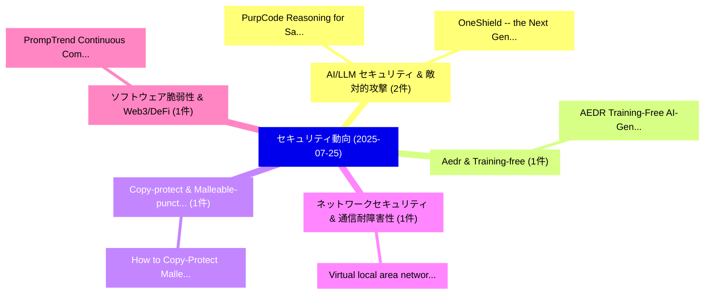

# 📅 02_daily: 日次エグゼクティブサマリー報告書 (2025-07-25)

**集計日時**: 2026-10-02 23:05:34 UTC  
**対象日付**: 2025-07-25  
**本日収集論文数**: 17 件  

---

## 💡 主要セキュリティ動向・脅威インサイト (Executive Insights)

本日の収集論文（計 17 件）において、以下の重点セキュリティ領域で活発な研究動向が確認されました：
- **AI/LLM セキュリティ & 敵対的攻撃** (2 件): 注目論文として 「PurpCode: Reasoning for Safer ...」、「OneShield -- the Next Generati...」 等が発表され、実務防御および攻撃検証の進展が見られます。
- **Aedr & Training-free** (1 件): 注目論文として 「AEDR: Training-Free AI-Generat...」 等が発表され、実務防御および攻撃検証の進展が見られます。
- **Copy-protect & Malleable-puncturable** (1 件): 注目論文として 「How to Copy-Protect Malleable-...」 等が発表され、実務防御および攻撃検証の進展が見られます。
- **ネットワークセキュリティ & 通信耐障害性** (1 件): 注目論文として 「Virtual local area network ove...」 等が発表され、実務防御および攻撃検証の進展が見られます。
- **ソフトウェア脆弱性 & Web3/DeFi** (1 件): 注目論文として 「PrompTrend: Continuous Communi...」 等が発表され、実務防御および攻撃検証の進展が見られます。

### 🗺️ 技術・脅威トピックマインドマップ

---

## 📌 日次セキュリティ論文一覧 (日本語表形式)

| No | arXiv ID | 論文タイトル (日本語訳) | 重要キーワード | 構造化エグゼクティブ要約 (背景・提案・影響) | 脅威分類 | 詳細リンク |
|---|---|---|---|---|---|---|
| 1 | `2507.18988v2` | [AEDR: Training-Free AI-Generated Image Attribution via Autoencoder Double-Reconstruction（セキュリティ分析論文）](../../okf/papers/2025-07-25/2507.18988.md) | `Generated Image Attribution`, `Autoencoder Double`, `Training-Free AI` | 【提案】概要 (Overview & Key Finding) 本論文「AEDR: Training-Free AI-Generated Image Attribution via ...。実証評価により経営層・セキュリティ管理者向け推奨アクション (E... | `cs.CR` | [arXiv](https://arxiv.org/abs/2507.18988v2) &#124; [OKF](../../okf/papers/2025-07-25/2507.18988.md) |
| 2 | `2507.19032v1` | [How to Copy-Protect Malleable-Puncturable Cryptographic Functionalities Under Arbitrary Challenge Distributions（セキュリティ分析論文）](../../okf/papers/2025-07-25/2507.19032.md) | `Protect Malleable`, `Copy-Protect Malleable`, `Vipul Goyal` | 【提案】概要 (Overview & Key Finding) 本論文「How to Copy-Protect Malleable-Puncturable Cryptographic...。実証評価により経営層・セキュリティ管理者向け推奨アクション (E... | `cs.CR` | [arXiv](https://arxiv.org/abs/2507.19032v1) &#124; [OKF](../../okf/papers/2025-07-25/2507.19032.md) |
| 3 | `2507.19055v1` | [Virtual local area network over HTTP for launching an insider attack（セキュリティ分析論文）](../../okf/papers/2025-07-25/2507.19055.md) | `Yuksel Arslan`, `Raw Meta`, `Executive Summary` | 【提案】概要 (Overview & Key Finding) 本論文「Virtual local area network over HTTP for launching an i...。実証評価により経営層・セキュリティ管理者向け推奨アクション (E... | `cs.CR` | [arXiv](https://arxiv.org/abs/2507.19055v1) &#124; [OKF](../../okf/papers/2025-07-25/2507.19055.md) |
| 4 | `2507.19060v4` | [PurpCode: Reasoning for Safer Code Generation（セキュリティ分析論文）](../../okf/papers/2025-07-25/2507.19060.md) | `Safer Code Generation`, `Jiawei Liu`, `Nirav Diwan` | 【提案】概要 (Overview & Key Finding) 本論文「PurpCode: Reasoning for Safer Code Generation（セキュリティ分析論...。実証評価によりNguyen, Tianjiao Yu, Munt... | `cs.CR` | [arXiv](https://arxiv.org/abs/2507.19060v4) &#124; [OKF](../../okf/papers/2025-07-25/2507.19060.md) |
| 5 | `2507.19185v1` | [PrompTrend: Continuous Community-Driven Vulnerability Discovery and Assessment for 大規模言語モデル](../../okf/papers/2025-07-25/2507.19185.md) | `Driven Vulnerability Discovery`, `Continuous Community`, `Community-Driven Vulnerability` | 【提案】概要 (Overview & Key Finding) 本論文「PrompTrend: Continuous Community-Driven 脆弱性 Discovery a...。実証評価により経営層・セキュリティ管理者向け推奨アクション (E... | `cs.CR` | [arXiv](https://arxiv.org/abs/2507.19185v1) &#124; [OKF](../../okf/papers/2025-07-25/2507.19185.md) |
| 6 | `2507.19219v2` | [How Much Do Large Language Model Cheat on Evaluation? Overestimation under the One-Time-Pad-Based Frameworkのベンチマーク評価](../../okf/papers/2025-07-25/2507.19219.md) | `Benchmarking Overestimation`, `Zi Liang`, `Liantong Yu` | 【提案】Benchmarking Overestimation under the One-Time-Pad-Based Framework ### (日本語題名: How Much...。実証評価により経営層・セキュリティ管理者向け推奨アクション (E... | `cs.CR` | [arXiv](https://arxiv.org/abs/2507.19219v2) &#124; [OKF](../../okf/papers/2025-07-25/2507.19219.md) |
| 7 | `2507.19295v1` | [On the Security of a Code-Based PIR Scheme（セキュリティ分析論文）](../../okf/papers/2025-07-25/2507.19295.md) | `Code-Based PIR`, `Svenja Lage`, `Hannes Bartz` | 【提案】概要 (Overview & Key Finding) 本論文「On the Security of a Code-Based PIR Scheme（セキュリティ分析論文）」...。実証評価により経営層・セキュリティ管理者向け推奨アクション (E... | `cs.CR` | [arXiv](https://arxiv.org/abs/2507.19295v1) &#124; [OKF](../../okf/papers/2025-07-25/2507.19295.md) |
| 8 | `2507.19367v1` | [Empowering IoT Firmware Secure Update with Customization Rights（セキュリティ分析論文）](../../okf/papers/2025-07-25/2507.19367.md) | `Firmware Secure Update`, `Customization Rights`, `Weihao Chen` | 【提案】概要 (Overview & Key Finding) 本論文「Empowering IoT Firmware Secure Update with Customizatio...。実証評価によりHong, Yuqing Zhang,。 | `cs.CR` | [arXiv](https://arxiv.org/abs/2507.19367v1) &#124; [OKF](../../okf/papers/2025-07-25/2507.19367.md) |
| 9 | `2507.19391v1` | [Transcript Franking for Encrypted Messaging（セキュリティ分析論文）](../../okf/papers/2025-07-25/2507.19391.md) | `Transcript Franking`, `Encrypted Messaging`, `Armin Namavari` | 【提案】概要 (Overview & Key Finding) 本論文「Transcript Franking for Encrypted Messaging（セキュリティ分析論文）...。実証評価により経営層・セキュリティ管理者向け推奨アクション (E... | `cs.CR` | [arXiv](https://arxiv.org/abs/2507.19391v1) &#124; [OKF](../../okf/papers/2025-07-25/2507.19391.md) |
| 10 | `2507.19399v1` | [Running in CIRCLE? A Simple Benchmark for LLM Code Interpreter Security（セキュリティ分析論文）](../../okf/papers/2025-07-25/2507.19399.md) | `Code Interpreter Security`, `Simple Benchmark`, `Gabriel Chua` | 【提案】A Simple Benchmark for LLM Code Interpreter Security ### (日本語題名: Running in CIRCLE?。実証評価により経営層・セキュリティ管理者向け推奨アクション (Executiv... | `cs.CR` | [arXiv](https://arxiv.org/abs/2507.19399v1) &#124; [OKF](../../okf/papers/2025-07-25/2507.19399.md) |
| 11 | `2507.19411v1` | [SILS: Strategic Influence on Liquidity Stability and Whale Detection in Concentrated-Liquidity DEXs（セキュリティ分析論文）](../../okf/papers/2025-07-25/2507.19411.md) | `Strategic Influence`, `Liquidity Stability`, `Whale Detection` | 【提案】概要 (Overview & Key Finding) 本論文「SILS: Strategic Influence on Liquidity Stability and Wh...。実証評価により経営層・セキュリティ管理者向け推奨アクション (E... | `cs.CR` | [arXiv](https://arxiv.org/abs/2507.19411v1) &#124; [OKF](../../okf/papers/2025-07-25/2507.19411.md) |
| 12 | `2507.19598v1` | [MOCHA: Are Code Language Models Robust Against Multi-Turn Malicious Coding Prompts?（セキュリティ分析論文）](../../okf/papers/2025-07-25/2507.19598.md) | `Turn Malicious Coding Prompts`, `Multi-Turn Malicious`, `Muntasir Wahed` | 【提案】### (日本語題名: MOCHA: Are Code Language Models Robust Against Multi-Turn Malicious Coding ...。実証評価により経営層・セキュリティ管理者向け推奨アクション (E... | `cs.CR` | [arXiv](https://arxiv.org/abs/2507.19598v1) &#124; [OKF](../../okf/papers/2025-07-25/2507.19598.md) |
| 13 | `2507.19609v1` | [the Internet of Medical Things (IoMT): Real-World Attack Taxonomy and Practical Security Measuresのセキュリティ強化](../../okf/papers/2025-07-25/2507.19609.md) | `World Attack Taxonomy`, `Medical Things`, `Real-World Attack` | 【提案】概要 (Overview & Key Finding) 本論文「the Internet of Medical Things (IoMT): Real-World Attac...。実証評価により経営層・セキュリティ管理者向け推奨アクション (E... | `cs.CR` | [arXiv](https://arxiv.org/abs/2507.19609v1) &#124; [OKF](../../okf/papers/2025-07-25/2507.19609.md) |
| 14 | `2507.19695v1` | [Polar Coding and Linear Decoding（セキュリティ分析論文）](../../okf/papers/2025-07-25/2507.19695.md) | `Polar Coding`, `Linear Decoding`, `Raw Meta` | 【提案】概要 (Overview & Key Finding) 本論文「Polar Coding and Linear Decoding（セキュリティ分析論文）」（原題: Polar...。実証評価によりBarbosa - **公開日時**: `2025... | `cs.CR` | [arXiv](https://arxiv.org/abs/2507.19695v1) &#124; [OKF](../../okf/papers/2025-07-25/2507.19695.md) |
| 15 | `2507.21163v1` | [Generating Adversarial Point Clouds Using Diffusion Model（セキュリティ分析論文）](../../okf/papers/2025-07-25/2507.21163.md) | `Generating Adversarial Point Clouds Using Diffusion Model`, `Ruiyang Zhao`, `Bingbing Zhu` | 【提案】概要 (Overview & Key Finding) 本論文「Generating Adversarial Point Clouds Using Diffusion Mod...。実証評価により経営層・セキュリティ管理者向け推奨アクション (E... | `cs.CR` | [arXiv](https://arxiv.org/abs/2507.21163v1) &#124; [OKF](../../okf/papers/2025-07-25/2507.21163.md) |
| 16 | `2507.21170v2` | [OneShield -- the Next Generation of LLM Guardrails（セキュリティ分析論文）](../../okf/papers/2025-07-25/2507.21170.md) | `Next Generation`, `Anna Lisa Gentile`, `Shubhi Asthana` | 【提案】概要 (Overview & Key Finding) 本論文「OneShield -- the Next Generation of LLM Guardrails（セキュリ...。実証評価により経営層・セキュリティ管理者向け推奨アクション (E... | `cs.CR` | [arXiv](https://arxiv.org/abs/2507.21170v2) &#124; [OKF](../../okf/papers/2025-07-25/2507.21170.md) |
| 17 | `2507.22077v1` | [From Cloud-Native to Trust-Native: A Protocol for Verifiable Multi-Agent Systems（セキュリティ分析論文）](../../okf/papers/2025-07-25/2507.22077.md) | `Verifiable Multi`, `Agent Systems`, `Multi-Agent Systems` | 【提案】概要 (Overview & Key Finding) 本論文「From Cloud-Native to Trust-Native: A Protocol for Verif...。実証評価により経営層・セキュリティ管理者向け推奨アクション (E... | `cs.CR` | [arXiv](https://arxiv.org/abs/2507.22077v1) &#124; [OKF](../../okf/papers/2025-07-25/2507.22077.md) |

