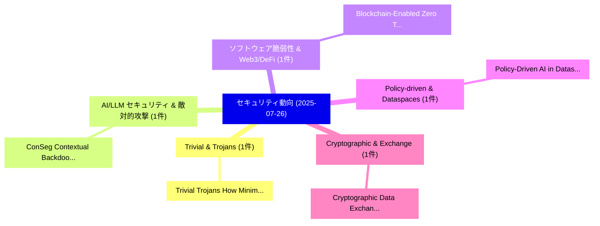

# 📅 02_daily: 日次エグゼクティブサマリー報告書 (2025-07-26)

**集計日時**: 2026-10-02 23:05:34 UTC  
**対象日付**: 2025-07-26  
**本日収集論文数**: 8 件  

---

## 💡 主要セキュリティ動向・脅威インサイト (Executive Insights)

本日の収集論文（計 8 件）において、以下の重点セキュリティ領域で活発な研究動向が確認されました：
- **Trivial & Trojans** (1 件): 注目論文として 「Trivial Trojans: How Minimal M...」 等が発表され、実務防御および攻撃検証の進展が見られます。
- **AI/LLM セキュリティ & 敵対的攻撃** (1 件): 注目論文として 「ConSeg: Contextual Backdoor At...」 等が発表され、実務防御および攻撃検証の進展が見られます。
- **ソフトウェア脆弱性 & Web3/DeFi** (1 件): 注目論文として 「"Blockchain-Enabled Zero Trust...」 等が発表され、実務防御および攻撃検証の進展が見られます。
- **Policy-driven & Dataspaces** (1 件): 注目論文として 「Policy-Driven AI in Dataspaces...」 等が発表され、実務防御および攻撃検証の進展が見られます。
- **Cryptographic & Exchange** (1 件): 注目論文として 「Cryptographic Data Exchange fo...」 等が発表され、実務防御および攻撃検証の進展が見られます。

### 🗺️ 技術・脅威トピックマインドマップ

---

## 📌 日次セキュリティ論文一覧 (日本語表形式)

| No | arXiv ID | 論文タイトル (日本語訳) | 重要キーワード | 構造化エグゼクティブ要約 (背景・提案・影響) | 脅威分類 | 詳細リンク |
|---|---|---|---|---|---|---|
| 1 | `2507.19880v1` | [Trivial Trojans: How Minimal MCP Servers Enable Cross-Tool Exfiltration of Sensitive Data（セキュリティ分析論文）](../../okf/papers/2025-07-26/2507.19880.md) | `Servers Enable Cross`, `Trivial Trojans`, `Tool Exfiltration` | 【提案】概要 (Overview & Key Finding) 本論文「Trivial Trojans: How Minimal MCP Servers Enable Cross-T...。実証評価により経営層・セキュリティ管理者向け推奨アクション (E... | `cs.CR` | [arXiv](https://arxiv.org/abs/2507.19880v1) &#124; [OKF](../../okf/papers/2025-07-26/2507.19880.md) |
| 2 | `2507.19905v1` | [ConSeg: Contextual Backdoor Attack Against Semantic Segmentation（セキュリティ分析論文）](../../okf/papers/2025-07-26/2507.19905.md) | `Bilal Hussain Abbasi`, `Zirui Gong`, `Yanjun Zhang` | 【提案】概要 (Overview & Key Finding) 本論文「ConSeg: Contextual Backdoor Attack Against Semantic Seg...。実証評価により経営層・セキュリティ管理者向け推奨アクション (E... | `cs.CR` | [arXiv](https://arxiv.org/abs/2507.19905v1) &#124; [OKF](../../okf/papers/2025-07-26/2507.19905.md) |
| 3 | `2507.19976v1` | ["Blockchain-Enabled Zero Trust Framework for FinTech Ecosystems Against Insider Threats and Cyber Attacks"のセキュリティ強化](../../okf/papers/2025-07-26/2507.19976.md) | `Blockchain-Enabled Zero`, `Cyber Attacks`, `Avinash Singh` | 【提案】概要 (Overview & Key Finding) 本論文「"Blockchain-Enabled ゼロトラスト Framework for FinTech Ecosys...。実証評価により経営層・セキュリティ管理者向け推奨アクション (E... | `cs.CR` | [arXiv](https://arxiv.org/abs/2507.19976v1) &#124; [OKF](../../okf/papers/2025-07-26/2507.19976.md) |
| 4 | `2507.20014v2` | [Policy-Driven AI in Dataspaces: Taxonomy, Explainability, and Pathways for Compliant Innovation（セキュリティ分析論文）](../../okf/papers/2025-07-26/2507.20014.md) | `Policy-Driven AI`, `Compliant Innovation`, `Satyam Kumar Navneet` | 【提案】概要 (Overview & Key Finding) 本論文「Policy-Driven AI in Dataspaces: Taxonomy, Explainabilit...。実証評価により経営層・セキュリティ管理者向け推奨アクション (E... | `cs.CR` | [arXiv](https://arxiv.org/abs/2507.20014v2) &#124; [OKF](../../okf/papers/2025-07-26/2507.20014.md) |
| 5 | `2507.20074v2` | [Cryptographic Data Exchange for Nuclear Warheads（セキュリティ分析論文）](../../okf/papers/2025-07-26/2507.20074.md) | `Cryptographic Data Exchange`, `Nuclear Warheads`, `Neil Perry` | 【提案】概要 (Overview & Key Finding) 本論文「Cryptographic Data Exchange for Nuclear Warheads（セキュリティ...。実証評価により経営層・セキュリティ管理者向け推奨アクション (E... | `cs.CR` | [arXiv](https://arxiv.org/abs/2507.20074v2) &#124; [OKF](../../okf/papers/2025-07-26/2507.20074.md) |
| 6 | `2507.21177v1` | [FedBAP: Backdoor Defense via Benign Adversarial Perturbation in 連合学習](../../okf/papers/2025-07-26/2507.21177.md) | `Benign Adversarial Perturbation`, `Backdoor Defense`, `Federated Learning` | 【提案】概要 (Overview & Key Finding) 本論文「FedBAP: Backdoor Defense via Benign Adversarial Perturb...。実証評価により経営層・セキュリティ管理者向け推奨アクション (E... | `cs.CR` | [arXiv](https://arxiv.org/abs/2507.21177v1) &#124; [OKF](../../okf/papers/2025-07-26/2507.21177.md) |
| 7 | `2507.21178v3` | [SHoM: A Mental-Synthesis Trust Management Model for Mitigating Botnet-Driven DDoS Attacks in the Internet of Things（セキュリティ分析論文）](../../okf/papers/2025-07-26/2507.21178.md) | `Synthesis Trust Management Model`, `Mitigating Botnet`, `Mental-Synthesis Trust` | 【提案】概要 (Overview & Key Finding) 本論文「SHoM: A Mental-Synthesis Trust Management Model for Mit...。実証評価により経営層・セキュリティ管理者向け推奨アクション (E... | `cs.CR` | [arXiv](https://arxiv.org/abs/2507.21178v3) &#124; [OKF](../../okf/papers/2025-07-26/2507.21178.md) |
| 8 | `2507.21181v1` | [Mitigation of Social Media Platforms Impact on the Users（セキュリティ分析論文）](../../okf/papers/2025-07-26/2507.21181.md) | `Social Media Platforms Impact`, `Smita Khapre`, `Sudhanshu Semwal` | 【提案】概要 (Overview & Key Finding) 本論文「Mitigation of Social Media Platforms Impact on the User...。実証評価により経営層・セキュリティ管理者向け推奨アクション (E... | `cs.CR` | [arXiv](https://arxiv.org/abs/2507.21181v1) &#124; [OKF](../../okf/papers/2025-07-26/2507.21181.md) |

