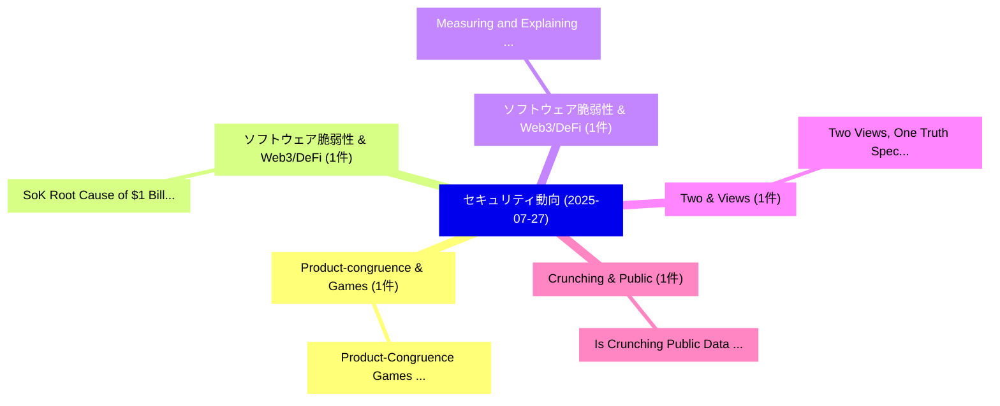

# 📅 02_daily: 日次エグゼクティブサマリー報告書 (2025-07-27)

**集計日時**: 2026-10-02 23:05:34 UTC  
**対象日付**: 2025-07-27  
**本日収集論文数**: 7 件  

---

## 💡 主要セキュリティ動向・脅威インサイト (Executive Insights)

本日の収集論文（計 7 件）において、以下の重点セキュリティ領域で活発な研究動向が確認されました：
- **Product-congruence & Games** (1 件): 注目論文として 「Product-Congruence Games: A Un...」 等が発表され、実務防御および攻撃検証の進展が見られます。
- **ソフトウェア脆弱性 & Web3/DeFi** (1 件): 注目論文として 「SoK: Root Cause of $1 Billion ...」 等が発表され、実務防御および攻撃検証の進展が見られます。
- **ソフトウェア脆弱性 & Web3/DeFi** (1 件): 注目論文として 「Measuring and Explaining the E...」 等が発表され、実務防御および攻撃検証の進展が見られます。
- **Two & Views** (1 件): 注目論文として 「Two Views, One Truth: Spectral...」 等が発表され、実務防御および攻撃検証の進展が見られます。
- **Crunching & Public** (1 件): 注目論文として 「Is Crunching Public Data the R...」 等が発表され、実務防御および攻撃検証の進展が見られます。

### 🗺️ 技術・脅威トピックマインドマップ

---

## 📌 日次セキュリティ論文一覧 (日本語表形式)

| No | arXiv ID | 論文タイトル (日本語訳) | 重要キーワード | 構造化エグゼクティブ要約 (背景・提案・影響) | 脅威分類 | 詳細リンク |
|---|---|---|---|---|---|---|
| 1 | `2507.20087v1` | [Product-Congruence Games: A Unified Impartial-Game Framework for RSA ($φ$-MuM) and AES (poly-MuM)（セキュリティ分析論文）](../../okf/papers/2025-07-27/2507.20087.md) | `Congruence Games`, `Unified Impartial`, `Product-Congruence Games` | 【提案】概要 (Overview & Key Finding) 本論文「Product-Congruence Games: A Unified Impartial-Game Fram...。実証評価により経営層・セキュリティ管理者向け推奨アクション (E... | `cs.CR` | [arXiv](https://arxiv.org/abs/2507.20087v1) &#124; [OKF](../../okf/papers/2025-07-27/2507.20087.md) |
| 2 | `2507.20175v3` | [SoK: Root Cause of $1 Billion Loss in Smart Contract Real-World Attacks via a Systematic Literature Review of Vulnerabilities（セキュリティ分析論文）](../../okf/papers/2025-07-27/2507.20175.md) | `Smart Contract Real`, `Systematic Literature Review`, `Root Cause` | 【提案】概要 (Overview & Key Finding) 本論文「SoK: Root Cause of $1 Billion Loss in スマートコントラクト Real-W...。実証評価により経営層・セキュリティ管理者向け推奨アクション (E... | `cs.CR` | [arXiv](https://arxiv.org/abs/2507.20175v3) &#124; [OKF](../../okf/papers/2025-07-27/2507.20175.md) |
| 3 | `2507.20361v1` | [Measuring and Explaining the Effects of Android App Transformations in Online マルウェア検出](../../okf/papers/2025-07-27/2507.20361.md) | `Android App Transformations`, `Online Malware Detection`, `Guozhu Meng` | 【提案】概要 (Overview & Key Finding) 本論文「Measuring and Explaining the Effects of Android App Tra...。実証評価により経営層・セキュリティ管理者向け推奨アクション (E... | `cs.CR` | [arXiv](https://arxiv.org/abs/2507.20361v1) &#124; [OKF](../../okf/papers/2025-07-27/2507.20361.md) |
| 4 | `2507.20417v1` | [Two Views, One Truth: Spectral and Self-Supervised Features Fusion for Robust Speech Deepfake Detection（セキュリティ分析論文）](../../okf/papers/2025-07-27/2507.20417.md) | `Robust Speech Deepfake Detection`, `Supervised Features Fusion`, `Two Views` | 【提案】概要 (Overview & Key Finding) 本論文「Two Views, One Truth: Spectral and Self-Supervised Feat...。実証評価により経営層・セキュリティ管理者向け推奨アクション (E... | `cs.CR` | [arXiv](https://arxiv.org/abs/2507.20417v1) &#124; [OKF](../../okf/papers/2025-07-27/2507.20417.md) |
| 5 | `2507.20434v1` | [Is Crunching Public Data the Right Approach to Detect BGP Hijacks?（セキュリティ分析論文）](../../okf/papers/2025-07-27/2507.20434.md) | `Alessandro Giaconia`, `Muoi Tran`, `Laurent Vanbever` | 【提案】### (日本語題名: Is Crunching Public Data the Right Approach to Detect BGP Hijacks?（セキュリティ分析...。実証評価により経営層・セキュリティ管理者向け推奨アクション (E... | `cs.CR` | [arXiv](https://arxiv.org/abs/2507.20434v1) &#124; [OKF](../../okf/papers/2025-07-27/2507.20434.md) |
| 6 | `2507.21182v1` | [SDD: Self-Degraded Defense against Malicious Fine-tuning（セキュリティ分析論文）](../../okf/papers/2025-07-27/2507.21182.md) | `Degraded Defense`, `Malicious Fine`, `Self-Degraded Defense` | 【提案】概要 (Overview & Key Finding) 本論文「SDD: Self-Degraded Defense against Malicious Fine-tunin...。実証評価により経営層・セキュリティ管理者向け推奨アクション (E... | `cs.CR` | [arXiv](https://arxiv.org/abs/2507.21182v1) &#124; [OKF](../../okf/papers/2025-07-27/2507.21182.md) |
| 7 | `2507.21193v1` | [Interpretable Anomaly-Based DDoS Detection in AI-RAN with XAI and LLMs（セキュリティ分析論文）](../../okf/papers/2025-07-27/2507.21193.md) | `Interpretable Anomaly`, `Anomaly-Based DDoS`, `Mahdi Boloursaz Mashhadi` | 【提案】概要 (Overview & Key Finding) 本論文「Interpretable Anomaly-Based DDoS Detection in AI-RAN wi...。実証評価により経営層・セキュリティ管理者向け推奨アクション (E... | `cs.CR` | [arXiv](https://arxiv.org/abs/2507.21193v1) &#124; [OKF](../../okf/papers/2025-07-27/2507.21193.md) |

