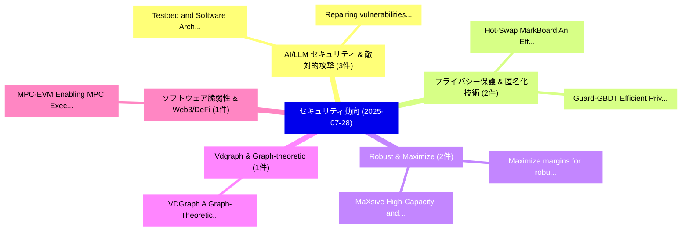

# 📅 02_daily: 日次エグゼクティブサマリー報告書 (2025-07-28)

**集計日時**: 2026-10-02 23:05:34 UTC  
**対象日付**: 2025-07-28  
**本日収集論文数**: 19 件  

---

## 💡 主要セキュリティ動向・脅威インサイト (Executive Insights)

本日の収集論文（計 19 件）において、以下の重点セキュリティ領域で活発な研究動向が確認されました：
- **AI/LLM セキュリティ & 敵対的攻撃** (3 件): 注目論文として 「Testbed and Software Architect...」、「Repairing vulnerabilities with...」 等が発表され、実務防御および攻撃検証の進展が見られます。
- **プライバシー保護 & 匿名化技術** (2 件): 注目論文として 「Hot-Swap MarkBoard: An Efficie...」、「Guard-GBDT: Efficient Privacy-...」 等が発表され、実務防御および攻撃検証の進展が見られます。
- **Robust & Maximize** (2 件): 注目論文として 「MaXsive: High-Capacity and Rob...」、「Maximize margins for robust sp...」 等が発表され、実務防御および攻撃検証の進展が見られます。
- **Vdgraph & Graph-theoretic** (1 件): 注目論文として 「VDGraph: A Graph-Theoretic App...」 等が発表され、実務防御および攻撃検証の進展が見られます。
- **ソフトウェア脆弱性 & Web3/DeFi** (1 件): 注目論文として 「MPC-EVM: Enabling MPC Executio...」 等が発表され、実務防御および攻撃検証の進展が見られます。

### 🗺️ 技術・脅威トピックマインドマップ

---

## 📌 日次セキュリティ論文一覧 (日本語表形式)

| No | arXiv ID | 論文タイトル (日本語訳) | 重要キーワード | 構造化エグゼクティブ要約 (背景・提案・影響) | 脅威分類 | 詳細リンク |
|---|---|---|---|---|---|---|
| 1 | `2507.20502v1` | [VDGraph: A Graph-Theoretic Approach to Unlock Insights from SBOM and SCA Data（セキュリティ分析論文）](../../okf/papers/2025-07-28/2507.20502.md) | `Unlock Insights`, `David Sastre Medina`, `Howell Xia` | 【提案】概要 (Overview & Key Finding) 本論文「VDGraph: A Graph-Theoretic Approach to Unlock Insights ...。実証評価により経営層・セキュリティ管理者向け推奨アクション (E... | `cs.CR` | [arXiv](https://arxiv.org/abs/2507.20502v1) &#124; [OKF](../../okf/papers/2025-07-28/2507.20502.md) |
| 2 | `2507.20554v1` | [MPC-EVM: Enabling MPC Execution by Smart Contracts In An Asynchronous Manner（セキュリティ分析論文）](../../okf/papers/2025-07-28/2507.20554.md) | `Yichen Zhou`, `Chenxing Li`, `Fan Long` | 【提案】概要 (Overview & Key Finding) 本論文「MPC-EVM: Enabling MPC Execution by スマートコントラクトs In An As...。実証評価により経営層・セキュリティ管理者向け推奨アクション (E... | `cs.CR` | [arXiv](https://arxiv.org/abs/2507.20554v1) &#124; [OKF](../../okf/papers/2025-07-28/2507.20554.md) |
| 3 | `2507.20650v1` | [Hot-Swap MarkBoard: An Efficient Black-box Watermarking Approach for Large-scale Model Distribution（セキュリティ分析論文）](../../okf/papers/2025-07-28/2507.20650.md) | `Model Distribution`, `Hot-Swap MarkBoard`, `Black-box Watermarking` | 【提案】概要 (Overview & Key Finding) 本論文「Hot-Swap MarkBoard: An Efficient Black-box Watermarking...。実証評価により経営層・セキュリティ管理者向け推奨アクション (E... | `cs.CR` | [arXiv](https://arxiv.org/abs/2507.20650v1) &#124; [OKF](../../okf/papers/2025-07-28/2507.20650.md) |
| 4 | `2507.20672v1` | [Program Analysis for High-Value Smart Contract Vulnerabilities: Techniques and Insights（セキュリティ分析論文）](../../okf/papers/2025-07-28/2507.20672.md) | `Value Smart Contract Vulnerabilities`, `High-Value Smart`, `Value Smart Contract Vulnerabil` | 【提案】概要 (Overview & Key Finding) 本論文「Program Analysis for High-Value スマートコントラクト Vulnerabilit...。実証評価により経営層・セキュリティ管理者向け推奨アクション (E... | `cs.CR` | [arXiv](https://arxiv.org/abs/2507.20672v1) &#124; [OKF](../../okf/papers/2025-07-28/2507.20672.md) |
| 5 | `2507.20676v1` | [A Novel Post-Quantum Secure Digital Signature Scheme Based on Neural Network（セキュリティ分析論文）](../../okf/papers/2025-07-28/2507.20676.md) | `Quantum Secure Digital Signature Scheme Based`, `Neural Network`, `Post-Quantum Secure` | 【提案】概要 (Overview & Key Finding) 本論文「A Novel Post-量子 Secure Digital Signature Scheme Based o...。実証評価により経営層・セキュリティ管理者向け推奨アクション (E... | `cs.CR` | [arXiv](https://arxiv.org/abs/2507.20676v1) &#124; [OKF](../../okf/papers/2025-07-28/2507.20676.md) |
| 6 | `2507.20688v2` | [Guard-GBDT: Efficient Privacy-Preserving Approximated GBDT Training on Vertical Dataset（セキュリティ分析論文）](../../okf/papers/2025-07-28/2507.20688.md) | `Efficient Privacy`, `Preserving Approximated`, `Vertical Dataset` | 【提案】概要 (Overview & Key Finding) 本論文「Guard-GBDT: Efficient Privacy-Preserving Approximated G...。実証評価により経営層・セキュリティ管理者向け推奨アクション (E... | `cs.CR` | [arXiv](https://arxiv.org/abs/2507.20688v2) &#124; [OKF](../../okf/papers/2025-07-28/2507.20688.md) |
| 7 | `2507.20704v2` | [Text2VLM: Adapting Text-Only Datasets to Evaluate Alignment Training in Visual Language Models（セキュリティ分析論文）](../../okf/papers/2025-07-28/2507.20704.md) | `Visual Language Models`, `Adapting Text`, `Text-Only Datasets` | 【提案】概要 (Overview & Key Finding) 本論文「Text2VLM: Adapting Text-Only Datasets to Evaluate Align...。実証評価により経営層・セキュリティ管理者向け推奨アクション (E... | `cs.CR` | [arXiv](https://arxiv.org/abs/2507.20704v2) &#124; [OKF](../../okf/papers/2025-07-28/2507.20704.md) |
| 8 | `2507.20806v1` | [Collusion Resistant DNS With Private Information Retrieval（セキュリティ分析論文）](../../okf/papers/2025-07-28/2507.20806.md) | `Collusion Resistant`, `Yunming Xiao`, `Peizhi Liu` | 【提案】概要 (Overview & Key Finding) 本論文「Collusion Resistant DNS With Private Information Retrie...。実証評価により経営層・セキュリティ管理者向け推奨アクション (E... | `cs.CR` | [arXiv](https://arxiv.org/abs/2507.20806v1) &#124; [OKF](../../okf/papers/2025-07-28/2507.20806.md) |
| 9 | `2507.20851v1` | [An Open-source Implementation and Security Triad's TEE Trusted Time Protocolの分析](../../okf/papers/2025-07-28/2507.20851.md) | `Open-source Implementation`, `Trusted Time Protocol`, `Security Triad` | 【提案】概要 (Overview & Key Finding) 本論文「An Open-source Implementation and Security Triad's TEE ...。実証評価により経営層・セキュリティ管理者向け推奨アクション (E... | `cs.CR` | [arXiv](https://arxiv.org/abs/2507.20851v1) &#124; [OKF](../../okf/papers/2025-07-28/2507.20851.md) |
| 10 | `2507.20873v1` | [Testbed and Software Architecture for Enhancing Security in Industrial Private 5G Networks（セキュリティ分析論文）](../../okf/papers/2025-07-28/2507.20873.md) | `Software Architecture`, `Enhancing Security`, `Industrial Private` | 【提案】概要 (Overview & Key Finding) 本論文「Testbed and Software Architecture for Enhancing Securit...。実証評価により経営層・セキュリティ管理者向け推奨アクション (E... | `cs.CR` | [arXiv](https://arxiv.org/abs/2507.20873v1) &#124; [OKF](../../okf/papers/2025-07-28/2507.20873.md) |
| 11 | `2507.20891v4` | [Characterizing the Sensitivity to Individual Bit Flips in Client-Side Operations of the CKKS Scheme（セキュリティ分析論文）](../../okf/papers/2025-07-28/2507.20891.md) | `Individual Bit Flips`, `Side Operations`, `Client-Side Operations` | 【提案】概要 (Overview & Key Finding) 本論文「Characterizing the Sensitivity to Individual Bit Flips ...。実証評価により経営層・セキュリティ管理者向け推奨アクション (E... | `cs.CR` | [arXiv](https://arxiv.org/abs/2507.20891v4) &#124; [OKF](../../okf/papers/2025-07-28/2507.20891.md) |
| 12 | `2507.20977v2` | [Repairing vulnerabilities without invisible hands. A differentiated replication study on LLMs（セキュリティ分析論文）](../../okf/papers/2025-07-28/2507.20977.md) | `Maria Camporese`, `Fabio Massacci`, `Raw Meta` | 【提案】A differentiated replication study on LLMs / arXiv: 2507.20977v2）は、cs.SE 分野における最新セキュリティ...。実証評価により経営層・セキュリティ管理者向け推奨アクション (E... | `cs.CR` | [arXiv](https://arxiv.org/abs/2507.20977v2) &#124; [OKF](../../okf/papers/2025-07-28/2507.20977.md) |
| 13 | `2507.21038v2` | [Development and a secured VoIP system for surveillance activitiesの分析](../../okf/papers/2025-07-28/2507.21038.md) | `Matsive Ali`, `Raw Meta`, `Executive Summary` | 【提案】概要 (Overview & Key Finding) 本論文「Development and a secured VoIP system for surveillance ...。実証評価によりMatsive Ali - **公開日時**: `... | `cs.CR` | [arXiv](https://arxiv.org/abs/2507.21038v2) &#124; [OKF](../../okf/papers/2025-07-28/2507.21038.md) |
| 14 | `2507.21195v1` | [MaXsive: High-Capacity and Robust Training-Free Generative Image Watermarking in Diffusion Models（セキュリティ分析論文）](../../okf/papers/2025-07-28/2507.21195.md) | `Free Generative Image Watermarking`, `Robust Training`, `Diffusion Models` | 【提案】概要 (Overview & Key Finding) 本論文「MaXsive: High-Capacity and Robust Training-Free Generat...。実証評価により経営層・セキュリティ管理者向け推奨アクション (E... | `cs.CR` | [arXiv](https://arxiv.org/abs/2507.21195v1) &#124; [OKF](../../okf/papers/2025-07-28/2507.21195.md) |
| 15 | `2507.21258v2` | [Verification Cost Asymmetry in Cognitive Warfare: A Complexity-Theoretic Framework（セキュリティ分析論文）](../../okf/papers/2025-07-28/2507.21258.md) | `Verification Cost Asymmetry`, `Cognitive Warfare`, `Joshua Luberisse` | 【提案】概要 (Overview & Key Finding) 本論文「Verification Cost Asymmetry in Cognitive Warfare: A Com...。実証評価により経営層・セキュリティ管理者向け推奨アクション (E... | `cs.CR` | [arXiv](https://arxiv.org/abs/2507.21258v2) &#124; [OKF](../../okf/papers/2025-07-28/2507.21258.md) |
| 16 | `2507.21325v1` | [On Post-Quantum Cryptography Authentication for Quantum Key Distribution（セキュリティ分析論文）](../../okf/papers/2025-07-28/2507.21325.md) | `Quantum Cryptography Authentication`, `Quantum Key Distribution`, `Post-Quantum Cryptography` | 【提案】概要 (Overview & Key Finding) 本論文「On ポスト量子暗号 Authentication for 量子鍵配送（セキュリティ分析論文）」（原題: On...。実証評価により経営層・セキュリティ管理者向け推奨アクション (E... | `cs.CR` | [arXiv](https://arxiv.org/abs/2507.21325v1) &#124; [OKF](../../okf/papers/2025-07-28/2507.21325.md) |
| 17 | `2507.21387v1` | [Radio EMG-based Gesture Recognition Networksに対する敵対的攻撃](../../okf/papers/2025-07-28/2507.21387.md) | `EMG-based Gesture`, `Radio Adversarial Attacks`, `Gesture Recognition Networks` | 【提案】概要 (Overview & Key Finding) 本論文「Radio EMG-based Gesture Recognition Networksに対する敵対的攻撃」（...。実証評価により経営層・セキュリティ管理者向け推奨アクション (E... | `cs.CR` | [arXiv](https://arxiv.org/abs/2507.21387v1) &#124; [OKF](../../okf/papers/2025-07-28/2507.21387.md) |
| 18 | `2507.22171v3` | [Enhancing Jailbreak Attacks on LLMs via Persona Prompts（セキュリティ分析論文）](../../okf/papers/2025-07-28/2507.22171.md) | `Enhancing Jailbreak Attacks`, `Persona Prompts`, `Zheng Zhang` | 【提案】概要 (Overview & Key Finding) 本論文「Enhancing ジェイルブレイク Attacks on LLMs via Persona Prompts（...。実証評価により経営層・セキュリティ管理者向け推奨アクション (E... | `cs.CR` | [arXiv](https://arxiv.org/abs/2507.22171v3) &#124; [OKF](../../okf/papers/2025-07-28/2507.22171.md) |
| 19 | `2508.00897v1` | [Maximize margins for robust splicing detection（セキュリティ分析論文）](../../okf/papers/2025-07-28/2508.00897.md) | `Julien Simon`, `Rony Abecidan`, `Patrick Bas` | 【提案】概要 (Overview & Key Finding) 本論文「Maximize margins for robust splicing detection（セキュリティ分析...。実証評価により経営層・セキュリティ管理者向け推奨アクション (E... | `cs.CR` | [arXiv](https://arxiv.org/abs/2508.00897v1) &#124; [OKF](../../okf/papers/2025-07-28/2508.00897.md) |

