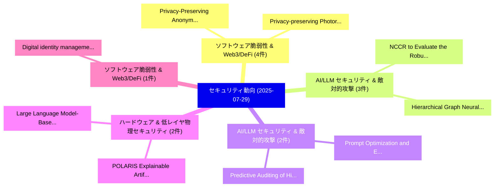

# 📅 02_daily: 日次エグゼクティブサマリー報告書 (2025-07-29)

**集計日時**: 2026-10-02 23:05:34 UTC  
**対象日付**: 2025-07-29  
**本日収集論文数**: 27 件  

---

## 💡 主要セキュリティ動向・脅威インサイト (Executive Insights)

本日の収集論文（計 27 件）において、以下の重点セキュリティ領域で活発な研究動向が確認されました：
- **ソフトウェア脆弱性 & Web3/DeFi** (4 件): 注目論文として 「Privacy-Preserving Anonymizati...」、「Privacy-preserving Photorealis...」 等が発表され、実務防御および攻撃検証の進展が見られます。
- **AI/LLM セキュリティ & 敵対的攻撃** (3 件): 注目論文として 「NCCR: to Evaluate the Robustne...」、「Hierarchical Graph Neural Netw...」 等が発表され、実務防御および攻撃検証の進展が見られます。
- **AI/LLM セキュリティ & 敵対的攻撃** (2 件): 注目論文として 「Prompt Optimization and Evalua...」、「Predictive Auditing of Hidden ...」 等が発表され、実務防御および攻撃検証の進展が見られます。
- **ハードウェア & 低レイヤ物理セキュリティ** (2 件): 注目論文として 「POLARIS: Explainable Artificia...」、「Large Language Model-Based Fra...」 等が発表され、実務防御および攻撃検証の進展が見られます。
- **ソフトウェア脆弱性 & Web3/DeFi** (1 件): 注目論文として 「Digital identity management sy...」 等が発表され、実務防御および攻撃検証の進展が見られます。

### 🗺️ 技術・脅威トピックマインドマップ

---

## 📌 日次セキュリティ論文一覧 (日本語表形式)

| No | arXiv ID | 論文タイトル (日本語訳) | 重要キーワード | 構造化エグゼクティブ要約 (背景・提案・影響) | 脅威分類 | 詳細リンク |
|---|---|---|---|---|---|---|
| 1 | `2507.21398v1` | [Digital identity management system with blockchain:An implementation with Ethereum and Ganache（セキュリティ分析論文）](../../okf/papers/2025-07-29/2507.21398.md) | `Davi Lopes`, `Tais Mello`, `Reis Bezerra` | 【提案】概要 (Overview & Key Finding) 本論文「Digital identity management system with blockchain:An i...。実証評価により経営層・セキュリティ管理者向け推奨アクション (E... | `cs.CR` | [arXiv](https://arxiv.org/abs/2507.21398v1) &#124; [OKF](../../okf/papers/2025-07-29/2507.21398.md) |
| 2 | `2507.21412v3` | [Cascading and Proxy Membership Inference Attacks（セキュリティ分析論文）](../../okf/papers/2025-07-29/2507.21412.md) | `Proxy Membership Inference Attacks`, `Yuntao Du`, `Jiacheng Li` | 【提案】概要 (Overview & Key Finding) 本論文「Cascading and Proxy Membership Inference Attacks（セキュリティ...。実証評価により経営層・セキュリティ管理者向け推奨アクション (E... | `cs.CR` | [arXiv](https://arxiv.org/abs/2507.21412v3) &#124; [OKF](../../okf/papers/2025-07-29/2507.21412.md) |
| 3 | `2507.21483v2` | [NCCR: to Evaluate the Robustness of Neural Networks and Adversarial Examples（セキュリティ分析論文）](../../okf/papers/2025-07-29/2507.21483.md) | `Neural Networks`, `Adversarial Examples`, `Shi Pu` | 【提案】概要 (Overview & Key Finding) 本論文「NCCR: to Evaluate the Robustness of Neural Networks and...。実証評価により経営層・セキュリティ管理者向け推奨アクション (E... | `cs.CR` | [arXiv](https://arxiv.org/abs/2507.21483v2) &#124; [OKF](../../okf/papers/2025-07-29/2507.21483.md) |
| 4 | `2507.21538v1` | [Can We End the Cat-and-Mouse Game? Simulating Self-Evolving Phishing Attacks with LLMs and Genetic Algorithms（セキュリティ分析論文）](../../okf/papers/2025-07-29/2507.21538.md) | `Evolving Phishing Attacks`, `Mouse Game`, `Simulating Self` | 【提案】Simulating Self-Evolving Phishing Attacks with LLMs and Genetic Algorithms ### (日本語題名: ...。実証評価により経営層・セキュリティ管理者向け推奨アクション (E... | `cs.CR` | [arXiv](https://arxiv.org/abs/2507.21538v1) &#124; [OKF](../../okf/papers/2025-07-29/2507.21538.md) |
| 5 | `2507.21540v3` | [PRISM: Programmatic Reasoning with Image Sequence Manipulation for LVLM Jailbreaking（セキュリティ分析論文）](../../okf/papers/2025-07-29/2507.21540.md) | `Image Sequence Manipulation`, `Programmatic Reasoning`, `Image Sequence Manipu` | 【提案】概要 (Overview & Key Finding) 本論文「PRISM: Programmatic Reasoning with Image Sequence Manip...。実証評価により経営層・セキュリティ管理者向け推奨アクション (E... | `cs.CR` | [arXiv](https://arxiv.org/abs/2507.21540v3) &#124; [OKF](../../okf/papers/2025-07-29/2507.21540.md) |
| 6 | `2507.21591v2` | [Hierarchical Graph Neural Network for Compressed Speech Steganalysis（セキュリティ分析論文）](../../okf/papers/2025-07-29/2507.21591.md) | `Hierarchical Graph Neural Network`, `Compressed Speech Steganalysis`, `Mohamed Chahine Ghanem` | 【提案】概要 (Overview & Key Finding) 本論文「Hierarchical Graph Neural Network for Compressed Speech...。実証評価により経営層・セキュリティ管理者向け推奨アクション (E... | `cs.CR` | [arXiv](https://arxiv.org/abs/2507.21591v2) &#124; [OKF](../../okf/papers/2025-07-29/2507.21591.md) |
| 7 | `2507.21640v1` | [GUARD-CAN: Graph-Understanding and Recurrent Architecture for CAN Anomaly Detection（セキュリティ分析論文）](../../okf/papers/2025-07-29/2507.21640.md) | `Recurrent Architecture`, `Anomaly Detection`, `Hyeong Seon Kim` | 【提案】概要 (Overview & Key Finding) 本論文「GUARD-CAN: Graph-Understanding and Recurrent Architectu...。実証評価により経営層・セキュリティ管理者向け推奨アクション (E... | `cs.CR` | [arXiv](https://arxiv.org/abs/2507.21640v1) &#124; [OKF](../../okf/papers/2025-07-29/2507.21640.md) |
| 8 | `2507.21731v1` | [Modelling Arbitrary Computations in the Symbolic Model using an Equational Theory for Bounded Binary Circuits（セキュリティ分析論文）](../../okf/papers/2025-07-29/2507.21731.md) | `Modelling Arbitrary Computations`, `Bounded Binary Circuits`, `Symbolic Model` | 【提案】概要 (Overview & Key Finding) 本論文「Modelling Arbitrary Computations in the Symbolic Model ...。実証評価により経営層・セキュリティ管理者向け推奨アクション (E... | `cs.CR` | [arXiv](https://arxiv.org/abs/2507.21731v1) &#124; [OKF](../../okf/papers/2025-07-29/2507.21731.md) |
| 9 | `2507.21817v4` | [Out of Distribution, Out of Luck: How Well Can LLMs Trained on Vulnerability Datasets Detect Top 25 CWE Weaknesses?（セキュリティ分析論文）](../../okf/papers/2025-07-29/2507.21817.md) | `Vulnerability Datasets Detect Top`, `Ngoc Tan Bui`, `Huu Hung Nguyen` | 【提案】### (日本語題名: Out of Distribution, Out of Luck: How Well Can LLMs Trained on 脆弱性 Datasets...。実証評価により経営層・セキュリティ管理者向け推奨アクション (E... | `cs.CR` | [arXiv](https://arxiv.org/abs/2507.21817v4) &#124; [OKF](../../okf/papers/2025-07-29/2507.21817.md) |
| 10 | `2507.21904v1` | [Privacy-Preserving Anonymization of System and Network Event Logs Using Salt-Based Hashing and Temporal Noise（セキュリティ分析論文）](../../okf/papers/2025-07-29/2507.21904.md) | `Network Event Logs Using Salt`, `Preserving Anonymization`, `Privacy-Preserving Anonymization` | 【提案】概要 (Overview & Key Finding) 本論文「Privacy-Preserving Anonymization of System and Network ...。実証評価により経営層・セキュリティ管理者向け推奨アクション (E... | `cs.CR` | [arXiv](https://arxiv.org/abs/2507.21904v1) &#124; [OKF](../../okf/papers/2025-07-29/2507.21904.md) |
| 11 | `2507.21985v1` | [ZIUM: Zero-Shot Intent-Aware Adversarial Attack on Unlearned Models（セキュリティ分析論文）](../../okf/papers/2025-07-29/2507.21985.md) | `Aware Adversarial Attack`, `Shot Intent`, `Unlearned Models` | 【提案】概要 (Overview & Key Finding) 本論文「ZIUM: Zero-Shot Intent-Aware 敵対的攻撃 on Unlearned Models（...。実証評価により経営層・セキュリティ管理者向け推奨アクション (E... | `cs.CR` | [arXiv](https://arxiv.org/abs/2507.21985v1) &#124; [OKF](../../okf/papers/2025-07-29/2507.21985.md) |
| 12 | `2507.22037v1` | [Secure Tug-of-War (SecTOW): Iterative Defense-Attack Training with Reinforcement Learning for Multimodal Model Security（セキュリティ分析論文）](../../okf/papers/2025-07-29/2507.22037.md) | `Multimodal Model Security`, `Secure Tug`, `Iterative Defense` | 【提案】概要 (Overview & Key Finding) 本論文「Secure Tug-of-War (SecTOW): Iterative Defense-Attack Tr...。実証評価により経営層・セキュリティ管理者向け推奨アクション (E... | `cs.CR` | [arXiv](https://arxiv.org/abs/2507.22037v1) &#124; [OKF](../../okf/papers/2025-07-29/2507.22037.md) |
| 13 | `2507.22133v1` | [Prompt Optimization and Evaluation for LLM Automated Red Teaming（セキュリティ分析論文）](../../okf/papers/2025-07-29/2507.22133.md) | `Automated Red Teaming`, `Prompt Optimization`, `Michael Freenor` | 【提案】概要 (Overview & Key Finding) 本論文「Prompt Optimization and Evaluation for LLM Automated Re...。実証評価により経営層・セキュリティ管理者向け推奨アクション (E... | `cs.CR` | [arXiv](https://arxiv.org/abs/2507.22133v1) &#124; [OKF](../../okf/papers/2025-07-29/2507.22133.md) |
| 14 | `2507.22140v2` | [Evaluation of Noise and Crosstalk in Neutral Atom Quantum Computers（セキュリティ分析論文）](../../okf/papers/2025-07-29/2507.22140.md) | `Neutral Atom Quantum Computers`, `Pranet Sharma`, `Yizhuo Tan` | 【提案】概要 (Overview & Key Finding) 本論文「Evaluation of Noise and Crosstalk in Neutral Atom 量子 Co...。実証評価により経営層・セキュリティ管理者向け推奨アクション (E... | `cs.CR` | [arXiv](https://arxiv.org/abs/2507.22140v2) &#124; [OKF](../../okf/papers/2025-07-29/2507.22140.md) |
| 15 | `2507.22153v1` | [Privacy-preserving Photorealistic Self-avatars in Mixed Realityに向けて](../../okf/papers/2025-07-29/2507.22153.md) | `Photorealistic Self`, `Privacy-preserving Photorealistic`, `Towards Privacy` | 【提案】概要 (Overview & Key Finding) 本論文「Privacy-preserving Photorealistic Self-avatars in Mixed...。実証評価により経営層・セキュリティ管理者向け推奨アクション (E... | `cs.CR` | [arXiv](https://arxiv.org/abs/2507.22153v1) &#124; [OKF](../../okf/papers/2025-07-29/2507.22153.md) |
| 16 | `2507.22160v1` | [Strategic Deflection: Defending LLMs from Logit Manipulation（セキュリティ分析論文）](../../okf/papers/2025-07-29/2507.22160.md) | `Strategic Deflection`, `Logit Manipulation`, `Amal El Fallah Seghrouchni` | 【提案】概要 (Overview & Key Finding) 本論文「Strategic Deflection: Defending LLMs from Logit Manipul...。実証評価により経営層・セキュリティ管理者向け推奨アクション (E... | `cs.CR` | [arXiv](https://arxiv.org/abs/2507.22160v1) &#124; [OKF](../../okf/papers/2025-07-29/2507.22160.md) |
| 17 | `2507.22165v1` | [Programmable Data Planes for Network Security（セキュリティ分析論文）](../../okf/papers/2025-07-29/2507.22165.md) | `Programmable Data Planes`, `Network Security`, `Gursimran Singh` | 【提案】概要 (Overview & Key Finding) 本論文「Programmable Data Planes for Network Security（セキュリティ分析論...。実証評価によりAcharya, Minseok Kwon - *... | `cs.CR` | [arXiv](https://arxiv.org/abs/2507.22165v1) &#124; [OKF](../../okf/papers/2025-07-29/2507.22165.md) |
| 18 | `2507.22177v1` | [POLARIS: Explainable Artificial Intelligence for Mitigating Power Side-Channel Leakage（セキュリティ分析論文）](../../okf/papers/2025-07-29/2507.22177.md) | `Explainable Artificial Intelligence`, `Mitigating Power Side`, `Channel Leakage` | 【提案】概要 (Overview & Key Finding) 本論文「POLARIS: Explainable Artificial Intelligence for Mitiga...。実証評価により経営層・セキュリティ管理者向け推奨アクション (E... | `cs.CR` | [arXiv](https://arxiv.org/abs/2507.22177v1) &#124; [OKF](../../okf/papers/2025-07-29/2507.22177.md) |
| 19 | `2507.22226v2` | [Optimal Planning for Enhancing the Resilience of Modern Distribution Systems Against Cyberattacks（セキュリティ分析論文）](../../okf/papers/2025-07-29/2507.22226.md) | `Optimal Planning`, `Ahmad Mohammad Saber`, `Armita Khashayardoost` | 【提案】概要 (Overview & Key Finding) 本論文「Optimal Planning for Enhancing the Resilience of Modern...。実証評価により経営層・セキュリティ管理者向け推奨アクション (E... | `cs.CR` | [arXiv](https://arxiv.org/abs/2507.22226v2) &#124; [OKF](../../okf/papers/2025-07-29/2507.22226.md) |
| 20 | `2507.22231v1` | [Understanding Concept Drift with Deprecated Permissions in Android マルウェア検出](../../okf/papers/2025-07-29/2507.22231.md) | `Understanding Concept Drift`, `Deprecated Permissions`, `Android Malware Detection` | 【提案】概要 (Overview & Key Finding) 本論文「Understanding Concept Drift with Deprecated Permissions...。実証評価により経営層・セキュリティ管理者向け推奨アクション (E... | `cs.CR` | [arXiv](https://arxiv.org/abs/2507.22231v1) &#124; [OKF](../../okf/papers/2025-07-29/2507.22231.md) |
| 21 | `2507.22239v2` | [Large Language Model-Based Framework for Explainable Cyberattack Detection in Automatic Generation Control Systems（セキュリティ分析論文）](../../okf/papers/2025-07-29/2507.22239.md) | `Automatic Generation Control Systems`, `Large Language Model`, `Explainable Cyberattack Detection` | 【提案】概要 (Overview & Key Finding) 本論文「Large Language Model-Based Framework for Explainable Cy...。実証評価により経営層・セキュリティ管理者向け推奨アクション (E... | `cs.CR` | [arXiv](https://arxiv.org/abs/2507.22239v2) &#124; [OKF](../../okf/papers/2025-07-29/2507.22239.md) |
| 22 | `2507.22265v1` | [Cell-Probe Lower Bounds via Semi-Random CSP Refutation: Simplified and the Odd-Locality Case（セキュリティ分析論文）](../../okf/papers/2025-07-29/2507.22265.md) | `Probe Lower Bounds`, `Cell-Probe Lower`, `Locality Case` | 【提案】概要 (Overview & Key Finding) 本論文「Cell-Probe Lower Bounds via Semi-Random CSP Refutation:...。実証評価により経営層・セキュリティ管理者向け推奨アクション (E... | `cs.CR` | [arXiv](https://arxiv.org/abs/2507.22265v1) &#124; [OKF](../../okf/papers/2025-07-29/2507.22265.md) |
| 23 | `2508.00907v2` | [Prime Factorization Equation from a Tensor Network Perspective（セキュリティ分析論文）](../../okf/papers/2025-07-29/2508.00907.md) | `Prime Factorization Equation`, `Tensor Network Perspective`, `Alejandro Mata Ali` | 【提案】概要 (Overview & Key Finding) 本論文「Prime Factorization Equation from a Tensor Network Pers...。実証評価により経営層・セキュリティ管理者向け推奨アクション (E... | `cs.CR` | [arXiv](https://arxiv.org/abs/2508.00907v2) &#124; [OKF](../../okf/papers/2025-07-29/2508.00907.md) |
| 24 | `2508.00910v2` | [Cyber-Zero: Training サイバーセキュリティ Agents without Runtime](../../okf/papers/2025-07-29/2508.00910.md) | `Training Cybersecurity Agents`, `Terry Yue Zhuo`, `Dingmin Wang` | 【提案】背景とセキュリティ上の課題 (Background & Problem) 本研究はサイバー脅威環境におけるセキュリティ構造・脆弱性の検証を目的としています。(主要検出項目: ...。実証評価により経営層・セキュリティ管理者向け推奨アクション (E... | `cs.CR` | [arXiv](https://arxiv.org/abs/2508.00910v2) &#124; [OKF](../../okf/papers/2025-07-29/2508.00910.md) |
| 25 | `2508.00912v1` | [Predictive Auditing of Hidden Tokens in LLM APIs via Reasoning Length Estimation（セキュリティ分析論文）](../../okf/papers/2025-07-29/2508.00912.md) | `Reasoning Length Estimation`, `Predictive Auditing`, `Hidden Tokens` | 【提案】概要 (Overview & Key Finding) 本論文「Predictive Auditing of Hidden Tokens in LLM APIs via Re...。実証評価により経営層・セキュリティ管理者向け推奨アクション (E... | `cs.CR` | [arXiv](https://arxiv.org/abs/2508.00912v1) &#124; [OKF](../../okf/papers/2025-07-29/2508.00912.md) |
| 26 | `2508.05655v1` | [Blockchain-Based Decentralized Domain Name System（セキュリティ分析論文）](../../okf/papers/2025-07-29/2508.05655.md) | `Based Decentralized Domain Name System`, `Blockchain-Based Decentralized`, `Guang Yang` | 【提案】概要 (Overview & Key Finding) 本論文「Blockchain-Based Decentralized Domain Name System（セキュリテ...。実証評価により経営層・セキュリティ管理者向け推奨アクション (E... | `cs.CR` | [arXiv](https://arxiv.org/abs/2508.05655v1) &#124; [OKF](../../okf/papers/2025-07-29/2508.05655.md) |
| 27 | `2510.02184v1` | [Testing Stability and Robustness in Three Cryptographic Chaotic Systems（セキュリティ分析論文）](../../okf/papers/2025-07-29/2510.02184.md) | `Three Cryptographic Chaotic Systems`, `Testing Stability`, `Raw Meta` | 【提案】概要 (Overview & Key Finding) 本論文「Testing Stability and Robustness in Three Cryptographic...。実証評価によりAnagnostopoulos, K.。 | `cs.CR` | [arXiv](https://arxiv.org/abs/2510.02184v1) &#124; [OKF](../../okf/papers/2025-07-29/2510.02184.md) |

