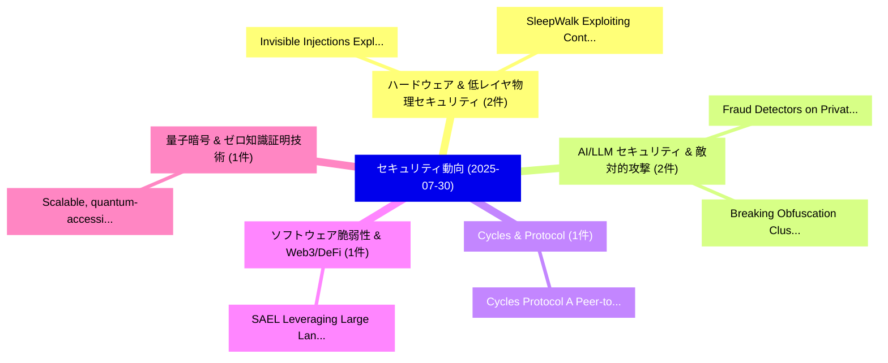

# 📅 02_daily: 日次エグゼクティブサマリー報告書 (2025-07-30)

**集計日時**: 2026-10-02 23:05:34 UTC  
**対象日付**: 2025-07-30  
**本日収集論文数**: 16 件  

---

## 💡 主要セキュリティ動向・脅威インサイト (Executive Insights)

本日の収集論文（計 16 件）において、以下の重点セキュリティ領域で活発な研究動向が確認されました：
- **ハードウェア & 低レイヤ物理セキュリティ** (2 件): 注目論文として 「Invisible Injections: Exploiti...」、「SleepWalk: Exploiting Context ...」 等が発表され、実務防御および攻撃検証の進展が見られます。
- **AI/LLM セキュリティ & 敵対的攻撃** (2 件): 注目論文として 「Fraud Detectors on Private Gra...」、「Breaking Obfuscation: Cluster-...」 等が発表され、実務防御および攻撃検証の進展が見られます。
- **Cycles & Protocol** (1 件): 注目論文として 「Cycles Protocol: A Peer-to-Pee...」 等が発表され、実務防御および攻撃検証の進展が見られます。
- **ソフトウェア脆弱性 & Web3/DeFi** (1 件): 注目論文として 「SAEL: Leveraging Large Languag...」 等が発表され、実務防御および攻撃検証の進展が見られます。
- **量子暗号 & ゼロ知識証明技術** (1 件): 注目論文として 「Scalable, quantum-accessible, ...」 等が発表され、実務防御および攻撃検証の進展が見られます。

### 🗺️ 技術・脅威トピックマインドマップ

---

## 📌 日次セキュリティ論文一覧 (日本語表形式)

| No | arXiv ID | 論文タイトル (日本語訳) | 重要キーワード | 構造化エグゼクティブ要約 (背景・提案・影響) | 脅威分類 | 詳細リンク |
|---|---|---|---|---|---|---|
| 1 | `2507.22304v1` | [Invisible Injections: Exploiting Vision-Language Models Through Steganographic Prompt Embedding（セキュリティ分析論文）](../../okf/papers/2025-07-30/2507.22304.md) | `Invisible Injections`, `Exploiting Vision`, `Vision-Language Models` | 【提案】概要 (Overview & Key Finding) 本論文「Invisible Injections: Exploiting Vision-Language Models...。実証評価により経営層・セキュリティ管理者向け推奨アクション (E... | `cs.CR` | [arXiv](https://arxiv.org/abs/2507.22304v1) &#124; [OKF](../../okf/papers/2025-07-30/2507.22304.md) |
| 2 | `2507.22306v1` | [SleepWalk: Exploiting Context Switching and Residual Power for Physical Side-Channel Attacks（セキュリティ分析論文）](../../okf/papers/2025-07-30/2507.22306.md) | `Exploiting Context Switching`, `Residual Power`, `Physical Side` | 【提案】概要 (Overview & Key Finding) 本論文「SleepWalk: Exploiting Context Switching and Residual Po...。実証評価により経営層・セキュリティ管理者向け推奨アクション (E... | `cs.CR` | [arXiv](https://arxiv.org/abs/2507.22306v1) &#124; [OKF](../../okf/papers/2025-07-30/2507.22306.md) |
| 3 | `2507.22309v1` | [Cycles Protocol: A Peer-to-Peer Electronic Clearing System（セキュリティ分析論文）](../../okf/papers/2025-07-30/2507.22309.md) | `Peer Electronic Clearing System`, `Cycles Protocol`, `Ethan Buchman` | 【提案】概要 (Overview & Key Finding) 本論文「Cycles Protocol: A Peer-to-Peer Electronic Clearing Sys...。実証評価により経営層・セキュリティ管理者向け推奨アクション (E... | `cs.CR` | [arXiv](https://arxiv.org/abs/2507.22309v1) &#124; [OKF](../../okf/papers/2025-07-30/2507.22309.md) |
| 4 | `2507.22347v1` | [Fraud Detectors on Private Graph Dataのベンチマーク評価](../../okf/papers/2025-07-30/2507.22347.md) | `Benchmarking Fraud Detectors`, `Private Graph Data`, `Fraud Detectors` | 【提案】概要 (Overview & Key Finding) 本論文「Fraud Detectors on Private Graph Dataのベンチマーク評価」（原題: Ben...。実証評価により経営層・セキュリティ管理者向け推奨アクション (E... | `cs.CR` | [arXiv](https://arxiv.org/abs/2507.22347v1) &#124; [OKF](../../okf/papers/2025-07-30/2507.22347.md) |
| 5 | `2507.22371v1` | [SAEL: Leveraging Large Language Models with Adaptive Mixture-of-Experts for Smart Contract 脆弱性検出](../../okf/papers/2025-07-30/2507.22371.md) | `Leveraging Large Language Models`, `Adaptive Mixture`, `Smart Contract Vulnerability Detection` | 【提案】概要 (Overview & Key Finding) 本論文「SAEL: Leveraging Large Language Models with Adaptive Mi...。実証評価により経営層・セキュリティ管理者向け推奨アクション (E... | `cs.CR` | [arXiv](https://arxiv.org/abs/2507.22371v1) &#124; [OKF](../../okf/papers/2025-07-30/2507.22371.md) |
| 6 | `2507.22447v1` | [Breaking Obfuscation: Cluster-Aware Graph with LLM-Aided Recovery for Malicious JavaScript Detection（セキュリティ分析論文）](../../okf/papers/2025-07-30/2507.22447.md) | `Breaking Obfuscation`, `Aware Graph`, `Aided Recovery` | 【提案】概要 (Overview & Key Finding) 本論文「Breaking Obfuscation: Cluster-Aware Graph with LLM-Aide...。実証評価により経営層・セキュリティ管理者向け推奨アクション (E... | `cs.CR` | [arXiv](https://arxiv.org/abs/2507.22447v1) &#124; [OKF](../../okf/papers/2025-07-30/2507.22447.md) |
| 7 | `2507.22535v6` | [Scalable, quantum-accessible, and adaptive pseudorandom quantum state and pseudorandom function-like quantum state generators（セキュリティ分析論文）](../../okf/papers/2025-07-30/2507.22535.md) | `function-like quantum`, `Rishabh Batra`, `Zhili Chen` | 【提案】概要 (Overview & Key Finding) 本論文「Scalable, 量子-accessible, and adaptive pseudorandom 量子 s...。実証評価により経営層・セキュリティ管理者向け推奨アクション (E... | `cs.CR` | [arXiv](https://arxiv.org/abs/2507.22535v6) &#124; [OKF](../../okf/papers/2025-07-30/2507.22535.md) |
| 8 | `2507.22611v2` | [DoS Attacks and Defense Technologies in Blockchain Systems: A Hierarchical Analysis（セキュリティ分析論文）](../../okf/papers/2025-07-30/2507.22611.md) | `Defense Technologies`, `Blockchain Systems`, `Chunyi Zhang` | 【提案】概要 (Overview & Key Finding) 本論文「DoS Attacks and Defense Technologies in Blockchain Syst...。実証評価により経営層・セキュリティ管理者向け推奨アクション (E... | `cs.CR` | [arXiv](https://arxiv.org/abs/2507.22611v2) &#124; [OKF](../../okf/papers/2025-07-30/2507.22611.md) |
| 9 | `2507.22617v1` | [Hate in Plain Sight: On the Risks of Moderating AI-Generated Hateful Illusions（セキュリティ分析論文）](../../okf/papers/2025-07-30/2507.22617.md) | `Generated Hateful Illusions`, `Plain Sight`, `AI-Generated Hateful` | 【提案】概要 (Overview & Key Finding) 本論文「Hate in Plain Sight: On the Risks of Moderating AI-Gene...。実証評価により経営層・セキュリティ管理者向け推奨アクション (E... | `cs.CR` | [arXiv](https://arxiv.org/abs/2507.22617v1) &#124; [OKF](../../okf/papers/2025-07-30/2507.22617.md) |
| 10 | `2507.22674v1` | [CryptLC-MUME: A Lightweight Certificateless Multi-User Matchmaking Encryption for Mobile Devicesの分析](../../okf/papers/2025-07-30/2507.22674.md) | `Lightweight Certificateless Multi`, `User Matchmaking Encryption`, `Multi-User Matchmaking` | 【提案】概要 (Overview & Key Finding) 本論文「CryptLC-MUME: A Lightweight Certificateless Multi-User ...。実証評価により経営層・セキュリティ管理者向け推奨アクション (E... | `cs.CR` | [arXiv](https://arxiv.org/abs/2507.22674v1) &#124; [OKF](../../okf/papers/2025-07-30/2507.22674.md) |
| 11 | `2507.22772v1` | [Empirical Evaluation of Concept Drift in ML-Based Android マルウェア検出](../../okf/papers/2025-07-30/2507.22772.md) | `Concept Drift`, `ML-Based Android`, `Based Android Malware Detection` | 【提案】概要 (Overview & Key Finding) 本論文「Empirical Evaluation of Concept Drift in ML-Based Andro...。実証評価により経営層・セキュリティ管理者向け推奨アクション (E... | `cs.CR` | [arXiv](https://arxiv.org/abs/2507.22772v1) &#124; [OKF](../../okf/papers/2025-07-30/2507.22772.md) |
| 12 | `2507.23002v1` | [Noise-Coded Illumination for Forensic and Photometric Video Analysis（セキュリティ分析論文）](../../okf/papers/2025-07-30/2507.23002.md) | `Coded Illumination`, `Noise-Coded Illumination`, `Zekun Hao` | 【提案】概要 (Overview & Key Finding) 本論文「Noise-Coded Illumination for Forensic and Photometric V...。実証評価によりMichael, Zekun Hao, Serge... | `cs.CR` | [arXiv](https://arxiv.org/abs/2507.23002v1) &#124; [OKF](../../okf/papers/2025-07-30/2507.23002.md) |
| 13 | `2508.02836v1` | [Agentic Privacy-Preserving Machine Learning（セキュリティ分析論文）](../../okf/papers/2025-07-30/2508.02836.md) | `Preserving Machine Learning`, `Agentic Privacy`, `Privacy-Preserving Machine` | 【提案】概要 (Overview & Key Finding) 本論文「Agentic Privacy-Preserving Machine Learning（セキュリティ分析論文）...。実証評価により経営層・セキュリティ管理者向け推奨アクション (E... | `cs.CR` | [arXiv](https://arxiv.org/abs/2508.02836v1) &#124; [OKF](../../okf/papers/2025-07-30/2508.02836.md) |
| 14 | `2508.02840v2` | [Resource-Efficient Automatic Software Vulnerability Assessment via Knowledge Distillation and Particle Swarm Optimization（セキュリティ分析論文）](../../okf/papers/2025-07-30/2508.02840.md) | `Efficient Automatic Software Vulnerability Assessment`, `Particle Swarm Optimization`, `Knowledge Distillation` | 【提案】概要 (Overview & Key Finding) 本論文「Resource-Efficient Automatic Software 脆弱性 Assessment vi...。実証評価により経営層・セキュリティ管理者向け推奨アクション (E... | `cs.CR` | [arXiv](https://arxiv.org/abs/2508.02840v2) &#124; [OKF](../../okf/papers/2025-07-30/2508.02840.md) |
| 15 | `2508.05658v2` | [Universally Unfiltered and Unseen:Input-Agnostic Multimodal Jailbreaks against Text-to-Image Model Safeguards（セキュリティ分析論文）](../../okf/papers/2025-07-30/2508.05658.md) | `Agnostic Multimodal Jailbreaks`, `Image Model Safeguards`, `Universally Unfiltered` | 【提案】概要 (Overview & Key Finding) 本論文「Universally Unfiltered and Unseen:Input-Agnostic Multim...。実証評価により経営層・セキュリティ管理者向け推奨アクション (E... | `cs.CR` | [arXiv](https://arxiv.org/abs/2508.05658v2) &#124; [OKF](../../okf/papers/2025-07-30/2508.05658.md) |
| 16 | `2508.09994v2` | [Whisper Smarter, not Harder: Adversarial Attack on Partial Suppression（セキュリティ分析論文）](../../okf/papers/2025-07-30/2508.09994.md) | `Whisper Smarter`, `Adversarial Attack`, `Partial Suppression` | 【提案】背景とセキュリティ上の課題 (Background & Problem) 本研究はサイバー脅威環境におけるセキュリティ構造・脆弱性の検証を目的としています。(主要検出項目: ...。実証評価により経営層・セキュリティ管理者向け推奨アクション (E... | `cs.CR` | [arXiv](https://arxiv.org/abs/2508.09994v2) &#124; [OKF](../../okf/papers/2025-07-30/2508.09994.md) |

