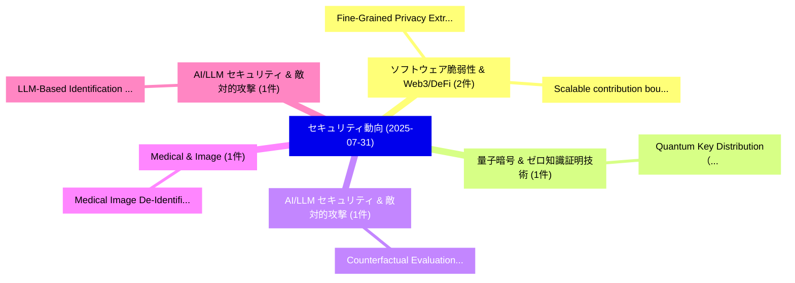

# 📅 02_daily: 日次エグゼクティブサマリー報告書 (2025-07-31)

**集計日時**: 2026-10-02 23:05:34 UTC  
**対象日付**: 2025-07-31  
**本日収集論文数**: 12 件  

---

## 💡 主要セキュリティ動向・脅威インサイト (Executive Insights)

本日の収集論文（計 12 件）において、以下の重点セキュリティ領域で活発な研究動向が確認されました：
- **ソフトウェア脆弱性 & Web3/DeFi** (2 件): 注目論文として 「Fine-Grained Privacy Extractio...」、「Scalable contribution bounding...」 等が発表され、実務防御および攻撃検証の進展が見られます。
- **量子暗号 & ゼロ知識証明技術** (1 件): 注目論文として 「Quantum Key Distribution（セキュリテ...」 等が発表され、実務防御および攻撃検証の進展が見られます。
- **AI/LLM セキュリティ & 敵対的攻撃** (1 件): 注目論文として 「Counterfactual Evaluation for ...」 等が発表され、実務防御および攻撃検証の進展が見られます。
- **Medical & Image** (1 件): 注目論文として 「Medical Image De-Identificatio...」 等が発表され、実務防御および攻撃検証の進展が見られます。
- **AI/LLM セキュリティ & 敵対的攻撃** (1 件): 注目論文として 「LLM-Based Identification of In...」 等が発表され、実務防御および攻撃検証の進展が見られます。

### 🗺️ 技術・脅威トピックマインドマップ

---

## 📌 日次セキュリティ論文一覧 (日本語表形式)

| No | arXiv ID | 論文タイトル (日本語訳) | 重要キーワード | 構造化エグゼクティブ要約 (背景・提案・影響) | 脅威分類 | 詳細リンク |
|---|---|---|---|---|---|---|
| 1 | `2507.23192v1` | [Quantum Key Distribution（セキュリティ分析論文）](../../okf/papers/2025-07-31/2507.23192.md) | `Quantum Key Distribution`, `Sebastian Kish`, `Josef Pieprzyk` | 【提案】概要 (Overview & Key Finding) 本論文「量子鍵配送（セキュリティ分析論文）」（原題: 量子鍵配送 / arXiv: 2507.23192v1）は、qu...。実証評価により経営層・セキュリティ管理者向け推奨アクション (E... | `cs.CR` | [arXiv](https://arxiv.org/abs/2507.23192v1) &#124; [OKF](../../okf/papers/2025-07-31/2507.23192.md) |
| 2 | `2507.23229v2` | [Fine-Grained Privacy Extraction from Retrieval-Augmented Generation Systems via Knowledge Asymmetry Exploitation（セキュリティ分析論文）](../../okf/papers/2025-07-31/2507.23229.md) | `Grained Privacy Extraction`, `Augmented Generation Systems`, `Knowledge Asymmetry Exploitation` | 【提案】概要 (Overview & Key Finding) 本論文「Fine-Grained Privacy Extraction from Retrieval-Augmente...。実証評価により経営層・セキュリティ管理者向け推奨アクション (E... | `cs.CR` | [arXiv](https://arxiv.org/abs/2507.23229v2) &#124; [OKF](../../okf/papers/2025-07-31/2507.23229.md) |
| 3 | `2507.23432v1` | [Scalable contribution bounding to achieve privacy（セキュリティ分析論文）](../../okf/papers/2025-07-31/2507.23432.md) | `Vincent Cohen`, `Alessandro Epasto`, `Jason Lee` | 【提案】概要 (Overview & Key Finding) 本論文「Scalable contribution bounding to achieve privacy（セキュリテ...。実証評価により経営層・セキュリティ管理者向け推奨アクション (E... | `cs.CR` | [arXiv](https://arxiv.org/abs/2507.23432v1) &#124; [OKF](../../okf/papers/2025-07-31/2507.23432.md) |
| 4 | `2507.23453v2` | [Counterfactual Evaluation for Blind Attack Detection in LLM-based Evaluation Systems（セキュリティ分析論文）](../../okf/papers/2025-07-31/2507.23453.md) | `Blind Attack Detection`, `Lijia Liu`, `Takumi Kondo` | 【提案】概要 (Overview & Key Finding) 本論文「Counterfactual Evaluation for Blind Attack Detection in...。実証評価により経営層・セキュリティ管理者向け推奨アクション (E... | `cs.CR` | [arXiv](https://arxiv.org/abs/2507.23453v2) &#124; [OKF](../../okf/papers/2025-07-31/2507.23453.md) |
| 5 | `2507.23608v1` | [Medical Image De-Identification Benchmark Challenge（セキュリティ分析論文）](../../okf/papers/2025-07-31/2507.23608.md) | `Medical Image De`, `Identification Benchmark Challenge`, `De-Identification Benchmark` | 【提案】概要 (Overview & Key Finding) 本論文「Medical Image De-Identification Benchmark Challenge（セキュ...。実証評価により経営層・セキュリティ管理者向け推奨アクション (E... | `cs.CR` | [arXiv](https://arxiv.org/abs/2507.23608v1) &#124; [OKF](../../okf/papers/2025-07-31/2507.23608.md) |
| 6 | `2507.23611v1` | [LLM-Based Identification of Infostealer Infection Vectors from Screenshots: The Case of Aurora（セキュリティ分析論文）](../../okf/papers/2025-07-31/2507.23611.md) | `Infostealer Infection Vectors`, `Based Identification`, `LLM-Based Identification` | 【提案】概要 (Overview & Key Finding) 本論文「LLM-Based Identification of Infostealer Infection Vecto...。実証評価により経営層・セキュリティ管理者向け推奨アクション (E... | `cs.CR` | [arXiv](https://arxiv.org/abs/2507.23611v1) &#124; [OKF](../../okf/papers/2025-07-31/2507.23611.md) |
| 7 | `2507.23641v2` | [Polynomial Lattices for the BIKE Cryptosystem（セキュリティ分析論文）](../../okf/papers/2025-07-31/2507.23641.md) | `Polynomial Lattices`, `Michael Schaller`, `Raw Meta` | 【提案】概要 (Overview & Key Finding) 本論文「Polynomial Lattices for the BIKE Cryptosystem（セキュリティ分析論...。実証評価により経営層・セキュリティ管理者向け推奨アクション (E... | `cs.CR` | [arXiv](https://arxiv.org/abs/2507.23641v2) &#124; [OKF](../../okf/papers/2025-07-31/2507.23641.md) |
| 8 | `2508.00934v1` | [How サイバーセキュリティ Behaviors affect the Success of Darknet Drug Vendors: A Quantitative Analysis](../../okf/papers/2025-07-31/2508.00934.md) | `Darknet Drug Vendors`, `Syon Balakrishnan`, `Aaron Grinberg` | 【提案】概要 (Overview & Key Finding) 本論文「How サイバーセキュリティ Behaviors affect the Success of Darknet ...。実証評価により経営層・セキュリティ管理者向け推奨アクション (E... | `cs.CR` | [arXiv](https://arxiv.org/abs/2508.00934v1) &#124; [OKF](../../okf/papers/2025-07-31/2508.00934.md) |
| 9 | `2508.00935v2` | [Measuring Harmfulness of Computer-Using Agents（セキュリティ分析論文）](../../okf/papers/2025-07-31/2508.00935.md) | `Measuring Harmfulness`, `Using Agents`, `Computer-Using Agents` | 【提案】概要 (Overview & Key Finding) 本論文「Measuring Harmfulness of Computer-Using Agents（セキュリティ分析...。実証評価により経営層・セキュリティ管理者向け推奨アクション (E... | `cs.CR` | [arXiv](https://arxiv.org/abs/2508.00935v2) &#124; [OKF](../../okf/papers/2025-07-31/2508.00935.md) |
| 10 | `2508.00938v1` | [Trusted Routing for Blockchain-Empowered UAV Networks via Multi-Agent Deep Reinforcement Learning（セキュリティ分析論文）](../../okf/papers/2025-07-31/2508.00938.md) | `Agent Deep Reinforcement Learning`, `Trusted Routing`, `Blockchain-Empowered UAV` | 【提案】概要 (Overview & Key Finding) 本論文「Trusted Routing for Blockchain-Empowered UAV Networks v...。実証評価により経営層・セキュリティ管理者向け推奨アクション (E... | `cs.CR` | [arXiv](https://arxiv.org/abs/2508.00938v1) &#124; [OKF](../../okf/papers/2025-07-31/2508.00938.md) |
| 11 | `2508.00943v2` | [LLMs Can Covertly Sandbag on Capability Evaluations Against Chain-of-Thought Monitoring（セキュリティ分析論文）](../../okf/papers/2025-07-31/2508.00943.md) | `Can Covertly Sandbag`, `Thought Monitoring`, `Chloe Li` | 【提案】概要 (Overview & Key Finding) 本論文「LLMs Can Covertly Sandbag on Capability Evaluations Aga...。実証評価により経営層・セキュリティ管理者向け推奨アクション (E... | `cs.CR` | [arXiv](https://arxiv.org/abs/2508.00943v2) &#124; [OKF](../../okf/papers/2025-07-31/2508.00943.md) |
| 12 | `2508.15776v1` | [Implementing Zero Trust Architecture to Enhance Security and Resilience in the Pharmaceutical Supply Chain（セキュリティ分析論文）](../../okf/papers/2025-07-31/2508.15776.md) | `Implementing Zero Trust Architecture`, `Pharmaceutical Supply Chain`, `Enhance Security` | 【提案】概要 (Overview & Key Finding) 本論文「Implementing ゼロトラスト Architecture to Enhance Security an...。実証評価により経営層・セキュリティ管理者向け推奨アクション (E... | `cs.CR` | [arXiv](https://arxiv.org/abs/2508.15776v1) &#124; [OKF](../../okf/papers/2025-07-31/2508.15776.md) |

