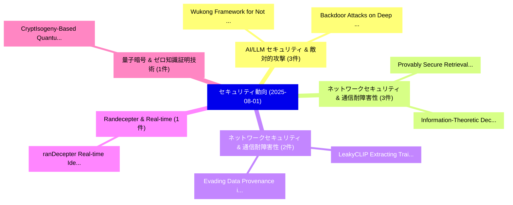

# 📅 02_daily: 日次エグゼクティブサマリー報告書 (2025-08-01)

**集計日時**: 2026-10-02 23:05:34 UTC  
**対象日付**: 2025-08-01  
**本日収集論文数**: 26 件  

---

## 💡 主要セキュリティ動向・脅威インサイト (Executive Insights)

本日の収集論文（計 26 件）において、以下の重点セキュリティ領域で活発な研究動向が確認されました：
- **AI/LLM セキュリティ & 敵対的攻撃** (3 件): 注目論文として 「Wukong Framework for Not Safe ...」、「Backdoor Attacks on Deep Learn...」 等が発表され、実務防御および攻撃検証の進展が見られます。
- **ネットワークセキュリティ & 通信耐障害性** (3 件): 注目論文として 「Information-Theoretic Decentra...」、「Provably Secure Retrieval-Augm...」 等が発表され、実務防御および攻撃検証の進展が見られます。
- **ネットワークセキュリティ & 通信耐障害性** (2 件): 注目論文として 「LeakyCLIP: Extracting Training...」、「Evading Data Provenance in Dee...」 等が発表され、実務防御および攻撃検証の進展が見られます。
- **Randecepter & Real-time** (1 件): 注目論文として 「ranDecepter: Real-time Identif...」 等が発表され、実務防御および攻撃検証の進展が見られます。
- **量子暗号 & ゼロ知識証明技術** (1 件): 注目論文として 「CryptIsogeny-Based Quantum Mon...」 等が発表され、実務防御および攻撃検証の進展が見られます。

### 🗺️ 技術・脅威トピックマインドマップ

---

## 📌 日次セキュリティ論文一覧 (日本語表形式)

| No | arXiv ID | 論文タイトル (日本語訳) | 重要キーワード | 構造化エグゼクティブ要約 (背景・提案・影響) | 脅威分類 | 詳細リンク |
|---|---|---|---|---|---|---|
| 1 | `2508.00293v3` | [ranDecepter: Real-time Identification and Deterrence of Ransomware Attacks（セキュリティ分析論文）](../../okf/papers/2025-08-01/2508.00293.md) | `Ransomware Attacks`, `Real-time Identification`, `Md Sajidul Islam Sajid` | 【提案】概要 (Overview & Key Finding) 本論文「ranDecepter: Real-time Identification and Deterrence of...。実証評価により経営層・セキュリティ管理者向け推奨アクション (E... | `cs.CR` | [arXiv](https://arxiv.org/abs/2508.00293v3) &#124; [OKF](../../okf/papers/2025-08-01/2508.00293.md) |
| 2 | `2508.00351v1` | [CryptIsogeny-Based Quantum Money with Rational Pointsの分析](../../okf/papers/2025-08-01/2508.00351.md) | `Based Quantum Money`, `Rational Points`, `Isogeny-Based Quantum` | 【提案】概要 (Overview & Key Finding) 本論文「CryptIsogeny-Based 量子 Money with Rational Pointsの分析」（原題...。実証評価により経営層・セキュリティ管理者向け推奨アクション (E... | `cs.CR` | [arXiv](https://arxiv.org/abs/2508.00351v1) &#124; [OKF](../../okf/papers/2025-08-01/2508.00351.md) |
| 3 | `2508.00368v1` | [Preliminary Investigation into Uncertainty-Aware Attack Stage Classification（セキュリティ分析論文）](../../okf/papers/2025-08-01/2508.00368.md) | `Aware Attack Stage Classification`, `Preliminary Investigation`, `Uncertainty-Aware Attack` | 【提案】概要 (Overview & Key Finding) 本論文「Preliminary Investigation into Uncertainty-Aware Attack...。実証評価により経営層・セキュリティ管理者向け推奨アクション (E... | `cs.CR` | [arXiv](https://arxiv.org/abs/2508.00368v1) &#124; [OKF](../../okf/papers/2025-08-01/2508.00368.md) |
| 4 | `2508.00434v2` | [CIF: A Constrained Inversion Framework for Reliable Message Extraction in Diffusion-Based Generative Steganography（セキュリティ分析論文）](../../okf/papers/2025-08-01/2508.00434.md) | `Reliable Message Extraction`, `Based Generative Steganography`, `Diffusion-Based Generative` | 【提案】概要 (Overview & Key Finding) 本論文「CIF: A Constrained Inversion Framework for Reliable Mes...。実証評価により経営層・セキュリティ管理者向け推奨アクション (E... | `cs.CR` | [arXiv](https://arxiv.org/abs/2508.00434v2) &#124; [OKF](../../okf/papers/2025-08-01/2508.00434.md) |
| 5 | `2508.00478v1` | [CyGATE: Game-Theoretic Cyber Attack-Defense Engine for Patch Strategy Optimization（セキュリティ分析論文）](../../okf/papers/2025-08-01/2508.00478.md) | `Theoretic Cyber Attack`, `Patch Strategy Optimization`, `Defense Engine` | 【提案】概要 (Overview & Key Finding) 本論文「CyGATE: Game-Theoretic Cyber Attack-Defense Engine for ...。実証評価により経営層・セキュリティ管理者向け推奨アクション (E... | `cs.CR` | [arXiv](https://arxiv.org/abs/2508.00478v1) &#124; [OKF](../../okf/papers/2025-08-01/2508.00478.md) |
| 6 | `2508.00555v2` | [Activation-Guided Local Editing for Jailbreaking Attacks（セキュリティ分析論文）](../../okf/papers/2025-08-01/2508.00555.md) | `Guided Local Editing`, `Jailbreaking Attacks`, `Activation-Guided Local` | 【提案】概要 (Overview & Key Finding) 本論文「Activation-Guided Local Editing for ジェイルブレイクing Attacks...。実証評価により経営層・セキュリティ管理者向け推奨アクション (E... | `cs.CR` | [arXiv](https://arxiv.org/abs/2508.00555v2) &#124; [OKF](../../okf/papers/2025-08-01/2508.00555.md) |
| 7 | `2508.00591v2` | [Wukong Framework for Not Safe For Work Detection in Text-to-Image systems（セキュリティ分析論文）](../../okf/papers/2025-08-01/2508.00591.md) | `Mingrui Liu`, `Sixiao Zhang`, `Cheng Long` | 【提案】背景とセキュリティ上の課題 (Background & Problem) 本研究はサイバー脅威環境におけるセキュリティ構造・脆弱性の検証を目的としています。(主要検出項目: ...。実証評価により経営層・セキュリティ管理者向け推奨アクション (E... | `cs.CR` | [arXiv](https://arxiv.org/abs/2508.00591v2) &#124; [OKF](../../okf/papers/2025-08-01/2508.00591.md) |
| 8 | `2508.00596v4` | [Information-Theoretic Decentralized Secure Aggregation with Passive Collusion Resilience（セキュリティ分析論文）](../../okf/papers/2025-08-01/2508.00596.md) | `Theoretic Decentralized Secure Aggregation`, `Passive Collusion Resilience`, `Information-Theoretic Decentralized` | 【提案】概要 (Overview & Key Finding) 本論文「Information-Theoretic Decentralized Secure Aggregation ...。実証評価により経営層・セキュリティ管理者向け推奨アクション (E... | `cs.CR` | [arXiv](https://arxiv.org/abs/2508.00596v4) &#124; [OKF](../../okf/papers/2025-08-01/2508.00596.md) |
| 9 | `2508.00602v1` | [LeakSealer: A Semisupervised Defense for LLMs Against Prompt Injection and Leakage Attacks（セキュリティ分析論文）](../../okf/papers/2025-08-01/2508.00602.md) | `Semisupervised Defense`, `Leakage Attacks`, `Francesco Panebianco` | 【提案】概要 (Overview & Key Finding) 本論文「LeakSealer: A Semisupervised Defense for LLMs Against プ...。実証評価により経営層・セキュリティ管理者向け推奨アクション (E... | `cs.CR` | [arXiv](https://arxiv.org/abs/2508.00602v1) &#124; [OKF](../../okf/papers/2025-08-01/2508.00602.md) |
| 10 | `2508.00620v1` | [Backdoor Attacks on Deep Learning Face Detection（セキュリティ分析論文）](../../okf/papers/2025-08-01/2508.00620.md) | `Deep Learning Face Detection`, `Backdoor Attacks`, `Quentin Le Roux` | 【提案】概要 (Overview & Key Finding) 本論文「Backdoor Attacks on Deep Learning Face Detection（セキュリティ...。実証評価により経営層・セキュリティ管理者向け推奨アクション (E... | `cs.CR` | [arXiv](https://arxiv.org/abs/2508.00620v1) &#124; [OKF](../../okf/papers/2025-08-01/2508.00620.md) |
| 11 | `2508.00636v1` | [FedGuard: A Diverse-Byzantine-Robust Mechanism for 連合学習 with Major Malicious Clients](../../okf/papers/2025-08-01/2508.00636.md) | `Major Malicious Clients`, `Robust Mechanism`, `Federated Learning` | 【提案】概要 (Overview & Key Finding) 本論文「FedGuard: A Diverse-Byzantine-Robust Mechanism for 連合学習...。実証評価により経営層・セキュリティ管理者向け推奨アクション (E... | `cs.CR` | [arXiv](https://arxiv.org/abs/2508.00636v1) &#124; [OKF](../../okf/papers/2025-08-01/2508.00636.md) |
| 12 | `2508.00637v1` | [Cyber-Physical Co-Simulation of Load Frequency Control under Load-Altering Attacks（セキュリティ分析論文）](../../okf/papers/2025-08-01/2508.00637.md) | `Load Frequency Control`, `Physical Co`, `Altering Attacks` | 【提案】概要 (Overview & Key Finding) 本論文「Cyber-Physical Co-Simulation of Load Frequency Control ...。実証評価により経営層・セキュリティ管理者向け推奨アクション (E... | `cs.CR` | [arXiv](https://arxiv.org/abs/2508.00637v1) &#124; [OKF](../../okf/papers/2025-08-01/2508.00637.md) |
| 13 | `2508.00649v2` | [Revisiting Adversarial Patch Defenses on Object Detectors: Unified Evaluation, Large-Scale Dataset, and New Insights（セキュリティ分析論文）](../../okf/papers/2025-08-01/2508.00649.md) | `Revisiting Adversarial Patch Defenses`, `Object Detectors`, `Scale Dataset` | 【提案】概要 (Overview & Key Finding) 本論文「Revisiting Adversarial Patch Defenses on Object Detecto...。実証評価により経営層・セキュリティ管理者向け推奨アクション (E... | `cs.CR` | [arXiv](https://arxiv.org/abs/2508.00649v2) &#124; [OKF](../../okf/papers/2025-08-01/2508.00649.md) |
| 14 | `2508.00659v1` | [Demo: TOSense -- What Did You Just Agree to?（セキュリティ分析論文）](../../okf/papers/2025-08-01/2508.00659.md) | `Xinzhang Chen`, `Hassan Ali`, `Arash Shaghaghi` | 【提案】### (日本語題名: Demo: TOSense -- What Did You Just Agree to?（セキュリティ分析論文）)  > [!NOTE] > **OK...。実証評価によりKanhere, Sanjay Jha - **公... | `cs.CR` | [arXiv](https://arxiv.org/abs/2508.00659v1) &#124; [OKF](../../okf/papers/2025-08-01/2508.00659.md) |
| 15 | `2508.00682v1` | [Unveiling Dynamic Binary Instrumentation Techniques（セキュリティ分析論文）](../../okf/papers/2025-08-01/2508.00682.md) | `Unveiling Dynamic Binary Instrumentation Techniques`, `Pablo Garcia Bringas`, `Oscar Llorente` | 【提案】概要 (Overview & Key Finding) 本論文「Unveiling Dynamic Binary Instrumentation Techniques（セキュ...。実証評価により経営層・セキュリティ管理者向け推奨アクション (E... | `cs.CR` | [arXiv](https://arxiv.org/abs/2508.00682v1) &#124; [OKF](../../okf/papers/2025-08-01/2508.00682.md) |
| 16 | `2508.00748v2` | [Is It Really You? Exploring Biometric Verification Scenarios in Photorealistic Talking-Head Avatar Videos（セキュリティ分析論文）](../../okf/papers/2025-08-01/2508.00748.md) | `Exploring Biometric Verification Scenarios`, `Head Avatar Videos`, `Photorealistic Talking` | 【提案】Exploring Biometric Verification Scenarios in Photorealistic Talking-Head Avatar Videos...。実証評価により経営層・セキュリティ管理者向け推奨アクション (E... | `cs.CR` | [arXiv](https://arxiv.org/abs/2508.00748v2) &#124; [OKF](../../okf/papers/2025-08-01/2508.00748.md) |
| 17 | `2508.00756v4` | [LeakyCLIP: Extracting Training Data from CLIP（セキュリティ分析論文）](../../okf/papers/2025-08-01/2508.00756.md) | `Extracting Training Data`, `Yunhao Chen`, `Shujie Wang` | 【提案】概要 (Overview & Key Finding) 本論文「LeakyCLIP: Extracting Training Data from CLIP（セキュリティ分析論...。実証評価により経営層・セキュリティ管理者向け推奨アクション (E... | `cs.CR` | [arXiv](https://arxiv.org/abs/2508.00756v4) &#124; [OKF](../../okf/papers/2025-08-01/2508.00756.md) |
| 18 | `2508.01051v1` | [QPP-RNG: A Conceptual Quantum System for True Randomness（セキュリティ分析論文）](../../okf/papers/2025-08-01/2508.01051.md) | `Conceptual Quantum System`, `True Randomness`, `Randy Kuang` | 【提案】概要 (Overview & Key Finding) 本論文「QPP-RNG: A Conceptual 量子 System for True Randomness（セキュ...。実証評価により経営層・セキュリティ管理者向け推奨アクション (E... | `cs.CR` | [arXiv](https://arxiv.org/abs/2508.01051v1) &#124; [OKF](../../okf/papers/2025-08-01/2508.01051.md) |
| 19 | `2508.01054v1` | [Autonomous Penetration Testing: Solving Capture-the-Flag Challenges with LLMs（セキュリティ分析論文）](../../okf/papers/2025-08-01/2508.01054.md) | `Autonomous Penetration Testing`, `Solving Capture`, `Flag Challenges` | 【提案】概要 (Overview & Key Finding) 本論文「Autonomous Penetration Testing: Solving Capture-the-Fla...。実証評価により経営層・セキュリティ管理者向け推奨アクション (E... | `cs.CR` | [arXiv](https://arxiv.org/abs/2508.01054v1) &#124; [OKF](../../okf/papers/2025-08-01/2508.01054.md) |
| 20 | `2508.01059v1` | [Llama-3.1-FoundationAI-SecurityLLM-8B-Instruct Technical Report（セキュリティ分析論文）](../../okf/papers/2025-08-01/2508.01059.md) | `Instruct Technical Report`, `Sajana Weerawardhena`, `Paul Kassianik` | 【提案】概要 (Overview & Key Finding) 本論文「Llama-3.1-FoundationAI-SecurityLLM-8B-Instruct Technica...。実証評価により経営層・セキュリティ管理者向け推奨アクション (E... | `cs.CR` | [arXiv](https://arxiv.org/abs/2508.01059v1) &#124; [OKF](../../okf/papers/2025-08-01/2508.01059.md) |
| 21 | `2508.01062v1` | [CP-FREEZER: Latency Attacks against Vehicular Cooperative Perception（セキュリティ分析論文）](../../okf/papers/2025-08-01/2508.01062.md) | `Vehicular Cooperative Perception`, `Latency Attacks`, `Chenyi Wang` | 【提案】概要 (Overview & Key Finding) 本論文「CP-FREEZER: Latency Attacks against Vehicular Cooperati...。実証評価により経営層・セキュリティ管理者向け推奨アクション (E... | `cs.CR` | [arXiv](https://arxiv.org/abs/2508.01062v1) &#124; [OKF](../../okf/papers/2025-08-01/2508.01062.md) |
| 22 | `2508.01074v1` | [Evading Data Provenance in Deep Neural Networks（セキュリティ分析論文）](../../okf/papers/2025-08-01/2508.01074.md) | `Evading Data Provenance`, `Deep Neural Networks`, `Hongyu Zhu` | 【提案】概要 (Overview & Key Finding) 本論文「Evading Data Provenance in Deep Neural Networks（セキュリティ分...。実証評価により経営層・セキュリティ管理者向け推奨アクション (E... | `cs.CR` | [arXiv](https://arxiv.org/abs/2508.01074v1) &#124; [OKF](../../okf/papers/2025-08-01/2508.01074.md) |
| 23 | `2508.01084v1` | [Provably Secure Retrieval-Augmented Generation（セキュリティ分析論文）](../../okf/papers/2025-08-01/2508.01084.md) | `Provably Secure Retrieval`, `Augmented Generation`, `Retrieval-Augmented Generation` | 【提案】概要 (Overview & Key Finding) 本論文「Provably Secure Retrieval-Augmented Generation（セキュリティ分析...。実証評価により経営層・セキュリティ管理者向け推奨アクション (E... | `cs.CR` | [arXiv](https://arxiv.org/abs/2508.01084v1) &#124; [OKF](../../okf/papers/2025-08-01/2508.01084.md) |
| 24 | `2508.01085v1` | [An Unconditionally Secure Encryption Scheme for IoBT Networks（セキュリティ分析論文）](../../okf/papers/2025-08-01/2508.01085.md) | `Mohammad Moltafet`, `Zouheir Rezki`, `Raw Meta` | 【提案】概要 (Overview & Key Finding) 本論文「An Unconditionally Secure Encryption Scheme for IoBT Ne...。実証評価によりSadjadpour, Zouheir Rezki... | `cs.CR` | [arXiv](https://arxiv.org/abs/2508.01085v1) &#124; [OKF](../../okf/papers/2025-08-01/2508.01085.md) |
| 25 | `2508.01107v2` | [Variational Autoencoder-Based Black-Box Adversarial Attack on Collaborative DNN Inference（セキュリティ分析論文）](../../okf/papers/2025-08-01/2508.01107.md) | `Box Adversarial Attack`, `Variational Autoencoder`, `Based Black` | 【提案】概要 (Overview & Key Finding) 本論文「Variational Autoencoder-Based Black-Box 敵対的攻撃 on Collab...。実証評価により経営層・セキュリティ管理者向け推奨アクション (E... | `cs.CR` | [arXiv](https://arxiv.org/abs/2508.01107v2) &#124; [OKF](../../okf/papers/2025-08-01/2508.01107.md) |
| 26 | `2508.05663v6` | [Random Walk Learning and the Pac-Man Attack（セキュリティ分析論文）](../../okf/papers/2025-08-01/2508.05663.md) | `Random Walk Learning`, `Man Attack`, `Pac-Man Attack` | 【提案】概要 (Overview & Key Finding) 本論文「Random Walk Learning and the Pac-Man Attack（セキュリティ分析論文）...。実証評価により経営層・セキュリティ管理者向け推奨アクション (E... | `cs.CR` | [arXiv](https://arxiv.org/abs/2508.05663v6) &#124; [OKF](../../okf/papers/2025-08-01/2508.05663.md) |

