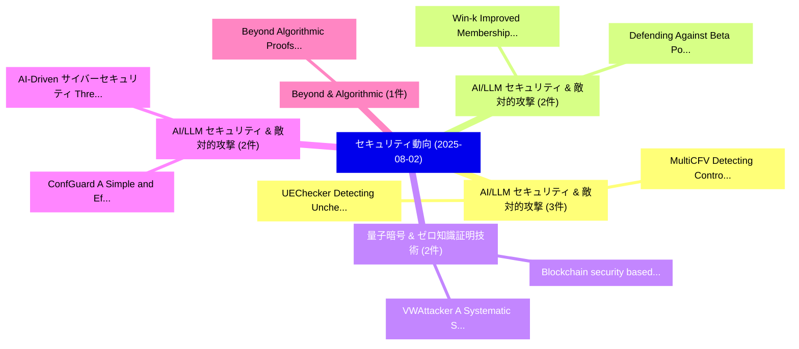

# 📅 02_daily: 日次エグゼクティブサマリー報告書 (2025-08-02)

**集計日時**: 2026-10-02 23:05:34 UTC  
**対象日付**: 2025-08-02  
**本日収集論文数**: 18 件  

---

## 💡 主要セキュリティ動向・脅威インサイト (Executive Insights)

本日の収集論文（計 18 件）において、以下の重点セキュリティ領域で活発な研究動向が確認されました：
- **AI/LLM セキュリティ & 敵対的攻撃** (3 件): 注目論文として 「UEChecker: Detecting Unchecked...」、「MultiCFV: Detecting Control Fl...」 等が発表され、実務防御および攻撃検証の進展が見られます。
- **AI/LLM セキュリティ & 敵対的攻撃** (2 件): 注目論文として 「Win-k: Improved Membership Inf...」、「Defending Against Beta Poisoni...」 等が発表され、実務防御および攻撃検証の進展が見られます。
- **量子暗号 & ゼロ知識証明技術** (2 件): 注目論文として 「Blockchain security based on c...」、「VWAttacker: A Systematic Secur...」 等が発表され、実務防御および攻撃検証の進展が見られます。
- **AI/LLM セキュリティ & 敵対的攻撃** (2 件): 注目論文として 「ConfGuard: A Simple and Effect...」、「AI-Driven サイバーセキュリティ Threat De...」 等が発表され、実務防御および攻撃検証の進展が見られます。
- **Beyond & Algorithmic** (1 件): 注目論文として 「Beyond Algorithmic Proofs: Imp...」 等が発表され、実務防御および攻撃検証の進展が見られます。

### 🗺️ 技術・脅威トピックマインドマップ

---

## 📌 日次セキュリティ論文一覧 (日本語表形式)

| No | arXiv ID | 論文タイトル (日本語訳) | 重要キーワード | 構造化エグゼクティブ要約 (背景・提案・影響) | 脅威分類 | 詳細リンク |
|---|---|---|---|---|---|---|
| 1 | `2508.01144v1` | [Beyond Algorithmic Proofs: Implementation-Level Provable Securityに向けて](../../okf/papers/2025-08-02/2508.01144.md) | `Beyond Algorithmic Proofs`, `Implementation-Level Provable`, `Level Provable Security` | 【提案】概要 (Overview & Key Finding) 本論文「Beyond Algorithmic Proofs: Implementation-Level Provabl...。実証評価により経営層・セキュリティ管理者向け推奨アクション (E... | `cs.CR` | [arXiv](https://arxiv.org/abs/2508.01144v1) &#124; [OKF](../../okf/papers/2025-08-02/2508.01144.md) |
| 2 | `2508.01207v1` | [Showcasing standards and approaches for cybersecurity, safety, and privacy issues in connected and 自動運転車両](../../okf/papers/2025-08-02/2508.01207.md) | `Raw Meta`, `Executive Summary`, `Key Finding` | 【提案】概要 (Overview & Key Finding) 本論文「Showcasing standards and approaches for cybersecurity, ...。実証評価により経営層・セキュリティ管理者向け推奨アクション (E... | `cs.CR` | [arXiv](https://arxiv.org/abs/2508.01207v1) &#124; [OKF](../../okf/papers/2025-08-02/2508.01207.md) |
| 3 | `2508.01249v3` | [AgentArmor: Enforcing Program Analysis on Agent Runtime Trace to Defend Against Prompt Injection（セキュリティ分析論文）](../../okf/papers/2025-08-02/2508.01249.md) | `Agent Runtime Trace`, `Peiran Wang`, `Yang Liu` | 【提案】概要 (Overview & Key Finding) 本論文「AgentArmor: Enforcing Program Analysis on Agent Runtime...。実証評価により経営層・セキュリティ管理者向け推奨アクション (E... | `cs.CR` | [arXiv](https://arxiv.org/abs/2508.01249v3) &#124; [OKF](../../okf/papers/2025-08-02/2508.01249.md) |
| 4 | `2508.01268v1` | [Win-k: Improved Membership Inference Attacks on Small Language Models（セキュリティ分析論文）](../../okf/papers/2025-08-02/2508.01268.md) | `Improved Membership Inference Attacks`, `Small Language Models`, `Hosein Madadi Tamar` | 【提案】概要 (Overview & Key Finding) 本論文「Win-k: Improved Membership Inference Attacks on Small L...。実証評価により経営層・セキュリティ管理者向け推奨アクション (E... | `cs.CR` | [arXiv](https://arxiv.org/abs/2508.01268v1) &#124; [OKF](../../okf/papers/2025-08-02/2508.01268.md) |
| 5 | `2508.01276v1` | [Defending Against Beta Poisoning Attacks in Machine Learning Models（セキュリティ分析論文）](../../okf/papers/2025-08-02/2508.01276.md) | `Machine Learning Models`, `Nilufer Gulciftci`, `Emre Gursoy` | 【提案】概要 (Overview & Key Finding) 本論文「Defending Against Beta Poisoning Attacks in Machine Lea...。実証評価によりEmre Gursoy。 | `cs.CR` | [arXiv](https://arxiv.org/abs/2508.01276v1) &#124; [OKF](../../okf/papers/2025-08-02/2508.01276.md) |
| 6 | `2508.01280v2` | [Blockchain security based on cryptography: a review（セキュリティ分析論文）](../../okf/papers/2025-08-02/2508.01280.md) | `Wenwen Zhou`, `Dongyang Lyu`, `Xiaoqi Li` | 【提案】概要 (Overview & Key Finding) 本論文「Blockchain security based on 暗号技術: a review（セキュリティ分析論文）...。実証評価により経営層・セキュリティ管理者向け推奨アクション (E... | `cs.CR` | [arXiv](https://arxiv.org/abs/2508.01280v2) &#124; [OKF](../../okf/papers/2025-08-02/2508.01280.md) |
| 7 | `2508.01306v1` | [PUZZLED: Jailbreaking LLMs through Word-Based Puzzles（セキュリティ分析論文）](../../okf/papers/2025-08-02/2508.01306.md) | `Based Puzzles`, `Word-Based Puzzles`, `Yelim Ahn` | 【提案】概要 (Overview & Key Finding) 本論文「PUZZLED: ジェイルブレイクing LLMs through Word-Based Puzzles（セキ...。実証評価により経営層・セキュリティ管理者向け推奨アクション (E... | `cs.CR` | [arXiv](https://arxiv.org/abs/2508.01306v1) &#124; [OKF](../../okf/papers/2025-08-02/2508.01306.md) |
| 8 | `2508.01332v3` | [BlockA2A: Secure and Verifiable Agent-to-Agent Interoperabilityに向けて](../../okf/papers/2025-08-02/2508.01332.md) | `Verifiable Agent`, `Towards Secure`, `Agent Interoperability` | 【提案】概要 (Overview & Key Finding) 本論文「BlockA2A: Secure and Verifiable Agent-to-Agent Interope...。実証評価により経営層・セキュリティ管理者向け推奨アクション (E... | `cs.CR` | [arXiv](https://arxiv.org/abs/2508.01332v3) &#124; [OKF](../../okf/papers/2025-08-02/2508.01332.md) |
| 9 | `2508.01343v2` | [UEChecker: Detecting Unchecked External Call Vulnerabilities in DApps via Graph Analysis（セキュリティ分析論文）](../../okf/papers/2025-08-02/2508.01343.md) | `Detecting Unchecked External Call Vulnerabilities`, `Dechao Kong`, `Xiaoqi Li` | 【提案】概要 (Overview & Key Finding) 本論文「UEChecker: Detecting Unchecked External Call Vulnerabil...。実証評価により経営層・セキュリティ管理者向け推奨アクション (E... | `cs.CR` | [arXiv](https://arxiv.org/abs/2508.01343v2) &#124; [OKF](../../okf/papers/2025-08-02/2508.01343.md) |
| 10 | `2508.01346v2` | [MultiCFV: Detecting Control Flow Vulnerabilities in Smart Contracts Leveraging Multimodal Deep Learning（セキュリティ分析論文）](../../okf/papers/2025-08-02/2508.01346.md) | `Smart Contracts Leveraging Multimodal Deep Learning`, `Detecting Control Flow Vulnerabilities`, `Hongli Peng` | 【提案】概要 (Overview & Key Finding) 本論文「MultiCFV: Detecting Control Flow Vulnerabilities in スマー...。実証評価により経営層・セキュリティ管理者向け推奨アクション (E... | `cs.CR` | [arXiv](https://arxiv.org/abs/2508.01346v2) &#124; [OKF](../../okf/papers/2025-08-02/2508.01346.md) |
| 11 | `2508.01351v2` | [NATLM: Detecting Defects in NFT Smart Contracts Leveraging LLM（セキュリティ分析論文）](../../okf/papers/2025-08-02/2508.01351.md) | `Smart Contracts Leveraging`, `Detecting Defects`, `Yuanzheng Niu` | 【提案】概要 (Overview & Key Finding) 本論文「NATLM: Detecting Defects in NFT スマートコントラクトs Leveraging ...。実証評価により経営層・セキュリティ管理者向け推奨アクション (E... | `cs.CR` | [arXiv](https://arxiv.org/abs/2508.01351v2) &#124; [OKF](../../okf/papers/2025-08-02/2508.01351.md) |
| 12 | `2508.01365v3` | [ConfGuard: A Simple and Effective Backdoor Detection for 大規模言語モデル](../../okf/papers/2025-08-02/2508.01365.md) | `Effective Backdoor Detection`, `Large Language Models`, `Zihan Wang` | 【提案】概要 (Overview & Key Finding) 本論文「ConfGuard: A Simple and Effective Backdoor Detection fo...。実証評価により経営層・セキュリティ管理者向け推奨アクション (E... | `cs.CR` | [arXiv](https://arxiv.org/abs/2508.01365v3) &#124; [OKF](../../okf/papers/2025-08-02/2508.01365.md) |
| 13 | `2508.01371v3` | [Prompt to Pwn: Automated Exploit Generation for Smart Contracts（セキュリティ分析論文）](../../okf/papers/2025-08-02/2508.01371.md) | `Automated Exploit Generation`, `Smart Contracts`, `Qin Wang` | 【提案】概要 (Overview & Key Finding) 本論文「Prompt to Pwn: Automated エクスプロイト Generation for スマートコント...。実証評価により経営層・セキュリティ管理者向け推奨アクション (E... | `cs.CR` | [arXiv](https://arxiv.org/abs/2508.01371v3) &#124; [OKF](../../okf/papers/2025-08-02/2508.01371.md) |
| 14 | `2508.01422v1` | [AI-Driven サイバーセキュリティ Threat Detection: Building Resilient Defense Systems Using Predictive Analytics](../../okf/papers/2025-08-02/2508.01422.md) | `Building Resilient Defense Systems Using Predictive Analytics`, `Driven Cybersecurity Threat Detection`, `Threat Detection` | 【提案】概要 (Overview & Key Finding) 本論文「AI-Driven サイバーセキュリティ 脅威 Detection: Building Resilient D...。実証評価により経営層・セキュリティ管理者向け推奨アクション (E... | `cs.CR` | [arXiv](https://arxiv.org/abs/2508.01422v1) &#124; [OKF](../../okf/papers/2025-08-02/2508.01422.md) |
| 15 | `2508.01448v1` | [Nakamoto Consensus from Multiple Resources（セキュリティ分析論文）](../../okf/papers/2025-08-02/2508.01448.md) | `Nakamoto Consensus`, `Multiple Resources`, `Mirza Ahad Baig` | 【提案】概要 (Overview & Key Finding) 本論文「Nakamoto Consensus from Multiple Resources（セキュリティ分析論文）」...。実証評価によりGünther, Krzysztof Pietrz... | `cs.CR` | [arXiv](https://arxiv.org/abs/2508.01448v1) &#124; [OKF](../../okf/papers/2025-08-02/2508.01448.md) |
| 16 | `2508.01451v1` | [Think Broad, Act Narrow: CWE Identification with Multi-Agent 大規模言語モデル](../../okf/papers/2025-08-02/2508.01451.md) | `Think Broad`, `Act Narrow`, `Agent Large Language Models` | 【提案】概要 (Overview & Key Finding) 本論文「Think Broad, Act Narrow: CWE Identification with Multi-...。実証評価により経営層・セキュリティ管理者向け推奨アクション (E... | `cs.CR` | [arXiv](https://arxiv.org/abs/2508.01451v1) &#124; [OKF](../../okf/papers/2025-08-02/2508.01451.md) |
| 17 | `2508.01469v1` | [VWAttacker: A Systematic Security Testing Framework for Voice over WiFi User Equipments（セキュリティ分析論文）](../../okf/papers/2025-08-02/2508.01469.md) | `User Equipments`, `Kazi Samin Mubasshir`, `Mashroor Hasan Bhuiyan` | 【提案】概要 (Overview & Key Finding) 本論文「VWAttacker: A Systematic Security Testing Framework for...。実証評価により経営層・セキュリティ管理者向け推奨アクション (E... | `cs.CR` | [arXiv](https://arxiv.org/abs/2508.01469v1) &#124; [OKF](../../okf/papers/2025-08-02/2508.01469.md) |
| 18 | `2508.01479v1` | [Reconstructing Trust Embeddings from Siamese Trust Scores: A Direct-Sum Approach with Fixed-Point Semantics（セキュリティ分析論文）](../../okf/papers/2025-08-02/2508.01479.md) | `Reconstructing Trust Embeddings`, `Siamese Trust Scores`, `Point Semantics` | 【提案】概要 (Overview & Key Finding) 本論文「Reconstructing Trust Embeddings from Siamese Trust Scor...。実証評価により経営層・セキュリティ管理者向け推奨アクション (E... | `cs.CR` | [arXiv](https://arxiv.org/abs/2508.01479v1) &#124; [OKF](../../okf/papers/2025-08-02/2508.01479.md) |

