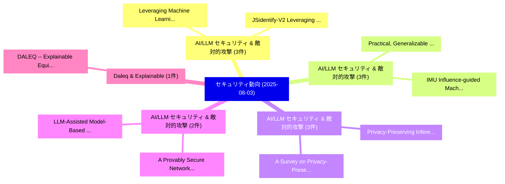

# 📅 02_daily: 日次エグゼクティブサマリー報告書 (2025-08-03)

**集計日時**: 2026-10-02 23:05:35 UTC  
**対象日付**: 2025-08-03  
**本日収集論文数**: 27 件  

---

## 💡 主要セキュリティ動向・脅威インサイト (Executive Insights)

本日の収集論文（計 27 件）において、以下の重点セキュリティ領域で活発な研究動向が確認されました：
- **AI/LLM セキュリティ & 敵対的攻撃** (3 件): 注目論文として 「Leveraging Machine Learning fo...」、「JSidentify-V2: Leveraging Dyna...」 等が発表され、実務防御および攻撃検証の進展が見られます。
- **AI/LLM セキュリティ & 敵対的攻撃** (3 件): 注目論文として 「Practical, Generalizable and R...」、「IMU: Influence-guided Machine ...」 等が発表され、実務防御および攻撃検証の進展が見られます。
- **AI/LLM セキュリティ & 敵対的攻撃** (3 件): 注目論文として 「Privacy-Preserving Inference f...」、「A Survey on Privacy-Preserving...」 等が発表され、実務防御および攻撃検証の進展が見られます。
- **AI/LLM セキュリティ & 敵対的攻撃** (2 件): 注目論文として 「A Provably Secure Network Prot...」、「LLM-Assisted Model-Based Fuzzi...」 等が発表され、実務防御および攻撃検証の進展が見られます。
- **Daleq & Explainable** (1 件): 注目論文として 「DALEQ -- Explainable Equivalen...」 等が発表され、実務防御および攻撃検証の進展が見られます。

### 🗺️ 技術・脅威トピックマインドマップ

---

## 📌 日次セキュリティ論文一覧 (日本語表形式)

| No | arXiv ID | 論文タイトル (日本語訳) | 重要キーワード | 構造化エグゼクティブ要約 (背景・提案・影響) | 脅威分類 | 詳細リンク |
|---|---|---|---|---|---|---|
| 1 | `2508.01530v1` | [DALEQ -- Explainable Equivalence for Java Bytecode（セキュリティ分析論文）](../../okf/papers/2025-08-03/2508.01530.md) | `Explainable Equivalence`, `Java Bytecode`, `Jens Dietrich` | 【提案】概要 (Overview & Key Finding) 本論文「DALEQ -- Explainable Equivalence for Java Bytecode（セキュリ...。実証評価により経営層・セキュリティ管理者向け推奨アクション (E... | `cs.CR` | [arXiv](https://arxiv.org/abs/2508.01530v1) &#124; [OKF](../../okf/papers/2025-08-03/2508.01530.md) |
| 2 | `2508.01542v1` | [Leveraging Machine Learning for Botnet Attack Detection in Edge-Computing Assisted IoT Networks（セキュリティ分析論文）](../../okf/papers/2025-08-03/2508.01542.md) | `Leveraging Machine Learning`, `Botnet Attack Detection`, `Computing Assisted` | 【提案】概要 (Overview & Key Finding) 本論文「Leveraging Machine Learning for Botnet Attack Detection...。実証評価により経営層・セキュリティ管理者向け推奨アクション (E... | `cs.CR` | [arXiv](https://arxiv.org/abs/2508.01542v1) &#124; [OKF](../../okf/papers/2025-08-03/2508.01542.md) |
| 3 | `2508.01554v1` | [Are All Prompt Components Value-Neutral? Understanding the Heterogeneous Adversarial Robustness of Dissected Prompt in 大規模言語モデル](../../okf/papers/2025-08-03/2508.01554.md) | `Heterogeneous Adversarial Robustness`, `Dissected Prompt`, `Large Language Models` | 【提案】Understanding the Heterogeneous Adversarial Robustness of Dissected Prompt in Large Lan...。実証評価により経営層・セキュリティ管理者向け推奨アクション (E... | `cs.CR` | [arXiv](https://arxiv.org/abs/2508.01554v1) &#124; [OKF](../../okf/papers/2025-08-03/2508.01554.md) |
| 4 | `2508.01595v3` | [BeDKD: Backdoor Defense Based on Directional Mapping Module and Adversarial Knowledge Distillation（セキュリティ分析論文）](../../okf/papers/2025-08-03/2508.01595.md) | `Backdoor Defense Based`, `Directional Mapping Module`, `Adversarial Knowledge Distillation` | 【提案】概要 (Overview & Key Finding) 本論文「BeDKD: Backdoor Defense Based on Directional Mapping Mo...。実証評価により経営層・セキュリティ管理者向け推奨アクション (E... | `cs.CR` | [arXiv](https://arxiv.org/abs/2508.01595v3) &#124; [OKF](../../okf/papers/2025-08-03/2508.01595.md) |
| 5 | `2508.01605v1` | [Practical, Generalizable and Robust Backdoor Attacks on Text-to-Image Diffusion Models（セキュリティ分析論文）](../../okf/papers/2025-08-03/2508.01605.md) | `Robust Backdoor Attacks`, `Image Diffusion Models`, `Haoran Dai` | 【提案】概要 (Overview & Key Finding) 本論文「Practical, Generalizable and Robust Backdoor Attacks on...。実証評価により経営層・セキュリティ管理者向け推奨アクション (E... | `cs.CR` | [arXiv](https://arxiv.org/abs/2508.01605v1) &#124; [OKF](../../okf/papers/2025-08-03/2508.01605.md) |
| 6 | `2508.01620v3` | [IMU: Influence-guided Machine Unlearning（セキュリティ分析論文）](../../okf/papers/2025-08-03/2508.01620.md) | `Machine Unlearning`, `Influence-guided Machine`, `Xindi Fan` | 【提案】概要 (Overview & Key Finding) 本論文「IMU: Influence-guided Machine Unlearning（セキュリティ分析論文）」（原...。実証評価により経営層・セキュリティ管理者向け推奨アクション (E... | `cs.CR` | [arXiv](https://arxiv.org/abs/2508.01620v3) &#124; [OKF](../../okf/papers/2025-08-03/2508.01620.md) |
| 7 | `2508.01636v1` | [Privacy-Preserving Inference for Quantized BERT Models（セキュリティ分析論文）](../../okf/papers/2025-08-03/2508.01636.md) | `Preserving Inference`, `Privacy-Preserving Inference`, `Tianpei Lu` | 【提案】概要 (Overview & Key Finding) 本論文「Privacy-Preserving Inference for Quantized BERT Models（...。実証評価により経営層・セキュリティ管理者向け推奨アクション (E... | `cs.CR` | [arXiv](https://arxiv.org/abs/2508.01636v1) &#124; [OKF](../../okf/papers/2025-08-03/2508.01636.md) |
| 8 | `2508.01638v1` | [Semantic Encryption: Secure and Effective Interaction with Cloud-based 大規模言語モデル via Semantic Transformation](../../okf/papers/2025-08-03/2508.01638.md) | `Semantic Encryption`, `Effective Interaction`, `Semantic Transformation` | 【提案】概要 (Overview & Key Finding) 本論文「Semantic Encryption: Secure and Effective Interaction w...。実証評価により経営層・セキュリティ管理者向け推奨アクション (E... | `cs.CR` | [arXiv](https://arxiv.org/abs/2508.01638v1) &#124; [OKF](../../okf/papers/2025-08-03/2508.01638.md) |
| 9 | `2508.01647v1` | [DUP: Detection-guided Unlearning for Backdoor Purification in Language Models（セキュリティ分析論文）](../../okf/papers/2025-08-03/2508.01647.md) | `Backdoor Purification`, `Detection-guided Unlearning`, `Language Models` | 【提案】概要 (Overview & Key Finding) 本論文「DUP: Detection-guided Unlearning for Backdoor Purificat...。実証評価により経営層・セキュリティ管理者向け推奨アクション (E... | `cs.CR` | [arXiv](https://arxiv.org/abs/2508.01647v1) &#124; [OKF](../../okf/papers/2025-08-03/2508.01647.md) |
| 10 | `2508.01649v1` | [EXPTIME One Way Functions: Bloom Filters, Succinct Graphs, Cliques, & Self Maskingに向けて](../../okf/papers/2025-08-03/2508.01649.md) | `One Way Functions`, `Bloom Filters`, `Succinct Graphs` | 【提案】概要 (Overview & Key Finding) 本論文「EXPTIME One Way Functions: Bloom Filters, Succinct Grap...。実証評価により経営層・セキュリティ管理者向け推奨アクション (E... | `cs.CR` | [arXiv](https://arxiv.org/abs/2508.01649v1) &#124; [OKF](../../okf/papers/2025-08-03/2508.01649.md) |
| 11 | `2508.01655v1` | [JSidentify-V2: Leveraging Dynamic Memory Fingerprinting for Mini-Game Plagiarism Detection（セキュリティ分析論文）](../../okf/papers/2025-08-03/2508.01655.md) | `Leveraging Dynamic Memory Fingerprinting`, `Game Plagiarism Detection`, `Mini-Game Plagiarism` | 【提案】概要 (Overview & Key Finding) 本論文「JSidentify-V2: Leveraging Dynamic Memory Fingerprinting...。実証評価により経営層・セキュリティ管理者向け推奨アクション (E... | `cs.CR` | [arXiv](https://arxiv.org/abs/2508.01655v1) &#124; [OKF](../../okf/papers/2025-08-03/2508.01655.md) |
| 12 | `2508.01676v1` | [Adversarial Patch Selection and Locationのベンチマーク評価](../../okf/papers/2025-08-03/2508.01676.md) | `Benchmarking Adversarial Patch Selection`, `Adversarial Patch Selection`, `Shai Kimhi` | 【提案】概要 (Overview & Key Finding) 本論文「Adversarial Patch Selection and Locationのベンチマーク評価」（原題: ...。実証評価により経営層・セキュリティ管理者向け推奨アクション (E... | `cs.CR` | [arXiv](https://arxiv.org/abs/2508.01676v1) &#124; [OKF](../../okf/papers/2025-08-03/2508.01676.md) |
| 13 | `2508.01685v1` | [Innovative tokenisation of structured data for LLM training（セキュリティ分析論文）](../../okf/papers/2025-08-03/2508.01685.md) | `Hani Ragab Hassen`, `Kayvan Karim`, `Hadj Batatia` | 【提案】概要 (Overview & Key Finding) 本論文「Innovative tokenisation of structured data for LLM trai...。実証評価によりHadj Batatia - **公開日時**: ... | `cs.CR` | [arXiv](https://arxiv.org/abs/2508.01685v1) &#124; [OKF](../../okf/papers/2025-08-03/2508.01685.md) |
| 14 | `2508.01694v5` | [Performance and Storage CRYSTALS Kyber as a Post Quantum Replacement for RSA and ECCの分析](../../okf/papers/2025-08-03/2508.01694.md) | `Post Quantum Replacement`, `Nicolas Rodriguez`, `Fernando Rodriguez` | 【提案】概要 (Overview & Key Finding) 本論文「Performance and Storage CRYSTALS Kyber as a Post 量子 Rep...。実証評価により経営層・セキュリティ管理者向け推奨アクション (E... | `cs.CR` | [arXiv](https://arxiv.org/abs/2508.01694v5) &#124; [OKF](../../okf/papers/2025-08-03/2508.01694.md) |
| 15 | `2508.01714v1` | [A Provably Secure Network Protocol for Private Communication with Analysis and Tracing Resistance（セキュリティ分析論文）](../../okf/papers/2025-08-03/2508.01714.md) | `Provably Secure Network Protocol`, `Private Communication`, `Tracing Resistance` | 【提案】概要 (Overview & Key Finding) 本論文「A Provably Secure Network Protocol for Private Communic...。実証評価により経営層・セキュリティ管理者向け推奨アクション (E... | `cs.CR` | [arXiv](https://arxiv.org/abs/2508.01714v1) &#124; [OKF](../../okf/papers/2025-08-03/2508.01714.md) |
| 16 | `2508.01750v1` | [LLM-Assisted Model-Based Fuzzing of Protocol Implementations（セキュリティ分析論文）](../../okf/papers/2025-08-03/2508.01750.md) | `Assisted Model`, `Based Fuzzing`, `Protocol Implementations` | 【提案】概要 (Overview & Key Finding) 本論文「LLM-Assisted Model-Based Fuzzing of Protocol Implementa...。実証評価により経営層・セキュリティ管理者向け推奨アクション (E... | `cs.CR` | [arXiv](https://arxiv.org/abs/2508.01750v1) &#124; [OKF](../../okf/papers/2025-08-03/2508.01750.md) |
| 17 | `2508.01768v1` | ["Energon": Unveiling Transformers from GPU Power and Thermal Side-Channels（セキュリティ分析論文）](../../okf/papers/2025-08-03/2508.01768.md) | `Unveiling Transformers`, `Thermal Side`, `Arunava Chaudhuri` | 【提案】概要 (Overview & Key Finding) 本論文「"Energon": Unveiling Transformers from GPU Power and Th...。実証評価により経営層・セキュリティ管理者向け推奨アクション (E... | `cs.CR` | [arXiv](https://arxiv.org/abs/2508.01768v1) &#124; [OKF](../../okf/papers/2025-08-03/2508.01768.md) |
| 18 | `2508.01784v1` | [RouteMark: A Fingerprint for Intellectual Property Attribution in Routing-based Model Merging（セキュリティ分析論文）](../../okf/papers/2025-08-03/2508.01784.md) | `Intellectual Property Attribution`, `Model Merging`, `Routing-based Model` | 【提案】概要 (Overview & Key Finding) 本論文「RouteMark: A Fingerprint for Intellectual Property Attr...。実証評価により経営層・セキュリティ管理者向け推奨アクション (E... | `cs.CR` | [arXiv](https://arxiv.org/abs/2508.01784v1) &#124; [OKF](../../okf/papers/2025-08-03/2508.01784.md) |
| 19 | `2508.01798v1` | [A Survey on Privacy-Preserving Computing in the Automotive Domain（セキュリティ分析論文）](../../okf/papers/2025-08-03/2508.01798.md) | `Preserving Computing`, `Automotive Domain`, `Privacy-Preserving Computing` | 【提案】概要 (Overview & Key Finding) 本論文「A Survey on Privacy-Preserving Computing in the Automot...。実証評価により経営層・セキュリティ管理者向け推奨アクション (E... | `cs.CR` | [arXiv](https://arxiv.org/abs/2508.01798v1) &#124; [OKF](../../okf/papers/2025-08-03/2508.01798.md) |
| 20 | `2508.01845v1` | [Beyond Vulnerabilities: A Survey of Adversarial Attacks as Both Threats and Defenses in Computer Vision Systems（セキュリティ分析論文）](../../okf/papers/2025-08-03/2508.01845.md) | `Computer Vision Systems`, `Beyond Vulnerabilities`, `Adversarial Attacks` | 【提案】概要 (Overview & Key Finding) 本論文「Beyond Vulnerabilities: A Survey of 敵対的攻撃s as Both Thre...。実証評価により経営層・セキュリティ管理者向け推奨アクション (E... | `cs.CR` | [arXiv](https://arxiv.org/abs/2508.01845v1) &#124; [OKF](../../okf/papers/2025-08-03/2508.01845.md) |
| 21 | `2508.01856v1` | [Efficient Byzantine Consensus MechanismBased on Reputation in IoT Blockchain（セキュリティ分析論文）](../../okf/papers/2025-08-03/2508.01856.md) | `Efficient Byzantine Consensus`, `Muhammad Zeeshan Haider`, `Xu Yuan` | 【提案】概要 (Overview & Key Finding) 本論文「Efficient Byzantine Consensus MechanismBased on Reputat...。実証評価により経営層・セキュリティ管理者向け推奨アクション (E... | `cs.CR` | [arXiv](https://arxiv.org/abs/2508.01856v1) &#124; [OKF](../../okf/papers/2025-08-03/2508.01856.md) |
| 22 | `2508.01863v1` | [Hard-Earned Lessons in Access Control at Scale: Enforcing Identity and Policy Across Trust Boundaries with Reverse Proxies and mTLS（セキュリティ分析論文）](../../okf/papers/2025-08-03/2508.01863.md) | `Policy Across Trust Boundaries`, `Earned Lessons`, `Access Control` | 【提案】概要 (Overview & Key Finding) 本論文「Hard-Earned Lessons in アクセス制御 at Scale: Enforcing Ident...。実証評価により経営層・セキュリティ管理者向け推奨アクション (E... | `cs.CR` | [arXiv](https://arxiv.org/abs/2508.01863v1) &#124; [OKF](../../okf/papers/2025-08-03/2508.01863.md) |
| 23 | `2508.01887v1` | [Complete Evasion, Zero Modification: PDF Attacks on AI Text Detection（セキュリティ分析論文）](../../okf/papers/2025-08-03/2508.01887.md) | `Complete Evasion`, `Zero Modification`, `Text Detection` | 【提案】概要 (Overview & Key Finding) 本論文「Complete Evasion, Zero Modification: PDF Attacks on AI ...。実証評価により経営層・セキュリティ管理者向け推奨アクション (E... | `cs.CR` | [arXiv](https://arxiv.org/abs/2508.01887v1) &#124; [OKF](../../okf/papers/2025-08-03/2508.01887.md) |
| 24 | `2508.01888v2` | [Optimizing Day-Ahead Energy Trading with Proximal Policy Optimization and Blockchain（セキュリティ分析論文）](../../okf/papers/2025-08-03/2508.01888.md) | `Ahead Energy Trading`, `Proximal Policy Optimization`, `Optimizing Day` | 【提案】概要 (Overview & Key Finding) 本論文「Optimizing Day-Ahead Energy Trading with Proximal Polic...。実証評価により経営層・セキュリティ管理者向け推奨アクション (E... | `cs.CR` | [arXiv](https://arxiv.org/abs/2508.01888v2) &#124; [OKF](../../okf/papers/2025-08-03/2508.01888.md) |
| 25 | `2508.01909v1` | [Analyzing The Mirai IoT Botnet and Its Recent Variants: Satori, Mukashi, Moobot, and Sonic（セキュリティ分析論文）](../../okf/papers/2025-08-03/2508.01909.md) | `Angela Famera`, `Ben Hilger`, `Suman Bhunia` | 【提案】概要 (Overview & Key Finding) 本論文「Analyzing The Mirai IoT Botnet and Its Recent Variants:...。実証評価により経営層・セキュリティ管理者向け推奨アクション (E... | `cs.CR` | [arXiv](https://arxiv.org/abs/2508.01909v1) &#124; [OKF](../../okf/papers/2025-08-03/2508.01909.md) |
| 26 | `2508.01913v1` | [A Decentralized Framework for Ethical Authorship Validation in Academic Publishing: Leveraging Self-Sovereign Identity and Blockchain Technology（セキュリティ分析論文）](../../okf/papers/2025-08-03/2508.01913.md) | `Ethical Authorship Validation`, `Academic Publishing`, `Leveraging Self` | 【提案】概要 (Overview & Key Finding) 本論文「A Decentralized Framework for Ethical Authorship Valida...。実証評価により経営層・セキュリティ管理者向け推奨アクション (E... | `cs.CR` | [arXiv](https://arxiv.org/abs/2508.01913v1) &#124; [OKF](../../okf/papers/2025-08-03/2508.01913.md) |
| 27 | `2508.11651v1` | [Tokenize Everything, But Can You Sell It? RWA Liquidity Challenges and the Road Ahead（セキュリティ分析論文）](../../okf/papers/2025-08-03/2508.11651.md) | `Tokenize Everything`, `Liquidity Challenges`, `Road Ahead` | 【提案】RWA Liquidity Challenges and the Road Ahead ### (日本語題名: Tokenize Everything, But Can Yo...。実証評価により経営層・セキュリティ管理者向け推奨アクション (E... | `cs.CR` | [arXiv](https://arxiv.org/abs/2508.11651v1) &#124; [OKF](../../okf/papers/2025-08-03/2508.11651.md) |

