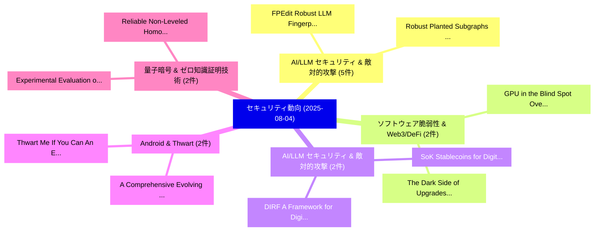

# 📅 02_daily: 日次エグゼクティブサマリー報告書 (2025-08-04)

**集計日時**: 2026-10-02 23:05:35 UTC  
**対象日付**: 2025-08-04  
**本日収集論文数**: 32 件  

---

## 💡 主要セキュリティ動向・脅威インサイト (Executive Insights)

本日の収集論文（計 32 件）において、以下の重点セキュリティ領域で活発な研究動向が確認されました：
- **AI/LLM セキュリティ & 敵対的攻撃** (5 件): 注目論文として 「FPEdit: Robust LLM Fingerprint...」、「Robust Planted Subgraphs in Se...」 等が発表され、実務防御および攻撃検証の進展が見られます。
- **ソフトウェア脆弱性 & Web3/DeFi** (2 件): 注目論文として 「GPU in the Blind Spot: Overloo...」、「The Dark Side of Upgrades: Unc...」 等が発表され、実務防御および攻撃検証の進展が見られます。
- **AI/LLM セキュリティ & 敵対的攻撃** (2 件): 注目論文として 「DIRF: A Framework for Digital ...」、「SoK: Stablecoins for Digital T...」 等が発表され、実務防御および攻撃検証の進展が見られます。
- **Android & Thwart** (2 件): 注目論文として 「A Comprehensive Evolving Permi...」、「Thwart Me If You Can: An Empir...」 等が発表され、実務防御および攻撃検証の進展が見られます。
- **量子暗号 & ゼロ知識証明技術** (2 件): 注目論文として 「Experimental Evaluation of Pos...」、「Reliable Non-Leveled Homomorph...」 等が発表され、実務防御および攻撃検証の進展が見られます。

### 🗺️ 技術・脅威トピックマインドマップ

---

## 📌 日次セキュリティ論文一覧 (日本語表形式)

| No | arXiv ID | 論文タイトル (日本語訳) | 重要キーワード | 構造化エグゼクティブ要約 (背景・提案・影響) | 脅威分類 | 詳細リンク |
|---|---|---|---|---|---|---|
| 1 | `2508.01983v1` | [Generative AI-Empowered Secure Communications in Space-Air-Ground Integrated Networks: A Survey and Tutorial（セキュリティ分析論文）](../../okf/papers/2025-08-04/2508.01983.md) | `Empowered Secure Communications`, `Ground Integrated Networks`, `AI-Empowered Secure` | 【提案】概要 (Overview & Key Finding) 本論文「Generative AI-Empowered Secure Communications in Space-...。実証評価により経営層・セキュリティ管理者向け推奨アクション (E... | `cs.CR` | [arXiv](https://arxiv.org/abs/2508.01983v1) &#124; [OKF](../../okf/papers/2025-08-04/2508.01983.md) |
| 2 | `2508.01995v1` | [GPU in the Blind Spot: Overlooked Security Risks in Transportation（セキュリティ分析論文）](../../okf/papers/2025-08-04/2508.01995.md) | `Overlooked Security Risks`, `Blind Spot`, `Noor Puspa` | 【提案】概要 (Overview & Key Finding) 本論文「GPU in the Blind Spot: Overlooked Security Risks in Tra...。実証評価により経営層・セキュリティ管理者向け推奨アクション (E... | `cs.CR` | [arXiv](https://arxiv.org/abs/2508.01995v1) &#124; [OKF](../../okf/papers/2025-08-04/2508.01995.md) |
| 3 | `2508.01997v2` | [DIRF: A Framework for Digital Identity Protection and Clone Governance in Agentic AI Systems（セキュリティ分析論文）](../../okf/papers/2025-08-04/2508.01997.md) | `Digital Identity Protection`, `Clone Governance`, `Muhammad Aziz Ul Haq` | 【提案】概要 (Overview & Key Finding) 本論文「DIRF: A Framework for Digital Identity Protection and C...。実証評価により経営層・セキュリティ管理者向け推奨アクション (E... | `cs.CR` | [arXiv](https://arxiv.org/abs/2508.01997v2) &#124; [OKF](../../okf/papers/2025-08-04/2508.01997.md) |
| 4 | `2508.02008v1` | [A Comprehensive Evolving Permission Usage in Android Apps: Trends, Threats, and Ecosystem Insightsの分析](../../okf/papers/2025-08-04/2508.02008.md) | `Android Apps`, `Comprehensive Evolving Permission Usage`, `Evolving Permission Usage` | 【提案】概要 (Overview & Key Finding) 本論文「A Comprehensive Evolving Permission Usage in Android Ap...。実証評価により経営層・セキュリティ管理者向け推奨アクション (E... | `cs.CR` | [arXiv](https://arxiv.org/abs/2508.02008v1) &#124; [OKF](../../okf/papers/2025-08-04/2508.02008.md) |
| 5 | `2508.02035v1` | [PhishParrot: LLM-Driven Adaptive Crawling to Unveil Cloaked Phishing Sites（セキュリティ分析論文）](../../okf/papers/2025-08-04/2508.02035.md) | `Unveil Cloaked Phishing Sites`, `Driven Adaptive Crawling`, `LLM-Driven Adaptive` | 【提案】概要 (Overview & Key Finding) 本論文「PhishParrot: LLM-Driven Adaptive Crawling to Unveil Clo...。実証評価により経営層・セキュリティ管理者向け推奨アクション (E... | `cs.CR` | [arXiv](https://arxiv.org/abs/2508.02035v1) &#124; [OKF](../../okf/papers/2025-08-04/2508.02035.md) |
| 6 | `2508.02092v3` | [FPEdit: Robust LLM Fingerprinting through Localized Parameter Editing（セキュリティ分析論文）](../../okf/papers/2025-08-04/2508.02092.md) | `Localized Parameter Editing`, `Shida Wang`, `Chaohu Liu` | 【提案】概要 (Overview & Key Finding) 本論文「FPEdit: Robust LLM Fingerprinting through Localized Par...。実証評価により経営層・セキュリティ管理者向け推奨アクション (E... | `cs.CR` | [arXiv](https://arxiv.org/abs/2508.02092v3) &#124; [OKF](../../okf/papers/2025-08-04/2508.02092.md) |
| 7 | `2508.02115v4` | [Coward: Collision-based OOD Watermarking for Practical Proactive Federated Backdoor Detection（セキュリティ分析論文）](../../okf/papers/2025-08-04/2508.02115.md) | `Practical Proactive Federated Backdoor Detection`, `Collision-based OOD`, `Practical Proactive Federated Backd` | 【提案】概要 (Overview & Key Finding) 本論文「Coward: Collision-based OOD Watermarking for Practical ...。実証評価により経営層・セキュリティ管理者向け推奨アクション (E... | `cs.CR` | [arXiv](https://arxiv.org/abs/2508.02115v4) &#124; [OKF](../../okf/papers/2025-08-04/2508.02115.md) |
| 8 | `2508.02116v2` | [SUAD: Solid-Channel Ultrasound Injection Attack and Defense to Voice Assistants（セキュリティ分析論文）](../../okf/papers/2025-08-04/2508.02116.md) | `Channel Ultrasound Injection Attack`, `Voice Assistants`, `Solid-Channel Ultrasound` | 【提案】概要 (Overview & Key Finding) 本論文「SUAD: Solid-Channel Ultrasound Injection Attack and Def...。実証評価により経営層・セキュリティ管理者向け推奨アクション (E... | `cs.CR` | [arXiv](https://arxiv.org/abs/2508.02116v2) &#124; [OKF](../../okf/papers/2025-08-04/2508.02116.md) |
| 9 | `2508.02145v1` | [The Dark Side of Upgrades: Uncovering Security Risks in Smart Contract Upgrades（セキュリティ分析論文）](../../okf/papers/2025-08-04/2508.02145.md) | `Uncovering Security Risks`, `Smart Contract Upgrades`, `Dingding Wang` | 【提案】概要 (Overview & Key Finding) 本論文「The Dark Side of Upgrades: Uncovering Security Risks in...。実証評価により経営層・セキュリティ管理者向け推奨アクション (E... | `cs.CR` | [arXiv](https://arxiv.org/abs/2508.02145v1) &#124; [OKF](../../okf/papers/2025-08-04/2508.02145.md) |
| 10 | `2508.02158v2` | [Robust Planted Subgraphs in Semi-Random Modelsの検出](../../okf/papers/2025-08-04/2508.02158.md) | `Robust Planted Subgraphs`, `Robust Detection`, `Planted Subgraphs` | 【提案】概要 (Overview & Key Finding) 本論文「Robust Planted Subgraphs in Semi-Random Modelsの検出」（原題: ...。実証評価により経営層・セキュリティ管理者向け推奨アクション (E... | `cs.CR` | [arXiv](https://arxiv.org/abs/2508.02158v2) &#124; [OKF](../../okf/papers/2025-08-04/2508.02158.md) |
| 11 | `2508.02182v1` | [Near-Optimal Differentially Private Graph Algorithms via the Multidimensional AboveThreshold Mechanism（セキュリティ分析論文）](../../okf/papers/2025-08-04/2508.02182.md) | `Optimal Differentially Private Graph Algorithms`, `Near-Optimal Differentially`, `Optimal Differentially Priv` | 【提案】概要 (Overview & Key Finding) 本論文「Near-Optimal Differentially Private Graph Algorithms vi...。実証評価により経営層・セキュリティ管理者向け推奨アクション (E... | `cs.CR` | [arXiv](https://arxiv.org/abs/2508.02182v1) &#124; [OKF](../../okf/papers/2025-08-04/2508.02182.md) |
| 12 | `2508.02188v3` | [Whispering Agents: An Event-driven Covert Communication Protocol For the Internet of Agents（セキュリティ分析論文）](../../okf/papers/2025-08-04/2508.02188.md) | `Whispering Agents`, `Event-driven Covert`, `Kaibo Huang` | 【提案】概要 (Overview & Key Finding) 本論文「Whispering Agents: An Event-driven Covert Communication...。実証評価により経営層・セキュリティ管理者向け推奨アクション (E... | `cs.CR` | [arXiv](https://arxiv.org/abs/2508.02188v3) &#124; [OKF](../../okf/papers/2025-08-04/2508.02188.md) |
| 13 | `2508.02312v1` | [A Survey on Data Security in 大規模言語モデル](../../okf/papers/2025-08-04/2508.02312.md) | `Data Security`, `Large Language Models`, `Kang Chen` | 【提案】概要 (Overview & Key Finding) 本論文「A Survey on Data Security in 大規模言語モデル」（原題: A Survey on ...。実証評価により経営層・セキュリティ管理者向け推奨アクション (E... | `cs.CR` | [arXiv](https://arxiv.org/abs/2508.02312v1) &#124; [OKF](../../okf/papers/2025-08-04/2508.02312.md) |
| 14 | `2508.02375v1` | [Publicly Accessible Operational Technology and Associated Risksの分析](../../okf/papers/2025-08-04/2508.02375.md) | `Publicly Accessible Operational Technology`, `Associated Risks`, `Matthew Rodda` | 【提案】概要 (Overview & Key Finding) 本論文「Publicly Accessible Operational Technology and Associat...。実証評価により経営層・セキュリティ管理者向け推奨アクション (E... | `cs.CR` | [arXiv](https://arxiv.org/abs/2508.02375v1) &#124; [OKF](../../okf/papers/2025-08-04/2508.02375.md) |
| 15 | `2508.02403v1` | [SoK: Stablecoins for Digital Transformation -- Design, Metrics, and Application with Real World Asset Tokenization as a Case Study（セキュリティ分析論文）](../../okf/papers/2025-08-04/2508.02403.md) | `Real World Asset Tokenization`, `Digital Transformation`, `Luyao Zhang` | 【提案】概要 (Overview & Key Finding) 本論文「SoK: Stablecoins for Digital Transformation -- Design, ...。実証評価により経営層・セキュリティ管理者向け推奨アクション (E... | `cs.CR` | [arXiv](https://arxiv.org/abs/2508.02403v1) &#124; [OKF](../../okf/papers/2025-08-04/2508.02403.md) |
| 16 | `2508.02438v1` | [SoftPUF: a Software-Based Blockchain Framework using PUF and Machine Learning（セキュリティ分析論文）](../../okf/papers/2025-08-04/2508.02438.md) | `Machine Learning`, `Software-Based Blockchain`, `Venkata Prasanth Yanambaka` | 【提案】概要 (Overview & Key Finding) 本論文「SoftPUF: a Software-Based Blockchain Framework using PU...。実証評価により経営層・セキュリティ管理者向け推奨アクション (E... | `cs.CR` | [arXiv](https://arxiv.org/abs/2508.02438v1) &#124; [OKF](../../okf/papers/2025-08-04/2508.02438.md) |
| 17 | `2508.02454v1` | [Thwart Me If You Can: An Empirical Android Platform Armoring Against Stalkerwareの分析](../../okf/papers/2025-08-04/2508.02454.md) | `Malvika Jadhav`, `Wenxuan Bao`, `Vincent Bindschaedler` | 【提案】概要 (Overview & Key Finding) 本論文「Thwart Me If You Can: An Empirical Android Platform Arm...。実証評価により経営層・セキュリティ管理者向け推奨アクション (E... | `cs.CR` | [arXiv](https://arxiv.org/abs/2508.02454v1) &#124; [OKF](../../okf/papers/2025-08-04/2508.02454.md) |
| 18 | `2508.02461v2` | [Experimental Evaluation of Post-Quantum Homomorphic Encryption for Privacy-Preserving I2I Communication in ITS（セキュリティ分析論文）](../../okf/papers/2025-08-04/2508.02461.md) | `Quantum Homomorphic Encryption`, `Post-Quantum Homomorphic`, `Privacy-Preserving I2I` | 【提案】概要 (Overview & Key Finding) 本論文「Experimental Evaluation of Post-量子 準同型暗号 for Privacy-Pr...。実証評価により経営層・セキュリティ管理者向け推奨アクション (E... | `cs.CR` | [arXiv](https://arxiv.org/abs/2508.02461v2) &#124; [OKF](../../okf/papers/2025-08-04/2508.02461.md) |
| 19 | `2508.02476v1` | [PoseGuard: Pose-Guided Generation with Safety Guardrails（セキュリティ分析論文）](../../okf/papers/2025-08-04/2508.02476.md) | `Guided Generation`, `Safety Guardrails`, `Pose-Guided Generation` | 【提案】概要 (Overview & Key Finding) 本論文「PoseGuard: Pose-Guided Generation with Safety Guardrail...。実証評価により経営層・セキュリティ管理者向け推奨アクション (E... | `cs.CR` | [arXiv](https://arxiv.org/abs/2508.02476v1) &#124; [OKF](../../okf/papers/2025-08-04/2508.02476.md) |
| 20 | `2508.02523v1` | [Transportation Cyber Incident Awareness through Generative AI-Based Incident Analysis and Retrieval-Augmented Question-Answering Systems（セキュリティ分析論文）](../../okf/papers/2025-08-04/2508.02523.md) | `Transportation Cyber Incident Awareness`, `Augmented Question`, `Answering Systems` | 【提案】概要 (Overview & Key Finding) 本論文「Transportation Cyber Incident Awareness through Generat...。実証評価により経営層・セキュリティ管理者向け推奨アクション (E... | `cs.CR` | [arXiv](https://arxiv.org/abs/2508.02523v1) &#124; [OKF](../../okf/papers/2025-08-04/2508.02523.md) |
| 21 | `2508.02543v2` | [Nicknames for Group Signatures（セキュリティ分析論文）](../../okf/papers/2025-08-04/2508.02543.md) | `Group Signatures`, `Guillaume Quispe`, `Pierre Jouvelot` | 【提案】概要 (Overview & Key Finding) 本論文「Nicknames for Group Signatures（セキュリティ分析論文）」（原題: Nicknam...。実証評価により経営層・セキュリティ管理者向け推奨アクション (E... | `cs.CR` | [arXiv](https://arxiv.org/abs/2508.02543v2) &#124; [OKF](../../okf/papers/2025-08-04/2508.02543.md) |
| 22 | `2508.02551v2` | [PrivAR: Client-Side Privacy Framework for Real-Time Location-Based Augmented Reality（セキュリティ分析論文）](../../okf/papers/2025-08-04/2508.02551.md) | `Based Augmented Reality`, `Time Location`, `Client-Side Privacy` | 【提案】概要 (Overview & Key Finding) 本論文「PrivAR: Client-Side Privacy Framework for Real-Time Loc...。実証評価により経営層・セキュリティ管理者向け推奨アクション (E... | `cs.CR` | [arXiv](https://arxiv.org/abs/2508.02551v2) &#124; [OKF](../../okf/papers/2025-08-04/2508.02551.md) |
| 23 | `2508.02805v3` | [Real-World Evaluation of Protocol-Compliant Denial-of-Service Attacks on C-V2X-based Forward Collision Warning Systems（セキュリティ分析論文）](../../okf/papers/2025-08-04/2508.02805.md) | `Forward Collision Warning Systems`, `Compliant Denial`, `Service Attacks` | 【提案】概要 (Overview & Key Finding) 本論文「Real-World Evaluation of Protocol-Compliant Denial-of-S...。実証評価により経営層・セキュリティ管理者向け推奨アクション (E... | `cs.CR` | [arXiv](https://arxiv.org/abs/2508.02805v3) &#124; [OKF](../../okf/papers/2025-08-04/2508.02805.md) |
| 24 | `2508.02881v3` | [Optimizing Preventive and Reactive Defense Resource Allocation with Uncertain Sensor Signals（セキュリティ分析論文）](../../okf/papers/2025-08-04/2508.02881.md) | `Reactive Defense Resource Allocation`, `Uncertain Sensor Signals`, `Optimizing Preventive` | 【提案】概要 (Overview & Key Finding) 本論文「Optimizing Preventive and Reactive Defense Resource All...。実証評価により経営層・セキュリティ管理者向け推奨アクション (E... | `cs.CR` | [arXiv](https://arxiv.org/abs/2508.02881v3) &#124; [OKF](../../okf/papers/2025-08-04/2508.02881.md) |
| 25 | `2508.02921v1` | [PentestJudge: Judging Agent Behavior Against Operational Requirements（セキュリティ分析論文）](../../okf/papers/2025-08-04/2508.02921.md) | `Shane Caldwell`, `Max Harley`, `Michael Kouremetis` | 【提案】概要 (Overview & Key Finding) 本論文「PentestJudge: Judging Agent Behavior Against Operationa...。実証評価により経営層・セキュリティ管理者向け推奨アクション (E... | `cs.CR` | [arXiv](https://arxiv.org/abs/2508.02921v1) &#124; [OKF](../../okf/papers/2025-08-04/2508.02921.md) |
| 26 | `2508.02942v1` | [LMDG: Advancing Lateral Movement Detection Through High-Fidelity Dataset Generation（セキュリティ分析論文）](../../okf/papers/2025-08-04/2508.02942.md) | `Fidelity Dataset Generation`, `High-Fidelity Dataset`, `Anas Mabrouk` | 【提案】概要 (Overview & Key Finding) 本論文「LMDG: Advancing Lateral Movement Detection Through High...。実証評価により経営層・セキュリティ管理者向け推奨アクション (E... | `cs.CR` | [arXiv](https://arxiv.org/abs/2508.02942v1) &#124; [OKF](../../okf/papers/2025-08-04/2508.02942.md) |
| 27 | `2508.02943v3` | [Reliable Non-Leveled Homomorphic Encryption for Web Services（セキュリティ分析論文）](../../okf/papers/2025-08-04/2508.02943.md) | `Leveled Homomorphic Encryption`, `Reliable Non`, `Web Services` | 【提案】概要 (Overview & Key Finding) 本論文「Reliable Non-Leveled 準同型暗号 for Web Services（セキュリティ分析論文）...。実証評価により経営層・セキュリティ管理者向け推奨アクション (E... | `cs.CR` | [arXiv](https://arxiv.org/abs/2508.02943v3) &#124; [OKF](../../okf/papers/2025-08-04/2508.02943.md) |
| 28 | `2508.02961v2` | [Defend LLMs Through Self-Consciousness（セキュリティ分析論文）](../../okf/papers/2025-08-04/2508.02961.md) | `Boshi Huang`, `Fabio Nonato`, `Raw Meta` | 【提案】概要 (Overview & Key Finding) 本論文「Defend LLMs Through Self-Consciousness（セキュリティ分析論文）」（原題:...。実証評価により経営層・セキュリティ管理者向け推奨アクション (E... | `cs.CR` | [arXiv](https://arxiv.org/abs/2508.02961v2) &#124; [OKF](../../okf/papers/2025-08-04/2508.02961.md) |
| 29 | `2508.04039v1` | [Large Reasoning Models Are Autonomous Jailbreak Agents（セキュリティ分析論文）](../../okf/papers/2025-08-04/2508.04039.md) | `Thilo Hagendorff`, `Erik Derner`, `Nuria Oliver` | 【提案】概要 (Overview & Key Finding) 本論文「Large Reasoning Models Are Autonomous ジェイルブレイク Agents（セ...。実証評価により経営層・セキュリティ管理者向け推奨アクション (E... | `cs.CR` | [arXiv](https://arxiv.org/abs/2508.04039v1) &#124; [OKF](../../okf/papers/2025-08-04/2508.04039.md) |
| 30 | `2508.05670v1` | [Can LLMs effectively provide game-theoretic-based scenarios for サイバーセキュリティ?](../../okf/papers/2025-08-04/2508.05670.md) | `Alessandro Di Stefano`, `Daniele Proverbio`, `Alessio Buscemi` | 【提案】### (日本語題名: Can LLMs effectively provide game-theoretic-based scenarios for サイバーセキュリティ?...。実証評価により経営層・セキュリティ管理者向け推奨アクション (E... | `cs.CR` | [arXiv](https://arxiv.org/abs/2508.05670v1) &#124; [OKF](../../okf/papers/2025-08-04/2508.05670.md) |
| 31 | `2508.05671v1` | [DINA: A Dual Defense Framework Against Internal Noise and External Attacks in Natural Language Processing（セキュリティ分析論文）](../../okf/papers/2025-08-04/2508.05671.md) | `Natural Language Processing`, `External Attacks`, `Wei Chuang` | 【提案】概要 (Overview & Key Finding) 本論文「DINA: A Dual Defense Framework Against Internal Noise a...。実証評価により経営層・セキュリティ管理者向け推奨アクション (E... | `cs.CR` | [arXiv](https://arxiv.org/abs/2508.05671v1) &#124; [OKF](../../okf/papers/2025-08-04/2508.05671.md) |
| 32 | `2508.15778v2` | [Stealthy and Effective Backdoor Attacks on Lane Detection: A Naturalistic Data Poisoning Approachに向けて](../../okf/papers/2025-08-04/2508.15778.md) | `Effective Backdoor Attacks`, `Lane Detection`, `Naturalistic Data Poisoning` | 【提案】概要 (Overview & Key Finding) 本論文「Stealthy and Effective Backdoor Attacks on Lane Detecti...。実証評価により経営層・セキュリティ管理者向け推奨アクション (E... | `cs.CR` | [arXiv](https://arxiv.org/abs/2508.15778v2) &#124; [OKF](../../okf/papers/2025-08-04/2508.15778.md) |

