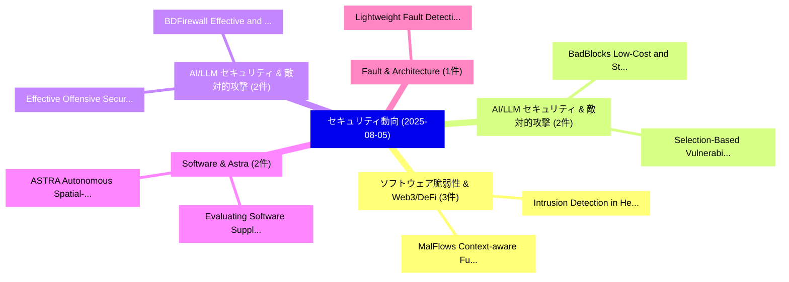

# 📅 02_daily: 日次エグゼクティブサマリー報告書 (2025-08-05)

**集計日時**: 2026-10-02 23:05:35 UTC  
**対象日付**: 2025-08-05  
**本日収集論文数**: 30 件  

---

## 💡 主要セキュリティ動向・脅威インサイト (Executive Insights)

本日の収集論文（計 30 件）において、以下の重点セキュリティ領域で活発な研究動向が確認されました：
- **ソフトウェア脆弱性 & Web3/DeFi** (3 件): 注目論文として 「Intrusion Detection in Heterog...」、「MalFlows: Context-aware Fusion...」 等が発表され、実務防御および攻撃検証の進展が見られます。
- **AI/LLM セキュリティ & 敵対的攻撃** (2 件): 注目論文として 「BadBlocks: Low-Cost and Stealt...」、「Selection-Based Vulnerabilitie...」 等が発表され、実務防御および攻撃検証の進展が見られます。
- **AI/LLM セキュリティ & 敵対的攻撃** (2 件): 注目論文として 「BDFirewall: Effective and Expe...」、「Effective Offensive Security L...」 等が発表され、実務防御および攻撃検証の進展が見られます。
- **Software & Astra** (2 件): 注目論文として 「Evaluating Software Supply Cha...」、「ASTRA: Autonomous Spatial-Temp...」 等が発表され、実務防御および攻撃検証の進展が見られます。
- **Fault & Architecture** (1 件): 注目論文として 「Lightweight Fault Detection Ar...」 等が発表され、実務防御および攻撃検証の進展が見られます。

### 🗺️ 技術・脅威トピックマインドマップ

---

## 📌 日次セキュリティ論文一覧 (日本語表形式)

| No | arXiv ID | 論文タイトル (日本語訳) | 重要キーワード | 構造化エグゼクティブ要約 (背景・提案・影響) | 脅威分類 | 詳細リンク |
|---|---|---|---|---|---|---|
| 1 | `2508.03062v1` | [Lightweight Fault Detection Architecture for NTT on FPGA（セキュリティ分析論文）](../../okf/papers/2025-08-05/2508.03062.md) | `Lightweight Fault Detection Architecture`, `Rourab Paul`, `Paresh Baidya` | 【提案】概要 (Overview & Key Finding) 本論文「Lightweight Fault Detection Architecture for NTT on FPG...。実証評価により経営層・セキュリティ管理者向け推奨アクション (E... | `cs.CR` | [arXiv](https://arxiv.org/abs/2508.03062v1) &#124; [OKF](../../okf/papers/2025-08-05/2508.03062.md) |
| 2 | `2508.03067v1` | [Untraceable DeepFakes via Traceable Fingerprint Elimination（セキュリティ分析論文）](../../okf/papers/2025-08-05/2508.03067.md) | `Traceable Fingerprint Elimination`, `Jiewei Lai`, `Lan Zhang` | 【提案】概要 (Overview & Key Finding) 本論文「Untraceable DeepFakes via Traceable Fingerprint Elimina...。実証評価により経営層・セキュリティ管理者向け推奨アクション (E... | `cs.CR` | [arXiv](https://arxiv.org/abs/2508.03067v1) &#124; [OKF](../../okf/papers/2025-08-05/2508.03067.md) |
| 3 | `2508.03091v1` | [T2UE: Generating Unlearnable Examples from Text Descriptions（セキュリティ分析論文）](../../okf/papers/2025-08-05/2508.03091.md) | `Generating Unlearnable Examples`, `Text Descriptions`, `Xingjun Ma` | 【提案】概要 (Overview & Key Finding) 本論文「T2UE: Generating Unlearnable Examples from Text Descrip...。実証評価により経営層・セキュリティ管理者向け推奨アクション (E... | `cs.CR` | [arXiv](https://arxiv.org/abs/2508.03091v1) &#124; [OKF](../../okf/papers/2025-08-05/2508.03091.md) |
| 4 | `2508.03097v1` | [VFLAIR-LLM: A Comprehensive Framework and Benchmark for Split Learning of LLMs（セキュリティ分析論文）](../../okf/papers/2025-08-05/2508.03097.md) | `Split Learning`, `Zixuan Gu`, `Qiufeng Fan` | 【提案】概要 (Overview & Key Finding) 本論文「VFLAIR-LLM: A Comprehensive Framework and Benchmark for...。実証評価により経営層・セキュリティ管理者向け推奨アクション (E... | `cs.CR` | [arXiv](https://arxiv.org/abs/2508.03097v1) &#124; [OKF](../../okf/papers/2025-08-05/2508.03097.md) |
| 5 | `2508.03125v1` | [Attack the Messages, Not the Agents: A Multi-round Adaptive Stealthy Tampering Framework for LLM-MAS（セキュリティ分析論文）](../../okf/papers/2025-08-05/2508.03125.md) | `Multi-round Adaptive`, `Bingyu Yan`, `Ziyi Zhou` | 【提案】背景とセキュリティ上の課題 (Background & Problem) 本研究はサイバー脅威環境におけるセキュリティ構造・脆弱性の検証を目的としています。(主要検出項目: ...。実証評価により経営層・セキュリティ管理者向け推奨アクション (E... | `cs.CR` | [arXiv](https://arxiv.org/abs/2508.03125v1) &#124; [OKF](../../okf/papers/2025-08-05/2508.03125.md) |
| 6 | `2508.03130v1` | [Protecting Small Organizations from AI Bots with Logrip: Hierarchical IP Hashing（セキュリティ分析論文）](../../okf/papers/2025-08-05/2508.03130.md) | `Protecting Small Organizations`, `Rama Carl Hoetzlein`, `Raw Meta` | 【提案】概要 (Overview & Key Finding) 本論文「Protecting Small Organizations from AI Bots with Logrip...。実証評価により経営層・セキュリティ管理者向け推奨アクション (E... | `cs.CR` | [arXiv](https://arxiv.org/abs/2508.03130v1) &#124; [OKF](../../okf/papers/2025-08-05/2508.03130.md) |
| 7 | `2508.03151v2` | [WiFinger: Fingerprinting Noisy IoT Event Traffic Using Packet-level Sequence Matching（セキュリティ分析論文）](../../okf/papers/2025-08-05/2508.03151.md) | `Event Traffic Using Packet`, `Fingerprinting Noisy`, `Sequence Matching` | 【提案】概要 (Overview & Key Finding) 本論文「WiFinger: Fingerprinting Noisy IoT Event Traffic Using ...。実証評価により経営層・セキュリティ管理者向け推奨アクション (E... | `cs.CR` | [arXiv](https://arxiv.org/abs/2508.03151v2) &#124; [OKF](../../okf/papers/2025-08-05/2508.03151.md) |
| 8 | `2508.03221v5` | [BadBlocks: Low-Cost and Stealthy Backdoor Attacks Tailored for Text-to-Image Diffusion Models（セキュリティ分析論文）](../../okf/papers/2025-08-05/2508.03221.md) | `Stealthy Backdoor Attacks Tailored`, `Image Diffusion Models`, `Jia Wu` | 【提案】概要 (Overview & Key Finding) 本論文「BadBlocks: Low-Cost and Stealthy Backdoor Attacks Tailo...。実証評価により経営層・セキュリティ管理者向け推奨アクション (E... | `cs.CR` | [arXiv](https://arxiv.org/abs/2508.03221v5) &#124; [OKF](../../okf/papers/2025-08-05/2508.03221.md) |
| 9 | `2508.03307v1` | [BDFirewall: Effective and Expeditiously Black-Box Backdoor Defense in MLaaSに向けて](../../okf/papers/2025-08-05/2508.03307.md) | `Box Backdoor Defense`, `Expeditiously Black`, `Black-Box Backdoor` | 【提案】概要 (Overview & Key Finding) 本論文「BDFirewall: Effective and Expeditiously Black-Box Backd...。実証評価により経営層・セキュリティ管理者向け推奨アクション (E... | `cs.CR` | [arXiv](https://arxiv.org/abs/2508.03307v1) &#124; [OKF](../../okf/papers/2025-08-05/2508.03307.md) |
| 10 | `2508.03321v1` | [Bidirectional TLS Handshake Caching for Constrained Industrial IoT Scenarios（セキュリティ分析論文）](../../okf/papers/2025-08-05/2508.03321.md) | `Handshake Caching`, `Constrained Industrial`, `Simon Mangel` | 【提案】概要 (Overview & Key Finding) 本論文「Bidirectional TLS Handshake Caching for Constrained Ind...。実証評価により経営層・セキュリティ管理者向け推奨アクション (E... | `cs.CR` | [arXiv](https://arxiv.org/abs/2508.03321v1) &#124; [OKF](../../okf/papers/2025-08-05/2508.03321.md) |
| 11 | `2508.03342v1` | [From Legacy to Standard: LLM-Assisted Transformation of サイバーセキュリティ Playbooks into CACAO Format](../../okf/papers/2025-08-05/2508.03342.md) | `Assisted Transformation`, `LLM-Assisted Transformation`, `Cybersecurity Playbooks` | 【提案】概要 (Overview & Key Finding) 本論文「From Legacy to Standard: LLM-Assisted Transformation of...。実証評価により経営層・セキュリティ管理者向け推奨アクション (E... | `cs.CR` | [arXiv](https://arxiv.org/abs/2508.03342v1) &#124; [OKF](../../okf/papers/2025-08-05/2508.03342.md) |
| 12 | `2508.03365v3` | [When Good Sounds Go Adversarial: Jailbreaking Audio-Language Models with Benign Inputs（セキュリティ分析論文）](../../okf/papers/2025-08-05/2508.03365.md) | `Jailbreaking Audio`, `Language Models`, `Benign Inputs` | 【提案】概要 (Overview & Key Finding) 本論文「When Good Sounds Go Adversarial: ジェイルブレイクing Audio-Lang...。実証評価により経営層・セキュリティ管理者向け推奨アクション (E... | `cs.CR` | [arXiv](https://arxiv.org/abs/2508.03365v3) &#124; [OKF](../../okf/papers/2025-08-05/2508.03365.md) |
| 13 | `2508.03413v1` | [Smart Car Privacy: Survey of Attacks and Privacy Issues（セキュリティ分析論文）](../../okf/papers/2025-08-05/2508.03413.md) | `Smart Car Privacy`, `Privacy Issues`, `Akshay Madhav Deshmukh` | 【提案】概要 (Overview & Key Finding) 本論文「Smart Car Privacy: Survey of Attacks and Privacy Issues...。実証評価により経営層・セキュリティ管理者向け推奨アクション (E... | `cs.CR` | [arXiv](https://arxiv.org/abs/2508.03413v1) &#124; [OKF](../../okf/papers/2025-08-05/2508.03413.md) |
| 14 | `2508.03474v1` | [Unravelling the Probabilistic Forest: Arbitrage in Prediction Markets（セキュリティ分析論文）](../../okf/papers/2025-08-05/2508.03474.md) | `Probabilistic Forest`, `Prediction Markets`, `Oriol Saguillo` | 【提案】概要 (Overview & Key Finding) 本論文「Unravelling the Probabilistic Forest: Arbitrage in Pred...。実証評価により経営層・セキュリティ管理者向け推奨アクション (E... | `cs.CR` | [arXiv](https://arxiv.org/abs/2508.03474v1) &#124; [OKF](../../okf/papers/2025-08-05/2508.03474.md) |
| 15 | `2508.03517v1` | [Intrusion Detection in Heterogeneous Networks with Domain-Adaptive Multi-Modal Learning（セキュリティ分析論文）](../../okf/papers/2025-08-05/2508.03517.md) | `Intrusion Detection`, `Heterogeneous Networks`, `Adaptive Multi` | 【提案】概要 (Overview & Key Finding) 本論文「Intrusion Detection in Heterogeneous Networks with Doma...。実証評価により経営層・セキュリティ管理者向け推奨アクション (E... | `cs.CR` | [arXiv](https://arxiv.org/abs/2508.03517v1) &#124; [OKF](../../okf/papers/2025-08-05/2508.03517.md) |
| 16 | `2508.03588v2` | [MalFlows: Context-aware Fusion of Heterogeneous Flow Semantics for Android マルウェア検出](../../okf/papers/2025-08-05/2508.03588.md) | `Heterogeneous Flow Semantics`, `Context-aware Fusion`, `Android Malware Detection` | 【提案】概要 (Overview & Key Finding) 本論文「MalFlows: Context-aware Fusion of Heterogeneous Flow Se...。実証評価により経営層・セキュリティ管理者向け推奨アクション (E... | `cs.CR` | [arXiv](https://arxiv.org/abs/2508.03588v2) &#124; [OKF](../../okf/papers/2025-08-05/2508.03588.md) |
| 17 | `2508.03681v1` | [What If, But Privately: Private Counterfactual Retrieval（セキュリティ分析論文）](../../okf/papers/2025-08-05/2508.03681.md) | `Private Counterfactual Retrieval`, `Shreya Meel`, `Mohamed Nomeir` | 【提案】概要 (Overview & Key Finding) 本論文「What If, But Privately: Private Counterfactual Retrieva...。実証評価により経営層・セキュリティ管理者向け推奨アクション (E... | `cs.CR` | [arXiv](https://arxiv.org/abs/2508.03681v1) &#124; [OKF](../../okf/papers/2025-08-05/2508.03681.md) |
| 18 | `2508.03793v3` | [AttnTrace: Contextual Attribution of Prompt Injection and Knowledge Corruption（セキュリティ分析論文）](../../okf/papers/2025-08-05/2508.03793.md) | `Contextual Attribution`, `Prompt Injection`, `Knowledge Corruption` | 【提案】概要 (Overview & Key Finding) 本論文「AttnTrace: Contextual Attribution of プロンプトインジェクション and ...。実証評価により経営層・セキュリティ管理者向け推奨アクション (E... | `cs.CR` | [arXiv](https://arxiv.org/abs/2508.03793v3) &#124; [OKF](../../okf/papers/2025-08-05/2508.03793.md) |
| 19 | `2508.03829v2` | [Majority Bit-Aware Watermarking For 大規模言語モデル](../../okf/papers/2025-08-05/2508.03829.md) | `Majority Bit`, `Bit-Aware Watermarking`, `Jiahao Xu` | 【提案】概要 (Overview & Key Finding) 本論文「Majority Bit-Aware Watermarking For 大規模言語モデル」（原題: Major...。実証評価により経営層・セキュリティ管理者向け推奨アクション (E... | `cs.CR` | [arXiv](https://arxiv.org/abs/2508.03829v2) &#124; [OKF](../../okf/papers/2025-08-05/2508.03829.md) |
| 20 | `2508.03856v1` | [Evaluating Software Supply Chain Security in Research Software（セキュリティ分析論文）](../../okf/papers/2025-08-05/2508.03856.md) | `Evaluating Software Supply Chain Security`, `Research Software`, `Richard Hegewald` | 【提案】概要 (Overview & Key Finding) 本論文「Evaluating Software Supply Chain Security in Research S...。実証評価により経営層・セキュリティ管理者向け推奨アクション (E... | `cs.CR` | [arXiv](https://arxiv.org/abs/2508.03856v1) &#124; [OKF](../../okf/papers/2025-08-05/2508.03856.md) |
| 21 | `2508.03879v1` | [RX-INT: A Kernel Engine for Real-Time Detection and In-Memory Threatsの分析](../../okf/papers/2025-08-05/2508.03879.md) | `Kernel Engine`, `Time Detection`, `Real-Time Detection` | 【提案】概要 (Overview & Key Finding) 本論文「RX-INT: A Kernel Engine for Real-Time Detection and In-...。実証評価により経営層・セキュリティ管理者向け推奨アクション (E... | `cs.CR` | [arXiv](https://arxiv.org/abs/2508.03879v1) &#124; [OKF](../../okf/papers/2025-08-05/2508.03879.md) |
| 22 | `2508.03882v2` | [Simulating Cyberattacks through a Breach Attack Simulation (BAS) Platform empowered by Security Chaos Engineering (SCE)（セキュリティ分析論文）](../../okf/papers/2025-08-05/2508.03882.md) | `Breach Attack Simulation`, `Security Chaos Engineering`, `Simulating Cyberattacks` | 【提案】概要 (Overview & Key Finding) 本論文「Simulating Cyberattacks through a Breach Attack Simulat...。実証評価により経営層・セキュリティ管理者向け推奨アクション (E... | `cs.CR` | [arXiv](https://arxiv.org/abs/2508.03882v2) &#124; [OKF](../../okf/papers/2025-08-05/2508.03882.md) |
| 23 | `2508.03936v1` | [ASTRA: Autonomous Spatial-Temporal Red-teaming for AI Software Assistants（セキュリティ分析論文）](../../okf/papers/2025-08-05/2508.03936.md) | `Autonomous Spatial`, `Temporal Red`, `Spatial-Temporal Red` | 【提案】概要 (Overview & Key Finding) 本論文「ASTRA: Autonomous Spatial-Temporal Red-teaming for AI S...。実証評価により経営層・セキュリティ管理者向け推奨アクション (E... | `cs.CR` | [arXiv](https://arxiv.org/abs/2508.03936v1) &#124; [OKF](../../okf/papers/2025-08-05/2508.03936.md) |
| 24 | `2508.03967v1` | [RAVID: Retrieval-Augmented Visual Detection: A Knowledge-Driven Approach for AI-Generated Image Identification（セキュリティ分析論文）](../../okf/papers/2025-08-05/2508.03967.md) | `Augmented Visual Detection`, `Generated Image Identification`, `Retrieval-Augmented Visual` | 【提案】概要 (Overview & Key Finding) 本論文「RAVID: Retrieval-Augmented Visual Detection: A Knowledg...。実証評価により経営層・セキュリティ管理者向け推奨アクション (E... | `cs.CR` | [arXiv](https://arxiv.org/abs/2508.03967v1) &#124; [OKF](../../okf/papers/2025-08-05/2508.03967.md) |
| 25 | `2508.05674v2` | [Effective Offensive Security LLM Agents: Hyperparameter Tuning, LLM as a Judge, and a Lightweight CTF Benchmarkに向けて](../../okf/papers/2025-08-05/2508.05674.md) | `Hyperparameter Tuning`, `Towards Effective Offensive Security`, `Effective Offensive Security` | 【提案】概要 (Overview & Key Finding) 本論文「Effective Offensive Security LLM Agents: Hyperparameter...。実証評価により経営層・セキュリティ管理者向け推奨アクション (E... | `cs.CR` | [arXiv](https://arxiv.org/abs/2508.05674v2) &#124; [OKF](../../okf/papers/2025-08-05/2508.05674.md) |
| 26 | `2508.05675v1` | [Principle-Guided Verilog Optimization: IP-Safe Knowledge Transfer via Local-Cloud Collaboration（セキュリティ分析論文）](../../okf/papers/2025-08-05/2508.05675.md) | `Guided Verilog Optimization`, `Safe Knowledge Transfer`, `Principle-Guided Verilog` | 【提案】概要 (Overview & Key Finding) 本論文「Principle-Guided Verilog Optimization: IP-Safe Knowledg...。実証評価により経営層・セキュリティ管理者向け推奨アクション (E... | `cs.CR` | [arXiv](https://arxiv.org/abs/2508.05675v1) &#124; [OKF](../../okf/papers/2025-08-05/2508.05675.md) |
| 27 | `2508.05677v1` | [Reinforcement Learning-based Medical Questionnaire Systems: Input-level Perturbation Strategies and Medical Constraint Validationに対する敵対的攻撃](../../okf/papers/2025-08-05/2508.05677.md) | `Medical Questionnaire Systems`, `Reinforcement Learning`, `Perturbation Strategies` | 【提案】概要 (Overview & Key Finding) 本論文「Reinforcement Learning-based Medical Questionnaire Syst...。実証評価により経営層・セキュリティ管理者向け推奨アクション (E... | `cs.CR` | [arXiv](https://arxiv.org/abs/2508.05677v1) &#124; [OKF](../../okf/papers/2025-08-05/2508.05677.md) |
| 28 | `2508.05681v1` | [Selection-Based Vulnerabilities: Clean-Label Backdoor Attacks in Active Learning（セキュリティ分析論文）](../../okf/papers/2025-08-05/2508.05681.md) | `Label Backdoor Attacks`, `Based Vulnerabilities`, `Selection-Based Vulnerabilities` | 【提案】概要 (Overview & Key Finding) 本論文「Selection-Based Vulnerabilities: Clean-Label Backdoor A...。実証評価により経営層・セキュリティ管理者向け推奨アクション (E... | `cs.CR` | [arXiv](https://arxiv.org/abs/2508.05681v1) &#124; [OKF](../../okf/papers/2025-08-05/2508.05681.md) |
| 29 | `2508.05684v1` | [MM-FusionNet: Context-Aware Dynamic Fusion for Multi-modal Fake News Detection with Large Vision-Language Models（セキュリティ分析論文）](../../okf/papers/2025-08-05/2508.05684.md) | `Aware Dynamic Fusion`, `Fake News Detection`, `Context-Aware Dynamic` | 【提案】概要 (Overview & Key Finding) 本論文「MM-FusionNet: Context-Aware Dynamic Fusion for Multi-mo...。実証評価により経営層・セキュリティ管理者向け推奨アクション (E... | `cs.CR` | [arXiv](https://arxiv.org/abs/2508.05684v1) &#124; [OKF](../../okf/papers/2025-08-05/2508.05684.md) |
| 30 | `2508.06325v1` | [Anti-Tamper Protection for Unauthorized Individual Image Generation（セキュリティ分析論文）](../../okf/papers/2025-08-05/2508.06325.md) | `Unauthorized Individual Image Generation`, `Tamper Protection`, `Anti-Tamper Protection` | 【提案】概要 (Overview & Key Finding) 本論文「Anti-Tamper Protection for Unauthorized Individual Imag...。実証評価により経営層・セキュリティ管理者向け推奨アクション (E... | `cs.CR` | [arXiv](https://arxiv.org/abs/2508.06325v1) &#124; [OKF](../../okf/papers/2025-08-05/2508.06325.md) |

