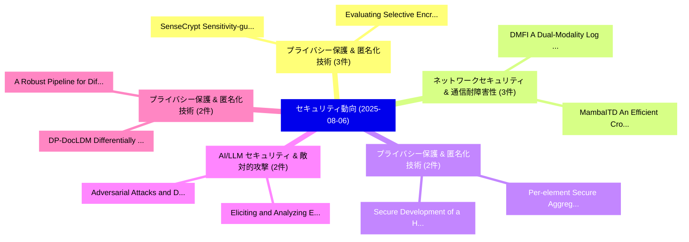

# 📅 02_daily: 日次エグゼクティブサマリー報告書 (2025-08-06)

**集計日時**: 2026-10-02 23:05:35 UTC  
**対象日付**: 2025-08-06  
**本日収集論文数**: 29 件  

---

## 💡 主要セキュリティ動向・脅威インサイト (Executive Insights)

本日の収集論文（計 29 件）において、以下の重点セキュリティ領域で活発な研究動向が確認されました：
- **プライバシー保護 & 匿名化技術** (3 件): 注目論文として 「SenseCrypt: Sensitivity-guided...」、「Evaluating Selective Encryptio...」 等が発表され、実務防御および攻撃検証の進展が見られます。
- **ネットワークセキュリティ & 通信耐障害性** (3 件): 注目論文として 「DMFI: A Dual-Modality Log Anal...」、「MambaITD: An Efficient Cross-M...」 等が発表され、実務防御および攻撃検証の進展が見られます。
- **プライバシー保護 & 匿名化技術** (2 件): 注目論文として 「Secure Development of a Hookin...」、「Per-element Secure Aggregation...」 等が発表され、実務防御および攻撃検証の進展が見られます。
- **AI/LLM セキュリティ & 敵対的攻撃** (2 件): 注目論文として 「Eliciting and Analyzing Emerge...」、「Adversarial Attacks and Defens...」 等が発表され、実務防御および攻撃検証の進展が見られます。
- **プライバシー保護 & 匿名化技術** (2 件): 注目論文として 「DP-DocLDM: Differentially Priv...」、「A Robust Pipeline for Differen...」 等が発表され、実務防御および攻撃検証の進展が見られます。

### 🗺️ 技術・脅威トピックマインドマップ

---

## 📌 日次セキュリティ論文一覧 (日本語表形式)

| No | arXiv ID | 論文タイトル (日本語訳) | 重要キーワード | 構造化エグゼクティブ要約 (背景・提案・影響) | 脅威分類 | 詳細リンク |
|---|---|---|---|---|---|---|
| 1 | `2508.03981v1` | [Reputation-based partition scheme for IoT security（セキュリティ分析論文）](../../okf/papers/2025-08-06/2508.03981.md) | `Reputation-based partition`, `Muhammad Zeeshan Haider`, `Zhikui Chen` | 【提案】概要 (Overview & Key Finding) 本論文「Reputation-based partition scheme for IoT security（セキュリ...。実証評価により経営層・セキュリティ管理者向け推奨アクション (E... | `cs.CR` | [arXiv](https://arxiv.org/abs/2508.03981v1) &#124; [OKF](../../okf/papers/2025-08-06/2508.03981.md) |
| 2 | `2508.04000v1` | [Advanced DAG-Based Ranking (ADR) Protocol for Blockchain Scalability（セキュリティ分析論文）](../../okf/papers/2025-08-06/2508.04000.md) | `Based Ranking`, `Blockchain Scalability`, `DAG-Based Ranking` | 【提案】概要 (Overview & Key Finding) 本論文「Advanced DAG-Based Ranking (ADR) Protocol for Blockchai...。実証評価により経営層・セキュリティ管理者向け推奨アクション (E... | `cs.CR` | [arXiv](https://arxiv.org/abs/2508.04000v1) &#124; [OKF](../../okf/papers/2025-08-06/2508.04000.md) |
| 3 | `2508.04024v1` | [Identity Theft in AI Conference Peer Review（セキュリティ分析論文）](../../okf/papers/2025-08-06/2508.04024.md) | `Conference Peer Review`, `Identity Theft`, `Melisa Bok` | 【提案】概要 (Overview & Key Finding) 本論文「Identity Theft in AI Conference Peer Review（セキュリティ分析論文）...。実証評価によりShah, Melisa Bok, Xukun L... | `cs.CR` | [arXiv](https://arxiv.org/abs/2508.04024v1) &#124; [OKF](../../okf/papers/2025-08-06/2508.04024.md) |
| 4 | `2508.04094v2` | [Isolate Trigger: Detecting and Eliminating Adaptive Backdoor Attacks（セキュリティ分析論文）](../../okf/papers/2025-08-06/2508.04094.md) | `Eliminating Adaptive Backdoor Attacks`, `Isolate Trigger`, `Chengrui Sun` | 【提案】概要 (Overview & Key Finding) 本論文「Isolate Trigger: Detecting and Eliminating Adaptive Bac...。実証評価により経営層・セキュリティ管理者向け推奨アクション (E... | `cs.CR` | [arXiv](https://arxiv.org/abs/2508.04094v2) &#124; [OKF](../../okf/papers/2025-08-06/2508.04094.md) |
| 5 | `2508.04100v1` | [SenseCrypt: Sensitivity-guided Selective Homomorphic Encryption for Joint 連合学習 in Cross-Device Scenarios](../../okf/papers/2025-08-06/2508.04100.md) | `Selective Homomorphic Encryption`, `Sensitivity-guided Selective`, `Device Scenarios` | 【提案】概要 (Overview & Key Finding) 本論文「SenseCrypt: Sensitivity-guided Selective 準同型暗号 for Join...。実証評価により経営層・セキュリティ管理者向け推奨アクション (E... | `cs.CR` | [arXiv](https://arxiv.org/abs/2508.04100v1) &#124; [OKF](../../okf/papers/2025-08-06/2508.04100.md) |
| 6 | `2508.04155v1` | [Evaluating Selective Encryption Against Gradient Inversion Attacks（セキュリティ分析論文）](../../okf/papers/2025-08-06/2508.04155.md) | `Jiajun Gu`, `Yuhang Yao`, `Shuaiqi Wang` | 【提案】概要 (Overview & Key Finding) 本論文「Evaluating Selective Encryption Against Gradient Invers...。実証評価により経営層・セキュリティ管理者向け推奨アクション (E... | `cs.CR` | [arXiv](https://arxiv.org/abs/2508.04155v1) &#124; [OKF](../../okf/papers/2025-08-06/2508.04155.md) |
| 7 | `2508.04178v1` | [Secure Development of a Hooking-Based Deception Framework Against Keylogging Techniques（セキュリティ分析論文）](../../okf/papers/2025-08-06/2508.04178.md) | `Secure Development`, `Hooking-Based Deception`, `Md Sajidul Islam Sajid` | 【提案】概要 (Overview & Key Finding) 本論文「Secure Development of a Hooking-Based Deception Framewo...。実証評価により経営層・セキュリティ管理者向け推奨アクション (E... | `cs.CR` | [arXiv](https://arxiv.org/abs/2508.04178v1) &#124; [OKF](../../okf/papers/2025-08-06/2508.04178.md) |
| 8 | `2508.04189v2` | [BadTime: An Effective Backdoor Attack on Multivariate Long-Term Time Series Forecasting（セキュリティ分析論文）](../../okf/papers/2025-08-06/2508.04189.md) | `Term Time Series Forecasting`, `Multivariate Long`, `Long-Term Time` | 【提案】概要 (Overview & Key Finding) 本論文「BadTime: An Effective Backdoor Attack on Multivariate L...。実証評価により経営層・セキュリティ管理者向け推奨アクション (E... | `cs.CR` | [arXiv](https://arxiv.org/abs/2508.04189v2) &#124; [OKF](../../okf/papers/2025-08-06/2508.04189.md) |
| 9 | `2508.04196v1` | [Eliciting and Analyzing Emergent Misalignment in State-of-the-Art 大規模言語モデル](../../okf/papers/2025-08-06/2508.04196.md) | `Analyzing Emergent Misalignment`, `Art Large Language Models`, `the-Art Large` | 【提案】背景とセキュリティ上の課題 (Background & Problem) 本研究はサイバー脅威環境におけるセキュリティ構造・脆弱性の検証を目的としています。(主要検出項目: ...。実証評価により経営層・セキュリティ管理者向け推奨アクション (E... | `cs.CR` | [arXiv](https://arxiv.org/abs/2508.04196v1) &#124; [OKF](../../okf/papers/2025-08-06/2508.04196.md) |
| 10 | `2508.04208v1` | [DP-DocLDM: Differentially Private Document Image Generation using Latent Diffusion Models（セキュリティ分析論文）](../../okf/papers/2025-08-06/2508.04208.md) | `Differentially Private Document Image Generation`, `Latent Diffusion Models`, `Differentially Private Document Ima` | 【提案】概要 (Overview & Key Finding) 本論文「DP-DocLDM: Differentially Private Document Image Genera...。実証評価により経営層・セキュリティ管理者向け推奨アクション (E... | `cs.CR` | [arXiv](https://arxiv.org/abs/2508.04208v1) &#124; [OKF](../../okf/papers/2025-08-06/2508.04208.md) |
| 11 | `2508.04265v1` | [SelectiveShield: Lightweight Hybrid Defense Against Gradient Leakage in 連合学習](../../okf/papers/2025-08-06/2508.04265.md) | `Federated Learning`, `Borui Li`, `Li Yan` | 【提案】概要 (Overview & Key Finding) 本論文「SelectiveShield: Lightweight Hybrid Defense Against Gra...。実証評価により経営層・セキュリティ管理者向け推奨アクション (E... | `cs.CR` | [arXiv](https://arxiv.org/abs/2508.04265v1) &#124; [OKF](../../okf/papers/2025-08-06/2508.04265.md) |
| 12 | `2508.04281v4` | [Prompt Injection Vulnerability of Consensus Generating Applications in Digital Democracy（セキュリティ分析論文）](../../okf/papers/2025-08-06/2508.04281.md) | `Prompt Injection Vulnerability`, `Consensus Generating Applications`, `Digital Democracy` | 【提案】概要 (Overview & Key Finding) 本論文「プロンプトインジェクション 脆弱性 of Consensus Generating Applications ...。実証評価により経営層・セキュリティ管理者向け推奨アクション (E... | `cs.CR` | [arXiv](https://arxiv.org/abs/2508.04281v4) &#124; [OKF](../../okf/papers/2025-08-06/2508.04281.md) |
| 13 | `2508.04285v2` | [Per-element Secure Aggregation against Data Reconstruction Attacks in 連合学習](../../okf/papers/2025-08-06/2508.04285.md) | `Data Reconstruction Attacks`, `Secure Aggregation`, `Per-element Secure` | 【提案】概要 (Overview & Key Finding) 本論文「Per-element Secure Aggregation against Data Reconstruct...。実証評価により経営層・セキュリティ管理者向け推奨アクション (E... | `cs.CR` | [arXiv](https://arxiv.org/abs/2508.04285v2) &#124; [OKF](../../okf/papers/2025-08-06/2508.04285.md) |
| 14 | `2508.04340v2` | [Riemann-Roch bases for arbitrary elliptic curve divisors and their application in cryptography（セキュリティ分析論文）](../../okf/papers/2025-08-06/2508.04340.md) | `Riemann-Roch bases`, `Artyom Kuninets`, `Ekaterina Malygina` | 【提案】概要 (Overview & Key Finding) 本論文「Riemann-Roch bases for arbitrary elliptic curve divisor...。実証評価により経営層・セキュリティ管理者向け推奨アクション (E... | `cs.CR` | [arXiv](https://arxiv.org/abs/2508.04340v2) &#124; [OKF](../../okf/papers/2025-08-06/2508.04340.md) |
| 15 | `2508.04542v2` | [Privacy Risk Predictions Based on Fundamental Understanding of Personal Data and an Evolving Threat Landscape（セキュリティ分析論文）](../../okf/papers/2025-08-06/2508.04542.md) | `Privacy Risk Predictions Based`, `Evolving Threat Landscape`, `Fundamental Understanding` | 【提案】概要 (Overview & Key Finding) 本論文「Privacy Risk Predictions Based on Fundamental Understan...。実証評価により経営層・セキュリティ管理者向け推奨アクション (E... | `cs.CR` | [arXiv](https://arxiv.org/abs/2508.04542v2) &#124; [OKF](../../okf/papers/2025-08-06/2508.04542.md) |
| 16 | `2508.04561v1` | [Attack Pattern Mining to Discover Hidden Threats to Industrial Control Systems（セキュリティ分析論文）](../../okf/papers/2025-08-06/2508.04561.md) | `Attack Pattern Mining`, `Discover Hidden Threats`, `Industrial Control Systems` | 【提案】概要 (Overview & Key Finding) 本論文「Attack Pattern Mining to Discover Hidden Threats to Ind...。実証評価により経営層・セキュリティ管理者向け推奨アクション (E... | `cs.CR` | [arXiv](https://arxiv.org/abs/2508.04561v1) &#124; [OKF](../../okf/papers/2025-08-06/2508.04561.md) |
| 17 | `2508.04583v3` | [Energy Consumption of TLS, Searchable Encryption and Fully Homomorphic Encryption（セキュリティ分析論文）](../../okf/papers/2025-08-06/2508.04583.md) | `Fully Homomorphic Encryption`, `Energy Consumption`, `Searchable Encryption` | 【提案】概要 (Overview & Key Finding) 本論文「Energy Consumption of TLS, Searchable Encryption and Fu...。実証評価により経営層・セキュリティ管理者向け推奨アクション (E... | `cs.CR` | [arXiv](https://arxiv.org/abs/2508.04583v3) &#124; [OKF](../../okf/papers/2025-08-06/2508.04583.md) |
| 18 | `2508.04641v1` | [4-Swap: Achieving Grief-Free and Bribery-Safe Atomic Swaps Using Four Transactions（セキュリティ分析論文）](../../okf/papers/2025-08-06/2508.04641.md) | `Safe Atomic Swaps Using Four Transactions`, `Achieving Grief`, `Bribery-Safe Atomic` | 【提案】概要 (Overview & Key Finding) 本論文「4-Swap: Achieving Grief-Free and Bribery-Safe Atomic Sw...。実証評価により経営層・セキュリティ管理者向け推奨アクション (E... | `cs.CR` | [arXiv](https://arxiv.org/abs/2508.04641v1) &#124; [OKF](../../okf/papers/2025-08-06/2508.04641.md) |
| 19 | `2508.04644v1` | [Millions of inequivalent quadratic APN functions in eight variables（セキュリティ分析論文）](../../okf/papers/2025-08-06/2508.04644.md) | `Christof Beierle`, `Philippe Langevin`, `Gregor Leander` | 【提案】概要 (Overview & Key Finding) 本論文「Millions of inequivalent quadratic APN functions in eig...。実証評価により経営層・セキュリティ管理者向け推奨アクション (E... | `cs.CR` | [arXiv](https://arxiv.org/abs/2508.04644v1) &#124; [OKF](../../okf/papers/2025-08-06/2508.04644.md) |
| 20 | `2508.04669v3` | [サイバーセキュリティ of Quantum Key Distribution Implementations](../../okf/papers/2025-08-06/2508.04669.md) | `Quantum Key Distribution Implementations`, `Ittay Alfassi`, `Ran Gelles` | 【提案】概要 (Overview & Key Finding) 本論文「サイバーセキュリティ of 量子鍵配送 Implementations」（原題: Cybersecurity ...。実証評価により経営層・セキュリティ管理者向け推奨アクション (E... | `cs.CR` | [arXiv](https://arxiv.org/abs/2508.04669v3) &#124; [OKF](../../okf/papers/2025-08-06/2508.04669.md) |
| 21 | `2508.04894v1` | [Adversarial Attacks and Defenses on Graph-aware 大規模言語モデル (LLMs)](../../okf/papers/2025-08-06/2508.04894.md) | `Adversarial Attacks`, `Large Language Models`, `Graph-aware Large` | 【提案】概要 (Overview & Key Finding) 本論文「敵対的攻撃s and Defenses on Graph-aware 大規模言語モデル (LLMs)」（原題:...。実証評価によりOlatunji, Franziska Boeni... | `cs.CR` | [arXiv](https://arxiv.org/abs/2508.04894v1) &#124; [OKF](../../okf/papers/2025-08-06/2508.04894.md) |
| 22 | `2508.05689v1` | [Boosting Adversarial Transferability via Residual Perturbation Attack（セキュリティ分析論文）](../../okf/papers/2025-08-06/2508.05689.md) | `Boosting Adversarial Transferability`, `Residual Perturbation Attack`, `Jinjia Peng` | 【提案】概要 (Overview & Key Finding) 本論文「Boosting Adversarial Transferability via Residual Pertu...。実証評価により経営層・セキュリティ管理者向け推奨アクション (E... | `cs.CR` | [arXiv](https://arxiv.org/abs/2508.05689v1) &#124; [OKF](../../okf/papers/2025-08-06/2508.05689.md) |
| 23 | `2508.05690v2` | [Leveraging 大規模言語モデル for SQL behavior-based database intrusion detection](../../okf/papers/2025-08-06/2508.05690.md) | `behavior-based database`, `Meital Shlezinger`, `Shay Akirav` | 【提案】概要 (Overview & Key Finding) 本論文「Leveraging 大規模言語モデル for SQL behavior-based database int...。実証評価により経営層・セキュリティ管理者向け推奨アクション (E... | `cs.CR` | [arXiv](https://arxiv.org/abs/2508.05690v2) &#124; [OKF](../../okf/papers/2025-08-06/2508.05690.md) |
| 24 | `2508.05691v3` | [SPRINT: Robust Model Attribution of Generated Images via Secret Pixel Reconstruction（セキュリティ分析論文）](../../okf/papers/2025-08-06/2508.05691.md) | `Robust Model Attribution`, `Secret Pixel Reconstruction`, `Generated Images` | 【提案】概要 (Overview & Key Finding) 本論文「SPRINT: Robust Model Attribution of Generated Images vi...。実証評価により経営層・セキュリティ管理者向け推奨アクション (E... | `cs.CR` | [arXiv](https://arxiv.org/abs/2508.05691v3) &#124; [OKF](../../okf/papers/2025-08-06/2508.05691.md) |
| 25 | `2508.05694v2` | [DMFI: A Dual-Modality Log Analysis Framework for Insider Threat Detection with LoRA-Tuned Language Models（セキュリティ分析論文）](../../okf/papers/2025-08-06/2508.05694.md) | `Insider Threat Detection`, `Tuned Language Models`, `Dual-Modality Log` | 【提案】概要 (Overview & Key Finding) 本論文「DMFI: A Dual-Modality Log Analysis Framework for Inside...。実証評価により経営層・セキュリティ管理者向け推奨アクション (E... | `cs.CR` | [arXiv](https://arxiv.org/abs/2508.05694v2) &#124; [OKF](../../okf/papers/2025-08-06/2508.05694.md) |
| 26 | `2508.05695v1` | [MambaITD: An Efficient Cross-Modal Mamba Network for Insider Threat Detection（セキュリティ分析論文）](../../okf/papers/2025-08-06/2508.05695.md) | `Modal Mamba Network`, `Insider Threat Detection`, `Cross-Modal Mamba` | 【提案】概要 (Overview & Key Finding) 本論文「MambaITD: An Efficient Cross-Modal Mamba Network for In...。実証評価により経営層・セキュリティ管理者向け推奨アクション (E... | `cs.CR` | [arXiv](https://arxiv.org/abs/2508.05695v1) &#124; [OKF](../../okf/papers/2025-08-06/2508.05695.md) |
| 27 | `2508.05696v1` | [Log2Sig: Frequency-Aware Insider Threat Detection via Multivariate Behavioral Signal Decomposition（セキュリティ分析論文）](../../okf/papers/2025-08-06/2508.05696.md) | `Aware Insider Threat Detection`, `Multivariate Behavioral Signal Decomposition`, `Frequency-Aware Insider` | 【提案】概要 (Overview & Key Finding) 本論文「Log2Sig: Frequency-Aware Insider 脅威 Detection via Multi...。実証評価により経営層・セキュリティ管理者向け推奨アクション (E... | `cs.CR` | [arXiv](https://arxiv.org/abs/2508.05696v1) &#124; [OKF](../../okf/papers/2025-08-06/2508.05696.md) |
| 28 | `2508.10017v2` | [A Robust Pipeline for Differentially Private 連合学習 on Imbalanced Clinical Data using SMOTETomek and FedProx](../../okf/papers/2025-08-06/2508.10017.md) | `Imbalanced Clinical Data`, `Robust Pipeline`, `Differentially Private Federated Learning` | 【提案】概要 (Overview & Key Finding) 本論文「A Robust Pipeline for Differentially Private 連合学習 on Im...。実証評価により経営層・セキュリティ管理者向け推奨アクション (E... | `cs.CR` | [arXiv](https://arxiv.org/abs/2508.10017v2) &#124; [OKF](../../okf/papers/2025-08-06/2508.10017.md) |
| 29 | `2508.19250v1` | [Tight Quantum-Security Bounds and Parameter Optimization for SPHINCS+ and NTRU（セキュリティ分析論文）](../../okf/papers/2025-08-06/2508.19250.md) | `Tight Quantum`, `Security Bounds`, `Parameter Optimization` | 【提案】概要 (Overview & Key Finding) 本論文「Tight 量子-Security Bounds and Parameter Optimization for...。実証評価により経営層・セキュリティ管理者向け推奨アクション (E... | `cs.CR` | [arXiv](https://arxiv.org/abs/2508.19250v1) &#124; [OKF](../../okf/papers/2025-08-06/2508.19250.md) |

