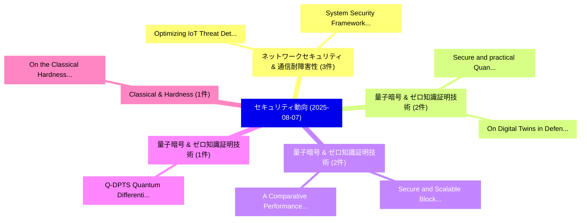

# 📅 02_daily: 日次エグゼクティブサマリー報告書 (2025-08-07)

**集計日時**: 2026-10-02 23:05:35 UTC  
**対象日付**: 2025-08-07  
**本日収集論文数**: 18 件  

---

## 💡 主要セキュリティ動向・脅威インサイト (Executive Insights)

本日の収集論文（計 18 件）において、以下の重点セキュリティ領域で活発な研究動向が確認されました：
- **ネットワークセキュリティ & 通信耐障害性** (3 件): 注目論文として 「Optimizing IoT Threat Detectio...」、「System Security Framework for ...」 等が発表され、実務防御および攻撃検証の進展が見られます。
- **量子暗号 & ゼロ知識証明技術** (2 件): 注目論文として 「Secure and practical Quantum D...」、「On Digital Twins in Defence: O...」 等が発表され、実務防御および攻撃検証の進展が見られます。
- **量子暗号 & ゼロ知識証明技術** (2 件): 注目論文として 「Secure and Scalable Blockchain...」、「A Comparative Performance Eval...」 等が発表され、実務防御および攻撃検証の進展が見られます。
- **量子暗号 & ゼロ知識証明技術** (1 件): 注目論文として 「Q-DPTS: Quantum Differentially...」 等が発表され、実務防御および攻撃検証の進展が見られます。
- **Classical & Hardness** (1 件): 注目論文として 「On the Classical Hardness of t...」 等が発表され、実務防御および攻撃検証の進展が見られます。

### 🗺️ 技術・脅威トピックマインドマップ

---

## 📌 日次セキュリティ論文一覧 (日本語表形式)

| No | arXiv ID | 論文タイトル (日本語訳) | 重要キーワード | 構造化エグゼクティブ要約 (背景・提案・影響) | 脅威分類 | 詳細リンク |
|---|---|---|---|---|---|---|
| 1 | `2508.05036v2` | [Q-DPTS: Quantum Differentially Private Time Series Forecasting via Variational Quantum Circuits（セキュリティ分析論文）](../../okf/papers/2025-08-07/2508.05036.md) | `Quantum Differentially Private Time Series Forecasting`, `Variational Quantum Circuits`, `Sheng Chen` | 【提案】概要 (Overview & Key Finding) 本論文「Q-DPTS: 量子 Differentially Private Time Series Forecasti...。実証評価により経営層・セキュリティ管理者向け推奨アクション (E... | `cs.CR` | [arXiv](https://arxiv.org/abs/2508.05036v2) &#124; [OKF](../../okf/papers/2025-08-07/2508.05036.md) |
| 2 | `2508.05048v2` | [On the Classical Hardness of the Semidirect Discrete Logarithm Problem in Finite Groups（セキュリティ分析論文）](../../okf/papers/2025-08-07/2508.05048.md) | `Semidirect Discrete Logarithm Problem`, `Classical Hardness`, `Finite Groups` | 【提案】概要 (Overview & Key Finding) 本論文「On the Classical Hardness of the Semidirect Discrete Lo...。実証評価により経営層・セキュリティ管理者向け推奨アクション (E... | `cs.CR` | [arXiv](https://arxiv.org/abs/2508.05048v2) &#124; [OKF](../../okf/papers/2025-08-07/2508.05048.md) |
| 3 | `2508.05087v1` | [JPS: Jailbreak Multimodal 大規模言語モデル with Collaborative Visual Perturbation and Textual Steering](../../okf/papers/2025-08-07/2508.05087.md) | `Collaborative Visual Perturbation`, `Textual Steering`, `Jailbreak Multimodal Large Language Models` | 【提案】概要 (Overview & Key Finding) 本論文「JPS: ジェイルブレイク Multimodal 大規模言語モデル with Collaborative Vi...。実証評価により経営層・セキュリティ管理者向け推奨アクション (E... | `cs.CR` | [arXiv](https://arxiv.org/abs/2508.05087v1) &#124; [OKF](../../okf/papers/2025-08-07/2508.05087.md) |
| 4 | `2508.05110v1` | [Necessity of Block Designs for Optimal Locally Private Distribution Estimation（セキュリティ分析論文）](../../okf/papers/2025-08-07/2508.05110.md) | `Optimal Locally Private Distribution Estimation`, `Block Designs`, `Abigail Gentle` | 【提案】概要 (Overview & Key Finding) 本論文「Necessity of Block Designs for Optimal Locally Private ...。実証評価により経営層・セキュリティ管理者向け推奨アクション (E... | `cs.CR` | [arXiv](https://arxiv.org/abs/2508.05110v1) &#124; [OKF](../../okf/papers/2025-08-07/2508.05110.md) |
| 5 | `2508.05188v1` | [Incident Response Planning Using a Lightweight Large Language Model with Reduced Hallucination（セキュリティ分析論文）](../../okf/papers/2025-08-07/2508.05188.md) | `Incident Response Planning Using`, `Lightweight Large Language Model`, `Reduced Hallucination` | 【提案】概要 (Overview & Key Finding) 本論文「Incident Response Planning Using a Lightweight Large La...。実証評価により経営層・セキュリティ管理者向け推奨アクション (E... | `cs.CR` | [arXiv](https://arxiv.org/abs/2508.05188v1) &#124; [OKF](../../okf/papers/2025-08-07/2508.05188.md) |
| 6 | `2508.05276v2` | [An Overview of 7726 User Reports: Uncovering SMS Scams and Scammer Strategies（セキュリティ分析論文）](../../okf/papers/2025-08-07/2508.05276.md) | `User Reports`, `Scammer Strategies`, `Sharad Agarwal` | 【提案】概要 (Overview & Key Finding) 本論文「An Overview of 7726 User Reports: Uncovering SMS Scams ...。実証評価により経営層・セキュリティ管理者向け推奨アクション (E... | `cs.CR` | [arXiv](https://arxiv.org/abs/2508.05276v2) &#124; [OKF](../../okf/papers/2025-08-07/2508.05276.md) |
| 7 | `2508.05334v2` | [ShikkhaChain: A Blockchain-Powered Academic Credential Verification System for Bangladesh（セキュリティ分析論文）](../../okf/papers/2025-08-07/2508.05334.md) | `Powered Academic Credential Verification System`, `Blockchain-Powered Academic`, `Ibrahim Khalil Shanto` | 【提案】概要 (Overview & Key Finding) 本論文「ShikkhaChain: A Blockchain-Powered Academic Credential ...。実証評価により経営層・セキュリティ管理者向け推奨アクション (E... | `cs.CR` | [arXiv](https://arxiv.org/abs/2508.05334v2) &#124; [OKF](../../okf/papers/2025-08-07/2508.05334.md) |
| 8 | `2508.05355v1` | [Secure and practical Quantum Digital Signatures（セキュリティ分析論文）](../../okf/papers/2025-08-07/2508.05355.md) | `Quantum Digital Signatures`, `Federico Grasselli`, `Gaetano Russo` | 【提案】概要 (Overview & Key Finding) 本論文「Secure and practical 量子 Digital Signatures（セキュリティ分析論文）」...。実証評価により経営層・セキュリティ管理者向け推奨アクション (E... | `cs.CR` | [arXiv](https://arxiv.org/abs/2508.05355v1) &#124; [OKF](../../okf/papers/2025-08-07/2508.05355.md) |
| 9 | `2508.05394v1` | [Grouped k-threshold random grid-based visual cryptography scheme（セキュリティ分析論文）](../../okf/papers/2025-08-07/2508.05394.md) | `k-threshold random`, `grid-based visual`, `Xiaoli Zhuo` | 【提案】概要 (Overview & Key Finding) 本論文「Grouped k-threshold random grid-based visual 暗号技術 schem...。実証評価により経営層・セキュリティ管理者向け推奨アクション (E... | `cs.CR` | [arXiv](https://arxiv.org/abs/2508.05394v1) &#124; [OKF](../../okf/papers/2025-08-07/2508.05394.md) |
| 10 | `2508.05518v1` | [Local Distance Query with Differential Privacy（セキュリティ分析論文）](../../okf/papers/2025-08-07/2508.05518.md) | `Local Distance Query`, `Differential Privacy`, `Weihong Sheng` | 【提案】概要 (Overview & Key Finding) 本論文「Local Distance Query with 差分プライバシー（セキュリティ分析論文）」（原題: Loc...。実証評価により経営層・セキュリティ管理者向け推奨アクション (E... | `cs.CR` | [arXiv](https://arxiv.org/abs/2508.05518v1) &#124; [OKF](../../okf/papers/2025-08-07/2508.05518.md) |
| 11 | `2508.05545v1` | [PRvL: Quantifying the Capabilities and Risks of 大規模言語モデル for PII Redaction](../../okf/papers/2025-08-07/2508.05545.md) | `Large Language Models`, `Leon Garza`, `Anantaa Kotal` | 【提案】概要 (Overview & Key Finding) 本論文「PRvL: Quantifying the Capabilities and Risks of 大規模言語モデ...。実証評価により経営層・セキュリティ管理者向け推奨アクション (E... | `cs.CR` | [arXiv](https://arxiv.org/abs/2508.05545v1) &#124; [OKF](../../okf/papers/2025-08-07/2508.05545.md) |
| 12 | `2508.05591v1` | [Optimizing IoT Threat Detection with Kolmogorov-Arnold Networks (KANs)（セキュリティ分析論文）](../../okf/papers/2025-08-07/2508.05591.md) | `Threat Detection`, `Arnold Networks`, `Kolmogorov-Arnold Networks` | 【提案】概要 (Overview & Key Finding) 本論文「Optimizing IoT 脅威 Detection with Kolmogorov-Arnold Netw...。実証評価により経営層・セキュリティ管理者向け推奨アクション (E... | `cs.CR` | [arXiv](https://arxiv.org/abs/2508.05591v1) &#124; [OKF](../../okf/papers/2025-08-07/2508.05591.md) |
| 13 | `2508.05600v2` | [Non-omniscient backdoor injection with one poison sample: Proving the one-poison hypothesis for linear regression, linear classification, and 2-layer ReLU neural networks（セキュリティ分析論文）](../../okf/papers/2025-08-07/2508.05600.md) | `Non-omniscient backdoor`, `one-poison hypothesis`, `2-layer ReLU` | 【提案】概要 (Overview & Key Finding) 本論文「Non-omniscient backdoor injection with one poison sampl...。実証評価により経営層・セキュリティ管理者向け推奨アクション (E... | `cs.CR` | [arXiv](https://arxiv.org/abs/2508.05600v2) &#124; [OKF](../../okf/papers/2025-08-07/2508.05600.md) |
| 14 | `2508.05707v1` | [System Security Framework for 5G Advanced /6G IoT Integrated Terrestrial Network-Non-Terrestrial Network (TN-NTN) with AI-Enabled Cloud Security（セキュリティ分析論文）](../../okf/papers/2025-08-07/2508.05707.md) | `Integrated Terrestrial Network`, `Enabled Cloud Security`, `Terrestrial Network` | 【提案】概要 (Overview & Key Finding) 本論文「System Security Framework for 5G Advanced /6G IoT Integ...。実証評価により経営層・セキュリティ管理者向け推奨アクション (E... | `cs.CR` | [arXiv](https://arxiv.org/abs/2508.05707v1) &#124; [OKF](../../okf/papers/2025-08-07/2508.05707.md) |
| 15 | `2508.05717v2` | [On Digital Twins in Defence: Overview and Applications（セキュリティ分析論文）](../../okf/papers/2025-08-07/2508.05717.md) | `Jose Luis Sanchez`, `Marco Giberna`, `Holger Voos` | 【提案】概要 (Overview & Key Finding) 本論文「On Digital Twins in Defence: Overview and Applications（...。実証評価により経営層・セキュリティ管理者向け推奨アクション (E... | `cs.CR` | [arXiv](https://arxiv.org/abs/2508.05717v2) &#124; [OKF](../../okf/papers/2025-08-07/2508.05717.md) |
| 16 | `2508.05865v2` | [Secure and Scalable Blockchain Voting: A Comparative Framework and the Role of 大規模言語モデル](../../okf/papers/2025-08-07/2508.05865.md) | `Scalable Blockchain Voting`, `Large Language Models`, `Elvis Nnaemeka Chukwuani` | 【提案】概要 (Overview & Key Finding) 本論文「Secure and Scalable Blockchain Voting: A Comparative Fr...。実証評価により経営層・セキュリティ管理者向け推奨アクション (E... | `cs.CR` | [arXiv](https://arxiv.org/abs/2508.05865v2) &#124; [OKF](../../okf/papers/2025-08-07/2508.05865.md) |
| 17 | `2508.06574v1` | [Semi-Supervised Supply Chain Fraud Detection with Unsupervised Pre-Filtering（セキュリティ分析論文）](../../okf/papers/2025-08-07/2508.06574.md) | `Supervised Supply Chain Fraud Detection`, `Unsupervised Pre`, `Semi-Supervised Supply` | 【提案】概要 (Overview & Key Finding) 本論文「Semi-Supervised Supply Chain Fraud Detection with Unsup...。実証評価により経営層・セキュリティ管理者向け推奨アクション (E... | `cs.CR` | [arXiv](https://arxiv.org/abs/2508.06574v1) &#124; [OKF](../../okf/papers/2025-08-07/2508.06574.md) |
| 18 | `2508.10023v1` | [A Comparative Performance Evaluation of Kyber, sntrup761, and FrodoKEM for Post-Quantum Cryptography（セキュリティ分析論文）](../../okf/papers/2025-08-07/2508.10023.md) | `Quantum Cryptography`, `Post-Quantum Cryptography`, `Raw Meta` | 【提案】概要 (Overview & Key Finding) 本論文「A Comparative Performance Evaluation of Kyber, sntrup76...。実証評価により経営層・セキュリティ管理者向け推奨アクション (E... | `cs.CR` | [arXiv](https://arxiv.org/abs/2508.10023v1) &#124; [OKF](../../okf/papers/2025-08-07/2508.10023.md) |

