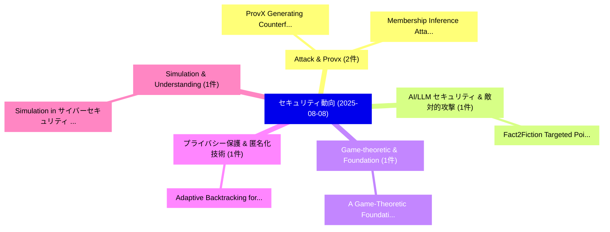

# 📅 02_daily: 日次エグゼクティブサマリー報告書 (2025-08-08)

**集計日時**: 2026-10-02 23:05:35 UTC  
**対象日付**: 2025-08-08  
**本日収集論文数**: 16 件  

---

## 💡 主要セキュリティ動向・脅威インサイト (Executive Insights)

本日の収集論文（計 16 件）において、以下の重点セキュリティ領域で活発な研究動向が確認されました：
- **Attack & Provx** (2 件): 注目論文として 「ProvX: Generating Counterfactu...」、「Membership Inference Attack wi...」 等が発表され、実務防御および攻撃検証の進展が見られます。
- **AI/LLM セキュリティ & 敵対的攻撃** (1 件): 注目論文として 「Fact2Fiction: Targeted Poisoni...」 等が発表され、実務防御および攻撃検証の進展が見られます。
- **Game-theoretic & Foundation** (1 件): 注目論文として 「A Game-Theoretic Foundation fo...」 等が発表され、実務防御および攻撃検証の進展が見られます。
- **プライバシー保護 & 匿名化技術** (1 件): 注目論文として 「Adaptive Backtracking for Priv...」 等が発表され、実務防御および攻撃検証の進展が見られます。
- **Simulation & Understanding** (1 件): 注目論文として 「Simulation in サイバーセキュリティ: Unde...」 等が発表され、実務防御および攻撃検証の進展が見られます。

### 🗺️ 技術・脅威トピックマインドマップ

---

## 📌 日次セキュリティ論文一覧 (日本語表形式)

| No | arXiv ID | 論文タイトル (日本語訳) | 重要キーワード | 構造化エグゼクティブ要約 (背景・提案・影響) | 脅威分類 | 詳細リンク |
|---|---|---|---|---|---|---|
| 1 | `2508.06059v2` | [Fact2Fiction: Targeted Poisoning Attack to Agentic Fact-checking System（セキュリティ分析論文）](../../okf/papers/2025-08-08/2508.06059.md) | `Targeted Poisoning Attack`, `Agentic Fact`, `Fact-checking System` | 【提案】概要 (Overview & Key Finding) 本論文「Fact2Fiction: Targeted Poisoning Attack to Agentic Fact...。実証評価により経営層・セキュリティ管理者向け推奨アクション (E... | `cs.CR` | [arXiv](https://arxiv.org/abs/2508.06059v2) &#124; [OKF](../../okf/papers/2025-08-08/2508.06059.md) |
| 2 | `2508.06071v2` | [A Game-Theoretic Foundation for Bitcoin's Price: A Security-Utility Equilibrium（セキュリティ分析論文）](../../okf/papers/2025-08-08/2508.06071.md) | `Theoretic Foundation`, `Utility Equilibrium`, `Game-Theoretic Foundation` | 【提案】概要 (Overview & Key Finding) 本論文「A Game-Theoretic Foundation for Bitcoin's Price: A Secu...。実証評価により経営層・セキュリティ管理者向け推奨アクション (E... | `cs.CR` | [arXiv](https://arxiv.org/abs/2508.06071v2) &#124; [OKF](../../okf/papers/2025-08-08/2508.06071.md) |
| 3 | `2508.06073v1` | [ProvX: Generating Counterfactual-Driven Attack Explanations for Provenance-Based Detection（セキュリティ分析論文）](../../okf/papers/2025-08-08/2508.06073.md) | `Driven Attack Explanations`, `Generating Counterfactual`, `Based Detection` | 【提案】概要 (Overview & Key Finding) 本論文「ProvX: Generating Counterfactual-Driven Attack Explanat...。実証評価により経営層・セキュリティ管理者向け推奨アクション (E... | `cs.CR` | [arXiv](https://arxiv.org/abs/2508.06073v1) &#124; [OKF](../../okf/papers/2025-08-08/2508.06073.md) |
| 4 | `2508.06087v1` | [Adaptive Backtracking for Privacy Protection in 大規模言語モデル](../../okf/papers/2025-08-08/2508.06087.md) | `Adaptive Backtracking`, `Privacy Protection`, `Large Language Models` | 【提案】概要 (Overview & Key Finding) 本論文「Adaptive Backtracking for Privacy Protection in 大規模言語モデ...。実証評価により経営層・セキュリティ管理者向け推奨アクション (E... | `cs.CR` | [arXiv](https://arxiv.org/abs/2508.06087v1) &#124; [OKF](../../okf/papers/2025-08-08/2508.06087.md) |
| 5 | `2508.06106v1` | [Simulation in サイバーセキュリティ: Understanding Techniques, Applications, and Goals](../../okf/papers/2025-08-08/2508.06106.md) | `Understanding Techniques`, `Luca Serena`, `Stefano Ferretti` | 【提案】概要 (Overview & Key Finding) 本論文「Simulation in サイバーセキュリティ: Understanding Techniques, App...。実証評価により経営層・セキュリティ管理者向け推奨アクション (E... | `cs.CR` | [arXiv](https://arxiv.org/abs/2508.06106v1) &#124; [OKF](../../okf/papers/2025-08-08/2508.06106.md) |
| 6 | `2508.06153v3` | [SLIP: Soft Label Mechanism and Key-Extraction-Guided CoT-based Defense Against Instruction Backdoor in APIs（セキュリティ分析論文）](../../okf/papers/2025-08-08/2508.06153.md) | `Soft Label Mechanism`, `CoT-based Defense`, `Zhengxian Wu` | 【提案】概要 (Overview & Key Finding) 本論文「SLIP: Soft Label Mechanism and Key-Extraction-Guided Co...。実証評価により経営層・セキュリティ管理者向け推奨アクション (E... | `cs.CR` | [arXiv](https://arxiv.org/abs/2508.06153v3) &#124; [OKF](../../okf/papers/2025-08-08/2508.06153.md) |
| 7 | `2508.06244v2` | [Membership Inference Attack with Partial Features（セキュリティ分析論文）](../../okf/papers/2025-08-08/2508.06244.md) | `Membership Inference Attack`, `Partial Features`, `Xurun Wang` | 【提案】概要 (Overview & Key Finding) 本論文「Membership Inference Attack with Partial Features（セキュリテ...。実証評価により経営層・セキュリティ管理者向け推奨アクション (E... | `cs.CR` | [arXiv](https://arxiv.org/abs/2508.06244v2) &#124; [OKF](../../okf/papers/2025-08-08/2508.06244.md) |
| 8 | `2508.06251v2` | [Synthetic Data Generation and Differential Privacy using Tensor Networks' Matrix Product States (MPS)（セキュリティ分析論文）](../../okf/papers/2025-08-08/2508.06251.md) | `Synthetic Data Generation`, `Matrix Product States`, `Differential Privacy` | 【提案】概要 (Overview & Key Finding) 本論文「Synthetic Data Generation and 差分プライバシー using Tensor Net...。実証評価により経営層・セキュリティ管理者向け推奨アクション (E... | `cs.CR` | [arXiv](https://arxiv.org/abs/2508.06251v2) &#124; [OKF](../../okf/papers/2025-08-08/2508.06251.md) |
| 9 | `2508.06377v2` | [DP-SPRT: Differentially Private Sequential Probability Ratio Tests（セキュリティ分析論文）](../../okf/papers/2025-08-08/2508.06377.md) | `Differentially Private Sequential Probability Ratio Tests`, `Thomas Michel`, `Debabrota Basu` | 【提案】概要 (Overview & Key Finding) 本論文「DP-SPRT: Differentially Private Sequential Probability ...。実証評価により経営層・セキュリティ管理者向け推奨アクション (E... | `cs.CR` | [arXiv](https://arxiv.org/abs/2508.06377v2) &#124; [OKF](../../okf/papers/2025-08-08/2508.06377.md) |
| 10 | `2508.06394v2` | [When AIOps Become "AI Oops": Subverting LLM-driven IT Operations via Telemetry Manipulation（セキュリティ分析論文）](../../okf/papers/2025-08-08/2508.06394.md) | `Telemetry Manipulation`, `Dario Pasquini`, `Giuseppe Ateniese` | 【提案】概要 (Overview & Key Finding) 本論文「When AIOps Become "AI Oops": Subverting LLM-driven IT O...。実証評価により経営層・セキュリティ管理者向け推奨アクション (E... | `cs.CR` | [arXiv](https://arxiv.org/abs/2508.06394v2) &#124; [OKF](../../okf/papers/2025-08-08/2508.06394.md) |
| 11 | `2508.06457v2` | [ScamAgents: How AI Agents Can Simulate Human-Level Scam Calls（セキュリティ分析論文）](../../okf/papers/2025-08-08/2508.06457.md) | `Agents Can Simulate Human`, `Level Scam Calls`, `Human-Level Scam` | 【提案】概要 (Overview & Key Finding) 本論文「ScamAgents: How AI Agents Can Simulate Human-Level Scam...。実証評価により経営層・セキュリティ管理者向け推奨アクション (E... | `cs.CR` | [arXiv](https://arxiv.org/abs/2508.06457v2) &#124; [OKF](../../okf/papers/2025-08-08/2508.06457.md) |
| 12 | `2508.06489v4` | [An Incentive-Compatible Semi-Parallel Proof-of-Work Protocol（セキュリティ分析論文）](../../okf/papers/2025-08-08/2508.06489.md) | `Compatible Semi`, `Parallel Proof`, `Incentive-Compatible Semi` | 【提案】概要 (Overview & Key Finding) 本論文「An Incentive-Compatible Semi-Parallel Proof-of-Work Pro...。実証評価により経営層・セキュリティ管理者向け推奨アクション (E... | `cs.CR` | [arXiv](https://arxiv.org/abs/2508.06489v4) &#124; [OKF](../../okf/papers/2025-08-08/2508.06489.md) |
| 13 | `2508.06643v1` | [Symbolic Execution in Practice: A Survey of Applications in Vulnerability, Malware, Firmware, and Protocol Analysis（セキュリティ分析論文）](../../okf/papers/2025-08-08/2508.06643.md) | `Symbolic Execution`, `Joshua Bailey`, `Charles Nicholas` | 【提案】概要 (Overview & Key Finding) 本論文「Symbolic Execution in Practice: A Survey of Application...。実証評価により経営層・セキュリティ管理者向け推奨アクション (E... | `cs.CR` | [arXiv](https://arxiv.org/abs/2508.06643v1) &#124; [OKF](../../okf/papers/2025-08-08/2508.06643.md) |
| 14 | `2508.06734v2` | [Quantifying the Generalization Gap: A New Benchmark for Out-of-Distribution Graph-Based Android Malware Classification（セキュリティ分析論文）](../../okf/papers/2025-08-08/2508.06734.md) | `Based Android Malware Classification`, `Generalization Gap`, `New Benchmark` | 【提案】概要 (Overview & Key Finding) 本論文「Quantifying the Generalization Gap: A New Benchmark for...。実証評価により経営層・セキュリティ管理者向け推奨アクション (E... | `cs.CR` | [arXiv](https://arxiv.org/abs/2508.06734v2) &#124; [OKF](../../okf/papers/2025-08-08/2508.06734.md) |
| 15 | `2508.09201v4` | [Learning to Detect Unseen Jailbreak Attacks in Large Vision-Language Models（セキュリティ分析論文）](../../okf/papers/2025-08-08/2508.09201.md) | `Detect Unseen Jailbreak Attacks`, `Large Vision`, `Language Models` | 【提案】概要 (Overview & Key Finding) 本論文「Learning to Detect Unseen ジェイルブレイク Attacks in Large Vis...。実証評価により経営層・セキュリティ管理者向け推奨アクション (E... | `cs.CR` | [arXiv](https://arxiv.org/abs/2508.09201v4) &#124; [OKF](../../okf/papers/2025-08-08/2508.09201.md) |
| 16 | `2508.10029v3` | [Latent Fusion Jailbreak: Blending Harmful and Harmless Representations to Elicit Unsafe LLM Outputs（セキュリティ分析論文）](../../okf/papers/2025-08-08/2508.10029.md) | `Latent Fusion Jailbreak`, `Blending Harmful`, `Harmless Representations` | 【提案】概要 (Overview & Key Finding) 本論文「Latent Fusion ジェイルブレイク: Blending Harmful and Harmless R...。実証評価により経営層・セキュリティ管理者向け推奨アクション (E... | `cs.CR` | [arXiv](https://arxiv.org/abs/2508.10029v3) &#124; [OKF](../../okf/papers/2025-08-08/2508.10029.md) |

