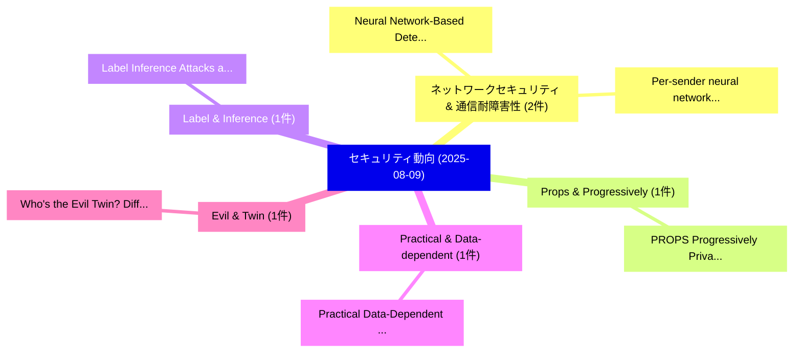

# 📅 02_daily: 日次エグゼクティブサマリー報告書 (2025-08-09)

**集計日時**: 2026-10-02 23:05:35 UTC  
**対象日付**: 2025-08-09  
**本日収集論文数**: 13 件  

---

## 💡 主要セキュリティ動向・脅威インサイト (Executive Insights)

本日の収集論文（計 13 件）において、以下の重点セキュリティ領域で活発な研究動向が確認されました：
- **ネットワークセキュリティ & 通信耐障害性** (2 件): 注目論文として 「Neural Network-Based Detection...」、「Per-sender neural network clas...」 等が発表され、実務防御および攻撃検証の進展が見られます。
- **Props & Progressively** (1 件): 注目論文として 「PROPS: Progressively Private S...」 等が発表され、実務防御および攻撃検証の進展が見られます。
- **Label & Inference** (1 件): 注目論文として 「Label Inference Attacks agains...」 等が発表され、実務防御および攻撃検証の進展が見られます。
- **Practical & Data-dependent** (1 件): 注目論文として 「Practical Data-Dependent Memor...」 等が発表され、実務防御および攻撃検証の進展が見られます。
- **Evil & Twin** (1 件): 注目論文として 「Who's the Evil Twin? Different...」 等が発表され、実務防御および攻撃検証の進展が見られます。

### 🗺️ 技術・脅威トピックマインドマップ

---

## 📌 日次セキュリティ論文一覧 (日本語表形式)

| No | arXiv ID | 論文タイトル (日本語訳) | 重要キーワード | 構造化エグゼクティブ要約 (背景・提案・影響) | 脅威分類 | 詳細リンク |
|---|---|---|---|---|---|---|
| 1 | `2508.06783v2` | [PROPS: Progressively Private Self-alignment of 大規模言語モデル](../../okf/papers/2025-08-09/2508.06783.md) | `Progressively Private Self`, `Large Language Models`, `Amrit Singh Bedi` | 【提案】概要 (Overview & Key Finding) 本論文「PROPS: Progressively Private Self-alignment of 大規模言語モデル...。実証評価により経営層・セキュリティ管理者向け推奨アクション (E... | `cs.CR` | [arXiv](https://arxiv.org/abs/2508.06783v2) &#124; [OKF](../../okf/papers/2025-08-09/2508.06783.md) |
| 2 | `2508.06789v1` | [Label Inference Attacks against Federated Unlearning（セキュリティ分析論文）](../../okf/papers/2025-08-09/2508.06789.md) | `Label Inference Attacks`, `Federated Unlearning`, `Wei Wang` | 【提案】概要 (Overview & Key Finding) 本論文「Label Inference Attacks against Federated Unlearning（セキ...。実証評価により経営層・セキュリティ管理者向け推奨アクション (E... | `cs.CR` | [arXiv](https://arxiv.org/abs/2508.06789v1) &#124; [OKF](../../okf/papers/2025-08-09/2508.06789.md) |
| 3 | `2508.06795v1` | [Practical Data-Dependent Memory-Hard Functions with Optimal Sustained Space Trade-offs in the Parallel Random Oracle Modelに向けて](../../okf/papers/2025-08-09/2508.06795.md) | `Optimal Sustained Space Trade`, `Dependent Memory`, `Data-Dependent Memory` | 【提案】概要 (Overview & Key Finding) 本論文「Practical Data-Dependent Memory-Hard Functions with Opt...。実証評価により経営層・セキュリティ管理者向け推奨アクション (E... | `cs.CR` | [arXiv](https://arxiv.org/abs/2508.06795v1) &#124; [OKF](../../okf/papers/2025-08-09/2508.06795.md) |
| 4 | `2508.06827v2` | [Who's the Evil Twin? Differential Auditing for Undesired Behavior（セキュリティ分析論文）](../../okf/papers/2025-08-09/2508.06827.md) | `Evil Twin`, `Differential Auditing`, `Undesired Behavior` | 【提案】Differential Auditing for Undesired Behavior ### (日本語題名: Who's the Evil Twin?。実証評価により経営層・セキュリティ管理者向け推奨アクション (Executive Reco... | `cs.CR` | [arXiv](https://arxiv.org/abs/2508.06827v2) &#124; [OKF](../../okf/papers/2025-08-09/2508.06827.md) |
| 5 | `2508.06837v2` | [Effective Prompt Stealing Attack against Text-to-Image Diffusion Modelsに向けて](../../okf/papers/2025-08-09/2508.06837.md) | `Towards Effective Prompt Stealing Attack`, `Effective Prompt Stealing Attack`, `Image Diffusion` | 【提案】概要 (Overview & Key Finding) 本論文「Effective Prompt Stealing Attack against Text-to-Image ...。実証評価により経営層・セキュリティ管理者向け推奨アクション (E... | `cs.CR` | [arXiv](https://arxiv.org/abs/2508.06837v2) &#124; [OKF](../../okf/papers/2025-08-09/2508.06837.md) |
| 6 | `2508.06972v3` | [DSperse: A Framework for Targeted Verification in Zero-Knowledge Machine Learning（セキュリティ分析論文）](../../okf/papers/2025-08-09/2508.06972.md) | `Knowledge Machine Learning`, `Targeted Verification`, `Zero-Knowledge Machine` | 【提案】概要 (Overview & Key Finding) 本論文「DSperse: A Framework for Targeted Verification in Zero-...。実証評価により経営層・セキュリティ管理者向け推奨アクション (E... | `cs.CR` | [arXiv](https://arxiv.org/abs/2508.06972v3) &#124; [OKF](../../okf/papers/2025-08-09/2508.06972.md) |
| 7 | `2508.07044v2` | [Balancing Privacy and Efficiency: Music Information Retrieval via Additive Homomorphic Encryption（セキュリティ分析論文）](../../okf/papers/2025-08-09/2508.07044.md) | `Music Information Retrieval`, `Additive Homomorphic Encryption`, `Balancing Privacy` | 【提案】概要 (Overview & Key Finding) 本論文「Balancing Privacy and Efficiency: Music Information Ret...。実証評価により経営層・セキュリティ管理者向け推奨アクション (E... | `cs.CR` | [arXiv](https://arxiv.org/abs/2508.07044v2) &#124; [OKF](../../okf/papers/2025-08-09/2508.07044.md) |
| 8 | `2508.07053v1` | [SPARE: Progressive Web Applications Against Unauthorized Replicationsのセキュリティ強化](../../okf/papers/2025-08-09/2508.07053.md) | `Nur Imtiazul Haque`, `Khandakar Ashrafi Akbar`, `Sajib Talukder` | 【提案】概要 (Overview & Key Finding) 本論文「SPARE: Progressive Web Applications Against Unauthorize...。実証評価により経営層・セキュリティ管理者向け推奨アクション (E... | `cs.CR` | [arXiv](https://arxiv.org/abs/2508.07053v1) &#124; [OKF](../../okf/papers/2025-08-09/2508.07053.md) |
| 9 | `2508.07094v2` | [ScamDetect: a Robust, Agnostic Framework to Uncover Threats in Smart Contractsに向けて](../../okf/papers/2025-08-09/2508.07094.md) | `Uncover Threats`, `Smart Contracts`, `Pasquale De Rosa` | 【提案】概要 (Overview & Key Finding) 本論文「ScamDetect: a Robust, Agnostic Framework to Uncover Thr...。実証評価により経営層・セキュリティ管理者向け推奨アクション (E... | `cs.CR` | [arXiv](https://arxiv.org/abs/2508.07094v2) &#124; [OKF](../../okf/papers/2025-08-09/2508.07094.md) |
| 10 | `2508.10031v2` | [Context Misleads LLMs: The Role of Context Filtering in Maintaining Safe Alignment of LLMs（セキュリティ分析論文）](../../okf/papers/2025-08-09/2508.10031.md) | `Maintaining Safe Alignment`, `Context Misleads`, `Context Filtering` | 【提案】概要 (Overview & Key Finding) 本論文「Context Misleads LLMs: The Role of Context Filtering in...。実証評価により経営層・セキュリティ管理者向け推奨アクション (E... | `cs.CR` | [arXiv](https://arxiv.org/abs/2508.10031v2) &#124; [OKF](../../okf/papers/2025-08-09/2508.10031.md) |
| 11 | `2508.10033v1` | [Cognitive サイバーセキュリティ for Artificial Intelligence: Guardrail Engineering with CCS-7](../../okf/papers/2025-08-09/2508.10033.md) | `Artificial Intelligence`, `Guardrail Engineering`, `Cognitive Cybersecurity` | 【提案】概要 (Overview & Key Finding) 本論文「Cognitive サイバーセキュリティ for Artificial Intelligence: Guard...。実証評価により経営層・セキュリティ管理者向け推奨アクション (E... | `cs.CR` | [arXiv](https://arxiv.org/abs/2508.10033v1) &#124; [OKF](../../okf/papers/2025-08-09/2508.10033.md) |
| 12 | `2508.10035v1` | [Neural Network-Based Detection and Multi-Class Classification of FDI Attacks in Smart Grid Home Energy Systems（セキュリティ分析論文）](../../okf/papers/2025-08-09/2508.10035.md) | `Smart Grid Home Energy Systems`, `Neural Network`, `Based Detection` | 【提案】概要 (Overview & Key Finding) 本論文「Neural Network-Based Detection and Multi-Class Classifi...。実証評価により経営層・セキュリティ管理者向け推奨アクション (E... | `cs.CR` | [arXiv](https://arxiv.org/abs/2508.10035v1) &#124; [OKF](../../okf/papers/2025-08-09/2508.10035.md) |
| 13 | `2509.00005v2` | [Per-sender neural network classifiers for email authorship validation（セキュリティ分析論文）](../../okf/papers/2025-08-09/2509.00005.md) | `Per-sender neural`, `Rohit Dube`, `Raw Meta` | 【提案】概要 (Overview & Key Finding) 本論文「Per-sender neural network classifiers for email authors...。実証評価により経営層・セキュリティ管理者向け推奨アクション (E... | `cs.CR` | [arXiv](https://arxiv.org/abs/2509.00005v2) &#124; [OKF](../../okf/papers/2025-08-09/2509.00005.md) |

