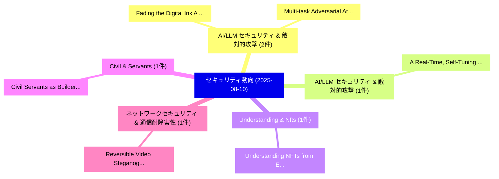

# 📅 02_daily: 日次エグゼクティブサマリー報告書 (2025-08-10)

**集計日時**: 2026-10-02 23:05:35 UTC  
**対象日付**: 2025-08-10  
**本日収集論文数**: 9 件  

---

## 💡 主要セキュリティ動向・脅威インサイト (Executive Insights)

本日の収集論文（計 9 件）において、以下の重点セキュリティ領域で活発な研究動向が確認されました：
- **AI/LLM セキュリティ & 敵対的攻撃** (2 件): 注目論文として 「Fading the Digital Ink: A Univ...」、「Multi-task Adversarial Attacks...」 等が発表され、実務防御および攻撃検証の進展が見られます。
- **AI/LLM セキュリティ & 敵対的攻撃** (1 件): 注目論文として 「A Real-Time, Self-Tuning Moder...」 等が発表され、実務防御および攻撃検証の進展が見られます。
- **Understanding & Nfts** (1 件): 注目論文として 「Understanding NFTs from EIP St...」 等が発表され、実務防御および攻撃検証の進展が見られます。
- **Civil & Servants** (1 件): 注目論文として 「Civil Servants as Builders: En...」 等が発表され、実務防御および攻撃検証の進展が見られます。
- **ネットワークセキュリティ & 通信耐障害性** (1 件): 注目論文として 「Reversible Video Steganography...」 等が発表され、実務防御および攻撃検証の進展が見られます。

### 🗺️ 技術・脅威トピックマインドマップ

---

## 📌 日次セキュリティ論文一覧 (日本語表形式)

| No | arXiv ID | 論文タイトル (日本語訳) | 重要キーワード | 構造化エグゼクティブ要約 (背景・提案・影響) | 脅威分類 | 詳細リンク |
|---|---|---|---|---|---|---|
| 1 | `2508.07139v1` | [A Real-Time, Self-Tuning Moderator Framework for Adversarial Prompt Detection（セキュリティ分析論文）](../../okf/papers/2025-08-10/2508.07139.md) | `Adversarial Prompt Detection`, `Self-Tuning Moderator`, `Ivan Zhang` | 【提案】概要 (Overview & Key Finding) 本論文「A Real-Time, Self-Tuning Moderator Framework for Advers...。実証評価により経営層・セキュリティ管理者向け推奨アクション (E... | `cs.CR` | [arXiv](https://arxiv.org/abs/2508.07139v1) &#124; [OKF](../../okf/papers/2025-08-10/2508.07139.md) |
| 2 | `2508.07190v1` | [Understanding NFTs from EIP Standards（セキュリティ分析論文）](../../okf/papers/2025-08-10/2508.07190.md) | `Minfeng Qi`, `Qin Wang`, `Guangsheng Yu` | 【提案】概要 (Overview & Key Finding) 本論文「Understanding NFTs from EIP Standards（セキュリティ分析論文）」（原題: ...。実証評価により経営層・セキュリティ管理者向け推奨アクション (E... | `cs.CR` | [arXiv](https://arxiv.org/abs/2508.07190v1) &#124; [OKF](../../okf/papers/2025-08-10/2508.07190.md) |
| 3 | `2508.07203v1` | [Civil Servants as Builders: Enabling Non-IT Staff to Develop Secure Python and R Tools（セキュリティ分析論文）](../../okf/papers/2025-08-10/2508.07203.md) | `Develop Secure Python`, `Civil Servants`, `Enabling Non` | 【提案】概要 (Overview & Key Finding) 本論文「Civil Servants as Builders: Enabling Non-IT Staff to De...。実証評価により経営層・セキュリティ管理者向け推奨アクション (E... | `cs.CR` | [arXiv](https://arxiv.org/abs/2508.07203v1) &#124; [OKF](../../okf/papers/2025-08-10/2508.07203.md) |
| 4 | `2508.07263v1` | [Fading the Digital Ink: A Universal Black-Box Attack Framework for 3DGS Watermarking Systems（セキュリティ分析論文）](../../okf/papers/2025-08-10/2508.07263.md) | `Digital Ink`, `Universal Black`, `Watermarking Systems` | 【提案】概要 (Overview & Key Finding) 本論文「Fading the Digital Ink: A Universal Black-Box Attack Fr...。実証評価により経営層・セキュリティ管理者向け推奨アクション (E... | `cs.CR` | [arXiv](https://arxiv.org/abs/2508.07263v1) &#124; [OKF](../../okf/papers/2025-08-10/2508.07263.md) |
| 5 | `2508.07289v1` | [Reversible Video Steganography Using Quick Response Codes and Modified ElGamal Cryptosystem（セキュリティ分析論文）](../../okf/papers/2025-08-10/2508.07289.md) | `Reversible Video Steganography Using Quick Response Codes`, `Raw Meta`, `Executive Summary` | 【提案】概要 (Overview & Key Finding) 本論文「Reversible Video Steganography Using Quick Response Cod...。実証評価により経営層・セキュリティ管理者向け推奨アクション (E... | `cs.CR` | [arXiv](https://arxiv.org/abs/2508.07289v1) &#124; [OKF](../../okf/papers/2025-08-10/2508.07289.md) |
| 6 | `2508.07505v1` | [Enhancing Privacy in Decentralized Min-Max Optimization: A Differentially Private Approach（セキュリティ分析論文）](../../okf/papers/2025-08-10/2508.07505.md) | `Enhancing Privacy`, `Decentralized Min`, `Max Optimization` | 【提案】概要 (Overview & Key Finding) 本論文「Enhancing Privacy in Decentralized Min-Max Optimization...。実証評価により経営層・セキュリティ管理者向け推奨アクション (E... | `cs.CR` | [arXiv](https://arxiv.org/abs/2508.07505v1) &#124; [OKF](../../okf/papers/2025-08-10/2508.07505.md) |
| 7 | `2508.07510v1` | [SRAM-based Physically Unclonable Function using Lightweight Hamming-Code Fuzzy Extractor for Energy Harvesting Beat Sensors（セキュリティ分析論文）](../../okf/papers/2025-08-10/2508.07510.md) | `Energy Harvesting Beat Sensors`, `Physically Unclonable Function`, `Code Fuzzy Extractor` | 【提案】概要 (Overview & Key Finding) 本論文「SRAM-based Physically Unclonable Function using Lightwe...。実証評価により経営層・セキュリティ管理者向け推奨アクション (E... | `cs.CR` | [arXiv](https://arxiv.org/abs/2508.07510v1) &#124; [OKF](../../okf/papers/2025-08-10/2508.07510.md) |
| 8 | `2508.10038v1` | [Certifiably robust malware detectors by design（セキュリティ分析論文）](../../okf/papers/2025-08-10/2508.10038.md) | `Francois Gimenez`, `Sarath Sivaprasad`, `Mario Fritz` | 【提案】概要 (Overview & Key Finding) 本論文「Certifiably robust マルウェア detectors by design（セキュリティ分析論文...。実証評価により経営層・セキュリティ管理者向け推奨アクション (E... | `cs.CR` | [arXiv](https://arxiv.org/abs/2508.10038v1) &#124; [OKF](../../okf/papers/2025-08-10/2508.10038.md) |
| 9 | `2508.10039v1` | [Multi-task Adversarial Attacks against Black-box Model with Few-shot Queries（セキュリティ分析論文）](../../okf/papers/2025-08-10/2508.10039.md) | `Adversarial Attacks`, `Multi-task Adversarial`, `Black-box Model` | 【提案】概要 (Overview & Key Finding) 本論文「Multi-task 敵対的攻撃s against Black-box Model with Few-shot...。実証評価により経営層・セキュリティ管理者向け推奨アクション (E... | `cs.CR` | [arXiv](https://arxiv.org/abs/2508.10039v1) &#124; [OKF](../../okf/papers/2025-08-10/2508.10039.md) |

