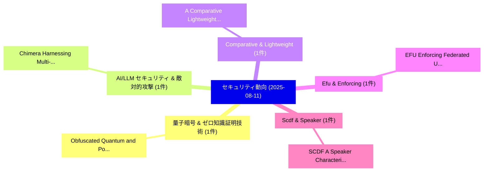

# 📅 02_daily: 日次エグゼクティブサマリー報告書 (2025-08-11)

**集計日時**: 2026-10-02 23:05:35 UTC  
**対象日付**: 2025-08-11  
**本日収集論文数**: 15 件  

---

## 💡 主要セキュリティ動向・脅威インサイト (Executive Insights)

本日の収集論文（計 15 件）において、以下の重点セキュリティ領域で活発な研究動向が確認されました：
- **量子暗号 & ゼロ知識証明技術** (1 件): 注目論文として 「Obfuscated Quantum and Post-Qu...」 等が発表され、実務防御および攻撃検証の進展が見られます。
- **AI/LLM セキュリティ & 敵対的攻撃** (1 件): 注目論文として 「Chimera: Harnessing Multi-Agen...」 等が発表され、実務防御および攻撃検証の進展が見られます。
- **Comparative & Lightweight** (1 件): 注目論文として 「A Comparative Lightweight Hash...」 等が発表され、実務防御および攻撃検証の進展が見られます。
- **Efu & Enforcing** (1 件): 注目論文として 「EFU: Enforcing Federated Unlea...」 等が発表され、実務防御および攻撃検証の進展が見られます。
- **Scdf & Speaker** (1 件): 注目論文として 「SCDF: A Speaker Characteristic...」 等が発表され、実務防御および攻撃検証の進展が見られます。

### 🗺️ 技術・脅威トピックマインドマップ

---

## 📌 日次セキュリティ論文一覧 (日本語表形式)

| No | arXiv ID | 論文タイトル (日本語訳) | 重要キーワード | 構造化エグゼクティブ要約 (背景・提案・影響) | 脅威分類 | 詳細リンク |
|---|---|---|---|---|---|---|
| 1 | `2508.07635v2` | [Obfuscated Quantum and Post-Quantum Cryptography（セキュリティ分析論文）](../../okf/papers/2025-08-11/2508.07635.md) | `Obfuscated Quantum`, `Quantum Cryptography`, `Post-Quantum Cryptography` | 【提案】概要 (Overview & Key Finding) 本論文「Obfuscated 量子 and ポスト量子暗号（セキュリティ分析論文）」（原題: Obfuscated 量...。実証評価により経営層・セキュリティ管理者向け推奨アクション (E... | `cs.CR` | [arXiv](https://arxiv.org/abs/2508.07635v2) &#124; [OKF](../../okf/papers/2025-08-11/2508.07635.md) |
| 2 | `2508.07745v4` | [Chimera: Harnessing Multi-Agent LLMs for Automatic Insider Threat Simulation（セキュリティ分析論文）](../../okf/papers/2025-08-11/2508.07745.md) | `Automatic Insider Threat Simulation`, `Harnessing Multi`, `Multi-Agent LLMs` | 【提案】概要 (Overview & Key Finding) 本論文「Chimera: Harnessing Multi-Agent LLMs for Automatic Insi...。実証評価により経営層・セキュリティ管理者向け推奨アクション (E... | `cs.CR` | [arXiv](https://arxiv.org/abs/2508.07745v4) &#124; [OKF](../../okf/papers/2025-08-11/2508.07745.md) |
| 3 | `2508.07840v1` | [A Comparative Lightweight Hash Functions Using AVR ATXMega128 and ChipWhispererの分析](../../okf/papers/2025-08-11/2508.07840.md) | `Comparative Lightweight Hash Functions Using`, `Lightweight Hash Functions Using`, `Mohsin Khan` | 【提案】概要 (Overview & Key Finding) 本論文「A Comparative Lightweight Hash Functions Using AVR ATXM...。実証評価により経営層・セキュリティ管理者向け推奨アクション (E... | `cs.CR` | [arXiv](https://arxiv.org/abs/2508.07840v1) &#124; [OKF](../../okf/papers/2025-08-11/2508.07840.md) |
| 4 | `2508.07873v1` | [EFU: Enforcing Federated Unlearning via Functional Encryption（セキュリティ分析論文）](../../okf/papers/2025-08-11/2508.07873.md) | `Enforcing Federated Unlearning`, `Functional Encryption`, `Samaneh Mohammadi` | 【提案】概要 (Overview & Key Finding) 本論文「EFU: Enforcing Federated Unlearning via Functional Encr...。実証評価により経営層・セキュリティ管理者向け推奨アクション (E... | `cs.CR` | [arXiv](https://arxiv.org/abs/2508.07873v1) &#124; [OKF](../../okf/papers/2025-08-11/2508.07873.md) |
| 5 | `2508.07944v1` | [SCDF: A Speaker Characteristics DeepFake Speech Dataset for Bias Analysis（セキュリティ分析論文）](../../okf/papers/2025-08-11/2508.07944.md) | `Speaker Characteristics`, `Speech Dataset`, `Karel Srna` | 【提案】概要 (Overview & Key Finding) 本論文「SCDF: A Speaker Characteristics DeepFake Speech Dataset...。実証評価により経営層・セキュリティ管理者向け推奨アクション (E... | `cs.CR` | [arXiv](https://arxiv.org/abs/2508.07944v1) &#124; [OKF](../../okf/papers/2025-08-11/2508.07944.md) |
| 6 | `2508.08029v1` | [Robust Anomaly Detection in O-RAN: Leveraging LLMs against Data Manipulation Attacks（セキュリティ分析論文）](../../okf/papers/2025-08-11/2508.08029.md) | `Robust Anomaly Detection`, `Data Manipulation Attacks`, `Ngoc Duy Pham` | 【提案】概要 (Overview & Key Finding) 本論文「Robust Anomaly Detection in O-RAN: Leveraging LLMs agai...。実証評価により経営層・セキュリティ管理者向け推奨アクション (E... | `cs.CR` | [arXiv](https://arxiv.org/abs/2508.08029v1) &#124; [OKF](../../okf/papers/2025-08-11/2508.08029.md) |
| 7 | `2508.08031v1` | [IPBA: Imperceptible Perturbation Backdoor Attack in Federated Self-Supervised Learning（セキュリティ分析論文）](../../okf/papers/2025-08-11/2508.08031.md) | `Imperceptible Perturbation Backdoor Attack`, `Federated Self`, `Supervised Learning` | 【提案】概要 (Overview & Key Finding) 本論文「IPBA: Imperceptible Perturbation Backdoor Attack in Fed...。実証評価により経営層・セキュリティ管理者向け推奨アクション (E... | `cs.CR` | [arXiv](https://arxiv.org/abs/2508.08031v1) &#124; [OKF](../../okf/papers/2025-08-11/2508.08031.md) |
| 8 | `2508.08043v2` | [False Reality: Uncovering Sensor-induced Human-VR Interaction Vulnerability（セキュリティ分析論文）](../../okf/papers/2025-08-11/2508.08043.md) | `False Reality`, `Uncovering Sensor`, `Interaction Vulnerability` | 【提案】概要 (Overview & Key Finding) 本論文「False Reality: Uncovering Sensor-induced Human-VR Inter...。実証評価により経営層・セキュリティ管理者向け推奨アクション (E... | `cs.CR` | [arXiv](https://arxiv.org/abs/2508.08043v2) &#124; [OKF](../../okf/papers/2025-08-11/2508.08043.md) |
| 9 | `2508.08068v1` | [Fully-Fluctuating Participation in Sleepy Consensus（セキュリティ分析論文）](../../okf/papers/2025-08-11/2508.08068.md) | `Fluctuating Participation`, `Sleepy Consensus`, `Fully-Fluctuating Participation` | 【提案】概要 (Overview & Key Finding) 本論文「Fully-Fluctuating Participation in Sleepy Consensus（セキュ...。実証評価により経営層・セキュリティ管理者向け推奨アクション (E... | `cs.CR` | [arXiv](https://arxiv.org/abs/2508.08068v1) &#124; [OKF](../../okf/papers/2025-08-11/2508.08068.md) |
| 10 | `2508.08190v3` | [PRECISE: Private Regulatory Compliance for Cyberattack Detection on Critical Infrastructure Systems（セキュリティ分析論文）](../../okf/papers/2025-08-11/2508.08190.md) | `Private Regulatory Compliance`, `Critical Infrastructure Systems`, `Cyberattack Detection` | 【提案】概要 (Overview & Key Finding) 本論文「PRECISE: Private Regulatory Compliance for Cyberattack ...。実証評価により経営層・セキュリティ管理者向け推奨アクション (E... | `cs.CR` | [arXiv](https://arxiv.org/abs/2508.08190v3) &#124; [OKF](../../okf/papers/2025-08-11/2508.08190.md) |
| 11 | `2508.08438v2` | [Selective KV-Cache Sharing to Mitigate Timing Side-Channels in LLM Inference（セキュリティ分析論文）](../../okf/papers/2025-08-11/2508.08438.md) | `Mitigate Timing Side`, `Cache Sharing`, `KV-Cache Sharing` | 【提案】概要 (Overview & Key Finding) 本論文「Selective KV-Cache Sharing to Mitigate Timing サイドチャネル攻撃...。実証評価により経営層・セキュリティ管理者向け推奨アクション (E... | `cs.CR` | [arXiv](https://arxiv.org/abs/2508.08438v2) &#124; [OKF](../../okf/papers/2025-08-11/2508.08438.md) |
| 12 | `2508.08462v1` | [Designing with Deception: ML- and Covert Gate-Enhanced Camouflaging to Thwart IC Reverse Engineering（セキュリティ分析論文）](../../okf/papers/2025-08-11/2508.08462.md) | `Covert Gate`, `Enhanced Camouflaging`, `Reverse Engineering` | 【提案】概要 (Overview & Key Finding) 本論文「Designing with Deception: ML- and Covert Gate-Enhanced ...。実証評価により経営層・セキュリティ管理者向け推奨アクション (E... | `cs.CR` | [arXiv](https://arxiv.org/abs/2508.08462v1) &#124; [OKF](../../okf/papers/2025-08-11/2508.08462.md) |
| 13 | `2508.09213v1` | [VeriPHY: Physical Layer Signal Authentication for Wireless Communication in 5G Environments（セキュリティ分析論文）](../../okf/papers/2025-08-11/2508.09213.md) | `Physical Layer Signal Authentication`, `Wireless Communication`, `Physical Layer Signal Authe` | 【提案】概要 (Overview & Key Finding) 本論文「VeriPHY: Physical Layer Signal Authentication for Wirel...。実証評価により経営層・セキュリティ管理者向け推奨アクション (E... | `cs.CR` | [arXiv](https://arxiv.org/abs/2508.09213v1) &#124; [OKF](../../okf/papers/2025-08-11/2508.09213.md) |
| 14 | `2508.10041v1` | [Quantum Prime Factorization: A Novel Approach Based on Fermat Method（セキュリティ分析論文）](../../okf/papers/2025-08-11/2508.10041.md) | `Quantum Prime Factorization`, `Julien Mellaerts`, `Raw Meta` | 【提案】概要 (Overview & Key Finding) 本論文「量子 Prime Factorization: A Novel Approach Based on Ferma...。実証評価により経営層・セキュリティ管理者向け推奨アクション (E... | `cs.CR` | [arXiv](https://arxiv.org/abs/2508.10041v1) &#124; [OKF](../../okf/papers/2025-08-11/2508.10041.md) |
| 15 | `2508.10042v1` | [FIDELIS: Blockchain-Enabled Protection Against Poisoning Attacks in 連合学習](../../okf/papers/2025-08-11/2508.10042.md) | `Blockchain-Enabled Protection`, `Federated Learning`, `Jane Carney` | 【提案】概要 (Overview & Key Finding) 本論文「FIDELIS: Blockchain-Enabled Protection Against Poisonin...。実証評価により経営層・セキュリティ管理者向け推奨アクション (E... | `cs.CR` | [arXiv](https://arxiv.org/abs/2508.10042v1) &#124; [OKF](../../okf/papers/2025-08-11/2508.10042.md) |

