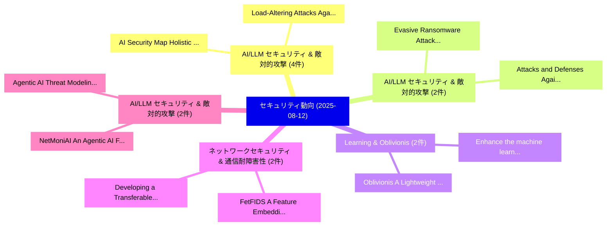

# 📅 02_daily: 日次エグゼクティブサマリー報告書 (2025-08-12)

**集計日時**: 2026-10-02 23:05:36 UTC  
**対象日付**: 2025-08-12  
**本日収集論文数**: 24 件  

---

## 💡 主要セキュリティ動向・脅威インサイト (Executive Insights)

本日の収集論文（計 24 件）において、以下の重点セキュリティ領域で活発な研究動向が確認されました：
- **AI/LLM セキュリティ & 敵対的攻撃** (4 件): 注目論文として 「AI Security Map: Holistic Orga...」、「Load-Altering Attacks Against ...」 等が発表され、実務防御および攻撃検証の進展が見られます。
- **AI/LLM セキュリティ & 敵対的攻撃** (2 件): 注目論文として 「Evasive Ransomware Attacks Usi...」、「Attacks and Defenses Against L...」 等が発表され、実務防御および攻撃検証の進展が見られます。
- **Learning & Oblivionis** (2 件): 注目論文として 「Oblivionis: A Lightweight Lear...」、「Enhance the machine learning a...」 等が発表され、実務防御および攻撃検証の進展が見られます。
- **ネットワークセキュリティ & 通信耐障害性** (2 件): 注目論文として 「FetFIDS: A Feature Embedding A...」、「Developing a Transferable Fede...」 等が発表され、実務防御および攻撃検証の進展が見られます。
- **AI/LLM セキュリティ & 敵対的攻撃** (2 件): 注目論文として 「Agentic AI: Threat Modeling an...」、「NetMoniAI: An Agentic AI Frame...」 等が発表され、実務防御および攻撃検証の進展が見られます。

### 🗺️ 技術・脅威トピックマインドマップ

---

## 📌 日次セキュリティ論文一覧 (日本語表形式)

| No | arXiv ID | 論文タイトル (日本語訳) | 重要キーワード | 構造化エグゼクティブ要約 (背景・提案・影響) | 脅威分類 | 詳細リンク |
|---|---|---|---|---|---|---|
| 1 | `2508.08583v1` | [AI Security Map: Holistic Organization of AI Security Technologies and Impacts on Stakeholders（セキュリティ分析論文）](../../okf/papers/2025-08-12/2508.08583.md) | `Security Map`, `Holistic Organization`, `Security Technologies` | 【提案】概要 (Overview & Key Finding) 本論文「AI Security Map: Holistic Organization of AI Security T...。実証評価により経営層・セキュリティ管理者向け推奨アクション (E... | `cs.CR` | [arXiv](https://arxiv.org/abs/2508.08583v1) &#124; [OKF](../../okf/papers/2025-08-12/2508.08583.md) |
| 2 | `2508.08593v1` | [Generative AI for Critical Infrastructure in Smart Grids: A Unified Framework for Synthetic Data Generation and Anomaly Detection（セキュリティ分析論文）](../../okf/papers/2025-08-12/2508.08593.md) | `Synthetic Data Generation`, `Critical Infrastructure`, `Smart Grids` | 【提案】概要 (Overview & Key Finding) 本論文「Generative AI for Critical Infrastructure in Smart Grid...。実証評価により経営層・セキュリティ管理者向け推奨アクション (E... | `cs.CR` | [arXiv](https://arxiv.org/abs/2508.08593v1) &#124; [OKF](../../okf/papers/2025-08-12/2508.08593.md) |
| 3 | `2508.08655v1` | [Hypervisor-based Double Extortion Ransomware Detection Method Using Kitsune Network Features（セキュリティ分析論文）](../../okf/papers/2025-08-12/2508.08655.md) | `Hypervisor-based Double`, `Manabu Hirano`, `Ryotaro Kobayashi` | 【提案】概要 (Overview & Key Finding) 本論文「Hypervisor-based Double Extortion ランサムウェア Detection Met...。実証評価により経営層・セキュリティ管理者向け推奨アクション (E... | `cs.CR` | [arXiv](https://arxiv.org/abs/2508.08655v1) &#124; [OKF](../../okf/papers/2025-08-12/2508.08655.md) |
| 4 | `2508.08656v1` | [Evasive Ransomware Attacks Using Low-level Behavioral Adversarial Examples（セキュリティ分析論文）](../../okf/papers/2025-08-12/2508.08656.md) | `Evasive Ransomware Attacks Using Low`, `Behavioral Adversarial Examples`, `Low-level Behavioral` | 【提案】概要 (Overview & Key Finding) 本論文「Evasive ランサムウェア Attacks Using Low-level Behavioral Adve...。実証評価により経営層・セキュリティ管理者向け推奨アクション (E... | `cs.CR` | [arXiv](https://arxiv.org/abs/2508.08656v1) &#124; [OKF](../../okf/papers/2025-08-12/2508.08656.md) |
| 5 | `2508.08749v2` | [Approximate DBSCAN under Differential Privacy（セキュリティ分析論文）](../../okf/papers/2025-08-12/2508.08749.md) | `Differential Privacy`, `Yuan Qiu`, `Ke Yi` | 【提案】概要 (Overview & Key Finding) 本論文「Approximate DBSCAN under 差分プライバシー（セキュリティ分析論文）」（原題: Appr...。実証評価により経営層・セキュリティ管理者向け推奨アクション (E... | `cs.CR` | [arXiv](https://arxiv.org/abs/2508.08749v2) &#124; [OKF](../../okf/papers/2025-08-12/2508.08749.md) |
| 6 | `2508.08789v5` | [Never compromise with vulnerabilities: a comprehensive survey on AI governance（セキュリティ分析論文）](../../okf/papers/2025-08-12/2508.08789.md) | `Joey Tianyi Zhou`, `Yuchu Jiang`, `Jian Zhao` | 【提案】背景とセキュリティ上の課題 (Background & Problem) 本研究はサイバー脅威環境におけるセキュリティ構造・脆弱性の検証を目的としています。(主要検出項目: ...。実証評価により経営層・セキュリティ管理者向け推奨アクション (E... | `cs.CR` | [arXiv](https://arxiv.org/abs/2508.08789v5) &#124; [OKF](../../okf/papers/2025-08-12/2508.08789.md) |
| 7 | `2508.08832v1` | [Image selective encryption analysis using mutual information in CNN based embedding space（セキュリティ分析論文）](../../okf/papers/2025-08-12/2508.08832.md) | `Ikram Messadi`, `Giulia Cervia`, `Vincent Itier` | 【提案】概要 (Overview & Key Finding) 本論文「Image selective encryption analysis using mutual inform...。実証評価により経営層・セキュリティ管理者向け推奨アクション (E... | `cs.CR` | [arXiv](https://arxiv.org/abs/2508.08832v1) &#124; [OKF](../../okf/papers/2025-08-12/2508.08832.md) |
| 8 | `2508.08836v1` | [EditMF: Drawing an Invisible Fingerprint for Your 大規模言語モデル](../../okf/papers/2025-08-12/2508.08836.md) | `Invisible Fingerprint`, `Jiaxuan Wu`, `Yinghan Zhou` | 【提案】概要 (Overview & Key Finding) 本論文「EditMF: Drawing an Invisible Fingerprint for Your 大規模言語...。実証評価により経営層・セキュリティ管理者向け推奨アクション (E... | `cs.CR` | [arXiv](https://arxiv.org/abs/2508.08836v1) &#124; [OKF](../../okf/papers/2025-08-12/2508.08836.md) |
| 9 | `2508.08875v2` | [Oblivionis: A Lightweight Learning and Unlearning Framework for Federated 大規模言語モデル](../../okf/papers/2025-08-12/2508.08875.md) | `Lightweight Learning`, `Federated Large Language Models`, `Wei Yang Bryan Lim` | 【提案】概要 (Overview & Key Finding) 本論文「Oblivionis: A Lightweight Learning and Unlearning Frame...。実証評価により経営層・セキュリティ管理者向け推奨アクション (E... | `cs.CR` | [arXiv](https://arxiv.org/abs/2508.08875v2) &#124; [OKF](../../okf/papers/2025-08-12/2508.08875.md) |
| 10 | `2508.08898v1` | [Redactable Blockchains: An Overview（セキュリティ分析論文）](../../okf/papers/2025-08-12/2508.08898.md) | `Redactable Blockchains`, `Federico Calandra`, `Marco Bernardo` | 【提案】概要 (Overview & Key Finding) 本論文「Redactable Blockchains: An Overview（セキュリティ分析論文）」（原題: Re...。実証評価により経営層・セキュリティ管理者向け推奨アクション (E... | `cs.CR` | [arXiv](https://arxiv.org/abs/2508.08898v1) &#124; [OKF](../../okf/papers/2025-08-12/2508.08898.md) |
| 11 | `2508.08945v1` | [Load-Altering Attacks Against Power Grids: A Case Study Using the GB-36 Bus System Open Dataset（セキュリティ分析論文）](../../okf/papers/2025-08-12/2508.08945.md) | `Bus System Open Dataset`, `Load-Altering Attacks`, `GB-36 Bus` | 【提案】概要 (Overview & Key Finding) 本論文「Load-Altering Attacks Against Power Grids: A Case Study...。実証評価により経営層・セキュリティ管理者向け推奨アクション (E... | `cs.CR` | [arXiv](https://arxiv.org/abs/2508.08945v1) &#124; [OKF](../../okf/papers/2025-08-12/2508.08945.md) |
| 12 | `2508.09021v1` | [Attacks and Defenses Against LLM Fingerprinting（セキュリティ分析論文）](../../okf/papers/2025-08-12/2508.09021.md) | `Kevin Kurian`, `Ethan Holland`, `Sean Oesch` | 【提案】概要 (Overview & Key Finding) 本論文「Attacks and Defenses Against LLM Fingerprinting（セキュリティ分...。実証評価により経営層・セキュリティ管理者向け推奨アクション (E... | `cs.CR` | [arXiv](https://arxiv.org/abs/2508.09021v1) &#124; [OKF](../../okf/papers/2025-08-12/2508.09021.md) |
| 13 | `2508.09056v1` | [FetFIDS: A Feature Embedding Attention based Federated Network Intrusion Detection Algorithm（セキュリティ分析論文）](../../okf/papers/2025-08-12/2508.09056.md) | `Federated Network Intrusion Detection Algorithm`, `Feature Embedding Attention`, `Abu Shafin Mohammad Mahdee Jameel` | 【提案】概要 (Overview & Key Finding) 本論文「FetFIDS: A Feature Embedding Attention based Federated ...。実証評価により経営層・セキュリティ管理者向け推奨アクション (E... | `cs.CR` | [arXiv](https://arxiv.org/abs/2508.09056v1) &#124; [OKF](../../okf/papers/2025-08-12/2508.09056.md) |
| 14 | `2508.09060v1` | [Developing a Transferable Federated Network Intrusion Detection System（セキュリティ分析論文）](../../okf/papers/2025-08-12/2508.09060.md) | `Transferable Federated Network Intrusion Detection System`, `Abu Shafin Mohammad Mahdee Jameel`, `Aly El Gamal` | 【提案】概要 (Overview & Key Finding) 本論文「Developing a Transferable Federated Network Intrusion D...。実証評価により経営層・セキュリティ管理者向け推奨アクション (E... | `cs.CR` | [arXiv](https://arxiv.org/abs/2508.09060v1) &#124; [OKF](../../okf/papers/2025-08-12/2508.09060.md) |
| 15 | `2508.09288v2` | [Can AI Keep a Secret? Contextual Integrity Verification: A Provable Security Architecture for LLMs（セキュリティ分析論文）](../../okf/papers/2025-08-12/2508.09288.md) | `Contextual Integrity Verification`, `Provable Security Architecture`, `Aayush Gupta` | 【提案】Contextual Integrity Verification: A Provable Security Architecture for LLMs ### (日本語題名...。実証評価により経営層・セキュリティ管理者向け推奨アクション (E... | `cs.CR` | [arXiv](https://arxiv.org/abs/2508.09288v2) &#124; [OKF](../../okf/papers/2025-08-12/2508.09288.md) |
| 16 | `2508.09299v2` | [Decentralized Weather Forecasting via Distributed Machine Learning and Blockchain-Based Model Validation（セキュリティ分析論文）](../../okf/papers/2025-08-12/2508.09299.md) | `Decentralized Weather Forecasting`, `Distributed Machine Learning`, `Based Model Validation` | 【提案】概要 (Overview & Key Finding) 本論文「Decentralized Weather Forecasting via Distributed Machi...。実証評価により経営層・セキュリティ管理者向け推奨アクション (E... | `cs.CR` | [arXiv](https://arxiv.org/abs/2508.09299v2) &#124; [OKF](../../okf/papers/2025-08-12/2508.09299.md) |
| 17 | `2508.09320v3` | [Exact Verification of Graph Neural Networks with Incremental Constraint Solving（セキュリティ分析論文）](../../okf/papers/2025-08-12/2508.09320.md) | `Graph Neural Networks`, `Incremental Constraint Solving`, `Exact Verification` | 【提案】概要 (Overview & Key Finding) 本論文「Exact Verification of Graph Neural Networks with Increm...。実証評価により経営層・セキュリティ管理者向け推奨アクション (E... | `cs.CR` | [arXiv](https://arxiv.org/abs/2508.09320v3) &#124; [OKF](../../okf/papers/2025-08-12/2508.09320.md) |
| 18 | `2508.09765v1` | [Enhance the machine learning algorithm performance in phishing detection with keyword features（セキュリティ分析論文）](../../okf/papers/2025-08-12/2508.09765.md) | `Zijiang Yang`, `Raw Meta`, `Executive Summary` | 【提案】概要 (Overview & Key Finding) 本論文「Enhance the machine learning algorithm performance in p...。実証評価により経営層・セキュリティ管理者向け推奨アクション (E... | `cs.CR` | [arXiv](https://arxiv.org/abs/2508.09765v1) &#124; [OKF](../../okf/papers/2025-08-12/2508.09765.md) |
| 19 | `2508.10043v1` | [Agentic AI: Threat Modeling and Risk Analysis for Network Monitoring Agentic AI Systemのセキュリティ強化](../../okf/papers/2025-08-12/2508.10043.md) | `Network Monitoring Agentic`, `Threat Modeling`, `Securing Agentic` | 【提案】概要 (Overview & Key Finding) 本論文「Agentic AI: 脅威 Modeling and Risk Analysis for Network M...。実証評価により経営層・セキュリティ管理者向け推奨アクション (E... | `cs.CR` | [arXiv](https://arxiv.org/abs/2508.10043v1) &#124; [OKF](../../okf/papers/2025-08-12/2508.10043.md) |
| 20 | `2508.10044v2` | [大規模言語モデル for Power System Security: A Novel Multi-Modal Approach for Anomaly Detection in Energy Management Systems](../../okf/papers/2025-08-12/2508.10044.md) | `Power System Security`, `Energy Management Systems`, `Anomaly Detection` | 【提案】概要 (Overview & Key Finding) 本論文「大規模言語モデル for Power System Security: A Novel Multi-Modal...。実証評価により経営層・セキュリティ管理者向け推奨アクション (E... | `cs.CR` | [arXiv](https://arxiv.org/abs/2508.10044v2) &#124; [OKF](../../okf/papers/2025-08-12/2508.10044.md) |
| 21 | `2508.10052v1` | [NetMoniAI: An Agentic AI Framework for Network Security & Monitoring（セキュリティ分析論文）](../../okf/papers/2025-08-12/2508.10052.md) | `Network Security`, `Venkata Nikhil Thanikella`, `Nikhil Padmanabh Kottur` | 【提案】概要 (Overview & Key Finding) 本論文「NetMoniAI: An Agentic AI Framework for Network Security...。実証評価により経営層・セキュリティ管理者向け推奨アクション (E... | `cs.CR` | [arXiv](https://arxiv.org/abs/2508.10052v1) &#124; [OKF](../../okf/papers/2025-08-12/2508.10052.md) |
| 22 | `2508.14070v2` | [Special-Character Open-Source Language Modelに対する敵対的攻撃](../../okf/papers/2025-08-12/2508.14070.md) | `Character Adversarial Attacks`, `Source Language Model`, `Character Open` | 【提案】概要 (Overview & Key Finding) 本論文「Special-Character Open-Source Language Modelに対する敵対的攻撃」（...。実証評価により経営層・セキュリティ管理者向け推奨アクション (E... | `cs.CR` | [arXiv](https://arxiv.org/abs/2508.14070v2) &#124; [OKF](../../okf/papers/2025-08-12/2508.14070.md) |
| 23 | `2508.21075v1` | [A Stream Pipeline Framework for Digital Payment Programming based on Smart Contracts（セキュリティ分析論文）](../../okf/papers/2025-08-12/2508.21075.md) | `Digital Payment Programming`, `Smart Contracts`, `Zijia Meng` | 【提案】概要 (Overview & Key Finding) 本論文「A Stream Pipeline Framework for Digital Payment Program...。実証評価により経営層・セキュリティ管理者向け推奨アクション (E... | `cs.CR` | [arXiv](https://arxiv.org/abs/2508.21075v1) &#124; [OKF](../../okf/papers/2025-08-12/2508.21075.md) |
| 24 | `2509.00006v1` | [Case Studies: Effective Approaches for Navigating Cross-Border Cloud Data Transfers Amid U.S. Government Privacy and Safety Concerns（セキュリティ分析論文）](../../okf/papers/2025-08-12/2509.00006.md) | `Border Cloud Data Transfers Amid`, `Case Studies`, `Effective Approaches` | 【提案】Government Privacy and Safety Concerns ### (日本語題名: Case Studies: Effective Approaches f...。実証評価により経営層・セキュリティ管理者向け推奨アクション (E... | `cs.CR` | [arXiv](https://arxiv.org/abs/2509.00006v1) &#124; [OKF](../../okf/papers/2025-08-12/2509.00006.md) |

