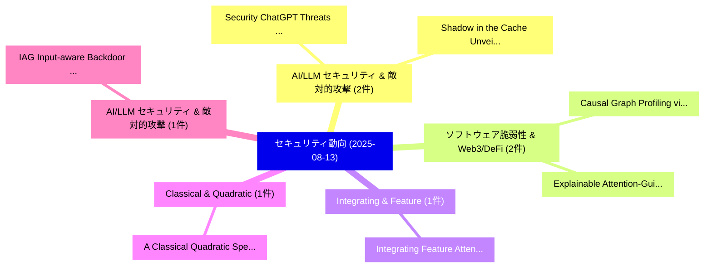

# 📅 02_daily: 日次エグゼクティブサマリー報告書 (2025-08-13)

**集計日時**: 2026-10-02 23:05:36 UTC  
**対象日付**: 2025-08-13  
**本日収集論文数**: 19 件  

---

## 💡 主要セキュリティ動向・脅威インサイト (Executive Insights)

本日の収集論文（計 19 件）において、以下の重点セキュリティ領域で活発な研究動向が確認されました：
- **AI/LLM セキュリティ & 敵対的攻撃** (2 件): 注目論文として 「Security ChatGPT: Threats and ...」、「Shadow in the Cache: Unveiling...」 等が発表され、実務防御および攻撃検証の進展が見られます。
- **ソフトウェア脆弱性 & Web3/DeFi** (2 件): 注目論文として 「Causal Graph Profiling via Str...」、「Explainable Attention-Guided S...」 等が発表され、実務防御および攻撃検証の進展が見られます。
- **Integrating & Feature** (1 件): 注目論文として 「Integrating Feature Attention ...」 等が発表され、実務防御および攻撃検証の進展が見られます。
- **Classical & Quadratic** (1 件): 注目論文として 「A Classical Quadratic Speedup ...」 等が発表され、実務防御および攻撃検証の進展が見られます。
- **AI/LLM セキュリティ & 敵対的攻撃** (1 件): 注目論文として 「IAG: Input-aware Backdoor Atta...」 等が発表され、実務防御および攻撃検証の進展が見られます。

### 🗺️ 技術・脅威トピックマインドマップ

---

## 📌 日次セキュリティ論文一覧 (日本語表形式)

| No | arXiv ID | 論文タイトル (日本語訳) | 重要キーワード | 構造化エグゼクティブ要約 (背景・提案・影響) | 脅威分類 | 詳細リンク |
|---|---|---|---|---|---|---|
| 1 | `2508.09399v2` | [Integrating Feature Attention and Temporal Modeling for Collaborative Financial Risk Assessment（セキュリティ分析論文）](../../okf/papers/2025-08-13/2508.09399.md) | `Collaborative Financial Risk Assessment`, `Integrating Feature Attention`, `Temporal Modeling` | 【提案】概要 (Overview & Key Finding) 本論文「Integrating Feature Attention and Temporal Modeling for...。実証評価により経営層・セキュリティ管理者向け推奨アクション (E... | `cs.CR` | [arXiv](https://arxiv.org/abs/2508.09399v2) &#124; [OKF](../../okf/papers/2025-08-13/2508.09399.md) |
| 2 | `2508.09422v1` | [A Classical Quadratic Speedup for Planted $k$XOR（セキュリティ分析論文）](../../okf/papers/2025-08-13/2508.09422.md) | `Classical Quadratic Speedup`, `Meghal Gupta`, `Raw Meta` | 【提案】概要 (Overview & Key Finding) 本論文「A Classical Quadratic Speedup for Planted $k$XOR（セキュリティ...。実証評価によりSinger - **公開日時**: `2025-... | `cs.CR` | [arXiv](https://arxiv.org/abs/2508.09422v1) &#124; [OKF](../../okf/papers/2025-08-13/2508.09422.md) |
| 3 | `2508.09426v2` | [Security ChatGPT: Threats and Privacy Risksの分析](../../okf/papers/2025-08-13/2508.09426.md) | `Privacy Risks`, `Yushan Xiang`, `Zhongwen Li` | 【提案】概要 (Overview & Key Finding) 本論文「Security ChatGPT: Threats and Privacy Risksの分析」（原題: Sec...。実証評価により経営層・セキュリティ管理者向け推奨アクション (E... | `cs.CR` | [arXiv](https://arxiv.org/abs/2508.09426v2) &#124; [OKF](../../okf/papers/2025-08-13/2508.09426.md) |
| 4 | `2508.09442v4` | [Shadow in the Cache: Unveiling and Mitigating Privacy Risks of KV-cache in LLM Inference（セキュリティ分析論文）](../../okf/papers/2025-08-13/2508.09442.md) | `Mitigating Privacy Risks`, `Zhifan Luo`, `Shuo Shao` | 【提案】概要 (Overview & Key Finding) 本論文「Shadow in the Cache: Unveiling and Mitigating Privacy R...。実証評価により経営層・セキュリティ管理者向け推奨アクション (E... | `cs.CR` | [arXiv](https://arxiv.org/abs/2508.09442v4) &#124; [OKF](../../okf/papers/2025-08-13/2508.09442.md) |
| 5 | `2508.09456v5` | [IAG: Input-aware Backdoor Attack on VLM-based Visual Grounding（セキュリティ分析論文）](../../okf/papers/2025-08-13/2508.09456.md) | `Backdoor Attack`, `Visual Grounding`, `Input-aware Backdoor` | 【提案】概要 (Overview & Key Finding) 本論文「IAG: Input-aware Backdoor Attack on VLM-based Visual Gr...。実証評価により経営層・セキュリティ管理者向け推奨アクション (E... | `cs.CR` | [arXiv](https://arxiv.org/abs/2508.09456v5) &#124; [OKF](../../okf/papers/2025-08-13/2508.09456.md) |
| 6 | `2508.09477v1` | [CLIP-Flow: A Universal Discriminator for AI-Generated Images Inspired by Anomaly Detection（セキュリティ分析論文）](../../okf/papers/2025-08-13/2508.09477.md) | `Generated Images Inspired`, `Universal Discriminator`, `Anomaly Detection` | 【提案】概要 (Overview & Key Finding) 本論文「CLIP-Flow: A Universal Discriminator for AI-Generated I...。実証評価により経営層・セキュリティ管理者向け推奨アクション (E... | `cs.CR` | [arXiv](https://arxiv.org/abs/2508.09477v1) &#124; [OKF](../../okf/papers/2025-08-13/2508.09477.md) |
| 7 | `2508.09504v1` | [Causal Graph Profiling via Structural Divergence for Robust Anomaly Detection in Cyber-Physical Systems（セキュリティ分析論文）](../../okf/papers/2025-08-13/2508.09504.md) | `Causal Graph Profiling`, `Robust Anomaly Detection`, `Structural Divergence` | 【提案】概要 (Overview & Key Finding) 本論文「Causal Graph Profiling via Structural Divergence for Ro...。実証評価により経営層・セキュリティ管理者向け推奨アクション (E... | `cs.CR` | [arXiv](https://arxiv.org/abs/2508.09504v1) &#124; [OKF](../../okf/papers/2025-08-13/2508.09504.md) |
| 8 | `2508.09652v1` | [Demystifying the Role of Rule-based Detection in AI Systems for Windows マルウェア検出](../../okf/papers/2025-08-13/2508.09652.md) | `Rule-based Detection`, `Windows Malware Detection`, `Ivan Tesfai Ogbu` | 【提案】概要 (Overview & Key Finding) 本論文「Demystifying the Role of Rule-based Detection in AI Sys...。実証評価により経営層・セキュリティ管理者向け推奨アクション (E... | `cs.CR` | [arXiv](https://arxiv.org/abs/2508.09652v1) &#124; [OKF](../../okf/papers/2025-08-13/2508.09652.md) |
| 9 | `2508.09665v1` | [Social-Sensor Identity Cloning Detection Using Weakly Supervised Deep Forest and Cryptographic Authentication（セキュリティ分析論文）](../../okf/papers/2025-08-13/2508.09665.md) | `Sensor Identity Cloning Detection Using Weakly Supervised Deep Forest`, `Social-Sensor Identity`, `Cryptographic Authentication` | 【提案】概要 (Overview & Key Finding) 本論文「Social-Sensor Identity Cloning Detection Using Weakly S...。実証評価により経営層・セキュリティ管理者向け推奨アクション (E... | `cs.CR` | [arXiv](https://arxiv.org/abs/2508.09665v1) &#124; [OKF](../../okf/papers/2025-08-13/2508.09665.md) |
| 10 | `2508.09673v2` | [Succinct Oblivious Tensor Evaluation and Applications: Adaptively-Secure Laconic Function Evaluation and Trapdoor Hashing for All Circuits（セキュリティ分析論文）](../../okf/papers/2025-08-13/2508.09673.md) | `Trapdoor Hashing`, `Adaptively-Secure Laconic`, `Damiano Abram` | 【提案】概要 (Overview & Key Finding) 本論文「Succinct Oblivious Tensor Evaluation and Applications: ...。実証評価により経営層・セキュリティ管理者向け推奨アクション (E... | `cs.CR` | [arXiv](https://arxiv.org/abs/2508.09673v2) &#124; [OKF](../../okf/papers/2025-08-13/2508.09673.md) |
| 11 | `2508.09735v2` | [Route Planning and Online Routing for Quantum Key Distribution Networks（セキュリティ分析論文）](../../okf/papers/2025-08-13/2508.09735.md) | `Quantum Key Distribution Networks`, `Route Planning`, `Online Routing` | 【提案】概要 (Overview & Key Finding) 本論文「Route Planning and Online Routing for 量子鍵配送 Networks（セキ...。実証評価により経営層・セキュリティ管理者向け推奨アクション (E... | `cs.CR` | [arXiv](https://arxiv.org/abs/2508.09735v2) &#124; [OKF](../../okf/papers/2025-08-13/2508.09735.md) |
| 12 | `2508.09783v1` | [Perfect message authentication codes are robust to small deviations from uniform key distributions（セキュリティ分析論文）](../../okf/papers/2025-08-13/2508.09783.md) | `Boris Ryabko`, `Raw Meta`, `Executive Summary` | 【提案】概要 (Overview & Key Finding) 本論文「Perfect message authentication codes are robust to smal...。実証評価により経営層・セキュリティ管理者向け推奨アクション (E... | `cs.CR` | [arXiv](https://arxiv.org/abs/2508.09783v1) &#124; [OKF](../../okf/papers/2025-08-13/2508.09783.md) |
| 13 | `2508.09801v3` | [Explainable Attention-Guided Stacked Graph Neural Networks for マルウェア検出](../../okf/papers/2025-08-13/2508.09801.md) | `Guided Stacked Graph Neural Networks`, `Explainable Attention`, `Attention-Guided Stacked` | 【提案】概要 (Overview & Key Finding) 本論文「Explainable Attention-Guided Stacked Graph Neural Netwo...。実証評価により経営層・セキュリティ管理者向け推奨アクション (E... | `cs.CR` | [arXiv](https://arxiv.org/abs/2508.09801v3) &#124; [OKF](../../okf/papers/2025-08-13/2508.09801.md) |
| 14 | `2508.09815v1` | [Extending the OWASP Multi-Agentic System Threat Modeling Guide: Insights from Multi-Agent Security Research（セキュリティ分析論文）](../../okf/papers/2025-08-13/2508.09815.md) | `Agentic System Threat Modeling Guide`, `Agent Security Research`, `Multi-Agentic System` | 【提案】概要 (Overview & Key Finding) 本論文「Extending the OWASP Multi-Agentic System 脅威 Modeling Gu...。実証評価により経営層・セキュリティ管理者向け推奨アクション (E... | `cs.CR` | [arXiv](https://arxiv.org/abs/2508.09815v1) &#124; [OKF](../../okf/papers/2025-08-13/2508.09815.md) |
| 15 | `2508.09980v1` | [On the Consistency and Performance of the Iterative Bayesian Update（セキュリティ分析論文）](../../okf/papers/2025-08-13/2508.09980.md) | `Iterative Bayesian Update`, `Catuscia Palamidessi`, `Raw Meta` | 【提案】概要 (Overview & Key Finding) 本論文「On the Consistency and Performance of the Iterative Bay...。実証評価により経営層・セキュリティ管理者向け推奨アクション (E... | `cs.CR` | [arXiv](https://arxiv.org/abs/2508.09980v1) &#124; [OKF](../../okf/papers/2025-08-13/2508.09980.md) |
| 16 | `2508.10065v1` | [Invisible Watermarks, Visible Gains: Steering Machine Unlearning with Bi-Level Watermarking Design（セキュリティ分析論文）](../../okf/papers/2025-08-13/2508.10065.md) | `Steering Machine Unlearning`, `Level Watermarking Design`, `Invisible Watermarks` | 【提案】概要 (Overview & Key Finding) 本論文「Invisible Watermarks, Visible Gains: Steering Machine U...。実証評価により経営層・セキュリティ管理者向け推奨アクション (E... | `cs.CR` | [arXiv](https://arxiv.org/abs/2508.10065v1) &#124; [OKF](../../okf/papers/2025-08-13/2508.10065.md) |
| 17 | `2508.10185v1` | [An Architecture for Distributed Digital Identities in the Physical World（セキュリティ分析論文）](../../okf/papers/2025-08-13/2508.10185.md) | `Distributed Digital Identities`, `Physical World`, `Michael Roland` | 【提案】概要 (Overview & Key Finding) 本論文「An Architecture for Distributed Digital Identities in t...。実証評価により経営層・セキュリティ管理者向け推奨アクション (E... | `cs.CR` | [arXiv](https://arxiv.org/abs/2508.10185v1) &#124; [OKF](../../okf/papers/2025-08-13/2508.10185.md) |
| 18 | `2508.10187v1` | [Incorporating Taxonomies of Cyber Incidents Into Detection Networks for Improved Detection Performance（セキュリティ分析論文）](../../okf/papers/2025-08-13/2508.10187.md) | `Improved Detection Performance`, `Incorporating Taxonomies`, `Ryan Warnick` | 【提案】概要 (Overview & Key Finding) 本論文「Incorporating Taxonomies of Cyber Incidents Into Detect...。実証評価により経営層・セキュリティ管理者向け推奨アクション (E... | `cs.CR` | [arXiv](https://arxiv.org/abs/2508.10187v1) &#124; [OKF](../../okf/papers/2025-08-13/2508.10187.md) |
| 19 | `2508.10212v1` | [Detecting Untargeted Attacks and Mitigating Unreliable Updates in 連合学習 for Underground Mining Operations](../../okf/papers/2025-08-13/2508.10212.md) | `Detecting Untargeted Attacks`, `Mitigating Unreliable Updates`, `Underground Mining Operations` | 【提案】概要 (Overview & Key Finding) 本論文「Detecting Untargeted Attacks and Mitigating Unreliable ...。実証評価により経営層・セキュリティ管理者向け推奨アクション (E... | `cs.CR` | [arXiv](https://arxiv.org/abs/2508.10212v1) &#124; [OKF](../../okf/papers/2025-08-13/2508.10212.md) |

