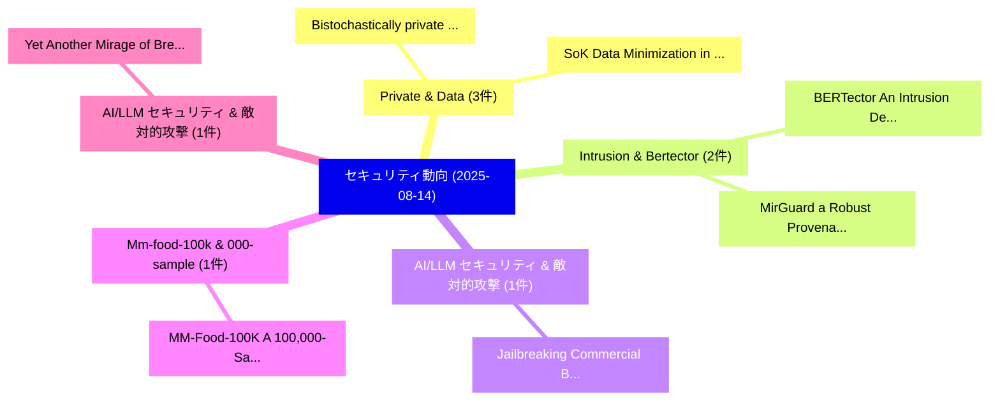

# 📅 02_daily: 日次エグゼクティブサマリー報告書 (2025-08-14)

**集計日時**: 2026-10-02 23:05:36 UTC  
**対象日付**: 2025-08-14  
**本日収集論文数**: 24 件  

---

## 💡 主要セキュリティ動向・脅威インサイト (Executive Insights)

本日の収集論文（計 24 件）において、以下の重点セキュリティ領域で活発な研究動向が確認されました：
- **Private & Data** (3 件): 注目論文として 「Bistochastically private relea...」、「SoK: Data Minimization in Mach...」 等が発表され、実務防御および攻撃検証の進展が見られます。
- **Intrusion & Bertector** (2 件): 注目論文として 「BERTector: An Intrusion Detect...」、「MirGuard: a Robust Provenance-...」 等が発表され、実務防御および攻撃検証の進展が見られます。
- **AI/LLM セキュリティ & 敵対的攻撃** (1 件): 注目論文として 「Jailbreaking Commercial Black-...」 等が発表され、実務防御および攻撃検証の進展が見られます。
- **Mm-food-100k & 000-sample** (1 件): 注目論文として 「MM-Food-100K: A 100,000-Sample...」 等が発表され、実務防御および攻撃検証の進展が見られます。
- **AI/LLM セキュリティ & 敵対的攻撃** (1 件): 注目論文として 「Yet Another Mirage of Breaking...」 等が発表され、実務防御および攻撃検証の進展が見られます。

### 🗺️ 技術・脅威トピックマインドマップ

---

## 📌 日次セキュリティ論文一覧 (日本語表形式)

| No | arXiv ID | 論文タイトル (日本語訳) | 重要キーワード | 構造化エグゼクティブ要約 (背景・提案・影響) | 脅威分類 | 詳細リンク |
|---|---|---|---|---|---|---|
| 1 | `2508.10327v2` | [BERTector: An Intrusion Detection Framework Constructed via Joint-dataset Learning Based on Language Model（セキュリティ分析論文）](../../okf/papers/2025-08-14/2508.10327.md) | `Learning Based`, `Language Model`, `Joint-dataset Learning` | 【提案】概要 (Overview & Key Finding) 本論文「BERTector: An Intrusion Detection Framework Constructed...。実証評価により経営層・セキュリティ管理者向け推奨アクション (E... | `cs.CR` | [arXiv](https://arxiv.org/abs/2508.10327v2) &#124; [OKF](../../okf/papers/2025-08-14/2508.10327.md) |
| 2 | `2508.10390v3` | [Jailbreaking Commercial Black-Box LLMs with Explicitly Harmful Prompts（セキュリティ分析論文）](../../okf/papers/2025-08-14/2508.10390.md) | `Jailbreaking Commercial Black`, `Explicitly Harmful Prompts`, `Black-Box LLMs` | 【提案】概要 (Overview & Key Finding) 本論文「ジェイルブレイクing Commercial Black-Box LLMs with Explicitly H...。実証評価により経営層・セキュリティ管理者向け推奨アクション (E... | `cs.CR` | [arXiv](https://arxiv.org/abs/2508.10390v3) &#124; [OKF](../../okf/papers/2025-08-14/2508.10390.md) |
| 3 | `2508.10429v1` | [MM-Food-100K: A 100,000-Sample Multimodal Food Intelligence Dataset with Verifiable Provenance（セキュリティ分析論文）](../../okf/papers/2025-08-14/2508.10429.md) | `Sample Multimodal Food Intelligence Dataset`, `Verifiable Provenance`, `000-Sample Multimodal` | 【提案】概要 (Overview & Key Finding) 本論文「MM-Food-100K: A 100,000-Sample Multimodal Food Intellig...。実証評価により経営層・セキュリティ管理者向け推奨アクション (E... | `cs.CR` | [arXiv](https://arxiv.org/abs/2508.10429v1) &#124; [OKF](../../okf/papers/2025-08-14/2508.10429.md) |
| 4 | `2508.10431v3` | [Yet Another Mirage of Breaking MIRAGE: Debunking Occupancy-based Side-Channel Attacks on Fully Associative Randomized Caches（セキュリティ分析論文）](../../okf/papers/2025-08-14/2508.10431.md) | `Yet Another Mirage`, `Fully Associative Randomized Caches`, `Debunking Occupancy` | 【提案】概要 (Overview & Key Finding) 本論文「Yet Another Mirage of Breaking MIRAGE: Debunking Occupa...。実証評価により経営層・セキュリティ管理者向け推奨アクション (E... | `cs.CR` | [arXiv](https://arxiv.org/abs/2508.10431v3) &#124; [OKF](../../okf/papers/2025-08-14/2508.10431.md) |
| 5 | `2508.10493v1` | [AlDBaran: Blazingly Fast State Commitments for Blockchainsに向けて](../../okf/papers/2025-08-14/2508.10493.md) | `Towards Blazingly Fast State Commitments`, `Blazingly Fast State Commitments`, `Bernhard Kauer` | 【提案】概要 (Overview & Key Finding) 本論文「AlDBaran: Blazingly Fast State Commitments for Blockcha...。実証評価により経営層・セキュリティ管理者向け推奨アクション (E... | `cs.CR` | [arXiv](https://arxiv.org/abs/2508.10493v1) &#124; [OKF](../../okf/papers/2025-08-14/2508.10493.md) |
| 6 | `2508.10510v1` | [Codes on any Cayley Graph have an Interactive Oracle Proof of Proximity（セキュリティ分析論文）](../../okf/papers/2025-08-14/2508.10510.md) | `Interactive Oracle Proof`, `Cayley Graph`, `Hugo Delavenne` | 【提案】概要 (Overview & Key Finding) 本論文「Codes on any Cayley Graph have an Interactive Oracle Pr...。実証評価により経営層・セキュリティ管理者向け推奨アクション (E... | `cs.CR` | [arXiv](https://arxiv.org/abs/2508.10510v1) &#124; [OKF](../../okf/papers/2025-08-14/2508.10510.md) |
| 7 | `2508.10606v1` | [Bistochastically private release of longitudinal data（セキュリティ分析論文）](../../okf/papers/2025-08-14/2508.10606.md) | `Nicolas Ruiz`, `Raw Meta`, `Executive Summary` | 【提案】概要 (Overview & Key Finding) 本論文「Bistochastically private release of longitudinal data（セ...。実証評価により経営層・セキュリティ管理者向け推奨アクション (E... | `cs.CR` | [arXiv](https://arxiv.org/abs/2508.10606v1) &#124; [OKF](../../okf/papers/2025-08-14/2508.10606.md) |
| 8 | `2508.10636v1` | [A Transformer-Based Approach for DDoS Attack Detection in IoT Networks（セキュリティ分析論文）](../../okf/papers/2025-08-14/2508.10636.md) | `Attack Detection`, `Payal Santosh Kate`, `Sandipan Dey` | 【提案】概要 (Overview & Key Finding) 本論文「A Transformer-Based Approach for DDoS Attack Detection ...。実証評価により経営層・セキュリティ管理者向け推奨アクション (E... | `cs.CR` | [arXiv](https://arxiv.org/abs/2508.10636v1) &#124; [OKF](../../okf/papers/2025-08-14/2508.10636.md) |
| 9 | `2508.10639v1` | [MirGuard: a Robust Provenance-based Intrusion Detection System Against Graph Manipulation Attacksに向けて](../../okf/papers/2025-08-14/2508.10639.md) | `Robust Provenance`, `Provenance-based Intrusion`, `Anyuan Sang` | 【提案】概要 (Overview & Key Finding) 本論文「MirGuard: a Robust Provenance-based Intrusion Detection...。実証評価により経営層・セキュリティ管理者向け推奨アクション (E... | `cs.CR` | [arXiv](https://arxiv.org/abs/2508.10639v1) &#124; [OKF](../../okf/papers/2025-08-14/2508.10639.md) |
| 10 | `2508.10652v1` | [A Novel Study on Intelligent Methods and Explainable AI for Dynamic Malware Analysis（セキュリティ分析論文）](../../okf/papers/2025-08-14/2508.10652.md) | `Intelligent Methods`, `Richa Dasila`, `Vatsala Upadhyay` | 【提案】概要 (Overview & Key Finding) 本論文「A Novel Study on Intelligent Methods and Explainable AI...。実証評価により経営層・セキュリティ管理者向け推奨アクション (E... | `cs.CR` | [arXiv](https://arxiv.org/abs/2508.10652v1) &#124; [OKF](../../okf/papers/2025-08-14/2508.10652.md) |
| 11 | `2508.10677v1` | [Advancing Autonomous Incident Response: Leveraging LLMs and Cyber Threat Intelligence（セキュリティ分析論文）](../../okf/papers/2025-08-14/2508.10677.md) | `Advancing Autonomous Incident Response`, `Cyber Threat Intelligence`, `Abdelaziz Amara Korba` | 【提案】概要 (Overview & Key Finding) 本論文「Advancing Autonomous Incident Response: Leveraging LLMs...。実証評価により経営層・セキュリティ管理者向け推奨アクション (E... | `cs.CR` | [arXiv](https://arxiv.org/abs/2508.10677v1) &#124; [OKF](../../okf/papers/2025-08-14/2508.10677.md) |
| 12 | `2508.10836v2` | [SoK: Data Minimization in Machine Learning（セキュリティ分析論文）](../../okf/papers/2025-08-14/2508.10836.md) | `Data Minimization`, `Machine Learning`, `Robin Staab` | 【提案】概要 (Overview & Key Finding) 本論文「SoK: Data Minimization in Machine Learning（セキュリティ分析論文）」...。実証評価により経営層・セキュリティ管理者向け推奨アクション (E... | `cs.CR` | [arXiv](https://arxiv.org/abs/2508.10836v2) &#124; [OKF](../../okf/papers/2025-08-14/2508.10836.md) |
| 13 | `2508.10879v1` | [An Iterative Algorithm for Differentially Private $k$-PCA with Adaptive Noise（セキュリティ分析論文）](../../okf/papers/2025-08-14/2508.10879.md) | `Differentially Private`, `Adaptive Noise`, `Amartya Sanyal` | 【提案】概要 (Overview & Key Finding) 本論文「An Iterative Algorithm for Differentially Private $k$-P...。実証評価により経営層・セキュリティ管理者向け推奨アクション (E... | `cs.CR` | [arXiv](https://arxiv.org/abs/2508.10879v1) &#124; [OKF](../../okf/papers/2025-08-14/2508.10879.md) |
| 14 | `2508.10880v3` | [Searching for Privacy Risks in LLMエージェント via Simulation](../../okf/papers/2025-08-14/2508.10880.md) | `Privacy Risks`, `Yanzhe Zhang`, `Diyi Yang` | 【提案】概要 (Overview & Key Finding) 本論文「Searching for Privacy Risks in LLMエージェント via Simulation...。実証評価により経営層・セキュリティ管理者向け推奨アクション (E... | `cs.CR` | [arXiv](https://arxiv.org/abs/2508.10880v3) &#124; [OKF](../../okf/papers/2025-08-14/2508.10880.md) |
| 15 | `2508.10991v4` | [MCP-Guard: A Multi-Stage Defense-in-Depth Framework for Model Context Protocol in Agentic AIのセキュリティ強化](../../okf/papers/2025-08-14/2508.10991.md) | `Stage Defense`, `Multi-Stage Defense`, `Securing Model Context Protocol` | 【提案】概要 (Overview & Key Finding) 本論文「MCP-Guard: A Multi-Stage Defense-in-Depth Framework for...。実証評価により経営層・セキュリティ管理者向け推奨アクション (E... | `cs.CR` | [arXiv](https://arxiv.org/abs/2508.10991v4) &#124; [OKF](../../okf/papers/2025-08-14/2508.10991.md) |
| 16 | `2508.11053v1` | [SHLIME: Foiling adversarial attacks fooling SHAP and LIME（セキュリティ分析論文）](../../okf/papers/2025-08-14/2508.11053.md) | `Hugh Van Deventer`, `Sam Chauhan`, `Estelle Duguet` | 【提案】概要 (Overview & Key Finding) 本論文「SHLIME: Foiling 敵対的攻撃s fooling SHAP and LIME（セキュリティ分析論文...。実証評価により経営層・セキュリティ管理者向け推奨アクション (E... | `cs.CR` | [arXiv](https://arxiv.org/abs/2508.11053v1) &#124; [OKF](../../okf/papers/2025-08-14/2508.11053.md) |
| 17 | `2508.11082v1` | [A Constant-Time Hardware Architecture for the CSIDH Key-Exchange Protocol（セキュリティ分析論文）](../../okf/papers/2025-08-14/2508.11082.md) | `Time Hardware Architecture`, `Exchange Protocol`, `Constant-Time Hardware` | 【提案】概要 (Overview & Key Finding) 本論文「A Constant-Time Hardware Architecture for the CSIDH Key...。実証評価により経営層・セキュリティ管理者向け推奨アクション (E... | `cs.CR` | [arXiv](https://arxiv.org/abs/2508.11082v1) &#124; [OKF](../../okf/papers/2025-08-14/2508.11082.md) |
| 18 | `2508.11095v1` | [HEIR: A Universal Compiler for Homomorphic Encryption（セキュリティ分析論文）](../../okf/papers/2025-08-14/2508.11095.md) | `Universal Compiler`, `Homomorphic Encryption`, `Meron Zerihun Demissie` | 【提案】概要 (Overview & Key Finding) 本論文「HEIR: A Universal Compiler for 準同型暗号（セキュリティ分析論文）」（原題: H...。実証評価により経営層・セキュリティ管理者向け推奨アクション (E... | `cs.CR` | [arXiv](https://arxiv.org/abs/2508.11095v1) &#124; [OKF](../../okf/papers/2025-08-14/2508.11095.md) |
| 19 | `2508.11710v1` | [Code 脆弱性検出 Across Different Programming Languages with AI Models](../../okf/papers/2025-08-14/2508.11710.md) | `Code Vulnerability Detection Across Different Programming Languages`, `Across Different Programming Languages`, `Hael Abdulhakim Ali Humran` | 【提案】概要 (Overview & Key Finding) 本論文「Code 脆弱性検出 Across Different Programming Languages with ...。実証評価により経営層・セキュリティ管理者向け推奨アクション (E... | `cs.CR` | [arXiv](https://arxiv.org/abs/2508.11710v1) &#124; [OKF](../../okf/papers/2025-08-14/2508.11710.md) |
| 20 | `2508.11711v2` | [Enhancing GraphQL Security by Detecting Malicious Queries Using 大規模言語モデル, Sentence Transformers, and Convolutional Neural Networks](../../okf/papers/2025-08-14/2508.11711.md) | `Convolutional Neural Networks`, `Sentence Transformers`, `Detecting Malicious Queries Using Large Language Models` | 【提案】概要 (Overview & Key Finding) 本論文「Enhancing GraphQL Security by Detecting Malicious Queri...。実証評価により経営層・セキュリティ管理者向け推奨アクション (E... | `cs.CR` | [arXiv](https://arxiv.org/abs/2508.11711v2) &#124; [OKF](../../okf/papers/2025-08-14/2508.11711.md) |
| 21 | `2508.11716v2` | [Privacy-Aware Fake Identity Documents: Methodology, Benchmark, and Improved Algorithms (FakeIDet2)の検出](../../okf/papers/2025-08-14/2508.11716.md) | `Improved Algorithms`, `Aware Fake Identity Documents`, `Privacy-Aware Fake` | 【提案】概要 (Overview & Key Finding) 本論文「Privacy-Aware Fake Identity Documents: Methodology, Ben...。実証評価により経営層・セキュリティ管理者向け推奨アクション (E... | `cs.CR` | [arXiv](https://arxiv.org/abs/2508.11716v2) &#124; [OKF](../../okf/papers/2025-08-14/2508.11716.md) |
| 22 | `2508.15808v1` | [Uplifted Attackers, Human Defenders: The Cyber Offense-Defense Balance for Trailing-Edge Organizations（セキュリティ分析論文）](../../okf/papers/2025-08-14/2508.15808.md) | `Uplifted Attackers`, `Human Defenders`, `Defense Balance` | 【提案】概要 (Overview & Key Finding) 本論文「Uplifted Attackers, Human Defenders: The Cyber Offense-...。実証評価により経営層・セキュリティ管理者向け推奨アクション (E... | `cs.CR` | [arXiv](https://arxiv.org/abs/2508.15808v1) &#124; [OKF](../../okf/papers/2025-08-14/2508.15808.md) |
| 23 | `2508.16619v1` | [nodeWSNsec: A hybrid metaheuristic approach for reliable security and node deployment in WSNs（セキュリティ分析論文）](../../okf/papers/2025-08-14/2508.16619.md) | `Sudhanshu Kumar Jha`, `Mir Mehedi Rahman`, `Md Masud Rana` | 【提案】概要 (Overview & Key Finding) 本論文「nodeWSNsec: A hybrid metaheuristic approach for reliabl...。実証評価により経営層・セキュリティ管理者向け推奨アクション (E... | `cs.CR` | [arXiv](https://arxiv.org/abs/2508.16619v1) &#124; [OKF](../../okf/papers/2025-08-14/2508.16619.md) |
| 24 | `2508.16625v2` | [Data and Context Matter: Generalizing AI-based Software Vulnerability Detectionに向けて](../../okf/papers/2025-08-14/2508.16625.md) | `Context Matter`, `AI-based Software`, `Software Vulnerability` | 【提案】概要 (Overview & Key Finding) 本論文「Data and Context Matter: Generalizing AI-based Software...。実証評価により経営層・セキュリティ管理者向け推奨アクション (E... | `cs.CR` | [arXiv](https://arxiv.org/abs/2508.16625v2) &#124; [OKF](../../okf/papers/2025-08-14/2508.16625.md) |

