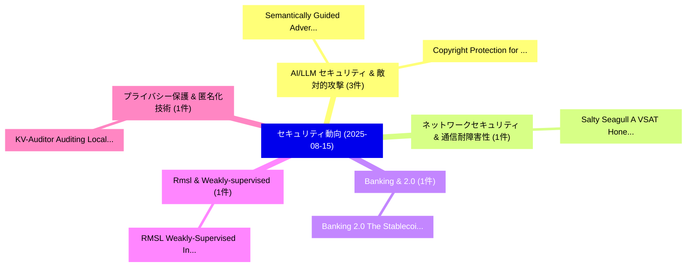

# 📅 02_daily: 日次エグゼクティブサマリー報告書 (2025-08-15)

**集計日時**: 2026-10-02 23:05:36 UTC  
**対象日付**: 2025-08-15  
**本日収集論文数**: 14 件  

---

## 💡 主要セキュリティ動向・脅威インサイト (Executive Insights)

本日の収集論文（計 14 件）において、以下の重点セキュリティ領域で活発な研究動向が確認されました：
- **AI/LLM セキュリティ & 敵対的攻撃** (3 件): 注目論文として 「Semantically Guided Adversaria...」、「Copyright Protection for 大規模言語...」 等が発表され、実務防御および攻撃検証の進展が見られます。
- **ネットワークセキュリティ & 通信耐障害性** (1 件): 注目論文として 「Salty Seagull: A VSAT Honeynet...」 等が発表され、実務防御および攻撃検証の進展が見られます。
- **Banking & 2.0** (1 件): 注目論文として 「Banking 2.0: The Stablecoin Ba...」 等が発表され、実務防御および攻撃検証の進展が見られます。
- **Rmsl & Weakly-supervised** (1 件): 注目論文として 「RMSL: Weakly-Supervised Inside...」 等が発表され、実務防御および攻撃検証の進展が見られます。
- **プライバシー保護 & 匿名化技術** (1 件): 注目論文として 「KV-Auditor: Auditing Local Dif...」 等が発表され、実務防御および攻撃検証の進展が見られます。

### 🗺️ 技術・脅威トピックマインドマップ

---

## 📌 日次セキュリティ論文一覧 (日本語表形式)

| No | arXiv ID | 論文タイトル (日本語訳) | 重要キーワード | 構造化エグゼクティブ要約 (背景・提案・影響) | 脅威分類 | 詳細リンク |
|---|---|---|---|---|---|---|
| 1 | `2508.11325v2` | [Salty Seagull: A VSAT Honeynet to Follow the Bread Crumb of Attacks in Ship Networks（セキュリティ分析論文）](../../okf/papers/2025-08-15/2508.11325.md) | `Salty Seagull`, `Bread Crumb`, `Ship Networks` | 【提案】概要 (Overview & Key Finding) 本論文「Salty Seagull: A VSAT Honeynet to Follow the Bread Crum...。実証評価により経営層・セキュリティ管理者向け推奨アクション (E... | `cybersecurity` | [arXiv](https://arxiv.org/abs/2508.11325v2) &#124; [OKF](../../okf/papers/2025-08-15/2508.11325.md) |
| 2 | `2508.11341v1` | [Semantically Guided Adversarial Testing of Vision Models Using Language Models（セキュリティ分析論文）](../../okf/papers/2025-08-15/2508.11341.md) | `Vision Models Using Language Models`, `Semantically Guided Adversarial Testing`, `Katarzyna Filus` | 【提案】概要 (Overview & Key Finding) 本論文「Semantically Guided Adversarial Testing of Vision Model...。実証評価により経営層・セキュリティ管理者向け推奨アクション (E... | `cs.CV` | [arXiv](https://arxiv.org/abs/2508.11341v1) &#124; [OKF](../../okf/papers/2025-08-15/2508.11341.md) |
| 3 | `2508.11395v1` | [Banking 2.0: The Stablecoin Banking Revolution -- How Digital Assets Are Reshaping Global Finance（セキュリティ分析論文）](../../okf/papers/2025-08-15/2508.11395.md) | `Rhea Pritham Marpu`, `Raw Meta`, `Executive Summary` | 【提案】概要 (Overview & Key Finding) 本論文「Banking 2.0: The Stablecoin Banking Revolution -- How D...。実証評価により経営層・セキュリティ管理者向け推奨アクション (E... | `cs.ET` | [arXiv](https://arxiv.org/abs/2508.11395v1) &#124; [OKF](../../okf/papers/2025-08-15/2508.11395.md) |
| 4 | `2508.11472v1` | [RMSL: Weakly-Supervised Insider Threat Detection with Robust Multi-sphere Learning（セキュリティ分析論文）](../../okf/papers/2025-08-15/2508.11472.md) | `Supervised Insider Threat Detection`, `Robust Multi`, `Weakly-Supervised Insider` | 【提案】概要 (Overview & Key Finding) 本論文「RMSL: Weakly-Supervised Insider 脅威 Detection with Robus...。実証評価により経営層・セキュリティ管理者向け推奨アクション (E... | `cs.AI` | [arXiv](https://arxiv.org/abs/2508.11472v1) &#124; [OKF](../../okf/papers/2025-08-15/2508.11472.md) |
| 5 | `2508.11495v1` | [KV-Auditor: Auditing Local Differential Privacy for Correlated Key-Value Estimation（セキュリティ分析論文）](../../okf/papers/2025-08-15/2508.11495.md) | `Auditing Local Differential Privacy`, `Correlated Key`, `Value Estimation` | 【提案】概要 (Overview & Key Finding) 本論文「KV-Auditor: Auditing Local 差分プライバシー for Correlated Key-...。実証評価により経営層・セキュリティ管理者向け推奨アクション (E... | `cybersecurity` | [arXiv](https://arxiv.org/abs/2508.11495v1) &#124; [OKF](../../okf/papers/2025-08-15/2508.11495.md) |
| 6 | `2508.11548v2` | [Copyright Protection for 大規模言語モデル: A Survey of Methods, Challenges, and Trends](../../okf/papers/2025-08-15/2508.11548.md) | `Copyright Protection`, `Large Language Models`, `Zhenhua Xu` | 【提案】概要 (Overview & Key Finding) 本論文「Copyright Protection for 大規模言語モデル: A Survey of Methods,...。実証評価により経営層・セキュリティ管理者向け推奨アクション (E... | `cybersecurity` | [arXiv](https://arxiv.org/abs/2508.11548v2) &#124; [OKF](../../okf/papers/2025-08-15/2508.11548.md) |
| 7 | `2508.11563v2` | [How Query Distribution Knowledge Breaks Multidimensional Encrypted Range Queries, With Guarantees（セキュリティ分析論文）](../../okf/papers/2025-08-15/2508.11563.md) | `Daniel Blackley`, `Nathaniel Moyer`, `Charalampos Papamanthou` | 【提案】概要 (Overview & Key Finding) 本論文「How Query Distribution Knowledge Breaks Multidimensiona...。実証評価により経営層・セキュリティ管理者向け推奨アクション (E... | `cybersecurity` | [arXiv](https://arxiv.org/abs/2508.11563v2) &#124; [OKF](../../okf/papers/2025-08-15/2508.11563.md) |
| 8 | `2508.11575v1` | [Activate Me!: Designing Efficient Activation Functions for Privacy-Preserving Machine Learning with Fully Homomorphic Encryption（セキュリティ分析論文）](../../okf/papers/2025-08-15/2508.11575.md) | `Designing Efficient Activation Functions`, `Preserving Machine Learning`, `Fully Homomorphic Encryption` | 【提案】概要 (Overview & Key Finding) 本論文「Activate Me!: Designing Efficient Activation Functions ...。実証評価により経営層・セキュリティ管理者向け推奨アクション (E... | `cybersecurity` | [arXiv](https://arxiv.org/abs/2508.11575v1) &#124; [OKF](../../okf/papers/2025-08-15/2508.11575.md) |
| 9 | `2508.11599v1` | [CryptoScope: Utilizing Large Language Models for Automated Cryptographic Logic 脆弱性検出](../../okf/papers/2025-08-15/2508.11599.md) | `Utilizing Large Language Models`, `Automated Cryptographic Logic`, `Automated Cryptographic Logic Vulnerability Detection` | 【提案】概要 (Overview & Key Finding) 本論文「CryptoScope: Utilizing Large Language Models for Automa...。実証評価により経営層・セキュリティ管理者向け推奨アクション (E... | `cs.AI` | [arXiv](https://arxiv.org/abs/2508.11599v1) &#124; [OKF](../../okf/papers/2025-08-15/2508.11599.md) |
| 10 | `2508.11742v2` | [Cross-Flow Correlations Survive Synthesis: Measuring Source-Level Privacy Leakage in Synthetic Network Traces（セキュリティ分析論文）](../../okf/papers/2025-08-15/2508.11742.md) | `Flow Correlations Survive Synthesis`, `Level Privacy Leakage`, `Synthetic Network Traces` | 【提案】概要 (Overview & Key Finding) 本論文「Cross-Flow Correlations Survive Synthesis: Measuring So...。実証評価により経営層・セキュリティ管理者向け推奨アクション (E... | `cs.NI` | [arXiv](https://arxiv.org/abs/2508.11742v2) &#124; [OKF](../../okf/papers/2025-08-15/2508.11742.md) |
| 11 | `2508.11797v1` | [AegisBlock: A Privacy-Preserving Medical Research Framework using Blockchain（セキュリティ分析論文）](../../okf/papers/2025-08-15/2508.11797.md) | `Privacy-Preserving Medical`, `Omar Rios Cruz`, `Calkin Garg` | 【提案】概要 (Overview & Key Finding) 本論文「AegisBlock: A Privacy-Preserving Medical Research Frame...。実証評価により経営層・セキュリティ管理者向け推奨アクション (E... | `cs.DB` | [arXiv](https://arxiv.org/abs/2508.11797v1) &#124; [OKF](../../okf/papers/2025-08-15/2508.11797.md) |
| 12 | `2508.11812v1` | [Sideways: Thwarting Lateral Movement by Implementing Active Directory Tieringのセキュリティ強化](../../okf/papers/2025-08-15/2508.11812.md) | `Thwarting Lateral Movement`, `Implementing Active Directory Tiering`, `Implementing Active Directory` | 【提案】概要 (Overview & Key Finding) 本論文「Sideways: Thwarting Lateral Movement by Implementing Ac...。実証評価により経営層・セキュリティ管理者向け推奨アクション (E... | `cs.NI` | [arXiv](https://arxiv.org/abs/2508.11812v1) &#124; [OKF](../../okf/papers/2025-08-15/2508.11812.md) |
| 13 | `2508.11817v1` | [Machine Learning-Based AES Key Recovery via Side-Channel Analysis on the ASCAD Dataset（セキュリティ分析論文）](../../okf/papers/2025-08-15/2508.11817.md) | `Machine Learning`, `Key Recovery`, `Learning-Based AES` | 【提案】概要 (Overview & Key Finding) 本論文「Machine Learning-Based AES Key Recovery via サイドチャネル攻撃 A...。実証評価により経営層・セキュリティ管理者向け推奨アクション (E... | `cybersecurity` | [arXiv](https://arxiv.org/abs/2508.11817v1) &#124; [OKF](../../okf/papers/2025-08-15/2508.11817.md) |
| 14 | `2508.11824v1` | [Rethinking Autonomy: Preventing Failures in AI-Driven Software Engineering（セキュリティ分析論文）](../../okf/papers/2025-08-15/2508.11824.md) | `Driven Software Engineering`, `Rethinking Autonomy`, `Preventing Failures` | 【提案】概要 (Overview & Key Finding) 本論文「Rethinking Autonomy: Preventing Failures in AI-Driven S...。実証評価により経営層・セキュリティ管理者向け推奨アクション (E... | `cs.AI` | [arXiv](https://arxiv.org/abs/2508.11824v1) &#124; [OKF](../../okf/papers/2025-08-15/2508.11824.md) |

