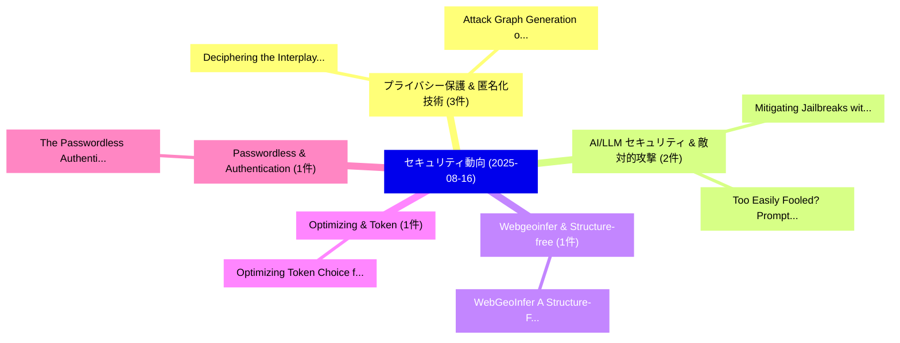

# 📅 02_daily: 日次エグゼクティブサマリー報告書 (2025-08-16)

**集計日時**: 2026-10-02 23:05:36 UTC  
**対象日付**: 2025-08-16  
**本日収集論文数**: 16 件  

---

## 💡 主要セキュリティ動向・脅威インサイト (Executive Insights)

本日の収集論文（計 16 件）において、以下の重点セキュリティ領域で活発な研究動向が確認されました：
- **プライバシー保護 & 匿名化技術** (3 件): 注目論文として 「Deciphering the Interplay betw...」、「Attack Graph Generation on HPC...」 等が発表され、実務防御および攻撃検証の進展が見られます。
- **AI/LLM セキュリティ & 敵対的攻撃** (2 件): 注目論文として 「Mitigating Jailbreaks with Int...」、「Too Easily Fooled? Prompt Inje...」 等が発表され、実務防御および攻撃検証の進展が見られます。
- **Webgeoinfer & Structure-free** (1 件): 注目論文として 「WebGeoInfer: A Structure-Free ...」 等が発表され、実務防御および攻撃検証の進展が見られます。
- **Optimizing & Token** (1 件): 注目論文として 「Optimizing Token Choice for Co...」 等が発表され、実務防御および攻撃検証の進展が見られます。
- **Passwordless & Authentication** (1 件): 注目論文として 「The Passwordless Authenticatio...」 等が発表され、実務防御および攻撃検証の進展が見られます。

### 🗺️ 技術・脅威トピックマインドマップ

---

## 📌 日次セキュリティ論文一覧 (日本語表形式)

| No | arXiv ID | 論文タイトル (日本語訳) | 重要キーワード | 構造化エグゼクティブ要約 (背景・提案・影響) | 脅威分類 | 詳細リンク |
|---|---|---|---|---|---|---|
| 1 | `2508.11907v1` | [Deciphering the Interplay between Attack and Protection Complexity in Privacy-Preserving 連合学習](../../okf/papers/2025-08-16/2508.11907.md) | `Protection Complexity`, `Preserving Federated Learning`, `Privacy-Preserving Federated` | 【提案】概要 (Overview & Key Finding) 本論文「Deciphering the Interplay between Attack and Protection...。実証評価により経営層・セキュリティ管理者向け推奨アクション (E... | `cs.AI` | [arXiv](https://arxiv.org/abs/2508.11907v1) &#124; [OKF](../../okf/papers/2025-08-16/2508.11907.md) |
| 2 | `2508.11913v1` | [WebGeoInfer: A Structure-Free and Multi-Stage Framework for Geolocation Inference of Devices Exposing Information（セキュリティ分析論文）](../../okf/papers/2025-08-16/2508.11913.md) | `Devices Exposing Information`, `Geolocation Inference`, `Huipeng Yang` | 【提案】概要 (Overview & Key Finding) 本論文「WebGeoInfer: A Structure-Free and Multi-Stage Framework...。実証評価により経営層・セキュリティ管理者向け推奨アクション (E... | `cybersecurity` | [arXiv](https://arxiv.org/abs/2508.11913v1) &#124; [OKF](../../okf/papers/2025-08-16/2508.11913.md) |
| 3 | `2508.11925v3` | [Optimizing Token Choice for Code Watermarking: An RL Approach（セキュリティ分析論文）](../../okf/papers/2025-08-16/2508.11925.md) | `Optimizing Token Choice`, `Code Watermarking`, `Zhimeng Guo` | 【提案】概要 (Overview & Key Finding) 本論文「Optimizing Token Choice for Code Watermarking: An RL Ap...。実証評価により経営層・セキュリティ管理者向け推奨アクション (E... | `executive-summary` | [arXiv](https://arxiv.org/abs/2508.11925v3) &#124; [OKF](../../okf/papers/2025-08-16/2508.11925.md) |
| 4 | `2508.11928v1` | [The Passwordless Authentication with Passkey Technology from an Implementation Perspective（セキュリティ分析論文）](../../okf/papers/2025-08-16/2508.11928.md) | `Passkey Technology`, `Implementation Perspective`, `Rashid Hussain Khokhar` | 【提案】概要 (Overview & Key Finding) 本論文「The Passwordless Authentication with Passkey Technology...。実証評価により経営層・セキュリティ管理者向け推奨アクション (E... | `cybersecurity` | [arXiv](https://arxiv.org/abs/2508.11928v1) &#124; [OKF](../../okf/papers/2025-08-16/2508.11928.md) |
| 5 | `2508.11939v1` | [Design and Implementation of a Controlled Ransomware Framework for Educational Purposes Using Flutter Cryptographic APIs on Desktop PCs and Android Devices（セキュリティ分析論文）](../../okf/papers/2025-08-16/2508.11939.md) | `Educational Purposes Using Flutter Cryptographic`, `Android Devices`, `Mohammed Akram Taher Khan` | 【提案】概要 (Overview & Key Finding) 本論文「Design and Implementation of a Controlled ランサムウェア Frame...。実証評価により経営層・セキュリティ管理者向け推奨アクション (E... | `cybersecurity` | [arXiv](https://arxiv.org/abs/2508.11939v1) &#124; [OKF](../../okf/papers/2025-08-16/2508.11939.md) |
| 6 | `2508.12035v2` | [ToxiEval-ZKP: A Structure-Private Verification Framework for Molecular Toxicity Repair Tasks（セキュリティ分析論文）](../../okf/papers/2025-08-16/2508.12035.md) | `Molecular Toxicity Repair Tasks`, `Structure-Private Verification`, `Fei Lin` | 【提案】概要 (Overview & Key Finding) 本論文「ToxiEval-ZKP: A Structure-Private Verification Framewor...。実証評価により経営層・セキュリティ管理者向け推奨アクション (E... | `cybersecurity` | [arXiv](https://arxiv.org/abs/2508.12035v2) &#124; [OKF](../../okf/papers/2025-08-16/2508.12035.md) |
| 7 | `2508.12072v2` | [Mitigating Jailbreaks with Intent-Aware LLMs（セキュリティ分析論文）](../../okf/papers/2025-08-16/2508.12072.md) | `Mitigating Jailbreaks`, `Intent-Aware LLMs`, `Wei Jie Yeo` | 【提案】概要 (Overview & Key Finding) 本論文「Mitigating ジェイルブレイクs with Intent-Aware LLMs（セキュリティ分析論文）...。実証評価により経営層・セキュリティ管理者向け推奨アクション (E... | `executive-summary` | [arXiv](https://arxiv.org/abs/2508.12072v2) &#124; [OKF](../../okf/papers/2025-08-16/2508.12072.md) |
| 8 | `2508.12093v3` | [PP-STAT: An Efficient Privacy-Preserving Statistical Analysis Framework using Homomorphic Encryption（セキュリティ分析論文）](../../okf/papers/2025-08-16/2508.12093.md) | `Homomorphic Encryption`, `Privacy-Preserving Statistical`, `Hyunmin Choi` | 【提案】概要 (Overview & Key Finding) 本論文「PP-STAT: An Efficient Privacy-Preserving Statistical An...。実証評価により経営層・セキュリティ管理者向け推奨アクション (E... | `cybersecurity` | [arXiv](https://arxiv.org/abs/2508.12093v3) &#124; [OKF](../../okf/papers/2025-08-16/2508.12093.md) |
| 9 | `2508.12107v1` | [Ethereum Crypto Wallets under Address Poisoning: How Usable and Secure Are They?（セキュリティ分析論文）](../../okf/papers/2025-08-16/2508.12107.md) | `Ethereum Crypto Wallets`, `Address Poisoning`, `Shixuan Guan` | 【提案】### (日本語題名: Ethereum Crypto Wallets under Address Poisoning: How Usable and Secure Are ...。実証評価により経営層・セキュリティ管理者向け推奨アクション (E... | `cybersecurity` | [arXiv](https://arxiv.org/abs/2508.12107v1) &#124; [OKF](../../okf/papers/2025-08-16/2508.12107.md) |
| 10 | `2508.12132v1` | [TriQDef: Disrupting Semantic and Gradient Alignment to Prevent Adversarial Patch Transferability in Quantized Neural Networks（セキュリティ分析論文）](../../okf/papers/2025-08-16/2508.12132.md) | `Prevent Adversarial Patch Transferability`, `Quantized Neural Networks`, `Disrupting Semantic` | 【提案】概要 (Overview & Key Finding) 本論文「TriQDef: Disrupting Semantic and Gradient Alignment to ...。実証評価により経営層・セキュリティ管理者向け推奨アクション (E... | `cs.CV` | [arXiv](https://arxiv.org/abs/2508.12132v1) &#124; [OKF](../../okf/papers/2025-08-16/2508.12132.md) |
| 11 | `2508.12138v1` | [Substituting Proof of Work in Blockchain with Training-Verified Collaborative Model Computation（セキュリティ分析論文）](../../okf/papers/2025-08-16/2508.12138.md) | `Verified Collaborative Model Computation`, `Substituting Proof`, `Training-Verified Collaborative` | 【提案】概要 (Overview & Key Finding) 本論文「Substituting Proof of Work in Blockchain with Training-...。実証評価により経営層・セキュリティ管理者向け推奨アクション (E... | `cs.AI` | [arXiv](https://arxiv.org/abs/2508.12138v1) &#124; [OKF](../../okf/papers/2025-08-16/2508.12138.md) |
| 12 | `2508.12161v1` | [Attack Graph Generation on HPC Clusters（セキュリティ分析論文）](../../okf/papers/2025-08-16/2508.12161.md) | `Attack Graph Generation`, `Ming Li`, `John Hale` | 【提案】概要 (Overview & Key Finding) 本論文「Attack Graph Generation on HPC Clusters（セキュリティ分析論文）」（原題...。実証評価により経営層・セキュリティ管理者向け推奨アクション (E... | `executive-summary` | [arXiv](https://arxiv.org/abs/2508.12161v1) &#124; [OKF](../../okf/papers/2025-08-16/2508.12161.md) |
| 13 | `2508.12175v1` | [Invitation Is All You Need! Promptware Attacks Against LLM-Powered Assistants in Production Are Practical and Dangerous（セキュリティ分析論文）](../../okf/papers/2025-08-16/2508.12175.md) | `Powered Assistants`, `LLM-Powered Assistants`, `Ben Nassi` | 【提案】Promptware Attacks Against LLM-Powered Assistants in Production Are Practical and Dange...。実証評価により経営層・セキュリティ管理者向け推奨アクション (E... | `cybersecurity` | [arXiv](https://arxiv.org/abs/2508.12175v1) &#124; [OKF](../../okf/papers/2025-08-16/2508.12175.md) |
| 14 | `2508.12181v1` | [CAN Networks Security in Smart Grids Communication Technologies（セキュリティ分析論文）](../../okf/papers/2025-08-16/2508.12181.md) | `Smart Grids Communication Technologies`, `Networks Security`, `Raw Meta` | 【提案】概要 (Overview & Key Finding) 本論文「CAN Networks Security in Smart Grids Communication Tech...。実証評価によりAbdelfattah, Shady A.。 | `cybersecurity` | [arXiv](https://arxiv.org/abs/2508.12181v1) &#124; [OKF](../../okf/papers/2025-08-16/2508.12181.md) |
| 15 | `2508.13214v1` | [Too Easily Fooled? Prompt Injection Breaks LLMs on Frustratingly Simple Multiple-Choice Questions（セキュリティ分析論文）](../../okf/papers/2025-08-16/2508.13214.md) | `Prompt Injection Breaks`, `Frustratingly Simple Multiple`, `Choice Questions` | 【提案】プロンプトインジェクション Breaks LLMs on Frustratingly Simple Multiple-Choice Questions ### (日本語題名:...。実証評価により経営層・セキュリティ管理者向け推奨アクション (E... | `cs.AI` | [arXiv](https://arxiv.org/abs/2508.13214v1) &#124; [OKF](../../okf/papers/2025-08-16/2508.13214.md) |
| 16 | `2509.00018v1` | [A Fluid Antenna Enabled Physical Layer Key Generation for Next-G Wireless Networks（セキュリティ分析論文）](../../okf/papers/2025-08-16/2509.00018.md) | `Fluid Antenna Enabled Physical Layer Key Generation`, `Wireless Networks`, `Next-G Wireless` | 【提案】概要 (Overview & Key Finding) 本論文「A Fluid Antenna Enabled Physical Layer Key Generation f...。実証評価により経営層・セキュリティ管理者向け推奨アクション (E... | `cs.AI` | [arXiv](https://arxiv.org/abs/2509.00018v1) &#124; [OKF](../../okf/papers/2025-08-16/2509.00018.md) |

