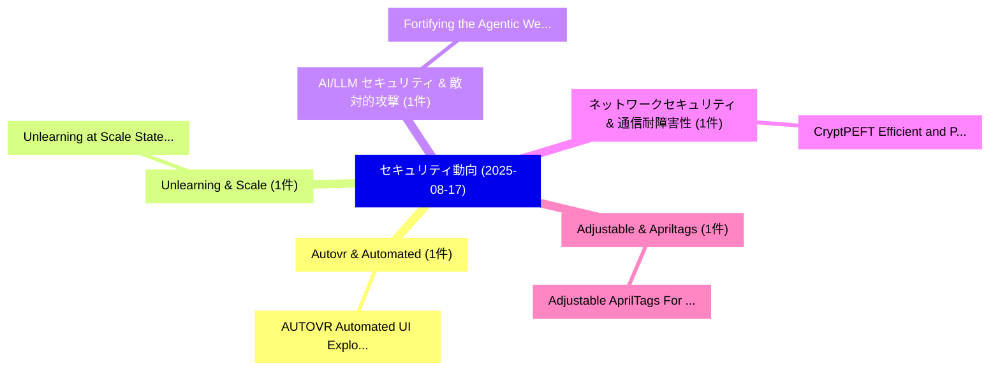

# 📅 02_daily: 日次エグゼクティブサマリー報告書 (2025-08-17)

**集計日時**: 2026-10-02 23:05:36 UTC  
**対象日付**: 2025-08-17  
**本日収集論文数**: 12 件  

---

## 💡 主要セキュリティ動向・脅威インサイト (Executive Insights)

本日の収集論文（計 12 件）において、以下の重点セキュリティ領域で活発な研究動向が確認されました：
- **Autovr & Automated** (1 件): 注目論文として 「AUTOVR: Automated UI Explorati...」 等が発表され、実務防御および攻撃検証の進展が見られます。
- **Unlearning & Scale** (1 件): 注目論文として 「Unlearning at Scale: State-Exa...」 等が発表され、実務防御および攻撃検証の進展が見られます。
- **AI/LLM セキュリティ & 敵対的攻撃** (1 件): 注目論文として 「Fortifying the Agentic Web: A ...」 等が発表され、実務防御および攻撃検証の進展が見られます。
- **ネットワークセキュリティ & 通信耐障害性** (1 件): 注目論文として 「CryptPEFT: Efficient and Priva...」 等が発表され、実務防御および攻撃検証の進展が見られます。
- **Adjustable & Apriltags** (1 件): 注目論文として 「Adjustable AprilTags For Ident...」 等が発表され、実務防御および攻撃検証の進展が見られます。

### 🗺️ 技術・脅威トピックマインドマップ

---

## 📌 日次セキュリティ論文一覧 (日本語表形式)

| No | arXiv ID | 論文タイトル (日本語訳) | 重要キーワード | 構造化エグゼクティブ要約 (背景・提案・影響) | 脅威分類 | 詳細リンク |
|---|---|---|---|---|---|---|
| 1 | `2508.12187v1` | [AUTOVR: Automated UI Exploration for Detecting Sensitive Data Flow Exposures in Virtual Reality Apps（セキュリティ分析論文）](../../okf/papers/2025-08-17/2508.12187.md) | `Detecting Sensitive Data Flow Exposures`, `Virtual Reality Apps`, `Chaoshun Zuo` | 【提案】概要 (Overview & Key Finding) 本論文「AUTOVR: Automated UI Exploration for Detecting Sensitiv...。実証評価により経営層・セキュリティ管理者向け推奨アクション (E... | `executive-summary` | [arXiv](https://arxiv.org/abs/2508.12187v1) &#124; [OKF](../../okf/papers/2025-08-17/2508.12187.md) |
| 2 | `2508.12220v2` | [Unlearning at Scale: State-Exact Trace-Preserving Deletion in Billion-Parameter Language Models（セキュリティ分析論文）](../../okf/papers/2025-08-17/2508.12220.md) | `Parameter Language Models`, `Exact Trace`, `Preserving Deletion` | 【提案】概要 (Overview & Key Finding) 本論文「Unlearning at Scale: State-Exact Trace-Preserving Delet...。実証評価により経営層・セキュリティ管理者向け推奨アクション (E... | `cs.AI` | [arXiv](https://arxiv.org/abs/2508.12220v2) &#124; [OKF](../../okf/papers/2025-08-17/2508.12220.md) |
| 3 | `2508.12259v3` | [Fortifying the Agentic Web: A Unified Zero-Trust Architecture Against Logic-layer Threats（セキュリティ分析論文）](../../okf/papers/2025-08-17/2508.12259.md) | `Agentic Web`, `Unified Zero`, `Zero-Trust Architecture` | 【提案】概要 (Overview & Key Finding) 本論文「Fortifying the Agentic Web: A Unified ゼロトラスト Architectu...。実証評価により経営層・セキュリティ管理者向け推奨アクション (E... | `cs.ET` | [arXiv](https://arxiv.org/abs/2508.12259v3) &#124; [OKF](../../okf/papers/2025-08-17/2508.12259.md) |
| 4 | `2508.12264v2` | [CryptPEFT: Efficient and Private Neural Network Inference via Parameter-Efficient Fine-Tuning（セキュリティ分析論文）](../../okf/papers/2025-08-17/2508.12264.md) | `Private Neural Network Inference`, `Efficient Fine`, `Parameter-Efficient Fine` | 【提案】概要 (Overview & Key Finding) 本論文「CryptPEFT: Efficient and Private Neural Network Inferen...。実証評価により経営層・セキュリティ管理者向け推奨アクション (E... | `cybersecurity` | [arXiv](https://arxiv.org/abs/2508.12264v2) &#124; [OKF](../../okf/papers/2025-08-17/2508.12264.md) |
| 5 | `2508.12304v1` | [Adjustable AprilTags For Identity Secured Tasks（セキュリティ分析論文）](../../okf/papers/2025-08-17/2508.12304.md) | `Hao Li`, `Raw Meta`, `Executive Summary` | 【提案】概要 (Overview & Key Finding) 本論文「Adjustable AprilTags For Identity Secured Tasks（セキュリティ分...。実証評価により経営層・セキュリティ管理者向け推奨アクション (E... | `executive-summary` | [arXiv](https://arxiv.org/abs/2508.12304v1) &#124; [OKF](../../okf/papers/2025-08-17/2508.12304.md) |
| 6 | `2508.12384v1` | [ViT-EnsembleAttack: Augmenting Ensemble Models for Stronger Adversarial Transferability in Vision Transformers（セキュリティ分析論文）](../../okf/papers/2025-08-17/2508.12384.md) | `Augmenting Ensemble Models`, `Stronger Adversarial Transferability`, `Vision Transformers` | 【提案】概要 (Overview & Key Finding) 本論文「ViT-EnsembleAttack: Augmenting Ensemble Models for Stro...。実証評価により経営層・セキュリティ管理者向け推奨アクション (E... | `cs.CV` | [arXiv](https://arxiv.org/abs/2508.12384v1) &#124; [OKF](../../okf/papers/2025-08-17/2508.12384.md) |
| 7 | `2508.12398v2` | [Where to Start Alignment? Diffusion Large Language Model May Demand a Distinct Position（セキュリティ分析論文）](../../okf/papers/2025-08-17/2508.12398.md) | `Diffusion Large Language Model May Demand`, `Start Alignment`, `Distinct Position` | 【提案】Diffusion Large Language Model May Demand a Distinct Position ### (日本語題名: Where to Star...。実証評価により経営層・セキュリティ管理者向け推奨アクション (E... | `cs.AI` | [arXiv](https://arxiv.org/abs/2508.12398v2) &#124; [OKF](../../okf/papers/2025-08-17/2508.12398.md) |
| 8 | `2508.12412v2` | [LumiMAS: A Comprehensive Framework for Real-Time Monitoring and Enhanced Observability in Multi-Agent Systems（セキュリティ分析論文）](../../okf/papers/2025-08-17/2508.12412.md) | `Time Monitoring`, `Enhanced Observability`, `Agent Systems` | 【提案】概要 (Overview & Key Finding) 本論文「LumiMAS: A Comprehensive Framework for Real-Time Monito...。実証評価により経営層・セキュリティ管理者向け推奨アクション (E... | `cs.AI` | [arXiv](https://arxiv.org/abs/2508.12412v2) &#124; [OKF](../../okf/papers/2025-08-17/2508.12412.md) |
| 9 | `2508.12470v1` | [A Robust Cross-Domain IDS using BiGRU-LSTM-Attention for Medical and Industrial IoT Security（セキュリティ分析論文）](../../okf/papers/2025-08-17/2508.12470.md) | `Robust Cross`, `Cross-Domain IDS`, `Ahmed Cherif Mazari` | 【提案】概要 (Overview & Key Finding) 本論文「A Robust Cross-Domain IDS using BiGRU-LSTM-Attention fo...。実証評価により経営層・セキュリティ管理者向け推奨アクション (E... | `cs.AI` | [arXiv](https://arxiv.org/abs/2508.12470v1) &#124; [OKF](../../okf/papers/2025-08-17/2508.12470.md) |
| 10 | `2508.12496v2` | [ChamaleoNet: Programmable Passive Probe for Enhanced Visibility on Erroneous Traffic（セキュリティ分析論文）](../../okf/papers/2025-08-17/2508.12496.md) | `Programmable Passive Probe`, `Enhanced Visibility`, `Erroneous Traffic` | 【提案】概要 (Overview & Key Finding) 本論文「ChamaleoNet: Programmable Passive Probe for Enhanced Vi...。実証評価により経営層・セキュリティ管理者向け推奨アクション (E... | `cs.NI` | [arXiv](https://arxiv.org/abs/2508.12496v2) &#124; [OKF](../../okf/papers/2025-08-17/2508.12496.md) |
| 11 | `2508.13220v3` | [MCPSecBench: A Systematic Security Benchmark and Playground for Testing Model Context Protocols（セキュリティ分析論文）](../../okf/papers/2025-08-17/2508.13220.md) | `Systematic Security Benchmark`, `Testing Model Context Protocols`, `Testing Model Context` | 【提案】概要 (Overview & Key Finding) 本論文「MCPSecBench: A Systematic Security Benchmark and Playgr...。実証評価により経営層・セキュリティ管理者向け推奨アクション (E... | `cs.AI` | [arXiv](https://arxiv.org/abs/2508.13220v3) &#124; [OKF](../../okf/papers/2025-08-17/2508.13220.md) |
| 12 | `2508.16637v1` | [Passive Hack-Back Strategies for Cyber Attribution: Covert Vectors in Denied Environment（セキュリティ分析論文）](../../okf/papers/2025-08-17/2508.16637.md) | `Passive Hack`, `Back Strategies`, `Cyber Attribution` | 【提案】概要 (Overview & Key Finding) 本論文「Passive Hack-Back Strategies for Cyber Attribution: Cov...。実証評価により経営層・セキュリティ管理者向け推奨アクション (E... | `cybersecurity` | [arXiv](https://arxiv.org/abs/2508.16637v1) &#124; [OKF](../../okf/papers/2025-08-17/2508.16637.md) |

