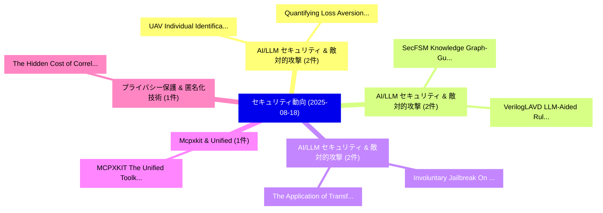

# 📅 02_daily: 日次エグゼクティブサマリー報告書 (2025-08-18)

**集計日時**: 2026-10-02 23:05:36 UTC  
**対象日付**: 2025-08-18  
**本日収集論文数**: 25 件  

---

## 💡 主要セキュリティ動向・脅威インサイト (Executive Insights)

本日の収集論文（計 25 件）において、以下の重点セキュリティ領域で活発な研究動向が確認されました：
- **AI/LLM セキュリティ & 敵対的攻撃** (2 件): 注目論文として 「UAV Individual Identification ...」、「Quantifying Loss Aversion in C...」 等が発表され、実務防御および攻撃検証の進展が見られます。
- **AI/LLM セキュリティ & 敵対的攻撃** (2 件): 注目論文として 「SecFSM: Knowledge Graph-Guided...」、「VerilogLAVD: LLM-Aided Rule Ge...」 等が発表され、実務防御および攻撃検証の進展が見られます。
- **AI/LLM セキュリティ & 敵対的攻撃** (2 件): 注目論文として 「The Application of Transformer...」、「Involuntary Jailbreak: On Self...」 等が発表され、実務防御および攻撃検証の進展が見られます。
- **Mcpxkit & Unified** (1 件): 注目論文として 「MCPXKIT: The Unified Toolkit f...」 等が発表され、実務防御および攻撃検証の進展が見られます。
- **プライバシー保護 & 匿名化技術** (1 件): 注目論文として 「The Hidden Cost of Correlation...」 等が発表され、実務防御および攻撃検証の進展が見られます。

### 🗺️ 技術・脅威トピックマインドマップ

---

## 📌 日次セキュリティ論文一覧 (日本語表形式)

| No | arXiv ID | 論文タイトル (日本語訳) | 重要キーワード | 構造化エグゼクティブ要約 (背景・提案・影響) | 脅威分類 | 詳細リンク |
|---|---|---|---|---|---|---|
| 1 | `2508.12538v2` | [MCPXKIT: The Unified Toolkit for Analyzing Model Context Protocol Security（セキュリティ分析論文）](../../okf/papers/2025-08-18/2508.12538.md) | `Analyzing Model Context Protocol Security`, `Analyzing Model Contex`, `Yongjian Guo` | 【提案】概要 (Overview & Key Finding) 本論文「MCPXKIT: The Unified Toolkit for Analyzing Model Contex...。実証評価により経営層・セキュリティ管理者向け推奨アクション (E... | `cs.AI` | [arXiv](https://arxiv.org/abs/2508.12538v2) &#124; [OKF](../../okf/papers/2025-08-18/2508.12538.md) |
| 2 | `2508.12539v1` | [The Hidden Cost of Correlation: Rethinking Privacy Leakage in Local Differential Privacy（セキュリティ分析論文）](../../okf/papers/2025-08-18/2508.12539.md) | `Rethinking Privacy Leakage`, `Local Differential Privacy`, `Sandaru Jayawardana` | 【提案】概要 (Overview & Key Finding) 本論文「The Hidden Cost of Correlation: Rethinking Privacy Leak...。実証評価により経営層・セキュリティ管理者向け推奨アクション (E... | `executive-summary` | [arXiv](https://arxiv.org/abs/2508.12539v1) &#124; [OKF](../../okf/papers/2025-08-18/2508.12539.md) |
| 3 | `2508.12553v2` | [DEFENDCLI: {Command-Line} Driven Attack Provenance Examination（セキュリティ分析論文）](../../okf/papers/2025-08-18/2508.12553.md) | `Driven Attack Provenance Examination`, `Peilun Wu`, `Nan Sun` | 【提案】概要 (Overview & Key Finding) 本論文「DEFENDCLI: {Command-Line} Driven Attack Provenance Exam...。実証評価により経営層・セキュリティ管理者向け推奨アクション (E... | `cybersecurity` | [arXiv](https://arxiv.org/abs/2508.12553v2) &#124; [OKF](../../okf/papers/2025-08-18/2508.12553.md) |
| 4 | `2508.12560v1` | [Data-driven Trust Bootstrapping for Mobile Edge Computing-based Industrial IoT Services（セキュリティ分析論文）](../../okf/papers/2025-08-18/2508.12560.md) | `Mobile Edge Computing`, `Trust Bootstrapping`, `Data-driven Trust` | 【提案】概要 (Overview & Key Finding) 本論文「Data-driven Trust Bootstrapping for Mobile Edge Computi...。実証評価により経営層・セキュリティ管理者向け推奨アクション (E... | `executive-summary` | [arXiv](https://arxiv.org/abs/2508.12560v1) &#124; [OKF](../../okf/papers/2025-08-18/2508.12560.md) |
| 5 | `2508.12571v1` | [Cyber Risks to Next-Gen Brain-Computer Interfaces: Analysis and Recommendations（セキュリティ分析論文）](../../okf/papers/2025-08-18/2508.12571.md) | `Cyber Risks`, `Gen Brain`, `Computer Interfaces` | 【提案】概要 (Overview & Key Finding) 本論文「Cyber Risks to Next-Gen Brain-Computer Interfaces: Anal...。実証評価により経営層・セキュリティ管理者向け推奨アクション (E... | `cs.ET` | [arXiv](https://arxiv.org/abs/2508.12571v1) &#124; [OKF](../../okf/papers/2025-08-18/2508.12571.md) |
| 6 | `2508.12584v1` | [Reducing False Positives with Active Behavioral Analysis for Cloud Security（セキュリティ分析論文）](../../okf/papers/2025-08-18/2508.12584.md) | `Reducing False Positives`, `Cloud Security`, `Raw Meta` | 【提案】概要 (Overview & Key Finding) 本論文「Reducing False Positives with Active Behavioral Analysi...。実証評価により経営層・セキュリティ管理者向け推奨アクション (E... | `cybersecurity` | [arXiv](https://arxiv.org/abs/2508.12584v1) &#124; [OKF](../../okf/papers/2025-08-18/2508.12584.md) |
| 7 | `2508.12597v2` | [UAV Individual Identification via Distilled RF Fingerprints-Based LLM in ISAC Networks（セキュリティ分析論文）](../../okf/papers/2025-08-18/2508.12597.md) | `Individual Identification`, `Fingerprints-Based LLM`, `Haolin Zheng` | 【提案】概要 (Overview & Key Finding) 本論文「UAV Individual Identification via Distilled RF Fingerpr...。実証評価により経営層・セキュリティ管理者向け推奨アクション (E... | `cybersecurity` | [arXiv](https://arxiv.org/abs/2508.12597v2) &#124; [OKF](../../okf/papers/2025-08-18/2508.12597.md) |
| 8 | `2508.12622v1` | [Consiglieres in the Shadow: Understanding the Use of Uncensored 大規模言語モデル in Cybercrimes](../../okf/papers/2025-08-18/2508.12622.md) | `Uncensored Large Language Models`, `Zilong Lin`, `Zichuan Li` | 【提案】概要 (Overview & Key Finding) 本論文「Consiglieres in the Shadow: Understanding the Use of Un...。実証評価により経営層・セキュリティ管理者向け推奨アクション (E... | `cybersecurity` | [arXiv](https://arxiv.org/abs/2508.12622v1) &#124; [OKF](../../okf/papers/2025-08-18/2508.12622.md) |
| 9 | `2508.12641v1` | [MPOCryptoML: Multi-Pattern based Off-Chain Crypto Money Laundering Detection（セキュリティ分析論文）](../../okf/papers/2025-08-18/2508.12641.md) | `Chain Crypto Money Laundering Detection`, `Multi-Pattern based`, `Off-Chain Crypto` | 【提案】概要 (Overview & Key Finding) 本論文「MPOCryptoML: Multi-Pattern based Off-Chain Crypto Money...。実証評価により経営層・セキュリティ管理者向け推奨アクション (E... | `cybersecurity` | [arXiv](https://arxiv.org/abs/2508.12641v1) &#124; [OKF](../../okf/papers/2025-08-18/2508.12641.md) |
| 10 | `2508.12730v3` | [Unlearning Comparator: A Visual Analytics System for Comparative Evaluation of Machine Unlearning Methods（セキュリティ分析論文）](../../okf/papers/2025-08-18/2508.12730.md) | `Visual Analytics System`, `Machine Unlearning Methods`, `Unlearning Comparator` | 【提案】概要 (Overview & Key Finding) 本論文「Unlearning Comparator: A Visual Analytics System for Co...。実証評価により経営層・セキュリティ管理者向け推奨アクション (E... | `executive-summary` | [arXiv](https://arxiv.org/abs/2508.12730v3) &#124; [OKF](../../okf/papers/2025-08-18/2508.12730.md) |
| 11 | `2508.12832v2` | [Efficient and Verifiable Privacy-Preserving Convolutional Computation for CNN Inference with Untrusted Clouds（セキュリティ分析論文）](../../okf/papers/2025-08-18/2508.12832.md) | `Preserving Convolutional Computation`, `Verifiable Privacy`, `Untrusted Clouds` | 【提案】概要 (Overview & Key Finding) 本論文「Efficient and Verifiable Privacy-Preserving Convolution...。実証評価により経営層・セキュリティ管理者向け推奨アクション (E... | `executive-summary` | [arXiv](https://arxiv.org/abs/2508.12832v2) &#124; [OKF](../../okf/papers/2025-08-18/2508.12832.md) |
| 12 | `2508.12859v1` | [The covering radius of Butson Hadamard codes for the homogeneous metric（セキュリティ分析論文）](../../okf/papers/2025-08-18/2508.12859.md) | `Butson Hadamard`, `Xingxing Xu`, `Minjia Shi` | 【提案】概要 (Overview & Key Finding) 本論文「The covering radius of Butson Hadamard codes for the ho...。実証評価により経営層・セキュリティ管理者向け推奨アクション (E... | `cybersecurity` | [arXiv](https://arxiv.org/abs/2508.12859v1) &#124; [OKF](../../okf/papers/2025-08-18/2508.12859.md) |
| 13 | `2508.12870v1` | [Supporting Socially Constrained Private Communications with SecureWhispers（セキュリティ分析論文）](../../okf/papers/2025-08-18/2508.12870.md) | `Supporting Socially Constrained Private Communications`, `Kieron Ivy Turk`, `Vinod Khandkar` | 【提案】概要 (Overview & Key Finding) 本論文「Supporting Socially Constrained Private Communications ...。実証評価により経営層・セキュリティ管理者向け推奨アクション (E... | `cybersecurity` | [arXiv](https://arxiv.org/abs/2508.12870v1) &#124; [OKF](../../okf/papers/2025-08-18/2508.12870.md) |
| 14 | `2508.12897v2` | [RAJ-PGA: Reasoning-Activated Jailbreak and Principle-Guided Alignment Framework for Large Reasoning Models（セキュリティ分析論文）](../../okf/papers/2025-08-18/2508.12897.md) | `Large Reasoning Models`, `Activated Jailbreak`, `Reasoning-Activated Jailbreak` | 【提案】概要 (Overview & Key Finding) 本論文「RAJ-PGA: Reasoning-Activated ジェイルブレイク and Principle-Gui...。実証評価により経営層・セキュリティ管理者向け推奨アクション (E... | `cs.AI` | [arXiv](https://arxiv.org/abs/2508.12897v2) &#124; [OKF](../../okf/papers/2025-08-18/2508.12897.md) |
| 15 | `2508.12910v2` | [SecFSM: Knowledge Graph-Guided Verilog Code Generation for Secure Finite State Machines in Systems-on-Chip（セキュリティ分析論文）](../../okf/papers/2025-08-18/2508.12910.md) | `Guided Verilog Code Generation`, `Secure Finite State Machines`, `Knowledge Graph` | 【提案】概要 (Overview & Key Finding) 本論文「SecFSM: Knowledge Graph-Guided Verilog Code Generation ...。実証評価により経営層・セキュリティ管理者向け推奨アクション (E... | `cs.AI` | [arXiv](https://arxiv.org/abs/2508.12910v2) &#124; [OKF](../../okf/papers/2025-08-18/2508.12910.md) |
| 16 | `2508.12953v1` | [Prescriptive Zero Trust- Assessing the impact of zero trust on cyber attack prevention（セキュリティ分析論文）](../../okf/papers/2025-08-18/2508.12953.md) | `Prescriptive Zero Trust`, `Samuel Aiello`, `Raw Meta` | 【提案】概要 (Overview & Key Finding) 本論文「Prescriptive ゼロトラスト- Assessing the impact of ゼロトラスト on ...。実証評価により経営層・セキュリティ管理者向け推奨アクション (E... | `cybersecurity` | [arXiv](https://arxiv.org/abs/2508.12953v1) &#124; [OKF](../../okf/papers/2025-08-18/2508.12953.md) |
| 17 | `2508.13030v1` | [The Application of Transformer-Based Models for Predicting Consequences of Cyber Attacks（セキュリティ分析論文）](../../okf/papers/2025-08-18/2508.13030.md) | `Based Models`, `Predicting Consequences`, `Transformer-Based Models` | 【提案】概要 (Overview & Key Finding) 本論文「The Application of Transformer-Based Models for Predict...。実証評価により経営層・セキュリティ管理者向け推奨アクション (E... | `cs.AI` | [arXiv](https://arxiv.org/abs/2508.13030v1) &#124; [OKF](../../okf/papers/2025-08-18/2508.13030.md) |
| 18 | `2508.13033v1` | [AuthenTree: A Scalable MPC-Based Distributed Trust Architecture for Chiplet-based Heterogeneous Systems（セキュリティ分析論文）](../../okf/papers/2025-08-18/2508.13033.md) | `Based Distributed Trust Architecture`, `Heterogeneous Systems`, `MPC-Based Distributed` | 【提案】概要 (Overview & Key Finding) 本論文「AuthenTree: A Scalable MPC-Based Distributed Trust Arch...。実証評価により経営層・セキュリティ管理者向け推奨アクション (E... | `cybersecurity` | [arXiv](https://arxiv.org/abs/2508.13033v1) &#124; [OKF](../../okf/papers/2025-08-18/2508.13033.md) |
| 19 | `2508.13048v1` | [MAJIC: Markovian Adaptive Jailbreaking via Iterative Composition of Diverse Innovative Strategies（セキュリティ分析論文）](../../okf/papers/2025-08-18/2508.13048.md) | `Markovian Adaptive Jailbreaking`, `Diverse Innovative Strategies`, `Iterative Composition` | 【提案】概要 (Overview & Key Finding) 本論文「MAJIC: Markovian Adaptive ジェイルブレイクing via Iterative Com...。実証評価により経営層・セキュリティ管理者向け推奨アクション (E... | `cybersecurity` | [arXiv](https://arxiv.org/abs/2508.13048v1) &#124; [OKF](../../okf/papers/2025-08-18/2508.13048.md) |
| 20 | `2508.13092v3` | [VerilogLAVD: LLM-Aided Rule Generation for 脆弱性検出 in Verilog](../../okf/papers/2025-08-18/2508.13092.md) | `Aided Rule Generation`, `LLM-Aided Rule`, `Vulnerability Detection` | 【提案】概要 (Overview & Key Finding) 本論文「VerilogLAVD: LLM-Aided Rule Generation for 脆弱性検出 in Ver...。実証評価により経営層・セキュリティ管理者向け推奨アクション (E... | `cs.AI` | [arXiv](https://arxiv.org/abs/2508.13092v3) &#124; [OKF](../../okf/papers/2025-08-18/2508.13092.md) |
| 21 | `2508.13118v2` | [AutoBnB-RAG: Enhancing Multi-Agent Incident Response with Retrieval-Augmented Generation（セキュリティ分析論文）](../../okf/papers/2025-08-18/2508.13118.md) | `Agent Incident Response`, `Enhancing Multi`, `Augmented Generation` | 【提案】概要 (Overview & Key Finding) 本論文「AutoBnB-RAG: Enhancing Multi-Agent Incident Response wi...。実証評価により経営層・セキュリティ管理者向け推奨アクション (E... | `executive-summary` | [arXiv](https://arxiv.org/abs/2508.13118v2) &#124; [OKF](../../okf/papers/2025-08-18/2508.13118.md) |
| 22 | `2508.13240v1` | [Quantifying Loss Aversion in Cyber Adversaries via LLM Analysis（セキュリティ分析論文）](../../okf/papers/2025-08-18/2508.13240.md) | `Quantifying Loss Aversion`, `Cyber Adversaries`, `Soham Hans` | 【提案】概要 (Overview & Key Finding) 本論文「Quantifying Loss Aversion in Cyber Adversaries via LLM ...。実証評価により経営層・セキュリティ管理者向け推奨アクション (E... | `cs.AI` | [arXiv](https://arxiv.org/abs/2508.13240v1) &#124; [OKF](../../okf/papers/2025-08-18/2508.13240.md) |
| 23 | `2508.13246v3` | [Involuntary Jailbreak: On Self-Prompting Attacks（セキュリティ分析論文）](../../okf/papers/2025-08-18/2508.13246.md) | `Involuntary Jailbreak`, `Prompting Attacks`, `Self-Prompting Attacks` | 【提案】概要 (Overview & Key Finding) 本論文「Involuntary ジェイルブレイク: On Self-Prompting Attacks（セキュリティ分...。実証評価により経営層・セキュリティ管理者向け推奨アクション (E... | `cs.AI` | [arXiv](https://arxiv.org/abs/2508.13246v3) &#124; [OKF](../../okf/papers/2025-08-18/2508.13246.md) |
| 24 | `2508.13357v2` | [Silentflow: Leveraging Trusted Execution for Resource-Limited MPC via Hardware-Algorithm Co-design（セキュリティ分析論文）](../../okf/papers/2025-08-18/2508.13357.md) | `Leveraging Trusted Execution`, `Algorithm Co`, `Resource-Limited MPC` | 【提案】概要 (Overview & Key Finding) 本論文「Silentflow: Leveraging Trusted Execution for Resource-L...。実証評価により経営層・セキュリティ管理者向け推奨アクション (E... | `cybersecurity` | [arXiv](https://arxiv.org/abs/2508.13357v2) &#124; [OKF](../../okf/papers/2025-08-18/2508.13357.md) |
| 25 | `2508.13364v1` | [A Risk Manager for Intrusion Tolerant Systems: Enhancing HAL 9000 with New Scoring and Data Sources（セキュリティ分析論文）](../../okf/papers/2025-08-18/2508.13364.md) | `Intrusion Tolerant Systems`, `Risk Manager`, `New Scoring` | 【提案】概要 (Overview & Key Finding) 本論文「A Risk Manager for Intrusion Tolerant Systems: Enhancin...。実証評価により経営層・セキュリティ管理者向け推奨アクション (E... | `executive-summary` | [arXiv](https://arxiv.org/abs/2508.13364v1) &#124; [OKF](../../okf/papers/2025-08-18/2508.13364.md) |

