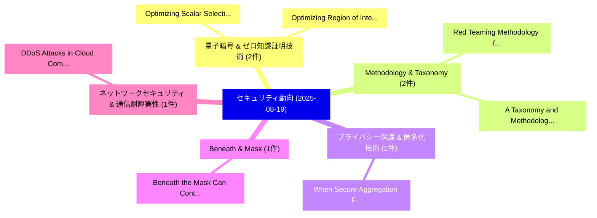

# 📅 02_daily: 日次エグゼクティブサマリー報告書 (2025-08-19)

**集計日時**: 2026-10-02 23:05:36 UTC  
**対象日付**: 2025-08-19  
**本日収集論文数**: 22 件  

---

## 💡 主要セキュリティ動向・脅威インサイト (Executive Insights)

本日の収集論文（計 22 件）において、以下の重点セキュリティ領域で活発な研究動向が確認されました：
- **量子暗号 & ゼロ知識証明技術** (2 件): 注目論文として 「Optimizing Scalar Selection in...」、「Optimizing Region of Interest ...」 等が発表され、実務防御および攻撃検証の進展が見られます。
- **Methodology & Taxonomy** (2 件): 注目論文として 「Red Teaming Methodology for De...」、「A Taxonomy and Methodology for...」 等が発表され、実務防御および攻撃検証の進展が見られます。
- **プライバシー保護 & 匿名化技術** (1 件): 注目論文として 「When Secure Aggregation Falls ...」 等が発表され、実務防御および攻撃検証の進展が見られます。
- **Beneath & Mask** (1 件): 注目論文として 「Beneath the Mask: Can Contribu...」 等が発表され、実務防御および攻撃検証の進展が見られます。
- **ネットワークセキュリティ & 通信耐障害性** (1 件): 注目論文として 「DDoS Attacks in Cloud Computin...」 等が発表され、実務防御および攻撃検証の進展が見られます。

### 🗺️ 技術・脅威トピックマインドマップ

---

## 📌 日次セキュリティ論文一覧 (日本語表形式)

| No | arXiv ID | 論文タイトル (日本語訳) | 重要キーワード | 構造化エグゼクティブ要約 (背景・提案・影響) | 脅威分類 | 詳細リンク |
|---|---|---|---|---|---|---|
| 1 | `2508.13425v1` | [When Secure Aggregation Falls Short: Achieving Long-Term Privacy in Asynchronous 連合学習 for LEO Satellite Networks](../../okf/papers/2025-08-19/2508.13425.md) | `Achieving Long`, `Term Privacy`, `Long-Term Privacy` | 【提案】概要 (Overview & Key Finding) 本論文「When Secure Aggregation Falls Short: Achieving Long-Ter...。実証評価により経営層・セキュリティ管理者向け推奨アクション (E... | `cybersecurity` | [arXiv](https://arxiv.org/abs/2508.13425v1) &#124; [OKF](../../okf/papers/2025-08-19/2508.13425.md) |
| 2 | `2508.13453v1` | [Beneath the Mask: Can Contribution Data Unveil Malicious Personas in Open-Source Projects?（セキュリティ分析論文）](../../okf/papers/2025-08-19/2508.13453.md) | `Can Contribution Data Unveil Malicious Personas`, `Source Projects`, `Open-Source Projects` | 【提案】### (日本語題名: Beneath the Mask: Can Contribution Data Unveil Malicious Personas in Open-S...。実証評価により経営層・セキュリティ管理者向け推奨アクション (E... | `cybersecurity` | [arXiv](https://arxiv.org/abs/2508.13453v1) &#124; [OKF](../../okf/papers/2025-08-19/2508.13453.md) |
| 3 | `2508.13520v1` | [Optimizing Scalar Selection in Elliptic Curve Cryptography Using Differential Evolution for Enhanced Security（セキュリティ分析論文）](../../okf/papers/2025-08-19/2508.13520.md) | `Elliptic Curve Cryptography Using Differential Evolution`, `Optimizing Scalar Selection`, `Enhanced Security` | 【提案】概要 (Overview & Key Finding) 本論文「Optimizing Scalar Selection in Elliptic Curve 暗号技術 Usin...。実証評価により経営層・セキュリティ管理者向け推奨アクション (E... | `executive-summary` | [arXiv](https://arxiv.org/abs/2508.13520v1) &#124; [OKF](../../okf/papers/2025-08-19/2508.13520.md) |
| 4 | `2508.13522v1` | [DDoS Attacks in Cloud Computing: Detection and Prevention（セキュリティ分析論文）](../../okf/papers/2025-08-19/2508.13522.md) | `Cloud Computing`, `Zain Ahmad`, `Musab Ahmad` | 【提案】概要 (Overview & Key Finding) 本論文「DDoS Attacks in Cloud Computing: Detection and Preventi...。実証評価により経営層・セキュリティ管理者向け推奨アクション (E... | `cs.AI` | [arXiv](https://arxiv.org/abs/2508.13522v1) &#124; [OKF](../../okf/papers/2025-08-19/2508.13522.md) |
| 5 | `2508.13588v2` | [CAI Fluency: A Framework for サイバーセキュリティ AI Fluency](../../okf/papers/2025-08-19/2508.13588.md) | `Luis Javier Navarrete`, `Jasmin Wachter`, `Veas Chavez` | 【提案】概要 (Overview & Key Finding) 本論文「CAI Fluency: A Framework for サイバーセキュリティ AI Fluency」（原題:...。実証評価によりVeas Chavez, Cathrin Scha... | `cybersecurity` | [arXiv](https://arxiv.org/abs/2508.13588v2) &#124; [OKF](../../okf/papers/2025-08-19/2508.13588.md) |
| 6 | `2508.13644v1` | [Conflicting Scores, Confusing Signals: Vulnerability Scoring Systemsの実証研究](../../okf/papers/2025-08-19/2508.13644.md) | `Conflicting Scores`, `Confusing Signals`, `Vulnerability Scoring Systems` | 【提案】概要 (Overview & Key Finding) 本論文「Conflicting Scores, Confusing Signals: 脆弱性 Scoring Syst...。実証評価により経営層・セキュリティ管理者向け推奨アクション (E... | `executive-summary` | [arXiv](https://arxiv.org/abs/2508.13644v1) &#124; [OKF](../../okf/papers/2025-08-19/2508.13644.md) |
| 7 | `2508.13690v1` | [Know Me by My Pulse: Toward Practical Continuous Authentication on Wearable Devices via Wrist-Worn PPG（セキュリティ分析論文）](../../okf/papers/2025-08-19/2508.13690.md) | `Toward Practical Continuous Authentication`, `Wearable Devices`, `Wrist-Worn PPG` | 【提案】概要 (Overview & Key Finding) 本論文「Know Me by My Pulse: Toward Practical Continuous Authen...。実証評価により経営層・セキュリティ管理者向け推奨アクション (E... | `executive-summary` | [arXiv](https://arxiv.org/abs/2508.13690v1) &#124; [OKF](../../okf/papers/2025-08-19/2508.13690.md) |
| 8 | `2508.13710v1` | [Optimizing Region of Interest Selection for Effective Embedding in Video Steganography Based on Genetic Algorithms（セキュリティ分析論文）](../../okf/papers/2025-08-19/2508.13710.md) | `Video Steganography Based`, `Optimizing Region`, `Interest Selection` | 【提案】概要 (Overview & Key Finding) 本論文「Optimizing Region of Interest Selection for Effective E...。実証評価により経営層・セキュリティ管理者向け推奨アクション (E... | `cs.MM` | [arXiv](https://arxiv.org/abs/2508.13710v1) &#124; [OKF](../../okf/papers/2025-08-19/2508.13710.md) |
| 9 | `2508.13730v1` | [On the Security and Privacy of 連合学習: A Survey with Attacks, Defenses, Frameworks, Applications, and Future Directions](../../okf/papers/2025-08-19/2508.13730.md) | `Future Directions`, `Federated Learning`, `Yelizaveta Falkouskaya` | 【提案】概要 (Overview & Key Finding) 本論文「On the Security and Privacy of 連合学習: A Survey with Atta...。実証評価により経営層・セキュリティ管理者向け推奨アクション (E... | `cs.AI` | [arXiv](https://arxiv.org/abs/2508.13730v1) &#124; [OKF](../../okf/papers/2025-08-19/2508.13730.md) |
| 10 | `2508.13750v2` | [NodeShield: Runtime Enforcement of Security-Enhanced SBOMs for Node.js（セキュリティ分析論文）](../../okf/papers/2025-08-19/2508.13750.md) | `Runtime Enforcement`, `Security-Enhanced SBOMs`, `Eric Cornelissen` | 【提案】概要 (Overview & Key Finding) 本論文「NodeShield: Runtime Enforcement of Security-Enhanced SB...。実証評価により経営層・セキュリティ管理者向け推奨アクション (E... | `cybersecurity` | [arXiv](https://arxiv.org/abs/2508.13750v2) &#124; [OKF](../../okf/papers/2025-08-19/2508.13750.md) |
| 11 | `2508.13965v1` | [Red Teaming Methodology for Design Obfuscation（セキュリティ分析論文）](../../okf/papers/2025-08-19/2508.13965.md) | `Red Teaming Methodology`, `Design Obfuscation`, `Yuntao Liu` | 【提案】概要 (Overview & Key Finding) 本論文「Red Teaming Methodology for Design Obfuscation（セキュリティ分析...。実証評価により経営層・セキュリティ管理者向け推奨アクション (E... | `cybersecurity` | [arXiv](https://arxiv.org/abs/2508.13965v1) &#124; [OKF](../../okf/papers/2025-08-19/2508.13965.md) |
| 12 | `2508.14128v1` | [CCFC: Core & Core-Full-Core Dual-Track Defense for LLM Jailbreak Protection（セキュリティ分析論文）](../../okf/papers/2025-08-19/2508.14128.md) | `Core Dual`, `Track Defense`, `Jailbreak Protection` | 【提案】概要 (Overview & Key Finding) 本論文「CCFC: Core & Core-Full-Core Dual-Track Defense for LLM ...。実証評価により経営層・セキュリティ管理者向け推奨アクション (E... | `cs.AI` | [arXiv](https://arxiv.org/abs/2508.14128v1) &#124; [OKF](../../okf/papers/2025-08-19/2508.14128.md) |
| 13 | `2508.14190v1` | [Two Birds with One Stone: Multi-Task Detection and Attribution of LLM-Generated Text（セキュリティ分析論文）](../../okf/papers/2025-08-19/2508.14190.md) | `Two Birds`, `One Stone`, `Task Detection` | 【提案】概要 (Overview & Key Finding) 本論文「Two Birds with One Stone: Multi-Task Detection and Attr...。実証評価により経営層・セキュリティ管理者向け推奨アクション (E... | `executive-summary` | [arXiv](https://arxiv.org/abs/2508.14190v1) &#124; [OKF](../../okf/papers/2025-08-19/2508.14190.md) |
| 14 | `2508.14230v1` | [A Taxonomy and Methodology for Proof-of-Location Systems（セキュリティ分析論文）](../../okf/papers/2025-08-19/2508.14230.md) | `Location Systems`, `Eduardo Brito`, `Fernando Castillo` | 【提案】概要 (Overview & Key Finding) 本論文「A Taxonomy and Methodology for Proof-of-Location System...。実証評価により経営層・セキュリティ管理者向け推奨アクション (E... | `cybersecurity` | [arXiv](https://arxiv.org/abs/2508.14230v1) &#124; [OKF](../../okf/papers/2025-08-19/2508.14230.md) |
| 15 | `2508.14261v1` | [SaMOSA: Sandbox for Malware Orchestration and Side-Channel Analysis（セキュリティ分析論文）](../../okf/papers/2025-08-19/2508.14261.md) | `Malware Orchestration`, `Venkata Sai Charan Putrevu`, `Meet Udeshi` | 【提案】概要 (Overview & Key Finding) 本論文「SaMOSA: Sandbox for マルウェア Orchestration and サイドチャネル攻撃 A...。実証評価により経営層・セキュリティ管理者向け推奨アクション (E... | `cybersecurity` | [arXiv](https://arxiv.org/abs/2508.14261v1) &#124; [OKF](../../okf/papers/2025-08-19/2508.14261.md) |
| 16 | `2508.14284v1` | [Differentially Private aggregate hints in mev-share（セキュリティ分析論文）](../../okf/papers/2025-08-19/2508.14284.md) | `Differentially Private`, `Jonathan Passerat`, `Sarisht Wadhwa` | 【提案】概要 (Overview & Key Finding) 本論文「Differentially Private aggregate hints in mev-share（セキュ...。実証評価により経営層・セキュリティ管理者向け推奨アクション (E... | `cybersecurity` | [arXiv](https://arxiv.org/abs/2508.14284v1) &#124; [OKF](../../okf/papers/2025-08-19/2508.14284.md) |
| 17 | `2508.14300v1` | [MultiFuzz: A Dense Retrieval-based Multi-Agent System for Network Protocol Fuzzing（セキュリティ分析論文）](../../okf/papers/2025-08-19/2508.14300.md) | `Network Protocol Fuzzing`, `Dense Retrieval`, `Retrieval-based Multi` | 【提案】概要 (Overview & Key Finding) 本論文「MultiFuzz: A Dense Retrieval-based Multi-Agent System f...。実証評価により経営層・セキュリティ管理者向け推奨アクション (E... | `cs.NI` | [arXiv](https://arxiv.org/abs/2508.14300v1) &#124; [OKF](../../okf/papers/2025-08-19/2508.14300.md) |
| 18 | `2508.14925v1` | [MCPTox: A Benchmark for Tool Poisoning Attack on Real-World MCP Servers（セキュリティ分析論文）](../../okf/papers/2025-08-19/2508.14925.md) | `Tool Poisoning Attack`, `Real-World MCP`, `Zhiqiang Wang` | 【提案】概要 (Overview & Key Finding) 本論文「MCPTox: A Benchmark for Tool Poisoning Attack on Real-W...。実証評価により経営層・セキュリティ管理者向け推奨アクション (E... | `executive-summary` | [arXiv](https://arxiv.org/abs/2508.14925v1) &#124; [OKF](../../okf/papers/2025-08-19/2508.14925.md) |
| 19 | `2508.15839v1` | [CIA+TA Risk Assessment for AI Reasoning Vulnerabilities（セキュリティ分析論文）](../../okf/papers/2025-08-19/2508.15839.md) | `Risk Assessment`, `Reasoning Vulnerabilities`, `Yuksel Aydin` | 【提案】概要 (Overview & Key Finding) 本論文「CIA+TA Risk Assessment for AI Reasoning Vulnerabilities...。実証評価により経営層・セキュリティ管理者向け推奨アクション (E... | `cs.AI` | [arXiv](https://arxiv.org/abs/2508.15839v1) &#124; [OKF](../../okf/papers/2025-08-19/2508.15839.md) |
| 20 | `2508.15840v7` | [Unveiling Unicode's Unseen Underpinnings in Undermining Authorship Attribution（セキュリティ分析論文）](../../okf/papers/2025-08-19/2508.15840.md) | `Undermining Authorship Attribution`, `Unveiling Unicode`, `Unseen Underpinnings` | 【提案】概要 (Overview & Key Finding) 本論文「Unveiling Unicode's Unseen Underpinnings in Undermining...。実証評価により経営層・セキュリティ管理者向け推奨アクション (E... | `executive-summary` | [arXiv](https://arxiv.org/abs/2508.15840v7) &#124; [OKF](../../okf/papers/2025-08-19/2508.15840.md) |
| 21 | `2508.15844v1` | [Ransomware Negotiation: Dynamics and Privacy-Preserving Mechanism Design（セキュリティ分析論文）](../../okf/papers/2025-08-19/2508.15844.md) | `Preserving Mechanism Design`, `Ransomware Negotiation`, `Privacy-Preserving Mechanism` | 【提案】概要 (Overview & Key Finding) 本論文「ランサムウェア Negotiation: Dynamics and Privacy-Preserving Me...。実証評価により経営層・セキュリティ管理者向け推奨アクション (E... | `executive-summary` | [arXiv](https://arxiv.org/abs/2508.15844v1) &#124; [OKF](../../okf/papers/2025-08-19/2508.15844.md) |
| 22 | `2508.18230v1` | [KillChainGraph: ML Framework for Predicting and Mapping ATT&CK Techniques（セキュリティ分析論文）](../../okf/papers/2025-08-19/2508.18230.md) | `Chitraksh Singh`, `Monisha Dhanraj`, `Ken Huang` | 【提案】概要 (Overview & Key Finding) 本論文「KillChainGraph: ML Framework for Predicting and Mapping...。実証評価により経営層・セキュリティ管理者向け推奨アクション (E... | `cs.AI` | [arXiv](https://arxiv.org/abs/2508.18230v1) &#124; [OKF](../../okf/papers/2025-08-19/2508.18230.md) |

