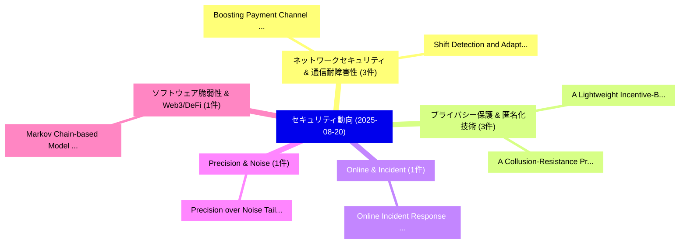

# 📅 02_daily: 日次エグゼクティブサマリー報告書 (2025-08-20)

**集計日時**: 2026-10-02 23:05:36 UTC  
**対象日付**: 2025-08-20  
**本日収集論文数**: 21 件  

---

## 💡 主要セキュリティ動向・脅威インサイト (Executive Insights)

本日の収集論文（計 21 件）において、以下の重点セキュリティ領域で活発な研究動向が確認されました：
- **ネットワークセキュリティ & 通信耐障害性** (3 件): 注目論文として 「Boosting Payment Channel Netwo...」、「Shift Detection and Adaptation...」 等が発表され、実務防御および攻撃検証の進展が見られます。
- **プライバシー保護 & 匿名化技術** (3 件): 注目論文として 「A Lightweight Incentive-Based ...」、「A Collusion-Resistance Privacy...」 等が発表され、実務防御および攻撃検証の進展が見られます。
- **Online & Incident** (1 件): 注目論文として 「Online Incident Response Plann...」 等が発表され、実務防御および攻撃検証の進展が見られます。
- **Precision & Noise** (1 件): 注目論文として 「Precision over Noise: Tailorin...」 等が発表され、実務防御および攻撃検証の進展が見られます。
- **ソフトウェア脆弱性 & Web3/DeFi** (1 件): 注目論文として 「Markov Chain-based Model of Bl...」 等が発表され、実務防御および攻撃検証の進展が見られます。

### 🗺️ 技術・脅威トピックマインドマップ

---

## 📌 日次セキュリティ論文一覧 (日本語表形式)

| No | arXiv ID | 論文タイトル (日本語訳) | 重要キーワード | 構造化エグゼクティブ要約 (背景・提案・影響) | 脅威分類 | 詳細リンク |
|---|---|---|---|---|---|---|
| 1 | `2508.14385v1` | [Online Incident Response Planning under Model Misspecification through Bayesian Learning and Belief Quantization（セキュリティ分析論文）](../../okf/papers/2025-08-20/2508.14385.md) | `Online Incident Response Planning`, `Model Misspecification`, `Bayesian Learning` | 【提案】概要 (Overview & Key Finding) 本論文「Online Incident Response Planning under Model Misspecif...。実証評価により経営層・セキュリティ管理者向け推奨アクション (E... | `cs.AI` | [arXiv](https://arxiv.org/abs/2508.14385v1) &#124; [OKF](../../okf/papers/2025-08-20/2508.14385.md) |
| 2 | `2508.14402v1` | [Precision over Noise: Tailoring S3 Public Access Detection to Reduce False Positives in Cloud Security Platforms（セキュリティ分析論文）](../../okf/papers/2025-08-20/2508.14402.md) | `Tailoring S3 Public Access Detection`, `Reduce False Positives`, `Cloud Security Platforms` | 【提案】概要 (Overview & Key Finding) 本論文「Precision over Noise: Tailoring S3 Public Access Detect...。実証評価により経営層・セキュリティ管理者向け推奨アクション (E... | `cybersecurity` | [arXiv](https://arxiv.org/abs/2508.14402v1) &#124; [OKF](../../okf/papers/2025-08-20/2508.14402.md) |
| 3 | `2508.14519v1` | [Markov Chain-based Model of Blockchain Radio Access Networks（セキュリティ分析論文）](../../okf/papers/2025-08-20/2508.14519.md) | `Blockchain Radio Access Networks`, `Markov Chain`, `Chain-based Model` | 【提案】概要 (Overview & Key Finding) 本論文「Markov Chain-based Model of Blockchain Radio Access Net...。実証評価によりBoulogeorgos, Hongwu Li。 | `executive-summary` | [arXiv](https://arxiv.org/abs/2508.14519v1) &#124; [OKF](../../okf/papers/2025-08-20/2508.14519.md) |
| 4 | `2508.14524v1` | [Boosting Payment Channel Network Liquidity with Topology Optimization and Transaction Selection（セキュリティ分析論文）](../../okf/papers/2025-08-20/2508.14524.md) | `Boosting Payment Channel Network Liquidity`, `Topology Optimization`, `Transaction Selection` | 【提案】概要 (Overview & Key Finding) 本論文「Boosting Payment Channel Network Liquidity with Topolog...。実証評価により経営層・セキュリティ管理者向け推奨アクション (E... | `executive-summary` | [arXiv](https://arxiv.org/abs/2508.14524v1) &#124; [OKF](../../okf/papers/2025-08-20/2508.14524.md) |
| 5 | `2508.14526v1` | [CoFacS -- Simulating a Complete Factory to Study the Security of Interconnected Production（セキュリティ分析論文）](../../okf/papers/2025-08-20/2508.14526.md) | `Complete Factory`, `Interconnected Production`, `Stefan Lenz` | 【提案】概要 (Overview & Key Finding) 本論文「CoFacS -- Simulating a Complete Factory to Study the Se...。実証評価により経営層・セキュリティ管理者向け推奨アクション (E... | `cs.NI` | [arXiv](https://arxiv.org/abs/2508.14526v1) &#124; [OKF](../../okf/papers/2025-08-20/2508.14526.md) |
| 6 | `2508.14530v1` | [DOPA: Stealthy and Generalizable Backdoor Attacks from a Single Client under Challenging Federated Constraints（セキュリティ分析論文）](../../okf/papers/2025-08-20/2508.14530.md) | `Generalizable Backdoor Attacks`, `Challenging Federated Constraints`, `Single Client` | 【提案】概要 (Overview & Key Finding) 本論文「DOPA: Stealthy and Generalizable Backdoor Attacks from ...。実証評価により経営層・セキュリティ管理者向け推奨アクション (E... | `cybersecurity` | [arXiv](https://arxiv.org/abs/2508.14530v1) &#124; [OKF](../../okf/papers/2025-08-20/2508.14530.md) |
| 7 | `2508.14568v1` | [Leuvenshtein: Efficient FHE-based Edit Distance Computation with Single Bootstrap per Cell（セキュリティ分析論文）](../../okf/papers/2025-08-20/2508.14568.md) | `Edit Distance Computation`, `Single Bootstrap`, `FHE-based Edit` | 【提案】概要 (Overview & Key Finding) 本論文「Leuvenshtein: Efficient FHE-based Edit Distance Computa...。実証評価により経営層・セキュリティ管理者向け推奨アクション (E... | `cybersecurity` | [arXiv](https://arxiv.org/abs/2508.14568v1) &#124; [OKF](../../okf/papers/2025-08-20/2508.14568.md) |
| 8 | `2508.14699v1` | [Foe for Fraud: Transferable Adversarial Attacks in Credit Card Fraud Detection（セキュリティ分析論文）](../../okf/papers/2025-08-20/2508.14699.md) | `Credit Card Fraud Detection`, `Transferable Adversarial Attacks`, `Jan Lum Fok` | 【提案】概要 (Overview & Key Finding) 本論文「Foe for Fraud: Transferable 敵対的攻撃s in Credit Card Fraud...。実証評価により経営層・セキュリティ管理者向け推奨アクション (E... | `cs.AI` | [arXiv](https://arxiv.org/abs/2508.14699v1) &#124; [OKF](../../okf/papers/2025-08-20/2508.14699.md) |
| 9 | `2508.14703v1` | [A Lightweight Incentive-Based Privacy-Preserving Smart Metering Protocol for Value-Added Services（セキュリティ分析論文）](../../okf/papers/2025-08-20/2508.14703.md) | `Preserving Smart Metering Protocol`, `Lightweight Incentive`, `Based Privacy` | 【提案】概要 (Overview & Key Finding) 本論文「A Lightweight Incentive-Based Privacy-Preserving Smart ...。実証評価により経営層・セキュリティ管理者向け推奨アクション (E... | `cybersecurity` | [arXiv](https://arxiv.org/abs/2508.14703v1) &#124; [OKF](../../okf/papers/2025-08-20/2508.14703.md) |
| 10 | `2508.14744v1` | [A Collusion-Resistance Privacy-Preserving Smart Metering Protocol for Operational Utility（セキュリティ分析論文）](../../okf/papers/2025-08-20/2508.14744.md) | `Preserving Smart Metering Protocol`, `Resistance Privacy`, `Operational Utility` | 【提案】概要 (Overview & Key Finding) 本論文「A Collusion-Resistance Privacy-Preserving Smart Meterin...。実証評価により経営層・セキュリティ管理者向け推奨アクション (E... | `cybersecurity` | [arXiv](https://arxiv.org/abs/2508.14744v1) &#124; [OKF](../../okf/papers/2025-08-20/2508.14744.md) |
| 11 | `2508.14796v1` | [A Guide to Stakeholder Analysis for サイバーセキュリティ Researchers](../../okf/papers/2025-08-20/2508.14796.md) | `Cybersecurity Researchers`, `Sophie Chen`, `Huiyun Peng` | 【提案】概要 (Overview & Key Finding) 本論文「A Guide to Stakeholder Analysis for サイバーセキュリティ Research...。実証評価により経営層・セキュリティ管理者向け推奨アクション (E... | `executive-summary` | [arXiv](https://arxiv.org/abs/2508.14796v1) &#124; [OKF](../../okf/papers/2025-08-20/2508.14796.md) |
| 12 | `2508.14815v1` | [A Lightweight Privacy-Preserving Smart Metering Billing Protocol with Dynamic Tariff Policy Adjustment（セキュリティ分析論文）](../../okf/papers/2025-08-20/2508.14815.md) | `Preserving Smart Metering Billing Protocol`, `Dynamic Tariff Policy Adjustment`, `Lightweight Privacy` | 【提案】概要 (Overview & Key Finding) 本論文「A Lightweight Privacy-Preserving Smart Metering Billing...。実証評価により経営層・セキュリティ管理者向け推奨アクション (E... | `cybersecurity` | [arXiv](https://arxiv.org/abs/2508.14815v1) &#124; [OKF](../../okf/papers/2025-08-20/2508.14815.md) |
| 13 | `2508.15031v2` | [A Systematic Survey of Model Extraction Attacks and Defenses: State-of-the-Art and Perspectives（セキュリティ分析論文）](../../okf/papers/2025-08-20/2508.15031.md) | `Model Extraction Attacks`, `Systematic Survey`, `Neil Zhenqiang Gong` | 【提案】背景とセキュリティ上の課題 (Background & Problem) 本研究はサイバー脅威環境におけるセキュリティ構造・脆弱性の検証を目的としています。(主要検出項目: ...。実証評価により経営層・セキュリティ管理者向け推奨アクション (E... | `cs.AI` | [arXiv](https://arxiv.org/abs/2508.15031v2) &#124; [OKF](../../okf/papers/2025-08-20/2508.15031.md) |
| 14 | `2508.15036v1` | [MoEcho: Exploiting Side-Channel Attacks to Compromise User Privacy in Mixture-of-Experts LLMs（セキュリティ分析論文）](../../okf/papers/2025-08-20/2508.15036.md) | `Compromise User Privacy`, `Exploiting Side`, `Channel Attacks` | 【提案】概要 (Overview & Key Finding) 本論文「MoEcho: Exploiting サイドチャネル攻撃 Attacks to Compromise User...。実証評価により経営層・セキュリティ管理者向け推奨アクション (E... | `cs.AI` | [arXiv](https://arxiv.org/abs/2508.15036v1) &#124; [OKF](../../okf/papers/2025-08-20/2508.15036.md) |
| 15 | `2508.15042v1` | [When Machine Learning Meets Vulnerability Discovery: Challenges and Lessons Learned（セキュリティ分析論文）](../../okf/papers/2025-08-20/2508.15042.md) | `Lessons Learned`, `Sima Arasteh`, `Christophe Hauser` | 【提案】概要 (Overview & Key Finding) 本論文「When Machine Learning Meets 脆弱性 Discovery: Challenges a...。実証評価により経営層・セキュリティ管理者向け推奨アクション (E... | `cybersecurity` | [arXiv](https://arxiv.org/abs/2508.15042v1) &#124; [OKF](../../okf/papers/2025-08-20/2508.15042.md) |
| 16 | `2508.15089v1` | [Tighter Privacy Analysis for Truncated Poisson Sampling（セキュリティ分析論文）](../../okf/papers/2025-08-20/2508.15089.md) | `Truncated Poisson Sampling`, `Arun Ganesh`, `Raw Meta` | 【提案】概要 (Overview & Key Finding) 本論文「Tighter Privacy Analysis for Truncated Poisson Sampling...。実証評価により経営層・セキュリティ管理者向け推奨アクション (E... | `cybersecurity` | [arXiv](https://arxiv.org/abs/2508.15089v1) &#124; [OKF](../../okf/papers/2025-08-20/2508.15089.md) |
| 17 | `2508.15100v2` | [Shift Detection and Adaptation for Network Intrusion Detection（セキュリティ分析論文）](../../okf/papers/2025-08-20/2508.15100.md) | `Network Intrusion Detection`, `Shift Detection`, `Ehssan Mousavipour` | 【提案】概要 (Overview & Key Finding) 本論文「Shift Detection and Adaptation for Network Intrusion De...。実証評価により経営層・セキュリティ管理者向け推奨アクション (E... | `executive-summary` | [arXiv](https://arxiv.org/abs/2508.15100v2) &#124; [OKF](../../okf/papers/2025-08-20/2508.15100.md) |
| 18 | `2508.15848v1` | [Self-Disguise Attack: Induce the LLM to disguise itself for AIGT detection evasion（セキュリティ分析論文）](../../okf/papers/2025-08-20/2508.15848.md) | `Disguise Attack`, `Self-Disguise Attack`, `Yinghan Zhou` | 【提案】概要 (Overview & Key Finding) 本論文「Self-Disguise Attack: Induce the LLM to disguise itself...。実証評価により経営層・セキュリティ管理者向け推奨アクション (E... | `executive-summary` | [arXiv](https://arxiv.org/abs/2508.15848v1) &#124; [OKF](../../okf/papers/2025-08-20/2508.15848.md) |
| 19 | `2508.15850v1` | [Linkage Attacks Expose Identity Risks in Public ECG Data Sharing（セキュリティ分析論文）](../../okf/papers/2025-08-20/2508.15850.md) | `Linkage Attacks Expose Identity Risks`, `Data Sharing`, `Sanaz Rahimi Mousavi` | 【提案】概要 (Overview & Key Finding) 本論文「Linkage Attacks Expose Identity Risks in Public ECG Dat...。実証評価により経営層・セキュリティ管理者向け推奨アクション (E... | `executive-summary` | [arXiv](https://arxiv.org/abs/2508.15850v1) &#124; [OKF](../../okf/papers/2025-08-20/2508.15850.md) |
| 20 | `2508.15865v1` | [Swarms: Cross-Domain Adaptation for ROS2-based CPS Anomaly Detectionのセキュリティ強化](../../okf/papers/2025-08-20/2508.15865.md) | `Domain Adaptation`, `Cross-Domain Adaptation`, `ROS2-based CPS` | 【提案】概要 (Overview & Key Finding) 本論文「Swarms: Cross-Domain Adaptation for ROS2-based CPS Anom...。実証評価により経営層・セキュリティ管理者向け推奨アクション (E... | `cs.AI` | [arXiv](https://arxiv.org/abs/2508.15865v1) &#124; [OKF](../../okf/papers/2025-08-20/2508.15865.md) |
| 21 | `2508.16662v1` | [Bridging the Mobile Trust Gap: A Zero Trust Framework for Consumer-Facing Applications（セキュリティ分析論文）](../../okf/papers/2025-08-20/2508.16662.md) | `Mobile Trust Gap`, `Facing Applications`, `Consumer-Facing Applications` | 【提案】概要 (Overview & Key Finding) 本論文「Bridging the Mobile Trust Gap: A ゼロトラスト Framework for C...。実証評価により経営層・セキュリティ管理者向け推奨アクション (E... | `cs.NI` | [arXiv](https://arxiv.org/abs/2508.16662v1) &#124; [OKF](../../okf/papers/2025-08-20/2508.16662.md) |

