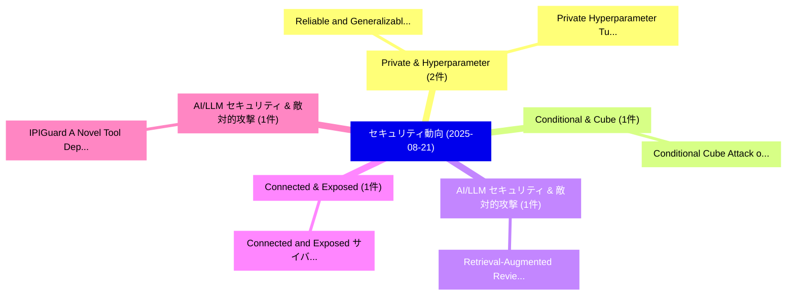

# 📅 02_daily: 日次エグゼクティブサマリー報告書 (2025-08-21)

**集計日時**: 2026-10-02 23:05:36 UTC  
**対象日付**: 2025-08-21  
**本日収集論文数**: 14 件  

---

## 💡 主要セキュリティ動向・脅威インサイト (Executive Insights)

本日の収集論文（計 14 件）において、以下の重点セキュリティ領域で活発な研究動向が確認されました：
- **Private & Hyperparameter** (2 件): 注目論文として 「Reliable and Generalizable Dif...」、「Private Hyperparameter Tuning ...」 等が発表され、実務防御および攻撃検証の進展が見られます。
- **Conditional & Cube** (1 件): 注目論文として 「Conditional Cube Attack on Rou...」 等が発表され、実務防御および攻撃検証の進展が見られます。
- **AI/LLM セキュリティ & 敵対的攻撃** (1 件): 注目論文として 「Retrieval-Augmented Review Gen...」 等が発表され、実務防御および攻撃検証の進展が見られます。
- **Connected & Exposed** (1 件): 注目論文として 「Connected and Exposed: サイバーセキュ...」 等が発表され、実務防御および攻撃検証の進展が見られます。
- **AI/LLM セキュリティ & 敵対的攻撃** (1 件): 注目論文として 「IPIGuard: A Novel Tool Depende...」 等が発表され、実務防御および攻撃検証の進展が見られます。

### 🗺️ 技術・脅威トピックマインドマップ

---

## 📌 日次セキュリティ論文一覧 (日本語表形式)

| No | arXiv ID | 論文タイトル (日本語訳) | 重要キーワード | 構造化エグゼクティブ要約 (背景・提案・影響) | 脅威分類 | 詳細リンク |
|---|---|---|---|---|---|---|
| 1 | `2508.15141v1` | [Reliable and Generalizable Differentially Private Machine Learning (Extended Version)に向けて](../../okf/papers/2025-08-21/2508.15141.md) | `Generalizable Differentially Private Machine Learning`, `Extended Version`, `Towards Reliable` | 【提案】概要 (Overview & Key Finding) 本論文「Reliable and Generalizable Differentially Private Machi...。実証評価により経営層・セキュリティ管理者向け推奨アクション (E... | `executive-summary` | [arXiv](https://arxiv.org/abs/2508.15141v1) &#124; [OKF](../../okf/papers/2025-08-21/2508.15141.md) |
| 2 | `2508.15172v1` | [Conditional Cube Attack on Round-Reduced ASCON（セキュリティ分析論文）](../../okf/papers/2025-08-21/2508.15172.md) | `Conditional Cube Attack`, `Round-Reduced ASCON`, `Zheng Li` | 【提案】概要 (Overview & Key Finding) 本論文「Conditional Cube Attack on Round-Reduced ASCON（セキュリティ分析...。実証評価により経営層・セキュリティ管理者向け推奨アクション (E... | `cybersecurity` | [arXiv](https://arxiv.org/abs/2508.15172v1) &#124; [OKF](../../okf/papers/2025-08-21/2508.15172.md) |
| 3 | `2508.15183v1` | [Private Hyperparameter Tuning with Ex-Post Guarantee（セキュリティ分析論文）](../../okf/papers/2025-08-21/2508.15183.md) | `Private Hyperparameter Tuning`, `Post Guarantee`, `Ex-Post Guarantee` | 【提案】概要 (Overview & Key Finding) 本論文「Private Hyperparameter Tuning with Ex-Post Guarantee（セキ...。実証評価により経営層・セキュリティ管理者向け推奨アクション (E... | `executive-summary` | [arXiv](https://arxiv.org/abs/2508.15183v1) &#124; [OKF](../../okf/papers/2025-08-21/2508.15183.md) |
| 4 | `2508.15252v2` | [Retrieval-Augmented Review Generation for Poisoning Recommender Systems（セキュリティ分析論文）](../../okf/papers/2025-08-21/2508.15252.md) | `Augmented Review Generation`, `Poisoning Recommender Systems`, `Retrieval-Augmented Review` | 【提案】概要 (Overview & Key Finding) 本論文「Retrieval-Augmented Review Generation for Poisoning Rec...。実証評価により経営層・セキュリティ管理者向け推奨アクション (E... | `executive-summary` | [arXiv](https://arxiv.org/abs/2508.15252v2) &#124; [OKF](../../okf/papers/2025-08-21/2508.15252.md) |
| 5 | `2508.15306v1` | [Connected and Exposed: サイバーセキュリティ Risks, Regulatory Gaps, and Public Perception in Internet-Connected Vehicles](../../okf/papers/2025-08-21/2508.15306.md) | `Regulatory Gaps`, `Public Perception`, `Connected Vehicles` | 【提案】概要 (Overview & Key Finding) 本論文「Connected and Exposed: サイバーセキュリティ Risks, Regulatory Gap...。実証評価により経営層・セキュリティ管理者向け推奨アクション (E... | `cybersecurity` | [arXiv](https://arxiv.org/abs/2508.15306v1) &#124; [OKF](../../okf/papers/2025-08-21/2508.15306.md) |
| 6 | `2508.15310v1` | [IPIGuard: A Novel Tool Dependency Graph-Based Defense Against Indirect Prompt Injection in LLMエージェント](../../okf/papers/2025-08-21/2508.15310.md) | `Graph-Based Defense`, `Jinghuai Zhang`, `Tianyu Du` | 【提案】概要 (Overview & Key Finding) 本論文「IPIGuard: A Novel Tool Dependency Graph-Based Defense A...。実証評価により経営層・セキュリティ管理者向け推奨アクション (E... | `cs.AI` | [arXiv](https://arxiv.org/abs/2508.15310v1) &#124; [OKF](../../okf/papers/2025-08-21/2508.15310.md) |
| 7 | `2508.15314v2` | [VideoEraser: Concept Erasure in Text-to-Video Diffusion Models（セキュリティ分析論文）](../../okf/papers/2025-08-21/2508.15314.md) | `Video Diffusion Models`, `Concept Erasure`, `Naen Xu` | 【提案】概要 (Overview & Key Finding) 本論文「VideoEraser: Concept Erasure in Text-to-Video Diffusion...。実証評価により経営層・セキュリティ管理者向け推奨アクション (E... | `cs.AI` | [arXiv](https://arxiv.org/abs/2508.15314v2) &#124; [OKF](../../okf/papers/2025-08-21/2508.15314.md) |
| 8 | `2508.15386v1` | [A Practical Guideline and Taxonomy to LLVM's Control Flow Integrity（セキュリティ分析論文）](../../okf/papers/2025-08-21/2508.15386.md) | `Control Flow Integrity`, `Practical Guideline`, `Sabine Houy` | 【提案】概要 (Overview & Key Finding) 本論文「A Practical Guideline and Taxonomy to LLVM's Control Fl...。実証評価により経営層・セキュリティ管理者向け推奨アクション (E... | `executive-summary` | [arXiv](https://arxiv.org/abs/2508.15386v1) &#124; [OKF](../../okf/papers/2025-08-21/2508.15386.md) |
| 9 | `2508.15541v1` | [BadFU: Backdoor 連合学習 through Adversarial Machine Unlearning](../../okf/papers/2025-08-21/2508.15541.md) | `Adversarial Machine Unlearning`, `Backdoor Federated Learning`, `Bingguang Lu` | 【提案】概要 (Overview & Key Finding) 本論文「BadFU: Backdoor 連合学習 through Adversarial Machine Unlear...。実証評価により経営層・セキュリティ管理者向け推奨アクション (E... | `executive-summary` | [arXiv](https://arxiv.org/abs/2508.15541v1) &#124; [OKF](../../okf/papers/2025-08-21/2508.15541.md) |
| 10 | `2508.15606v1` | [Scalable and Interpretable Mobile App Risk Analysis via Large Language Modelsに向けて](../../okf/papers/2025-08-21/2508.15606.md) | `Large Language Models`, `Towards Scalable`, `Large Language` | 【提案】概要 (Overview & Key Finding) 本論文「Scalable and Interpretable Mobile App Risk Analysis via...。実証評価により経営層・セキュリティ管理者向け推奨アクション (E... | `cybersecurity` | [arXiv](https://arxiv.org/abs/2508.15606v1) &#124; [OKF](../../okf/papers/2025-08-21/2508.15606.md) |
| 11 | `2508.15898v1` | [Automated Formal Verification of a Software Fault Isolation System（セキュリティ分析論文）](../../okf/papers/2025-08-21/2508.15898.md) | `Software Fault Isolation System`, `Automated Formal Verification`, `Matthew Sotoudeh` | 【提案】概要 (Overview & Key Finding) 本論文「Automated Formal Verification of a Software Fault Isola...。実証評価により経営層・セキュリティ管理者向け推奨アクション (E... | `cs.PL` | [arXiv](https://arxiv.org/abs/2508.15898v1) &#124; [OKF](../../okf/papers/2025-08-21/2508.15898.md) |
| 12 | `2508.15917v1` | [Evolving k-Threshold Visual Cryptography Schemes（セキュリティ分析論文）](../../okf/papers/2025-08-21/2508.15917.md) | `Threshold Visual Cryptography Schemes`, `k-Threshold Visual`, `Xiaoli Zhuo` | 【提案】概要 (Overview & Key Finding) 本論文「Evolving k-Threshold Visual 暗号技術 Schemes（セキュリティ分析論文）」（原...。実証評価により経営層・セキュリティ管理者向け推奨アクション (E... | `cybersecurity` | [arXiv](https://arxiv.org/abs/2508.15917v1) &#124; [OKF](../../okf/papers/2025-08-21/2508.15917.md) |
| 13 | `2508.15934v1` | [Strategic Sample Selection for Improved Clean-Label Backdoor Attacks in Text Classification（セキュリティ分析論文）](../../okf/papers/2025-08-21/2508.15934.md) | `Strategic Sample Selection`, `Label Backdoor Attacks`, `Improved Clean` | 【提案】概要 (Overview & Key Finding) 本論文「Strategic Sample Selection for Improved Clean-Label Bac...。実証評価により経営層・セキュリティ管理者向け推奨アクション (E... | `cs.AI` | [arXiv](https://arxiv.org/abs/2508.15934v1) &#124; [OKF](../../okf/papers/2025-08-21/2508.15934.md) |
| 14 | `2508.15987v2` | [PickleBall: Secure Deserialization of Pickle-based Machine Learning Models (Extended Report)（セキュリティ分析論文）](../../okf/papers/2025-08-21/2508.15987.md) | `Machine Learning Models`, `Secure Deserialization`, `Extended Report` | 【提案】概要 (Overview & Key Finding) 本論文「PickleBall: Secure Deserialization of Pickle-based Mach...。実証評価により経営層・セキュリティ管理者向け推奨アクション (E... | `executive-summary` | [arXiv](https://arxiv.org/abs/2508.15987v2) &#124; [OKF](../../okf/papers/2025-08-21/2508.15987.md) |

