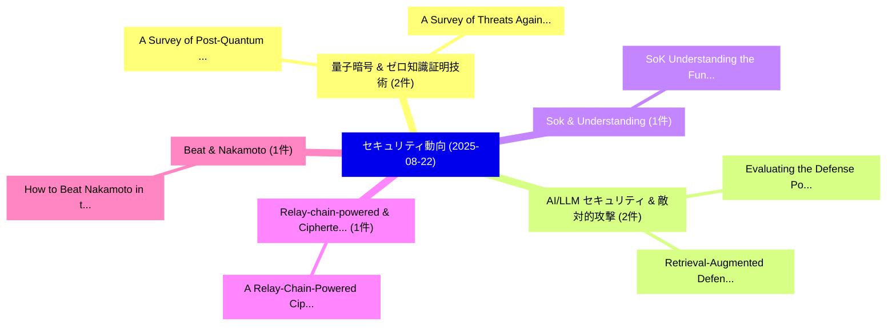

# 📅 02_daily: 日次エグゼクティブサマリー報告書 (2025-08-22)

**集計日時**: 2026-10-02 23:05:36 UTC  
**対象日付**: 2025-08-22  
**本日収集論文数**: 15 件  

---

## 💡 主要セキュリティ動向・脅威インサイト (Executive Insights)

本日の収集論文（計 15 件）において、以下の重点セキュリティ領域で活発な研究動向が確認されました：
- **量子暗号 & ゼロ知識証明技術** (2 件): 注目論文として 「A Survey of Post-Quantum Crypt...」、「A Survey of Threats Against Vo...」 等が発表され、実務防御および攻撃検証の進展が見られます。
- **AI/LLM セキュリティ & 敵対的攻撃** (2 件): 注目論文として 「Evaluating the Defense Potenti...」、「Retrieval-Augmented Defense: A...」 等が発表され、実務防御および攻撃検証の進展が見られます。
- **Sok & Understanding** (1 件): 注目論文として 「SoK: Understanding the Fundame...」 等が発表され、実務防御および攻撃検証の進展が見られます。
- **Relay-chain-powered & Ciphertext-policy** (1 件): 注目論文として 「A Relay-Chain-Powered Cipherte...」 等が発表され、実務防御および攻撃検証の進展が見られます。
- **Beat & Nakamoto** (1 件): 注目論文として 「How to Beat Nakamoto in the Ra...」 等が発表され、実務防御および攻撃検証の進展が見られます。

### 🗺️ 技術・脅威トピックマインドマップ

---

## 📌 日次セキュリティ論文一覧 (日本語表形式)

| No | arXiv ID | 論文タイトル (日本語訳) | 重要キーワード | 構造化エグゼクティブ要約 (背景・提案・影響) | 脅威分類 | 詳細リンク |
|---|---|---|---|---|---|---|
| 1 | `2508.16078v1` | [A Survey of Post-Quantum Cryptography Support in Cryptographic Libraries（セキュリティ分析論文）](../../okf/papers/2025-08-22/2508.16078.md) | `Quantum Cryptography Support`, `Cryptographic Libraries`, `Post-Quantum Cryptography` | 【提案】概要 (Overview & Key Finding) 本論文「A Survey of ポスト量子暗号 Support in Cryptographic Libraries（...。実証評価により経営層・セキュリティ管理者向け推奨アクション (E... | `cs.NI` | [arXiv](https://arxiv.org/abs/2508.16078v1) &#124; [OKF](../../okf/papers/2025-08-22/2508.16078.md) |
| 2 | `2508.16133v1` | [SoK: Understanding the Fundamentals and Implications of Sensor Out-of-band Vulnerabilities（セキュリティ分析論文）](../../okf/papers/2025-08-22/2508.16133.md) | `Shilin Xiao`, `Wenjun Zhu`, `Yan Jiang` | 【提案】概要 (Overview & Key Finding) 本論文「SoK: Understanding the Fundamentals and Implications of...。実証評価により経営層・セキュリティ管理者向け推奨アクション (E... | `cybersecurity` | [arXiv](https://arxiv.org/abs/2508.16133v1) &#124; [OKF](../../okf/papers/2025-08-22/2508.16133.md) |
| 3 | `2508.16150v4` | [Evaluating the Defense Potential of Machine Unlearning against Membership Inference Attacks（セキュリティ分析論文）](../../okf/papers/2025-08-22/2508.16150.md) | `Membership Inference Attacks`, `Defense Potential`, `Machine Unlearning` | 【提案】概要 (Overview & Key Finding) 本論文「Evaluating the Defense Potential of Machine Unlearning ...。実証評価により経営層・セキュリティ管理者向け推奨アクション (E... | `cybersecurity` | [arXiv](https://arxiv.org/abs/2508.16150v4) &#124; [OKF](../../okf/papers/2025-08-22/2508.16150.md) |
| 4 | `2508.16189v1` | [A Relay-Chain-Powered Ciphertext-Policy Attribute-Based Encryption in Intelligent Transportation Systems（セキュリティ分析論文）](../../okf/papers/2025-08-22/2508.16189.md) | `Intelligent Transportation Systems`, `Powered Ciphertext`, `Policy Attribute` | 【提案】概要 (Overview & Key Finding) 本論文「A Relay-Chain-Powered Ciphertext-Policy Attribute-Based...。実証評価により経営層・セキュリティ管理者向け推奨アクション (E... | `cs.AI` | [arXiv](https://arxiv.org/abs/2508.16189v1) &#124; [OKF](../../okf/papers/2025-08-22/2508.16189.md) |
| 5 | `2508.16202v2` | [How to Beat Nakamoto in the Race（セキュリティ分析論文）](../../okf/papers/2025-08-22/2508.16202.md) | `Beat Nakamoto`, `Jie Cao`, `Dongning Guo` | 【提案】概要 (Overview & Key Finding) 本論文「How to Beat Nakamoto in the Race（セキュリティ分析論文）」（原題: How t...。実証評価により経営層・セキュリティ管理者向け推奨アクション (E... | `cybersecurity` | [arXiv](https://arxiv.org/abs/2508.16202v2) &#124; [OKF](../../okf/papers/2025-08-22/2508.16202.md) |
| 6 | `2508.16347v2` | [Confusion is the Final Barrier: Rethinking Jailbreak Evaluation and Investigating the Real Misuse Threat of LLMs（セキュリティ分析論文）](../../okf/papers/2025-08-22/2508.16347.md) | `Real Misuse Threat`, `Final Barrier`, `Yu Yan` | 【提案】概要 (Overview & Key Finding) 本論文「Confusion is the Final Barrier: Rethinking ジェイルブレイク Eva...。実証評価により経営層・セキュリティ管理者向け推奨アクション (E... | `cs.AI` | [arXiv](https://arxiv.org/abs/2508.16347v2) &#124; [OKF](../../okf/papers/2025-08-22/2508.16347.md) |
| 7 | `2508.16405v2` | [Reconfigurable Physical Unclonable Function based on SOT-MRAM Chips（セキュリティ分析論文）](../../okf/papers/2025-08-22/2508.16405.md) | `Reconfigurable Physical Unclonable Function`, `SOT-MRAM Chips`, `Min Wang` | 【提案】概要 (Overview & Key Finding) 本論文「Reconfigurable Physical Unclonable Function based on SO...。実証評価により経営層・セキュリティ管理者向け推奨アクション (E... | `executive-summary` | [arXiv](https://arxiv.org/abs/2508.16405v2) &#124; [OKF](../../okf/papers/2025-08-22/2508.16405.md) |
| 8 | `2508.16406v3` | [Retrieval-Augmented Defense: Adaptive and Controllable Jailbreak Prevention for 大規模言語モデル](../../okf/papers/2025-08-22/2508.16406.md) | `Controllable Jailbreak Prevention`, `Augmented Defense`, `Retrieval-Augmented Defense` | 【提案】概要 (Overview & Key Finding) 本論文「Retrieval-Augmented Defense: Adaptive and Controllable ...。実証評価により経営層・セキュリティ管理者向け推奨アクション (E... | `executive-summary` | [arXiv](https://arxiv.org/abs/2508.16406v3) &#124; [OKF](../../okf/papers/2025-08-22/2508.16406.md) |
| 9 | `2508.16738v2` | [zkPHIRE: A Programmable Accelerator for ZKPs over HIgh-degRee, Expressive Gates（セキュリティ分析論文）](../../okf/papers/2025-08-22/2508.16738.md) | `Programmable Accelerator`, `Expressive Gates`, `Alhad Daftardar` | 【提案】概要 (Overview & Key Finding) 本論文「zkPHIRE: A Programmable Accelerator for ZKPs over HIgh-...。実証評価により経営層・セキュリティ管理者向け推奨アクション (E... | `executive-summary` | [arXiv](https://arxiv.org/abs/2508.16738v2) &#124; [OKF](../../okf/papers/2025-08-22/2508.16738.md) |
| 10 | `2508.16761v1` | [Heterogeneous Network (HetNet) Communications for Wildfire Management: Mitigating the Effects of Adversarial and Environmental Threatsのセキュリティ強化](../../okf/papers/2025-08-22/2508.16761.md) | `Wildfire Management`, `Securing Heterogeneous Network`, `Environmental Threats` | 【提案】概要 (Overview & Key Finding) 本論文「Heterogeneous Network (HetNet) Communications for Wildf...。実証評価により経営層・セキュリティ管理者向け推奨アクション (E... | `cybersecurity` | [arXiv](https://arxiv.org/abs/2508.16761v1) &#124; [OKF](../../okf/papers/2025-08-22/2508.16761.md) |
| 11 | `2508.16765v1` | [Guarding Your Conversations: Privacy Gatekeepers for Secure Interactions with Cloud-Based AI Models（セキュリティ分析論文）](../../okf/papers/2025-08-22/2508.16765.md) | `Privacy Gatekeepers`, `Secure Interactions`, `Cloud-Based AI` | 【提案】概要 (Overview & Key Finding) 本論文「Guarding Your Conversations: Privacy Gatekeepers for Se...。実証評価により経営層・セキュリティ管理者向け推奨アクション (E... | `cs.AI` | [arXiv](https://arxiv.org/abs/2508.16765v1) &#124; [OKF](../../okf/papers/2025-08-22/2508.16765.md) |
| 12 | `2508.16843v4` | [A Survey of Threats Against Voice Authentication and Anti-Spoofing Systems（セキュリティ分析論文）](../../okf/papers/2025-08-22/2508.16843.md) | `Spoofing Systems`, `Anti-Spoofing Systems`, `Hridoy Sankar Dutta` | 【提案】概要 (Overview & Key Finding) 本論文「A Survey of Threats Against Voice Authentication and An...。実証評価により経営層・セキュリティ管理者向け推奨アクション (E... | `cs.AI` | [arXiv](https://arxiv.org/abs/2508.16843v4) &#124; [OKF](../../okf/papers/2025-08-22/2508.16843.md) |
| 13 | `2508.19267v1` | [The Aegis Protocol: A Foundational Security Framework for Autonomous AI Agents（セキュリティ分析論文）](../../okf/papers/2025-08-22/2508.19267.md) | `Sai Teja Reddy Adapala`, `Yashwanth Reddy Alugubelly`, `Raw Meta` | 【提案】概要 (Overview & Key Finding) 本論文「The Aegis Protocol: A Foundational Security Framework f...。実証評価により経営層・セキュリティ管理者向け推奨アクション (E... | `cs.AI` | [arXiv](https://arxiv.org/abs/2508.19267v1) &#124; [OKF](../../okf/papers/2025-08-22/2508.19267.md) |
| 14 | `2508.19273v1` | [MixGAN: A Hybrid Semi-Supervised and Generative Approach for DDoS Detection in Cloud-Integrated IoT Networks（セキュリティ分析論文）](../../okf/papers/2025-08-22/2508.19273.md) | `Hybrid Semi`, `Cloud-Integrated IoT`, `Tongxi Wu` | 【提案】概要 (Overview & Key Finding) 本論文「MixGAN: A Hybrid Semi-Supervised and Generative Approac...。実証評価により経営層・セキュリティ管理者向け推奨アクション (E... | `cs.AI` | [arXiv](https://arxiv.org/abs/2508.19273v1) &#124; [OKF](../../okf/papers/2025-08-22/2508.19273.md) |
| 15 | `2509.05306v1` | [Log Analysis with AI Agents: Cowrie Case Studyに向けて](../../okf/papers/2025-08-22/2509.05306.md) | `Cowrie Case`, `Enis Karaarslan`, `Efe Emir` | 【提案】概要 (Overview & Key Finding) 本論文「Log Analysis with AI Agents: Cowrie Case Studyに向けて」（原題:...。実証評価により経営層・セキュリティ管理者向け推奨アクション (E... | `cs.AI` | [arXiv](https://arxiv.org/abs/2509.05306v1) &#124; [OKF](../../okf/papers/2025-08-22/2509.05306.md) |

