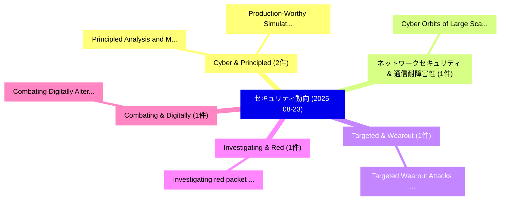

# 📅 02_daily: 日次エグゼクティブサマリー報告書 (2025-08-23)

**集計日時**: 2026-10-02 23:05:37 UTC  
**対象日付**: 2025-08-23  
**本日収集論文数**: 13 件  

---

## 💡 主要セキュリティ動向・脅威インサイト (Executive Insights)

本日の収集論文（計 13 件）において、以下の重点セキュリティ領域で活発な研究動向が確認されました：
- **Cyber & Principled** (2 件): 注目論文として 「Principled Analysis and Mitiga...」、「Production-Worthy Simulation f...」 等が発表され、実務防御および攻撃検証の進展が見られます。
- **ネットワークセキュリティ & 通信耐障害性** (1 件): 注目論文として 「Cyber Orbits of Large Scale Ne...」 等が発表され、実務防御および攻撃検証の進展が見られます。
- **Targeted & Wearout** (1 件): 注目論文として 「Targeted Wearout Attacks in Mi...」 等が発表され、実務防御および攻撃検証の進展が見られます。
- **Investigating & Red** (1 件): 注目論文として 「Investigating red packet fraud...」 等が発表され、実務防御および攻撃検証の進展が見られます。
- **Combating & Digitally** (1 件): 注目論文として 「Combating Digitally Altered Im...」 等が発表され、実務防御および攻撃検証の進展が見られます。

### 🗺️ 技術・脅威トピックマインドマップ

---

## 📌 日次セキュリティ論文一覧 (日本語表形式)

| No | arXiv ID | 論文タイトル (日本語訳) | 重要キーワード | 構造化エグゼクティブ要約 (背景・提案・影響) | 脅威分類 | 詳細リンク |
|---|---|---|---|---|---|---|
| 1 | `2508.16847v1` | [Cyber Orbits of Large Scale Network Traffic（セキュリティ分析論文）](../../okf/papers/2025-08-23/2508.16847.md) | `Large Scale Network Traffic`, `Cyber Orbits`, `Jeremy Kepner` | 【提案】概要 (Overview & Key Finding) 本論文「Cyber Orbits of Large Scale Network Traffic（セキュリティ分析論文）...。実証評価により経営層・セキュリティ管理者向け推奨アクション (E... | `cs.NI` | [arXiv](https://arxiv.org/abs/2508.16847v1) &#124; [OKF](../../okf/papers/2025-08-23/2508.16847.md) |
| 2 | `2508.16868v1` | [Targeted Wearout Attacks in Microprocessor Cores（セキュリティ分析論文）](../../okf/papers/2025-08-23/2508.16868.md) | `Targeted Wearout Attacks`, `Microprocessor Cores`, `Joshua Mashburn` | 【提案】概要 (Overview & Key Finding) 本論文「Targeted Wearout Attacks in Microprocessor Cores（セキュリティ...。実証評価によりGratz - **公開日時**: `2025-0... | `executive-summary` | [arXiv](https://arxiv.org/abs/2508.16868v1) &#124; [OKF](../../okf/papers/2025-08-23/2508.16868.md) |
| 3 | `2508.16941v2` | [Investigating red packet fraud in Android applications: Insights from user reviews（セキュリティ分析論文）](../../okf/papers/2025-08-23/2508.16941.md) | `Yu Cheng`, `Xiaofang Qi`, `Yanhui Li` | 【提案】概要 (Overview & Key Finding) 本論文「Investigating red packet fraud in Android applications:...。実証評価により経営層・セキュリティ管理者向け推奨アクション (E... | `cybersecurity` | [arXiv](https://arxiv.org/abs/2508.16941v2) &#124; [OKF](../../okf/papers/2025-08-23/2508.16941.md) |
| 4 | `2508.16975v1` | [Combating Digitally Altered Images: Deepfake Detection（セキュリティ分析論文）](../../okf/papers/2025-08-23/2508.16975.md) | `Combating Digitally Altered Images`, `Deepfake Detection`, `Saksham Kumar` | 【提案】概要 (Overview & Key Finding) 本論文「Combating Digitally Altered Images: Deepfake Detection（...。実証評価により経営層・セキュリティ管理者向け推奨アクション (E... | `cs.AI` | [arXiv](https://arxiv.org/abs/2508.16975v1) &#124; [OKF](../../okf/papers/2025-08-23/2508.16975.md) |
| 5 | `2508.16991v1` | [Principled Analysis and Mitigation of Space Cyber Risksに向けて](../../okf/papers/2025-08-23/2508.16991.md) | `Space Cyber Risks`, `Space Cyber`, `Ekzhin Ear` | 【提案】概要 (Overview & Key Finding) 本論文「Principled Analysis and Mitigation of Space Cyber Risks...。実証評価により経営層・セキュリティ管理者向け推奨アクション (E... | `cybersecurity` | [arXiv](https://arxiv.org/abs/2508.16991v1) &#124; [OKF](../../okf/papers/2025-08-23/2508.16991.md) |
| 6 | `2508.17043v1` | [ZAPS: A Zero-Knowledge Proof Protocol for Secure UAV Authentication with Flight Path Privacy（セキュリティ分析論文）](../../okf/papers/2025-08-23/2508.17043.md) | `Knowledge Proof Protocol`, `Flight Path Privacy`, `Zero-Knowledge Proof` | 【提案】概要 (Overview & Key Finding) 本論文「ZAPS: A ゼロ知識証明 Protocol for Secure UAV Authentication w...。実証評価により経営層・セキュリティ管理者向け推奨アクション (E... | `cybersecurity` | [arXiv](https://arxiv.org/abs/2508.17043v1) &#124; [OKF](../../okf/papers/2025-08-23/2508.17043.md) |
| 7 | `2508.17057v1` | [GRAID: Synthetic Data Generation with Geometric Constraints and Multi-Agentic Reflection for Harmful Content Detection（セキュリティ分析論文）](../../okf/papers/2025-08-23/2508.17057.md) | `Synthetic Data Generation`, `Harmful Content Detection`, `Geometric Constraints` | 【提案】概要 (Overview & Key Finding) 本論文「GRAID: Synthetic Data Generation with Geometric Constra...。実証評価により経営層・セキュリティ管理者向け推奨アクション (E... | `executive-summary` | [arXiv](https://arxiv.org/abs/2508.17057v1) &#124; [OKF](../../okf/papers/2025-08-23/2508.17057.md) |
| 8 | `2508.17071v1` | [Post-Quantum Blockchain: Challenges and Opportunities（セキュリティ分析論文）](../../okf/papers/2025-08-23/2508.17071.md) | `Quantum Blockchain`, `Post-Quantum Blockchain`, `Sufyan Al` | 【提案】概要 (Overview & Key Finding) 本論文「Post-量子 Blockchain: Challenges and Opportunities（セキュリティ...。実証評価により経営層・セキュリティ管理者向け推奨アクション (E... | `cybersecurity` | [arXiv](https://arxiv.org/abs/2508.17071v1) &#124; [OKF](../../okf/papers/2025-08-23/2508.17071.md) |
| 9 | `2508.17121v2` | [SyncGuard: Robust Audio Watermarking Capable of Countering Desynchronization Attacks（セキュリティ分析論文）](../../okf/papers/2025-08-23/2508.17121.md) | `Robust Audio Watermarking Capable`, `Countering Desynchronization Attacks`, `Robust Audio Watermarking Capa` | 【提案】概要 (Overview & Key Finding) 本論文「SyncGuard: Robust Audio Watermarking Capable of Counter...。実証評価により経営層・セキュリティ管理者向け推奨アクション (E... | `cs.MM` | [arXiv](https://arxiv.org/abs/2508.17121v2) &#124; [OKF](../../okf/papers/2025-08-23/2508.17121.md) |
| 10 | `2508.17135v1` | [Rao Differential Privacy（セキュリティ分析論文）](../../okf/papers/2025-08-23/2508.17135.md) | `Rao Differential Privacy`, `Carlos Soto`, `Raw Meta` | 【提案】概要 (Overview & Key Finding) 本論文「Rao 差分プライバシー（セキュリティ分析論文）」（原題: Rao 差分プライバシー / arXiv: 250...。実証評価により経営層・セキュリティ管理者向け推奨アクション (E... | `executive-summary` | [arXiv](https://arxiv.org/abs/2508.17135v1) &#124; [OKF](../../okf/papers/2025-08-23/2508.17135.md) |
| 11 | `2508.17155v1` | [Mind the Gap: Time-of-Check to Time-of-Use Vulnerabilities in LLM-Enabled Agents（セキュリティ分析論文）](../../okf/papers/2025-08-23/2508.17155.md) | `Use Vulnerabilities`, `Enabled Agents`, `LLM-Enabled Agents` | 【提案】概要 (Overview & Key Finding) 本論文「Mind the Gap: Time-of-Check to Time-of-Use Vulnerabilit...。実証評価により経営層・セキュリティ管理者向け推奨アクション (E... | `cs.AI` | [arXiv](https://arxiv.org/abs/2508.17155v1) &#124; [OKF](../../okf/papers/2025-08-23/2508.17155.md) |
| 12 | `2508.19277v1` | [POT: Inducing Overthinking in LLMs via Black-Box Iterative Optimization（セキュリティ分析論文）](../../okf/papers/2025-08-23/2508.19277.md) | `Box Iterative Optimization`, `Inducing Overthinking`, `Black-Box Iterative` | 【提案】概要 (Overview & Key Finding) 本論文「POT: Inducing Overthinking in LLMs via Black-Box Iterat...。実証評価により経営層・セキュリティ管理者向け推奨アクション (E... | `cs.AI` | [arXiv](https://arxiv.org/abs/2508.19277v1) &#124; [OKF](../../okf/papers/2025-08-23/2508.19277.md) |
| 13 | `2508.19278v2` | [Production-Worthy Simulation for Autonomous Cyber Operationsに向けて](../../okf/papers/2025-08-23/2508.19278.md) | `Worthy Simulation`, `Production-Worthy Simulation`, `Autonomous Cyber Operations` | 【提案】概要 (Overview & Key Finding) 本論文「Production-Worthy Simulation for Autonomous Cyber Opera...。実証評価により経営層・セキュリティ管理者向け推奨アクション (E... | `cs.AI` | [arXiv](https://arxiv.org/abs/2508.19278v2) &#124; [OKF](../../okf/papers/2025-08-23/2508.19278.md) |

