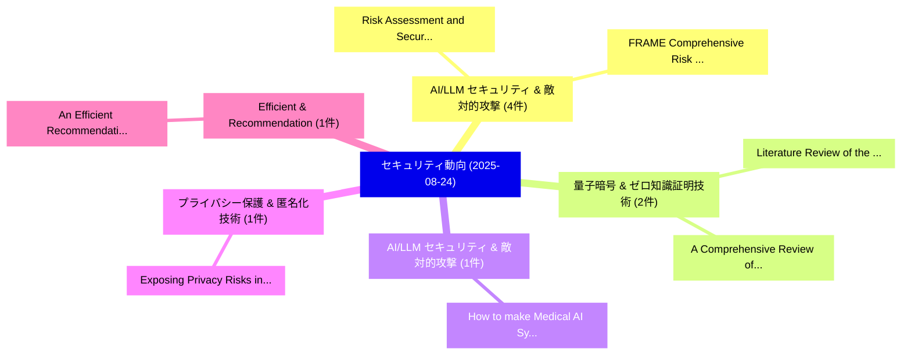

# 📅 02_daily: 日次エグゼクティブサマリー報告書 (2025-08-24)

**集計日時**: 2026-10-02 23:05:37 UTC  
**対象日付**: 2025-08-24  
**本日収集論文数**: 15 件  

---

## 💡 主要セキュリティ動向・脅威インサイト (Executive Insights)

本日の収集論文（計 15 件）において、以下の重点セキュリティ領域で活発な研究動向が確認されました：
- **AI/LLM セキュリティ & 敵対的攻撃** (4 件): 注目論文として 「Risk Assessment and Security L...」、「FRAME : Comprehensive Risk Ass...」 等が発表され、実務防御および攻撃検証の進展が見られます。
- **量子暗号 & ゼロ知識証明技術** (2 件): 注目論文として 「Literature Review of the Effec...」、「A Comprehensive Review of Deni...」 等が発表され、実務防御および攻撃検証の進展が見られます。
- **AI/LLM セキュリティ & 敵対的攻撃** (1 件): 注目論文として 「How to make Medical AI Systems...」 等が発表され、実務防御および攻撃検証の進展が見られます。
- **プライバシー保護 & 匿名化技術** (1 件): 注目論文として 「Exposing Privacy Risks in Grap...」 等が発表され、実務防御および攻撃検証の進展が見られます。
- **Efficient & Recommendation** (1 件): 注目論文として 「An Efficient Recommendation Fi...」 等が発表され、実務防御および攻撃検証の進展が見られます。

### 🗺️ 技術・脅威トピックマインドマップ

---

## 📌 日次セキュリティ論文一覧 (日本語表形式)

| No | arXiv ID | 論文タイトル (日本語訳) | 重要キーワード | 構造化エグゼクティブ要約 (背景・提案・影響) | 脅威分類 | 詳細リンク |
|---|---|---|---|---|---|---|
| 1 | `2508.17215v2` | [How to make Medical AI Systems safer? Simulating Vulnerabilities, and Threats in Multimodal Medical RAG System（セキュリティ分析論文）](../../okf/papers/2025-08-24/2508.17215.md) | `Simulating Vulnerabilities`, `Multimodal Medical`, `Kaiwen Zuo` | 【提案】Simulating Vulnerabilities, and Threats in Multimodal Medical RAG System ### (日本語題名: Ho...。実証評価により経営層・セキュリティ管理者向け推奨アクション (E... | `cs.AI` | [arXiv](https://arxiv.org/abs/2508.17215v2) &#124; [OKF](../../okf/papers/2025-08-24/2508.17215.md) |
| 2 | `2508.17222v1` | [Exposing Privacy Risks in Graph Retrieval-Augmented Generation（セキュリティ分析論文）](../../okf/papers/2025-08-24/2508.17222.md) | `Exposing Privacy Risks`, `Graph Retrieval`, `Augmented Generation` | 【提案】概要 (Overview & Key Finding) 本論文「Exposing Privacy Risks in Graph Retrieval-Augmented Gen...。実証評価により経営層・セキュリティ管理者向け推奨アクション (E... | `cs.AI` | [arXiv](https://arxiv.org/abs/2508.17222v1) &#124; [OKF](../../okf/papers/2025-08-24/2508.17222.md) |
| 3 | `2508.17296v2` | [Literature Review of the Effect of Quantum Computing on Cryptocurrencies using Blockchain Technology（セキュリティ分析論文）](../../okf/papers/2025-08-24/2508.17296.md) | `Literature Review`, `Quantum Computing`, `Blockchain Technology` | 【提案】概要 (Overview & Key Finding) 本論文「Literature Review of the Effect of 量子 Computing on Cryp...。実証評価により経営層・セキュリティ管理者向け推奨アクション (E... | `cybersecurity` | [arXiv](https://arxiv.org/abs/2508.17296v2) &#124; [OKF](../../okf/papers/2025-08-24/2508.17296.md) |
| 4 | `2508.17304v3` | [An Efficient Recommendation Filtering-based Trust Model for Internet of Thingsのセキュリティ強化](../../okf/papers/2025-08-24/2508.17304.md) | `Trust Model`, `Filtering-based Trust`, `Securing Internet` | 【提案】概要 (Overview & Key Finding) 本論文「An Efficient Recommendation Filtering-based Trust Model...。実証評価により経営層・セキュリティ管理者向け推奨アクション (E... | `cybersecurity` | [arXiv](https://arxiv.org/abs/2508.17304v3) &#124; [OKF](../../okf/papers/2025-08-24/2508.17304.md) |
| 5 | `2508.17329v3` | [Risk Assessment and Security Large Language Modelsの分析](../../okf/papers/2025-08-24/2508.17329.md) | `Risk Assessment`, `Large Language Models`, `Security Large Language` | 【提案】概要 (Overview & Key Finding) 本論文「Risk Assessment and Security Large Language Modelsの分析」（...。実証評価により経営層・セキュリティ管理者向け推奨アクション (E... | `cybersecurity` | [arXiv](https://arxiv.org/abs/2508.17329v3) &#124; [OKF](../../okf/papers/2025-08-24/2508.17329.md) |
| 6 | `2508.17341v3` | [MetaFed: Advancing Privacy, Performance, and Sustainability in Federated Metaverse Systems（セキュリティ分析論文）](../../okf/papers/2025-08-24/2508.17341.md) | `Federated Metaverse Systems`, `Advancing Privacy`, `Muhammet Anil Yagiz` | 【提案】概要 (Overview & Key Finding) 本論文「MetaFed: Advancing Privacy, Performance, and Sustainabi...。実証評価により経営層・セキュリティ管理者向け推奨アクション (E... | `cs.ET` | [arXiv](https://arxiv.org/abs/2508.17341v3) &#124; [OKF](../../okf/papers/2025-08-24/2508.17341.md) |
| 7 | `2508.17361v2` | [Trust Me, I Know This Function: Hijacking LLM Static Analysis using Bias（セキュリティ分析論文）](../../okf/papers/2025-08-24/2508.17361.md) | `Shir Bernstein`, `David Beste`, `Daniel Ayzenshteyn` | 【提案】概要 (Overview & Key Finding) 本論文「Trust Me, I Know This Function: Hijacking LLM Static An...。実証評価により経営層・セキュリティ管理者向け推奨アクション (E... | `executive-summary` | [arXiv](https://arxiv.org/abs/2508.17361v2) &#124; [OKF](../../okf/papers/2025-08-24/2508.17361.md) |
| 8 | `2508.17405v1` | [FRAME : Comprehensive Risk Assessment Framework for Adversarial Machine Learning Threats（セキュリティ分析論文）](../../okf/papers/2025-08-24/2508.17405.md) | `Adversarial Machine Learning Threats`, `Avishag Shapira`, `Simon Shigol` | 【提案】概要 (Overview & Key Finding) 本論文「FRAME : Comprehensive Risk Assessment Framework for Adv...。実証評価により経営層・セキュリティ管理者向け推奨アクション (E... | `executive-summary` | [arXiv](https://arxiv.org/abs/2508.17405v1) &#124; [OKF](../../okf/papers/2025-08-24/2508.17405.md) |
| 9 | `2508.17414v1` | [Cyber Security Educational Games for Children: A Systematic Literature Review（セキュリティ分析論文）](../../okf/papers/2025-08-24/2508.17414.md) | `Cyber Security Educational Games`, `Systematic Literature Review`, `Temesgen Kitaw Damenu` | 【提案】概要 (Overview & Key Finding) 本論文「Cyber Security Educational Games for Children: A System...。実証評価により経営層・セキュリティ管理者向け推奨アクション (E... | `executive-summary` | [arXiv](https://arxiv.org/abs/2508.17414v1) &#124; [OKF](../../okf/papers/2025-08-24/2508.17414.md) |
| 10 | `2508.17481v2` | [SoK: サイバーセキュリティ Assessment of Humanoid Ecosystem](../../okf/papers/2025-08-24/2508.17481.md) | `Humanoid Ecosystem`, `Cybersecurity Assessment`, `Priyanka Prakash Surve` | 【提案】概要 (Overview & Key Finding) 本論文「SoK: サイバーセキュリティ Assessment of Humanoid Ecosystem」（原題: S...。実証評価により経営層・セキュリティ管理者向け推奨アクション (E... | `executive-summary` | [arXiv](https://arxiv.org/abs/2508.17481v2) &#124; [OKF](../../okf/papers/2025-08-24/2508.17481.md) |
| 11 | `2508.18318v1` | [ZTFed-MAS2S: A Zero-Trust 連合学習 Framework with Verifiable Privacy and Trust-Aware Aggregation for Wind Power Data Imputation](../../okf/papers/2025-08-24/2508.18318.md) | `Wind Power Data Imputation`, `Verifiable Privacy`, `Aware Aggregation` | 【提案】概要 (Overview & Key Finding) 本論文「ZTFed-MAS2S: A ゼロトラスト 連合学習 Framework with Verifiable Pr...。実証評価により経営層・セキュリティ管理者向け推奨アクション (E... | `executive-summary` | [arXiv](https://arxiv.org/abs/2508.18318v1) &#124; [OKF](../../okf/papers/2025-08-24/2508.18318.md) |
| 12 | `2508.19281v1` | [CORTEX: Composite Overlay for Risk Tiering and Exposure in Operational AI Systems（セキュリティ分析論文）](../../okf/papers/2025-08-24/2508.19281.md) | `Composite Overlay`, `Risk Tiering`, `Kin Choong Yow` | 【提案】概要 (Overview & Key Finding) 本論文「CORTEX: Composite Overlay for Risk Tiering and Exposure...。実証評価により経営層・セキュリティ管理者向け推奨アクション (E... | `cs.AI` | [arXiv](https://arxiv.org/abs/2508.19281v1) &#124; [OKF](../../okf/papers/2025-08-24/2508.19281.md) |
| 13 | `2508.19283v1` | [Rethinking Denial-of-Service: A Conditional Taxonomy Unifying Availability and Sustainability Threats（セキュリティ分析論文）](../../okf/papers/2025-08-24/2508.19283.md) | `Conditional Taxonomy Unifying Availability`, `Rethinking Denial`, `Sustainability Threats` | 【提案】概要 (Overview & Key Finding) 本論文「Rethinking Denial-of-Service: A Conditional Taxonomy Un...。実証評価により経営層・セキュリティ管理者向け推奨アクション (E... | `cybersecurity` | [arXiv](https://arxiv.org/abs/2508.19283v1) &#124; [OKF](../../okf/papers/2025-08-24/2508.19283.md) |
| 14 | `2508.19284v1` | [A Comprehensive Review of Denial of Wallet Attacks in Serverless Architectures（セキュリティ分析論文）](../../okf/papers/2025-08-24/2508.19284.md) | `Comprehensive Review`, `Wallet Attacks`, `Serverless Architectures` | 【提案】概要 (Overview & Key Finding) 本論文「A Comprehensive Review of Denial of Wallet Attacks in S...。実証評価により経営層・セキュリティ管理者向け推奨アクション (E... | `cybersecurity` | [arXiv](https://arxiv.org/abs/2508.19284v1) &#124; [OKF](../../okf/papers/2025-08-24/2508.19284.md) |
| 15 | `2509.00043v1` | [Keystroke Detection by Exploiting Unintended RF Emission from Repaired USB Keyboards（セキュリティ分析論文）](../../okf/papers/2025-08-24/2509.00043.md) | `Keystroke Detection`, `Exploiting Unintended`, `Md Faizul Bari` | 【提案】概要 (Overview & Key Finding) 本論文「Keystroke Detection by Exploiting Unintended RF Emissio...。実証評価により経営層・セキュリティ管理者向け推奨アクション (E... | `cybersecurity` | [arXiv](https://arxiv.org/abs/2509.00043v1) &#124; [OKF](../../okf/papers/2025-08-24/2509.00043.md) |

