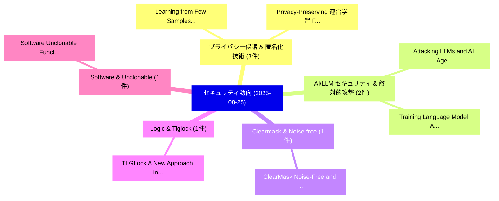

# 📅 02_daily: 日次エグゼクティブサマリー報告書 (2025-08-25)

**集計日時**: 2026-10-02 23:05:37 UTC  
**対象日付**: 2025-08-25  
**本日収集論文数**: 23 件  

---

## 💡 主要セキュリティ動向・脅威インサイト (Executive Insights)

本日の収集論文（計 23 件）において、以下の重点セキュリティ領域で活発な研究動向が確認されました：
- **プライバシー保護 & 匿名化技術** (3 件): 注目論文として 「Learning from Few Samples: A N...」、「Privacy-Preserving 連合学習 Framew...」 等が発表され、実務防御および攻撃検証の進展が見られます。
- **AI/LLM セキュリティ & 敵対的攻撃** (2 件): 注目論文として 「Attacking LLMs and AI Agents: ...」、「Training Language Model Agents...」 等が発表され、実務防御および攻撃検証の進展が見られます。
- **Clearmask & Noise-free** (1 件): 注目論文として 「ClearMask: Noise-Free and Natu...」 等が発表され、実務防御および攻撃検証の進展が見られます。
- **Logic & Tlglock** (1 件): 注目論文として 「TLGLock: A New Approach in Log...」 等が発表され、実務防御および攻撃検証の進展が見られます。
- **Software & Unclonable** (1 件): 注目論文として 「Software Unclonable Functions ...」 等が発表され、実務防御および攻撃検証の進展が見られます。

### 🗺️ 技術・脅威トピックマインドマップ

---

## 📌 日次セキュリティ論文一覧 (日本語表形式)

| No | arXiv ID | 論文タイトル (日本語訳) | 重要キーワード | 構造化エグゼクティブ要約 (背景・提案・影響) | 脅威分類 | 詳細リンク |
|---|---|---|---|---|---|---|
| 1 | `2508.17660v1` | [ClearMask: Noise-Free and Naturalness-Preserving Protection Against Voice Deepfake Attacks（セキュリティ分析論文）](../../okf/papers/2025-08-25/2508.17660.md) | `Naturalness-Preserving Protection`, `Yuanda Wang`, `Bocheng Chen` | 【提案】概要 (Overview & Key Finding) 本論文「ClearMask: Noise-Free and Naturalness-Preserving Protec...。実証評価により経営層・セキュリティ管理者向け推奨アクション (E... | `executive-summary` | [arXiv](https://arxiv.org/abs/2508.17660v1) &#124; [OKF](../../okf/papers/2025-08-25/2508.17660.md) |
| 2 | `2508.17674v2` | [Attacking LLMs and AI Agents: Advertisement Embedding Attacks Against 大規模言語モデル](../../okf/papers/2025-08-25/2508.17674.md) | `Qiming Guo`, `Jinwen Tang`, `Xingran Huang` | 【提案】概要 (Overview & Key Finding) 本論文「Attacking LLMs and AI Agents: Advertisement Embedding A...。実証評価により経営層・セキュリティ管理者向け推奨アクション (E... | `cs.AI` | [arXiv](https://arxiv.org/abs/2508.17674v2) &#124; [OKF](../../okf/papers/2025-08-25/2508.17674.md) |
| 3 | `2508.17809v1` | [TLGLock: A New Approach in Logic Locking Using Key-Driven Charge Recycling in Threshold Logic Gates（セキュリティ分析論文）](../../okf/papers/2025-08-25/2508.17809.md) | `Logic Locking Using Key`, `Driven Charge Recycling`, `Threshold Logic Gates` | 【提案】概要 (Overview & Key Finding) 本論文「TLGLock: A New Approach in Logic Locking Using Key-Driv...。実証評価により経営層・セキュリティ管理者向け推奨アクション (E... | `cs.ET` | [arXiv](https://arxiv.org/abs/2508.17809v1) &#124; [OKF](../../okf/papers/2025-08-25/2508.17809.md) |
| 4 | `2508.17853v1` | [Software Unclonable Functions for IoT Devices Identification and Security（セキュリティ分析論文）](../../okf/papers/2025-08-25/2508.17853.md) | `Software Unclonable Functions`, `Devices Identification`, `Saeed Alshehhi` | 【提案】概要 (Overview & Key Finding) 本論文「Software Unclonable Functions for IoT Devices Identific...。実証評価により経営層・セキュリティ管理者向け推奨アクション (E... | `cybersecurity` | [arXiv](https://arxiv.org/abs/2508.17853v1) &#124; [OKF](../../okf/papers/2025-08-25/2508.17853.md) |
| 5 | `2508.17856v1` | [MalLoc: Toward Fine-grained Android Malicious Payload Localization via LLMs（セキュリティ分析論文）](../../okf/papers/2025-08-25/2508.17856.md) | `Android Malicious Payload Localization`, `Toward Fine`, `Fine-grained Android` | 【提案】概要 (Overview & Key Finding) 本論文「MalLoc: Toward Fine-grained Android Malicious Payload L...。実証評価により経営層・セキュリティ管理者向け推奨アクション (E... | `executive-summary` | [arXiv](https://arxiv.org/abs/2508.17856v1) &#124; [OKF](../../okf/papers/2025-08-25/2508.17856.md) |
| 6 | `2508.17884v2` | [PhantomLint: Principled Hidden LLM Prompts in Structured Documentsの検出](../../okf/papers/2025-08-25/2508.17884.md) | `Principled Detection`, `Structured Documents`, `Principled Hidden` | 【提案】概要 (Overview & Key Finding) 本論文「PhantomLint: Principled Hidden LLM Prompts in Structure...。実証評価により経営層・セキュリティ管理者向け推奨アクション (E... | `cybersecurity` | [arXiv](https://arxiv.org/abs/2508.17884v2) &#124; [OKF](../../okf/papers/2025-08-25/2508.17884.md) |
| 7 | `2508.17913v1` | [PRZK-Bind: A Physically Rooted Zero-Knowledge Authentication Protocol for Secure Digital Twin Binding in Smart Cities（セキュリティ分析論文）](../../okf/papers/2025-08-25/2508.17913.md) | `Secure Digital Twin Binding`, `Physically Rooted Zero`, `Knowledge Authentication Protocol` | 【提案】概要 (Overview & Key Finding) 本論文「PRZK-Bind: A Physically Rooted Zero-Knowledge Authentic...。実証評価により経営層・セキュリティ管理者向け推奨アクション (E... | `cs.NI` | [arXiv](https://arxiv.org/abs/2508.17913v1) &#124; [OKF](../../okf/papers/2025-08-25/2508.17913.md) |
| 8 | `2508.17964v3` | [MoveScanner: Security Risks of Move Smart Contractsの分析](../../okf/papers/2025-08-25/2508.17964.md) | `Security Risks`, `Move Smart Contracts`, `Move Smart` | 【提案】概要 (Overview & Key Finding) 本論文「MoveScanner: Security Risks of Move スマートコントラクトsの分析」（原題:...。実証評価により経営層・セキュリティ管理者向け推奨アクション (E... | `cybersecurity` | [arXiv](https://arxiv.org/abs/2508.17964v3) &#124; [OKF](../../okf/papers/2025-08-25/2508.17964.md) |
| 9 | `2508.18109v1` | [Aligning Core Aspects: Improving Vulnerability Proof-of-Concepts via Cross-Source Insights（セキュリティ分析論文）](../../okf/papers/2025-08-25/2508.18109.md) | `Aligning Core Aspects`, `Improving Vulnerability Proof`, `Source Insights` | 【提案】概要 (Overview & Key Finding) 本論文「Aligning Core Aspects: Improving 脆弱性 Proof-of-Concepts ...。実証評価により経営層・セキュリティ管理者向け推奨アクション (E... | `cybersecurity` | [arXiv](https://arxiv.org/abs/2508.18109v1) &#124; [OKF](../../okf/papers/2025-08-25/2508.18109.md) |
| 10 | `2508.18148v1` | [Learning from Few Samples: A Novel Approach for High-Quality Malcode Generation（セキュリティ分析論文）](../../okf/papers/2025-08-25/2508.18148.md) | `Quality Malcode Generation`, `High-Quality Malcode`, `Haijian Ma` | 【提案】概要 (Overview & Key Finding) 本論文「Learning from Few Samples: A Novel Approach for High-Qu...。実証評価により経営層・セキュリティ管理者向け推奨アクション (E... | `cs.AI` | [arXiv](https://arxiv.org/abs/2508.18148v1) &#124; [OKF](../../okf/papers/2025-08-25/2508.18148.md) |
| 11 | `2508.18155v2` | [$AutoGuardX$: A Comprehensive サイバーセキュリティ Framework for Connected Vehicles](../../okf/papers/2025-08-25/2508.18155.md) | `Connected Vehicles`, `Muhammad Ali Nadeem`, `Bishwo Prakash Pokharel` | 【提案】概要 (Overview & Key Finding) 本論文「$AutoGuardX$: A Comprehensive サイバーセキュリティ Framework for ...。実証評価により経営層・セキュリティ管理者向け推奨アクション (E... | `cs.ET` | [arXiv](https://arxiv.org/abs/2508.18155v2) &#124; [OKF](../../okf/papers/2025-08-25/2508.18155.md) |
| 12 | `2508.18370v2` | [Training Language Model Agents to Find Vulnerabilities with CTF-Dojo（セキュリティ分析論文）](../../okf/papers/2025-08-25/2508.18370.md) | `Training Language Model Agents`, `Find Vulnerabilities`, `Terry Yue Zhuo` | 【提案】概要 (Overview & Key Finding) 本論文「Training Language Model Agents to Find Vulnerabilities ...。実証評価により経営層・セキュリティ管理者向け推奨アクション (E... | `executive-summary` | [arXiv](https://arxiv.org/abs/2508.18370v2) &#124; [OKF](../../okf/papers/2025-08-25/2508.18370.md) |
| 13 | `2508.18415v1` | [Face and Fingerprint Templates in Humanitarian Biometric Systemsのセキュリティ強化](../../okf/papers/2025-08-25/2508.18415.md) | `Fingerprint Templates`, `Humanitarian Biometric Systems`, `Securing Face` | 【提案】概要 (Overview & Key Finding) 本論文「Face and Fingerprint Templates in Humanitarian Biometri...。実証評価により経営層・セキュリティ管理者向け推奨アクション (E... | `cs.CV` | [arXiv](https://arxiv.org/abs/2508.18415v1) &#124; [OKF](../../okf/papers/2025-08-25/2508.18415.md) |
| 14 | `2508.18439v2` | [A Systematic Approach to Predict the Impact of サイバーセキュリティ Vulnerabilities Using LLMs](../../okf/papers/2025-08-25/2508.18439.md) | `Cybersecurity Vulnerabilities Using`, `Vulnerabilities Using`, `Pierre Lison` | 【提案】概要 (Overview & Key Finding) 本論文「A Systematic Approach to Predict the Impact of サイバーセキュリ...。実証評価により経営層・セキュリティ管理者向け推奨アクション (E... | `cs.AI` | [arXiv](https://arxiv.org/abs/2508.18439v2) &#124; [OKF](../../okf/papers/2025-08-25/2508.18439.md) |
| 15 | `2508.18453v3` | [Privacy-Preserving 連合学習 Framework for Risk-Based Adaptive Authentication](../../okf/papers/2025-08-25/2508.18453.md) | `Based Adaptive Authentication`, `Risk-Based Adaptive`, `Privacy-Preserving Federated` | 【提案】概要 (Overview & Key Finding) 本論文「Privacy-Preserving 連合学習 Framework for Risk-Based Adapti...。実証評価により経営層・セキュリティ管理者向け推奨アクション (E... | `cybersecurity` | [arXiv](https://arxiv.org/abs/2508.18453v3) &#124; [OKF](../../okf/papers/2025-08-25/2508.18453.md) |
| 16 | `2508.18485v1` | [An 8- and 12-bit block AES cipher（セキュリティ分析論文）](../../okf/papers/2025-08-25/2508.18485.md) | `12-bit block`, `Raw Meta`, `Executive Summary` | 【提案】概要 (Overview & Key Finding) 本論文「An 8- and 12-bit block AES cipher（セキュリティ分析論文）」（原題: An 8...。実証評価によりBreuer - **公開日時**: `2025-... | `executive-summary` | [arXiv](https://arxiv.org/abs/2508.18485v1) &#124; [OKF](../../okf/papers/2025-08-25/2508.18485.md) |
| 17 | `2508.18488v1` | [Collaborative Intelligence: Topic Modelling of Large Language Model use in Live サイバーセキュリティ Operations](../../okf/papers/2025-08-25/2508.18488.md) | `Large Language Model`, `Collaborative Intelligence`, `Topic Modelling` | 【提案】概要 (Overview & Key Finding) 本論文「Collaborative Intelligence: Topic Modelling of Large La...。実証評価により経営層・セキュリティ管理者向け推奨アクション (E... | `cs.AI` | [arXiv](https://arxiv.org/abs/2508.18488v1) &#124; [OKF](../../okf/papers/2025-08-25/2508.18488.md) |
| 18 | `2508.19286v1` | [RL-Finetuned LLMs for Privacy-Preserving Synthetic Rewriting（セキュリティ分析論文）](../../okf/papers/2025-08-25/2508.19286.md) | `Preserving Synthetic Rewriting`, `RL-Finetuned LLMs`, `Privacy-Preserving Synthetic` | 【提案】概要 (Overview & Key Finding) 本論文「RL-Finetuned LLMs for Privacy-Preserving Synthetic Rewr...。実証評価により経営層・セキュリティ管理者向け推奨アクション (E... | `cs.AI` | [arXiv](https://arxiv.org/abs/2508.19286v1) &#124; [OKF](../../okf/papers/2025-08-25/2508.19286.md) |
| 19 | `2508.19287v1` | [Prompt-in-Content Attacks: Exploiting Uploaded Inputs to Hijack LLM Behavior（セキュリティ分析論文）](../../okf/papers/2025-08-25/2508.19287.md) | `Exploiting Uploaded Inputs`, `Content Attacks`, `Zhuotao Lian` | 【提案】概要 (Overview & Key Finding) 本論文「Prompt-in-Content Attacks: Exploiting Uploaded Inputs t...。実証評価により経営層・セキュリティ管理者向け推奨アクション (E... | `cs.AI` | [arXiv](https://arxiv.org/abs/2508.19287v1) &#124; [OKF](../../okf/papers/2025-08-25/2508.19287.md) |
| 20 | `2508.19288v1` | [Tricking LLM-Based NPCs into Spilling Secrets（セキュリティ分析論文）](../../okf/papers/2025-08-25/2508.19288.md) | `Spilling Secrets`, `LLM-Based NPCs`, `Kyohei Shiomi` | 【提案】概要 (Overview & Key Finding) 本論文「Tricking LLM-Based NPCs into Spilling Secrets（セキュリティ分析論...。実証評価により経営層・セキュリティ管理者向け推奨アクション (E... | `cs.AI` | [arXiv](https://arxiv.org/abs/2508.19288v1) &#124; [OKF](../../okf/papers/2025-08-25/2508.19288.md) |
| 21 | `2508.19292v1` | [Stand on The Shoulders of Giants: Building JailExpert from Previous Attack Experience（セキュリティ分析論文）](../../okf/papers/2025-08-25/2508.19292.md) | `Previous Attack Experience`, `Xi Wang`, `Songlei Jian` | 【提案】概要 (Overview & Key Finding) 本論文「Stand on The Shoulders of Giants: Building JailExpert f...。実証評価により経営層・セキュリティ管理者向け推奨アクション (E... | `cs.AI` | [arXiv](https://arxiv.org/abs/2508.19292v1) &#124; [OKF](../../okf/papers/2025-08-25/2508.19292.md) |
| 22 | `2509.00059v1` | [Cryptographic Challenges: Masking Sensitive Data in Cyber Crimes through ASCII Art（セキュリティ分析論文）](../../okf/papers/2025-08-25/2509.00059.md) | `Masking Sensitive Data`, `Cryptographic Challenges`, `Cyber Crimes` | 【提案】概要 (Overview & Key Finding) 本論文「Cryptographic Challenges: Masking Sensitive Data in Cyb...。実証評価により経営層・セキュリティ管理者向け推奨アクション (E... | `cybersecurity` | [arXiv](https://arxiv.org/abs/2509.00059v1) &#124; [OKF](../../okf/papers/2025-08-25/2509.00059.md) |
| 23 | `2509.02578v1` | [Secure Password Generator Based on Secure Pseudo-Random Number Generator（セキュリティ分析論文）](../../okf/papers/2025-08-25/2509.02578.md) | `Secure Password Generator Based`, `Random Number Generator`, `Secure Pseudo` | 【提案】概要 (Overview & Key Finding) 本論文「Secure Password Generator Based on Secure Pseudo-Random...。実証評価により経営層・セキュリティ管理者向け推奨アクション (E... | `executive-summary` | [arXiv](https://arxiv.org/abs/2509.02578v1) &#124; [OKF](../../okf/papers/2025-08-25/2509.02578.md) |

