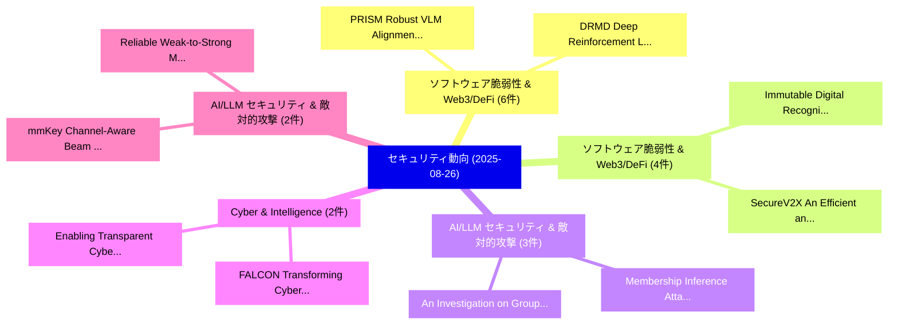

# 📅 02_daily: 日次エグゼクティブサマリー報告書 (2025-08-26)

**集計日時**: 2026-10-02 23:05:37 UTC  
**対象日付**: 2025-08-26  
**本日収集論文数**: 32 件  

---

## 💡 主要セキュリティ動向・脅威インサイト (Executive Insights)

本日の収集論文（計 32 件）において、以下の重点セキュリティ領域で活発な研究動向が確認されました：
- **ソフトウェア脆弱性 & Web3/DeFi** (6 件): 注目論文として 「PRISM: Robust VLM Alignment wi...」、「DRMD: Deep Reinforcement Learn...」 等が発表され、実務防御および攻撃検証の進展が見られます。
- **ソフトウェア脆弱性 & Web3/DeFi** (4 件): 注目論文として 「Immutable Digital Recognition ...」、「SecureV2X: An Efficient and Pr...」 等が発表され、実務防御および攻撃検証の進展が見られます。
- **AI/LLM セキュリティ & 敵対的攻撃** (3 件): 注目論文として 「Membership Inference Attacks o...」、「An Investigation on Group Quer...」 等が発表され、実務防御および攻撃検証の進展が見られます。
- **Cyber & Intelligence** (2 件): 注目論文として 「FALCON: Transforming Cyber Thr...」、「Enabling Transparent Cyber Thr...」 等が発表され、実務防御および攻撃検証の進展が見られます。
- **AI/LLM セキュリティ & 敵対的攻撃** (2 件): 注目論文として 「mmKey: Channel-Aware Beam Shap...」、「Reliable Weak-to-Strong Monito...」 等が発表され、実務防御および攻撃検証の進展が見られます。

### 🗺️ 技術・脅威トピックマインドマップ

---

## 📌 日次セキュリティ論文一覧 (日本語表形式)

| No | arXiv ID | 論文タイトル (日本語訳) | 重要キーワード | 構造化エグゼクティブ要約 (背景・提案・影響) | 脅威分類 | 詳細リンク |
|---|---|---|---|---|---|---|
| 1 | `2508.18649v2` | [PRISM: Robust VLM Alignment with Principled Reasoning for Integrated Safety in Multimodality（セキュリティ分析論文）](../../okf/papers/2025-08-26/2508.18649.md) | `Principled Reasoning`, `Integrated Safety`, `Nanxi Li` | 【提案】概要 (Overview & Key Finding) 本論文「PRISM: Robust VLM Alignment with Principled Reasoning f...。実証評価により経営層・セキュリティ管理者向け推奨アクション (E... | `cs.AI` | [arXiv](https://arxiv.org/abs/2508.18649v2) &#124; [OKF](../../okf/papers/2025-08-26/2508.18649.md) |
| 2 | `2508.18652v1` | [UniC-RAG: Universal Knowledge Corruption Attacks to Retrieval-Augmented Generation（セキュリティ分析論文）](../../okf/papers/2025-08-26/2508.18652.md) | `Universal Knowledge Corruption Attacks`, `Augmented Generation`, `Retrieval-Augmented Generation` | 【提案】概要 (Overview & Key Finding) 本論文「UniC-RAG: Universal Knowledge Corruption Attacks to Ret...。実証評価により経営層・セキュリティ管理者向け推奨アクション (E... | `executive-summary` | [arXiv](https://arxiv.org/abs/2508.18652v1) &#124; [OKF](../../okf/papers/2025-08-26/2508.18652.md) |
| 3 | `2508.18665v6` | [Membership Inference Attacks on In-Context Examples in LLM-based Recommender Systems（セキュリティ分析論文）](../../okf/papers/2025-08-26/2508.18665.md) | `Membership Inference Attacks`, `Context Examples`, `Recommender Systems` | 【提案】概要 (Overview & Key Finding) 本論文「Membership Inference Attacks on In-Context Examples in ...。実証評価により経営層・セキュリティ管理者向け推奨アクション (E... | `cs.AI` | [arXiv](https://arxiv.org/abs/2508.18665v6) &#124; [OKF](../../okf/papers/2025-08-26/2508.18665.md) |
| 4 | `2508.18684v2` | [FALCON: Transforming Cyber Threat Intelligence into Deployable IDS Rules with Self-Reflection（セキュリティ分析論文）](../../okf/papers/2025-08-26/2508.18684.md) | `Transforming Cyber Threat Intelligence`, `Md Rayhanur Rahman`, `Shaswata Mitra` | 【提案】概要 (Overview & Key Finding) 本論文「FALCON: Transforming Cyber 脅威 Intelligence into Deploya...。実証評価により経営層・セキュリティ管理者向け推奨アクション (E... | `cs.AI` | [arXiv](https://arxiv.org/abs/2508.18684v2) &#124; [OKF](../../okf/papers/2025-08-26/2508.18684.md) |
| 5 | `2508.18750v2` | [Immutable Digital Recognition via Blockchain（セキュリティ分析論文）](../../okf/papers/2025-08-26/2508.18750.md) | `Immutable Digital Recognition`, `Zeng Zhang`, `Xiaoqi Li` | 【提案】概要 (Overview & Key Finding) 本論文「Immutable Digital Recognition via Blockchain（セキュリティ分析論文...。実証評価により経営層・セキュリティ管理者向け推奨アクション (E... | `cybersecurity` | [arXiv](https://arxiv.org/abs/2508.18750v2) &#124; [OKF](../../okf/papers/2025-08-26/2508.18750.md) |
| 6 | `2508.18805v1` | [Hidden Tail: Adversarial Image Causing Stealthy Resource Consumption in Vision-Language Models（セキュリティ分析論文）](../../okf/papers/2025-08-26/2508.18805.md) | `Adversarial Image Causing Stealthy Resource Consumption`, `Hidden Tail`, `Language Models` | 【提案】概要 (Overview & Key Finding) 本論文「Hidden Tail: Adversarial Image Causing Stealthy Resourc...。実証評価により経営層・セキュリティ管理者向け推奨アクション (E... | `cs.CV` | [arXiv](https://arxiv.org/abs/2508.18805v1) &#124; [OKF](../../okf/papers/2025-08-26/2508.18805.md) |
| 7 | `2508.18811v2` | [Quantum computing on encrypted data with arbitrary rotation gates（セキュリティ分析論文）](../../okf/papers/2025-08-26/2508.18811.md) | `Manoj Kumar Mishra`, `Mohit Joshi`, `Raw Meta` | 【提案】概要 (Overview & Key Finding) 本論文「量子 computing on encrypted data with arbitrary rotation ...。実証評価によりKarthikeyan - **公開日時**。 | `executive-summary` | [arXiv](https://arxiv.org/abs/2508.18811v2) &#124; [OKF](../../okf/papers/2025-08-26/2508.18811.md) |
| 8 | `2508.18832v1` | [A Tight Context-aware Privacy Bound for Histogram Publication（セキュリティ分析論文）](../../okf/papers/2025-08-26/2508.18832.md) | `Tight Context`, `Privacy Bound`, `Histogram Publication` | 【提案】概要 (Overview & Key Finding) 本論文「A Tight Context-aware Privacy Bound for Histogram Publi...。実証評価により経営層・セキュリティ管理者向け推奨アクション (E... | `executive-summary` | [arXiv](https://arxiv.org/abs/2508.18832v1) &#124; [OKF](../../okf/papers/2025-08-26/2508.18832.md) |
| 9 | `2508.18839v2` | [DRMD: Deep Reinforcement Learning for マルウェア検出 under Concept Drift](../../okf/papers/2025-08-26/2508.18839.md) | `Deep Reinforcement Learning`, `Concept Drift`, `Malware Detection` | 【提案】概要 (Overview & Key Finding) 本論文「DRMD: Deep Reinforcement Learning for マルウェア検出 under Con...。実証評価により経営層・セキュリティ管理者向け推奨アクション (E... | `executive-summary` | [arXiv](https://arxiv.org/abs/2508.18839v2) &#124; [OKF](../../okf/papers/2025-08-26/2508.18839.md) |
| 10 | `2508.18933v1` | [VISION: Robust and Interpretable Code 脆弱性検出 Leveraging Counterfactual Augmentation](../../okf/papers/2025-08-26/2508.18933.md) | `Interpretable Code Vulnerability Detection Leveraging Counterfactual Augmentation`, `Leveraging Counterfactual Augmentation`, `Interpretable Code` | 【提案】概要 (Overview & Key Finding) 本論文「VISION: Robust and Interpretable Code 脆弱性検出 Leveraging ...。実証評価により経営層・セキュリティ管理者向け推奨アクション (E... | `cs.AI` | [arXiv](https://arxiv.org/abs/2508.18933v1) &#124; [OKF](../../okf/papers/2025-08-26/2508.18933.md) |
| 11 | `2508.18942v1` | [EnerSwap: Large-Scale, Privacy-First Automated Market Maker for V2G Energy Trading（セキュリティ分析論文）](../../okf/papers/2025-08-26/2508.18942.md) | `First Automated Market Maker`, `Energy Trading`, `Privacy-First Automated` | 【提案】概要 (Overview & Key Finding) 本論文「EnerSwap: Large-Scale, Privacy-First Automated Market M...。実証評価により経営層・セキュリティ管理者向け推奨アクション (E... | `cybersecurity` | [arXiv](https://arxiv.org/abs/2508.18942v1) &#124; [OKF](../../okf/papers/2025-08-26/2508.18942.md) |
| 12 | `2508.18947v2` | [LLMs in the SOC: Human-AI Collaboration in Security Operations Centresの実証研究](../../okf/papers/2025-08-26/2508.18947.md) | `Human-AI Collaboration`, `Security Operations`, `Security Operations Centres` | 【提案】概要 (Overview & Key Finding) 本論文「LLMs in the SOC: Human-AI Collaboration in Security Ope...。実証評価により経営層・セキュリティ管理者向け推奨アクション (E... | `cybersecurity` | [arXiv](https://arxiv.org/abs/2508.18947v2) &#124; [OKF](../../okf/papers/2025-08-26/2508.18947.md) |
| 13 | `2508.18976v1` | [The Double-edged Sword of LLM-based Data Reconstruction: Understanding and Mitigating Contextual Vulnerability in Word-level Differential Privacy Text Sanitization（セキュリティ分析論文）](../../okf/papers/2025-08-26/2508.18976.md) | `Differential Privacy Text Sanitization`, `Mitigating Contextual Vulnerability`, `Data Reconstruction` | 【提案】概要 (Overview & Key Finding) 本論文「The Double-edged Sword of LLM-based Data Reconstruction...。実証評価により経営層・セキュリティ管理者向け推奨アクション (E... | `executive-summary` | [arXiv](https://arxiv.org/abs/2508.18976v1) &#124; [OKF](../../okf/papers/2025-08-26/2508.18976.md) |
| 14 | `2508.19010v1` | [mmKey: Channel-Aware Beam Shaping for Reliable Key Generation in mmWave Wireless Networks（セキュリティ分析論文）](../../okf/papers/2025-08-26/2508.19010.md) | `Aware Beam Shaping`, `Reliable Key Generation`, `Channel-Aware Beam` | 【提案】概要 (Overview & Key Finding) 本論文「mmKey: Channel-Aware Beam Shaping for Reliable Key Gene...。実証評価により経営層・セキュリティ管理者向け推奨アクション (E... | `executive-summary` | [arXiv](https://arxiv.org/abs/2508.19010v1) &#124; [OKF](../../okf/papers/2025-08-26/2508.19010.md) |
| 15 | `2508.19072v1` | [Attackers Strike Back? Not Anymore -- An Ensemble of RL Defenders Awakens for APT Detection（セキュリティ分析論文）](../../okf/papers/2025-08-26/2508.19072.md) | `Attackers Strike Back`, `Defenders Awakens`, `Sidahmed Benabderrahmane` | 【提案】概要 (Overview & Key Finding) 本論文「Attackers Strike Back?。実証評価により経営層・セキュリティ管理者向け推奨アクション (Executive Recommendations) - 組織のセキュリテ... | `cs.AI` | [arXiv](https://arxiv.org/abs/2508.19072v1) &#124; [OKF](../../okf/papers/2025-08-26/2508.19072.md) |
| 16 | `2508.19115v1` | [SecureV2X: An Efficient and Privacy-Preserving System for Vehicle-to-Everything (V2X) Applications（セキュリティ分析論文）](../../okf/papers/2025-08-26/2508.19115.md) | `Preserving System`, `Privacy-Preserving System`, `Joshua Lee` | 【提案】概要 (Overview & Key Finding) 本論文「SecureV2X: An Efficient and Privacy-Preserving System f...。実証評価により経営層・セキュリティ管理者向け推奨アクション (E... | `cs.AI` | [arXiv](https://arxiv.org/abs/2508.19115v1) &#124; [OKF](../../okf/papers/2025-08-26/2508.19115.md) |
| 17 | `2508.19219v1` | [An Efficient Lightweight Blockchain for Decentralized IoT（セキュリティ分析論文）](../../okf/papers/2025-08-26/2508.19219.md) | `Faezeh Dehghan Tarzjani`, `Mostafa Salehi`, `Raw Meta` | 【提案】概要 (Overview & Key Finding) 本論文「An Efficient Lightweight Blockchain for Decentralized I...。実証評価により経営層・セキュリティ管理者向け推奨アクション (E... | `executive-summary` | [arXiv](https://arxiv.org/abs/2508.19219v1) &#124; [OKF](../../okf/papers/2025-08-26/2508.19219.md) |
| 18 | `2508.19309v1` | [Leveraging 3D Technologies for Hardware Security: Opportunities and Challenges（セキュリティ分析論文）](../../okf/papers/2025-08-26/2508.19309.md) | `Hardware Security`, `Peng Gu`, `Shuangchen Li` | 【提案】概要 (Overview & Key Finding) 本論文「Leveraging 3D Technologies for Hardware Security: Oppor...。実証評価により経営層・セキュリティ管理者向け推奨アクション (E... | `cs.ET` | [arXiv](https://arxiv.org/abs/2508.19309v1) &#124; [OKF](../../okf/papers/2025-08-26/2508.19309.md) |
| 19 | `2508.19321v1` | [An Investigation on Group Query Hallucination Attacks（セキュリティ分析論文）](../../okf/papers/2025-08-26/2508.19321.md) | `Group Query Hallucination Attacks`, `Kehao Miao`, `Xiaolong Jin` | 【提案】概要 (Overview & Key Finding) 本論文「An Investigation on Group Query Hallucination Attacks（セ...。実証評価により経営層・セキュリティ管理者向け推奨アクション (E... | `cs.AI` | [arXiv](https://arxiv.org/abs/2508.19321v1) &#124; [OKF](../../okf/papers/2025-08-26/2508.19321.md) |
| 20 | `2508.19323v1` | [A Technical Review on Comparison and Estimation of Steganographic Tools（セキュリティ分析論文）](../../okf/papers/2025-08-26/2508.19323.md) | `Technical Review`, `Steganographic Tools`, `Raw Meta` | 【提案】概要 (Overview & Key Finding) 本論文「A Technical Review on Comparison and Estimation of Steg...。実証評価によりBhatt, Rakesh R.。 | `cs.CV` | [arXiv](https://arxiv.org/abs/2508.19323v1) &#124; [OKF](../../okf/papers/2025-08-26/2508.19323.md) |
| 21 | `2508.19324v1` | [Deep Data Hiding for ICAO-Compliant Face Images: A Survey（セキュリティ分析論文）](../../okf/papers/2025-08-26/2508.19324.md) | `Deep Data Hiding`, `Compliant Face Images`, `ICAO-Compliant Face` | 【提案】概要 (Overview & Key Finding) 本論文「Deep Data Hiding for ICAO-Compliant Face Images: A Surv...。実証評価により経営層・セキュリティ管理者向け推奨アクション (E... | `cs.AI` | [arXiv](https://arxiv.org/abs/2508.19324v1) &#124; [OKF](../../okf/papers/2025-08-26/2508.19324.md) |
| 22 | `2508.19368v1` | [Just Dork and Crawl: Measuring Illegal Online Gambling Defacement in Indonesian Websites（セキュリティ分析論文）](../../okf/papers/2025-08-26/2508.19368.md) | `Measuring Illegal Online Gambling Defacement`, `Indonesian Websites`, `Measuring Illegal Online Gambling` | 【提案】概要 (Overview & Key Finding) 本論文「Just Dork and Crawl: Measuring Illegal Online Gambling ...。実証評価により経営層・セキュリティ管理者向け推奨アクション (E... | `cybersecurity` | [arXiv](https://arxiv.org/abs/2508.19368v1) &#124; [OKF](../../okf/papers/2025-08-26/2508.19368.md) |
| 23 | `2508.19381v1` | [Quantum Machine Learning for Malicious Code Analysisに向けて](../../okf/papers/2025-08-26/2508.19381.md) | `Towards Quantum Machine Learning`, `Quantum Machine Learning`, `Malicious Code` | 【提案】概要 (Overview & Key Finding) 本論文「量子 Machine Learning for Malicious Code Analysisに向けて」（原題...。実証評価により経営層・セキュリティ管理者向け推奨アクション (E... | `executive-summary` | [arXiv](https://arxiv.org/abs/2508.19381v1) &#124; [OKF](../../okf/papers/2025-08-26/2508.19381.md) |
| 24 | `2508.19395v1` | [A NIS2 pan-European registry for identifying and classifying essential and important entities（セキュリティ分析論文）](../../okf/papers/2025-08-26/2508.19395.md) | `pan-European registry`, `Fabian Aude Steen`, `Daniel Assani Shabani` | 【提案】概要 (Overview & Key Finding) 本論文「A NIS2 pan-European registry for identifying and classi...。実証評価により経営層・セキュリティ管理者向け推奨アクション (E... | `cybersecurity` | [arXiv](https://arxiv.org/abs/2508.19395v1) &#124; [OKF](../../okf/papers/2025-08-26/2508.19395.md) |
| 25 | `2508.19430v2` | [Formal Verification of Physical Layer Security Protocols for Next-Generation Communication Networks (extended version)（セキュリティ分析論文）](../../okf/papers/2025-08-26/2508.19430.md) | `Physical Layer Security Protocols`, `Generation Communication Networks`, `Formal Verification` | 【提案】概要 (Overview & Key Finding) 本論文「Formal Verification of Physical Layer Security Protocol...。実証評価により経営層・セキュリティ管理者向け推奨アクション (E... | `cs.LO` | [arXiv](https://arxiv.org/abs/2508.19430v2) &#124; [OKF](../../okf/papers/2025-08-26/2508.19430.md) |
| 26 | `2508.19450v1` | [CITADEL: Continual Anomaly Detection for Enhanced Learning in IoT Intrusion Detection（セキュリティ分析論文）](../../okf/papers/2025-08-26/2508.19450.md) | `Continual Anomaly Detection`, `Enhanced Learning`, `Intrusion Detection` | 【提案】概要 (Overview & Key Finding) 本論文「CITADEL: Continual Anomaly Detection for Enhanced Learn...。実証評価により経営層・セキュリティ管理者向け推奨アクション (E... | `cybersecurity` | [arXiv](https://arxiv.org/abs/2508.19450v1) &#124; [OKF](../../okf/papers/2025-08-26/2508.19450.md) |
| 27 | `2508.19456v1` | [ReLATE+: Unified Framework for Adversarial Attack Detection, Classification, and Resilient Model Selection in Time-Series Classification（セキュリティ分析論文）](../../okf/papers/2025-08-26/2508.19456.md) | `Adversarial Attack Detection`, `Resilient Model Selection`, `Series Classification` | 【提案】概要 (Overview & Key Finding) 本論文「ReLATE+: Unified Framework for 敵対的攻撃 Detection, Classif...。実証評価により経営層・セキュリティ管理者向け推奨アクション (E... | `cybersecurity` | [arXiv](https://arxiv.org/abs/2508.19456v1) &#124; [OKF](../../okf/papers/2025-08-26/2508.19456.md) |
| 28 | `2508.19458v1` | [The Sample Complexity of Membership Inference and Privacy Auditing（セキュリティ分析論文）](../../okf/papers/2025-08-26/2508.19458.md) | `Membership Inference`, `Privacy Auditing`, `Mahdi Haghifam` | 【提案】概要 (Overview & Key Finding) 本論文「The Sample Complexity of Membership Inference and Priva...。実証評価により経営層・セキュリティ管理者向け推奨アクション (E... | `executive-summary` | [arXiv](https://arxiv.org/abs/2508.19458v1) &#124; [OKF](../../okf/papers/2025-08-26/2508.19458.md) |
| 29 | `2508.19461v1` | [Reliable Weak-to-Strong Monitoring of LLMエージェント](../../okf/papers/2025-08-26/2508.19461.md) | `Reliable Weak`, `Strong Monitoring`, `Chen Bo Calvin Zhang` | 【提案】概要 (Overview & Key Finding) 本論文「Reliable Weak-to-Strong Monitoring of LLMエージェント」（原題: Re...。実証評価によりKnight, Zifan Wang - **公開... | `cs.AI` | [arXiv](https://arxiv.org/abs/2508.19461v1) &#124; [OKF](../../okf/papers/2025-08-26/2508.19461.md) |
| 30 | `2508.19465v1` | [Addressing Weak Authentication like RFID, NFC in EVs and EVCs using AI-powered Adaptive Authentication（セキュリティ分析論文）](../../okf/papers/2025-08-26/2508.19465.md) | `Addressing Weak Authentication`, `Adaptive Authentication`, `AI-powered Adaptive` | 【提案】概要 (Overview & Key Finding) 本論文「Addressing Weak Authentication like RFID, NFC in EVs an...。実証評価により経営層・セキュリティ管理者向け推奨アクション (E... | `cs.AI` | [arXiv](https://arxiv.org/abs/2508.19465v1) &#124; [OKF](../../okf/papers/2025-08-26/2508.19465.md) |
| 31 | `2508.19472v1` | [SIExVulTS: Sensitive Information Exposure 脆弱性検出 System using Transformer Models and Static Analysis](../../okf/papers/2025-08-26/2508.19472.md) | `Transformer Models`, `Sensitive Information Exposure Vulnerability Detection System`, `Sensitive Information Exposure` | 【提案】概要 (Overview & Key Finding) 本論文「SIExVulTS: Sensitive Information Exposure 脆弱性検出 System ...。実証評価により経営層・セキュリティ管理者向け推奨アクション (E... | `cs.AI` | [arXiv](https://arxiv.org/abs/2508.19472v1) &#124; [OKF](../../okf/papers/2025-08-26/2508.19472.md) |
| 32 | `2509.00081v2` | [Enabling Transparent Cyber Threat Intelligence Combining 大規模言語モデル and Domain Ontologies](../../okf/papers/2025-08-26/2509.00081.md) | `Enabling Transparent Cyber Threat Intelligence Combining`, `Domain Ontologies`, `Enabling Transparent Cyber Threat Intelligence Combining Large Language Models` | 【提案】概要 (Overview & Key Finding) 本論文「Enabling Transparent Cyber 脅威 Intelligence Combining 大規...。実証評価により経営層・セキュリティ管理者向け推奨アクション (E... | `cs.AI` | [arXiv](https://arxiv.org/abs/2509.00081v2) &#124; [OKF](../../okf/papers/2025-08-26/2509.00081.md) |

