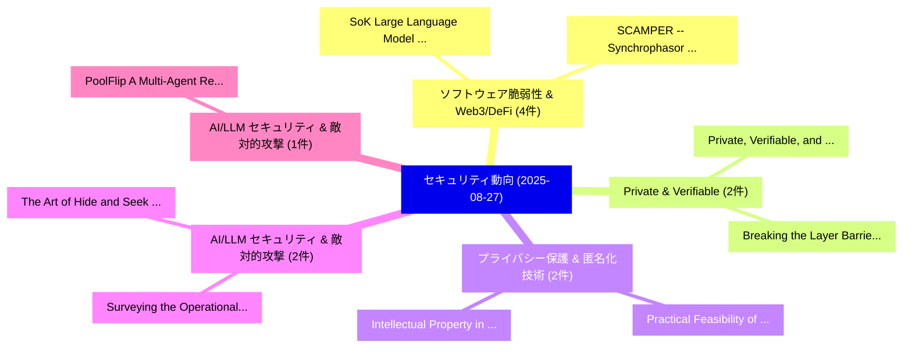

# 📅 02_daily: 日次エグゼクティブサマリー報告書 (2025-08-27)

**集計日時**: 2026-10-02 23:05:37 UTC  
**対象日付**: 2025-08-27  
**本日収集論文数**: 22 件  

---

## 💡 主要セキュリティ動向・脅威インサイト (Executive Insights)

本日の収集論文（計 22 件）において、以下の重点セキュリティ領域で活発な研究動向が確認されました：
- **ソフトウェア脆弱性 & Web3/DeFi** (4 件): 注目論文として 「SoK: Large Language Model Copy...」、「SCAMPER -- Synchrophasor Cover...」 等が発表され、実務防御および攻撃検証の進展が見られます。
- **Private & Verifiable** (2 件): 注目論文として 「Breaking the Layer Barrier: Re...」、「Private, Verifiable, and Audit...」 等が発表され、実務防御および攻撃検証の進展が見られます。
- **プライバシー保護 & 匿名化技術** (2 件): 注目論文として 「Intellectual Property in Graph...」、「Practical Feasibility of Gradi...」 等が発表され、実務防御および攻撃検証の進展が見られます。
- **AI/LLM セキュリティ & 敵対的攻撃** (2 件): 注目論文として 「The Art of Hide and Seek: Maki...」、「Surveying the Operational サイバー...」 等が発表され、実務防御および攻撃検証の進展が見られます。
- **AI/LLM セキュリティ & 敵対的攻撃** (1 件): 注目論文として 「PoolFlip: A Multi-Agent Reinfo...」 等が発表され、実務防御および攻撃検証の進展が見られます。

### 🗺️ 技術・脅威トピックマインドマップ

---

## 📌 日次セキュリティ論文一覧 (日本語表形式)

| No | arXiv ID | 論文タイトル (日本語訳) | 重要キーワード | 構造化エグゼクティブ要約 (背景・提案・影響) | 脅威分類 | 詳細リンク |
|---|---|---|---|---|---|---|
| 1 | `2508.19488v1` | [PoolFlip: A Multi-Agent Reinforcement Learning Security Environment for Cyber Defense（セキュリティ分析論文）](../../okf/papers/2025-08-27/2508.19488.md) | `Agent Reinforcement Learning Security Environment`, `Cyber Defense`, `Multi-Agent Reinforcement` | 【提案】概要 (Overview & Key Finding) 本論文「PoolFlip: A Multi-Agent Reinforcement Learning Security...。実証評価により経営層・セキュリティ管理者向け推奨アクション (E... | `cs.AI` | [arXiv](https://arxiv.org/abs/2508.19488v1) &#124; [OKF](../../okf/papers/2025-08-27/2508.19488.md) |
| 2 | `2508.19493v2` | [Mind the Third Eye! Privacy Awareness in MLLM-powered Smartphone Agentsのベンチマーク評価](../../okf/papers/2025-08-27/2508.19493.md) | `Third Eye`, `MLLM-powered Smartphone`, `Benchmarking Privacy Awareness` | 【提案】Benchmarking Privacy Awareness in MLLM-powered Smartphone Agents ### (日本語題名: Mind the T...。実証評価により経営層・セキュリティ管理者向け推奨アクション (E... | `cs.CV` | [arXiv](https://arxiv.org/abs/2508.19493v2) &#124; [OKF](../../okf/papers/2025-08-27/2508.19493.md) |
| 3 | `2508.19500v1` | [Servant, Stalker, Predator: How An Honest, Helpful, And Harmless (3H) Agent Unlocks Adversarial Skills（セキュリティ分析論文）](../../okf/papers/2025-08-27/2508.19500.md) | `Agent Unlocks Adversarial Skills`, `David Noever`, `Raw Meta` | 【提案】概要 (Overview & Key Finding) 本論文「Servant, Stalker, Predator: How An Honest, Helpful, And...。実証評価により経営層・セキュリティ管理者向け推奨アクション (E... | `cs.AI` | [arXiv](https://arxiv.org/abs/2508.19500v1) &#124; [OKF](../../okf/papers/2025-08-27/2508.19500.md) |
| 4 | `2508.19525v2` | [Breaking the Layer Barrier: Remodeling Private Transformer Inference with Hybrid CKKS and MPC（セキュリティ分析論文）](../../okf/papers/2025-08-27/2508.19525.md) | `Remodeling Private Transformer Inference`, `Layer Barrier`, `Tianshi Xu` | 【提案】概要 (Overview & Key Finding) 本論文「Breaking the Layer Barrier: Remodeling Private Transfor...。実証評価により経営層・セキュリティ管理者向け推奨アクション (E... | `cybersecurity` | [arXiv](https://arxiv.org/abs/2508.19525v2) &#124; [OKF](../../okf/papers/2025-08-27/2508.19525.md) |
| 5 | `2508.19620v1` | [A Scenario-Oriented Survey of Federated Recommender Systems: Techniques, Challenges, and Future Directions（セキュリティ分析論文）](../../okf/papers/2025-08-27/2508.19620.md) | `Federated Recommender Systems`, `Oriented Survey`, `Scenario-Oriented Survey` | 【提案】概要 (Overview & Key Finding) 本論文「A Scenario-Oriented Survey of Federated Recommender Sys...。実証評価により経営層・セキュリティ管理者向け推奨アクション (E... | `cs.AI` | [arXiv](https://arxiv.org/abs/2508.19620v1) &#124; [OKF](../../okf/papers/2025-08-27/2508.19620.md) |
| 6 | `2508.19641v1` | [Intellectual Property in Graph-Based Machine Learning as a Service: Attacks and Defenses（セキュリティ分析論文）](../../okf/papers/2025-08-27/2508.19641.md) | `Based Machine Learning`, `Intellectual Property`, `Graph-Based Machine` | 【提案】概要 (Overview & Key Finding) 本論文「Intellectual Property in Graph-Based Machine Learning a...。実証評価により経営層・セキュリティ管理者向け推奨アクション (E... | `cs.AI` | [arXiv](https://arxiv.org/abs/2508.19641v1) &#124; [OKF](../../okf/papers/2025-08-27/2508.19641.md) |
| 7 | `2508.19697v1` | [Safety Alignment Should Be Made More Than Just A Few Attention Heads（セキュリティ分析論文）](../../okf/papers/2025-08-27/2508.19697.md) | `Chao Huang`, `Zefeng Zhang`, `Juewei Yue` | 【提案】概要 (Overview & Key Finding) 本論文「Safety Alignment Should Be Made More Than Just A Few At...。実証評価により経営層・セキュリティ管理者向け推奨アクション (E... | `cs.AI` | [arXiv](https://arxiv.org/abs/2508.19697v1) &#124; [OKF](../../okf/papers/2025-08-27/2508.19697.md) |
| 8 | `2508.19714v1` | [Addressing Deepfake Issue in Selfie banking through camera based authentication（セキュリティ分析論文）](../../okf/papers/2025-08-27/2508.19714.md) | `Addressing Deepfake Issue`, `Subhrojyoti Mukherjee`, `Manoranjan Mohanty` | 【提案】概要 (Overview & Key Finding) 本論文「Addressing Deepfake Issue in Selfie banking through cam...。実証評価により経営層・セキュリティ管理者向け推奨アクション (E... | `cs.CV` | [arXiv](https://arxiv.org/abs/2508.19714v1) &#124; [OKF](../../okf/papers/2025-08-27/2508.19714.md) |
| 9 | `2508.19774v1` | [The Art of Hide and Seek: Making Pickle-Based Model Supply Chain Poisoning Stealthy Again（セキュリティ分析論文）](../../okf/papers/2025-08-27/2508.19774.md) | `Making Pickle`, `Pickle-Based Model`, `Tong Liu` | 【提案】概要 (Overview & Key Finding) 本論文「The Art of Hide and Seek: Making Pickle-Based Model Sup...。実証評価により経営層・セキュリティ管理者向け推奨アクション (E... | `cybersecurity` | [arXiv](https://arxiv.org/abs/2508.19774v1) &#124; [OKF](../../okf/papers/2025-08-27/2508.19774.md) |
| 10 | `2508.19819v2` | [Practical Feasibility of Gradient Inversion Attacks in 連合学習](../../okf/papers/2025-08-27/2508.19819.md) | `Gradient Inversion Attacks`, `Practical Feasibility`, `Federated Learning` | 【提案】概要 (Overview & Key Finding) 本論文「Practical Feasibility of Gradient Inversion Attacks in ...。実証評価により経営層・セキュリティ管理者向け推奨アクション (E... | `cs.AI` | [arXiv](https://arxiv.org/abs/2508.19819v2) &#124; [OKF](../../okf/papers/2025-08-27/2508.19819.md) |
| 11 | `2508.19825v1` | [Every Keystroke You Make: A Tech-Law Measurement and Event Listeners for Wiretappingの分析](../../okf/papers/2025-08-27/2508.19825.md) | `Law Measurement`, `Tech-Law Measurement`, `Event Listeners` | 【提案】概要 (Overview & Key Finding) 本論文「Every Keystroke You Make: A Tech-Law Measurement and Ev...。実証評価により経営層・セキュリティ管理者向け推奨アクション (E... | `cybersecurity` | [arXiv](https://arxiv.org/abs/2508.19825v1) &#124; [OKF](../../okf/papers/2025-08-27/2508.19825.md) |
| 12 | `2508.19843v3` | [SoK: Large Language Model Copyright Auditing via Fingerprinting（セキュリティ分析論文）](../../okf/papers/2025-08-27/2508.19843.md) | `Large Language Model Copyright Auditing`, `Shuo Shao`, `Yiming Li` | 【提案】概要 (Overview & Key Finding) 本論文「SoK: Large Language Model Copyright Auditing via Finger...。実証評価により経営層・セキュリティ管理者向け推奨アクション (E... | `cs.AI` | [arXiv](https://arxiv.org/abs/2508.19843v3) &#124; [OKF](../../okf/papers/2025-08-27/2508.19843.md) |
| 13 | `2508.20051v1` | [SCAMPER -- Synchrophasor Covert chAnnel for Malicious and Protective ERrands（セキュリティ分析論文）](../../okf/papers/2025-08-27/2508.20051.md) | `Synchrophasor Covert`, `Prashanth Krishnamurthy`, `Ramesh Karri` | 【提案】概要 (Overview & Key Finding) 本論文「SCAMPER -- Synchrophasor Covert chAnnel for Malicious a...。実証評価により経営層・セキュリティ管理者向け推奨アクション (E... | `cybersecurity` | [arXiv](https://arxiv.org/abs/2508.20051v1) &#124; [OKF](../../okf/papers/2025-08-27/2508.20051.md) |
| 14 | `2508.20083v2` | [DisarmRAG: Stealthy Retriever-Centric Poisoning to Disable Self-Correction in Retrieval-Augmented Generation (Extended Version)（セキュリティ分析論文）](../../okf/papers/2025-08-27/2508.20083.md) | `Stealthy Retriever`, `Centric Poisoning`, `Disable Self` | 【提案】概要 (Overview & Key Finding) 本論文「DisarmRAG: Stealthy Retriever-Centric Poisoning to Disa...。実証評価により経営層・セキュリティ管理者向け推奨アクション (E... | `executive-summary` | [arXiv](https://arxiv.org/abs/2508.20083v2) &#124; [OKF](../../okf/papers/2025-08-27/2508.20083.md) |
| 15 | `2508.20086v4` | [Detecting Malicious Intents in Smart Contracts with Pre-trained Programming Language Models（セキュリティ分析論文）](../../okf/papers/2025-08-27/2508.20086.md) | `Detecting Malicious Intents`, `Programming Language Models`, `Smart Contracts` | 【提案】概要 (Overview & Key Finding) 本論文「Detecting Malicious Intents in スマートコントラクトs with Pre-tra...。実証評価により経営層・セキュリティ管理者向け推奨アクション (E... | `executive-summary` | [arXiv](https://arxiv.org/abs/2508.20086v4) &#124; [OKF](../../okf/papers/2025-08-27/2508.20086.md) |
| 16 | `2508.20186v1` | [AI Propaganda factories with language models（セキュリティ分析論文）](../../okf/papers/2025-08-27/2508.20186.md) | `Lukasz Olejnik`, `Raw Meta`, `Executive Summary` | 【提案】概要 (Overview & Key Finding) 本論文「AI Propaganda factories with language models（セキュリティ分析論文...。実証評価により経営層・セキュリティ管理者向け推奨アクション (E... | `cs.AI` | [arXiv](https://arxiv.org/abs/2508.20186v1) &#124; [OKF](../../okf/papers/2025-08-27/2508.20186.md) |
| 17 | `2508.20212v2` | [FlowMalTrans: Unsupervised Binary Code Translation for マルウェア検出 Using Flow-Adapter Architecture](../../okf/papers/2025-08-27/2508.20212.md) | `Unsupervised Binary Code Translation`, `Adapter Architecture`, `Flow-Adapter Architecture` | 【提案】概要 (Overview & Key Finding) 本論文「FlowMalTrans: Unsupervised Binary Code Translation for ...。実証評価により経営層・セキュリティ管理者向け推奨アクション (E... | `executive-summary` | [arXiv](https://arxiv.org/abs/2508.20212v2) &#124; [OKF](../../okf/papers/2025-08-27/2508.20212.md) |
| 18 | `2508.20228v2` | [Robustness Assessment and Enhancement of Text Watermarking for Google's SynthID（セキュリティ分析論文）](../../okf/papers/2025-08-27/2508.20228.md) | `Robustness Assessment`, `Text Watermarking`, `Xia Han` | 【提案】概要 (Overview & Key Finding) 本論文「Robustness Assessment and Enhancement of Text Watermark...。実証評価により経営層・セキュリティ管理者向け推奨アクション (E... | `executive-summary` | [arXiv](https://arxiv.org/abs/2508.20228v2) &#124; [OKF](../../okf/papers/2025-08-27/2508.20228.md) |
| 19 | `2508.20282v3` | [Network-Level Prompt and Trait Leakage in Local Research Agents（セキュリティ分析論文）](../../okf/papers/2025-08-27/2508.20282.md) | `Local Research Agents`, `Level Prompt`, `Trait Leakage` | 【提案】概要 (Overview & Key Finding) 本論文「Network-Level Prompt and Trait Leakage in Local Researc...。実証評価により経営層・セキュリティ管理者向け推奨アクション (E... | `cs.AI` | [arXiv](https://arxiv.org/abs/2508.20282v3) &#124; [OKF](../../okf/papers/2025-08-27/2508.20282.md) |
| 20 | `2508.20307v1` | [Surveying the Operational サイバーセキュリティ and Supply Chain Threat Landscape when Developing and Deploying AI Systems](../../okf/papers/2025-08-27/2508.20307.md) | `Supply Chain Threat Landscape`, `Operational Cybersecurity`, `Joe Ingram` | 【提案】概要 (Overview & Key Finding) 本論文「Surveying the Operational サイバーセキュリティ and Supply Chain 脅...。実証評価により経営層・セキュリティ管理者向け推奨アクション (E... | `cs.AI` | [arXiv](https://arxiv.org/abs/2508.20307v1) &#124; [OKF](../../okf/papers/2025-08-27/2508.20307.md) |
| 21 | `2509.00085v1` | [Private, Verifiable, and Auditable AI Systems（セキュリティ分析論文）](../../okf/papers/2025-08-27/2509.00085.md) | `Tobin South`, `Raw Meta`, `Executive Summary` | 【提案】概要 (Overview & Key Finding) 本論文「Private, Verifiable, and Auditable AI Systems（セキュリティ分析論...。実証評価により経営層・セキュリティ管理者向け推奨アクション (E... | `cs.AI` | [arXiv](https://arxiv.org/abs/2509.00085v1) &#124; [OKF](../../okf/papers/2025-08-27/2509.00085.md) |
| 22 | `2509.00088v2` | [AEGIS : Automated Co-Evolutionary Framework for Guarding Prompt Injections Schema（セキュリティ分析論文）](../../okf/papers/2025-08-27/2509.00088.md) | `Guarding Prompt Injections Schema`, `Automated Co`, `Chun Liu` | 【提案】概要 (Overview & Key Finding) 本論文「AEGIS : Automated Co-Evolutionary Framework for Guardin...。実証評価により経営層・セキュリティ管理者向け推奨アクション (E... | `cs.AI` | [arXiv](https://arxiv.org/abs/2509.00088v2) &#124; [OKF](../../okf/papers/2025-08-27/2509.00088.md) |

