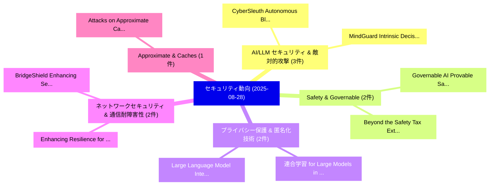

# 📅 02_daily: 日次エグゼクティブサマリー報告書 (2025-08-28)

**集計日時**: 2026-10-02 23:05:37 UTC  
**対象日付**: 2025-08-28  
**本日収集論文数**: 27 件  

---

## 💡 主要セキュリティ動向・脅威インサイト (Executive Insights)

本日の収集論文（計 27 件）において、以下の重点セキュリティ領域で活発な研究動向が確認されました：
- **AI/LLM セキュリティ & 敵対的攻撃** (3 件): 注目論文として 「MindGuard: Intrinsic Decision ...」、「CyberSleuth: Autonomous Blue-T...」 等が発表され、実務防御および攻撃検証の進展が見られます。
- **Safety & Governable** (2 件): 注目論文として 「Governable AI: Provable Safety...」、「Beyond the Safety Tax: Externa...」 等が発表され、実務防御および攻撃検証の進展が見られます。
- **プライバシー保護 & 匿名化技術** (2 件): 注目論文として 「連合学習 for Large Models in Medic...」、「Large Language Model Integrati...」 等が発表され、実務防御および攻撃検証の進展が見られます。
- **ネットワークセキュリティ & 通信耐障害性** (2 件): 注目論文として 「Enhancing Resilience for IoE: ...」、「BridgeShield: Enhancing Securi...」 等が発表され、実務防御および攻撃検証の進展が見られます。
- **Approximate & Caches** (1 件): 注目論文として 「Attacks on Approximate Caches ...」 等が発表され、実務防御および攻撃検証の進展が見られます。

### 🗺️ 技術・脅威トピックマインドマップ

---

## 📌 日次セキュリティ論文一覧 (日本語表形式)

| No | arXiv ID | 論文タイトル (日本語訳) | 重要キーワード | 構造化エグゼクティブ要約 (背景・提案・影響) | 脅威分類 | 詳細リンク |
|---|---|---|---|---|---|---|
| 1 | `2508.20411v1` | [Governable AI: Provable Safety Under Extreme Threat Models（セキュリティ分析論文）](../../okf/papers/2025-08-28/2508.20411.md) | `Donglin Wang`, `Weiyun Liang`, `Chunyuan Chen` | 【提案】概要 (Overview & Key Finding) 本論文「Governable AI: Provable Safety Under Extreme 脅威 Models（...。実証評価により経営層・セキュリティ管理者向け推奨アクション (E... | `cs.AI` | [arXiv](https://arxiv.org/abs/2508.20411v1) &#124; [OKF](../../okf/papers/2025-08-28/2508.20411.md) |
| 2 | `2508.20412v3` | [MindGuard: Intrinsic Decision Inspection for LLM Agents Against Metadata Poisoningのセキュリティ強化](../../okf/papers/2025-08-28/2508.20412.md) | `Intrinsic Decision Inspection`, `Zhiqiang Wang`, `Haohua Du` | 【提案】概要 (Overview & Key Finding) 本論文「MindGuard: Intrinsic Decision Inspection for LLM Agents...。実証評価により経営層・セキュリティ管理者向け推奨アクション (E... | `cybersecurity` | [arXiv](https://arxiv.org/abs/2508.20412v3) &#124; [OKF](../../okf/papers/2025-08-28/2508.20412.md) |
| 3 | `2508.20414v1` | [連合学習 for Large Models in Medical Imaging: A Comprehensive Review](../../okf/papers/2025-08-28/2508.20414.md) | `Large Models`, `Medical Imaging`, `Comprehensive Review` | 【提案】概要 (Overview & Key Finding) 本論文「連合学習 for Large Models in Medical Imaging: A Comprehensi...。実証評価により経営層・セキュリティ管理者向け推奨アクション (E... | `cs.CV` | [arXiv](https://arxiv.org/abs/2508.20414v1) &#124; [OKF](../../okf/papers/2025-08-28/2508.20414.md) |
| 4 | `2508.20424v4` | [Attacks on Approximate Caches in Text-to-Image Diffusion Models（セキュリティ分析論文）](../../okf/papers/2025-08-28/2508.20424.md) | `Image Diffusion Models`, `Approximate Caches`, `Desen Sun` | 【提案】概要 (Overview & Key Finding) 本論文「Attacks on Approximate Caches in Text-to-Image Diffusio...。実証評価により経営層・セキュリティ管理者向け推奨アクション (E... | `cybersecurity` | [arXiv](https://arxiv.org/abs/2508.20424v4) &#124; [OKF](../../okf/papers/2025-08-28/2508.20424.md) |
| 5 | `2508.20444v1` | [Ransomware 3.0: Self-Composing and LLM-Orchestrated（セキュリティ分析論文）](../../okf/papers/2025-08-28/2508.20444.md) | `Md Raz`, `Meet Udeshi`, `Sai Charan` | 【提案】概要 (Overview & Key Finding) 本論文「ランサムウェア 3.0: Self-Composing and LLM-Orchestrated（セキュリティ...。実証評価によりSai Charan, Prashanth Kri... | `cybersecurity` | [arXiv](https://arxiv.org/abs/2508.20444v1) &#124; [OKF](../../okf/papers/2025-08-28/2508.20444.md) |
| 6 | `2508.20452v1` | [Evaluating Differentially Private Generation of Domain-Specific Text（セキュリティ分析論文）](../../okf/papers/2025-08-28/2508.20452.md) | `Evaluating Differentially Private Generation`, `Specific Text`, `Domain-Specific Text` | 【提案】概要 (Overview & Key Finding) 本論文「Evaluating Differentially Private Generation of Domain-...。実証評価により経営層・セキュリティ管理者向け推奨アクション (E... | `cs.AI` | [arXiv](https://arxiv.org/abs/2508.20452v1) &#124; [OKF](../../okf/papers/2025-08-28/2508.20452.md) |
| 7 | `2508.20504v1` | [Enhancing Resilience for IoE: A Perspective of Networking-Level Safeguard（セキュリティ分析論文）](../../okf/papers/2025-08-28/2508.20504.md) | `Enhancing Resilience`, `Level Safeguard`, `Networking-Level Safeguard` | 【提案】概要 (Overview & Key Finding) 本論文「Enhancing Resilience for IoE: A Perspective of Networki...。実証評価により経営層・セキュリティ管理者向け推奨アクション (E... | `cs.NI` | [arXiv](https://arxiv.org/abs/2508.20504v1) &#124; [OKF](../../okf/papers/2025-08-28/2508.20504.md) |
| 8 | `2508.20517v1` | [BridgeShield: Enhancing Security for Cross-chain Bridge Applications via Heterogeneous Graph Mining（セキュリティ分析論文）](../../okf/papers/2025-08-28/2508.20517.md) | `Heterogeneous Graph Mining`, `Enhancing Security`, `Bridge Applications` | 【提案】概要 (Overview & Key Finding) 本論文「BridgeShield: Enhancing Security for Cross-chain Bridge...。実証評価により経営層・セキュリティ管理者向け推奨アクション (E... | `cs.AI` | [arXiv](https://arxiv.org/abs/2508.20517v1) &#124; [OKF](../../okf/papers/2025-08-28/2508.20517.md) |
| 9 | `2508.20578v1` | [Human-AI Collaborative Bot Detection in MMORPGs（セキュリティ分析論文）](../../okf/papers/2025-08-28/2508.20578.md) | `Collaborative Bot Detection`, `Human-AI Collaborative`, `Jaeman Son` | 【提案】概要 (Overview & Key Finding) 本論文「Human-AI Collaborative Bot Detection in MMORPGs（セキュリティ分...。実証評価により経営層・セキュリティ管理者向け推奨アクション (E... | `cs.AI` | [arXiv](https://arxiv.org/abs/2508.20578v1) &#124; [OKF](../../okf/papers/2025-08-28/2508.20578.md) |
| 10 | `2508.20591v1` | [Bitcoin as an Interplanetary Monetary Standard with Proof-of-Transit Timestamping（セキュリティ分析論文）](../../okf/papers/2025-08-28/2508.20591.md) | `Interplanetary Monetary Standard`, `Transit Timestamping`, `Carlos Puente` | 【提案】概要 (Overview & Key Finding) 本論文「Bitcoin as an Interplanetary Monetary Standard with Pro...。実証評価により経営層・セキュリティ管理者向け推奨アクション (E... | `cybersecurity` | [arXiv](https://arxiv.org/abs/2508.20591v1) &#124; [OKF](../../okf/papers/2025-08-28/2508.20591.md) |
| 11 | `2508.20613v1` | [Revisiting the Privacy Risks of Split Inference: A GAN-Based Data Reconstruction Attack via Progressive Feature Optimization（セキュリティ分析論文）](../../okf/papers/2025-08-28/2508.20613.md) | `Based Data Reconstruction Attack`, `Progressive Feature Optimization`, `Privacy Risks` | 【提案】概要 (Overview & Key Finding) 本論文「Revisiting the Privacy Risks of Split Inference: A GAN-...。実証評価により経営層・セキュリティ管理者向け推奨アクション (E... | `cs.CV` | [arXiv](https://arxiv.org/abs/2508.20613v1) &#124; [OKF](../../okf/papers/2025-08-28/2508.20613.md) |
| 12 | `2508.20643v2` | [CyberSleuth: Autonomous Blue-Team LLM Agent for Web Attack Forensics（セキュリティ分析論文）](../../okf/papers/2025-08-28/2508.20643.md) | `Web Attack Forensics`, `Autonomous Blue`, `Blue-Team LLM` | 【提案】概要 (Overview & Key Finding) 本論文「CyberSleuth: Autonomous Blue-Team LLM Agent for Web Att...。実証評価により経営層・セキュリティ管理者向け推奨アクション (E... | `cybersecurity` | [arXiv](https://arxiv.org/abs/2508.20643v2) &#124; [OKF](../../okf/papers/2025-08-28/2508.20643.md) |
| 13 | `2508.20653v1` | [Microarchitecture Design and of Custom SHA-3 Instruction for RISC-Vのベンチマーク評価](../../okf/papers/2025-08-28/2508.20653.md) | `Microarchitecture Design`, `SHA-3 Instruction`, `Alperen Bolat` | 【提案】概要 (Overview & Key Finding) 本論文「Microarchitecture Design and of Custom SHA-3 Instructio...。実証評価により経営層・セキュリティ管理者向け推奨アクション (E... | `cs.NI` | [arXiv](https://arxiv.org/abs/2508.20653v1) &#124; [OKF](../../okf/papers/2025-08-28/2508.20653.md) |
| 14 | `2508.20816v1` | [Multi-Agent Penetration Testing AI for the Web（セキュリティ分析論文）](../../okf/papers/2025-08-28/2508.20816.md) | `Agent Penetration Testing`, `Multi-Agent Penetration`, `Isaac David` | 【提案】概要 (Overview & Key Finding) 本論文「Multi-Agent Penetration Testing AI for the Web（セキュリティ分析...。実証評価により経営層・セキュリティ管理者向け推奨アクション (E... | `cs.AI` | [arXiv](https://arxiv.org/abs/2508.20816v1) &#124; [OKF](../../okf/papers/2025-08-28/2508.20816.md) |
| 15 | `2508.20848v1` | [JADES: A Universal Framework for Jailbreak Assessment via Decompositional Scoring（セキュリティ分析論文）](../../okf/papers/2025-08-28/2508.20848.md) | `Jailbreak Assessment`, `Decompositional Scoring`, `Junjie Chu` | 【提案】概要 (Overview & Key Finding) 本論文「JADES: A Universal Framework for ジェイルブレイク Assessment vi...。実証評価により経営層・セキュリティ管理者向け推奨アクション (E... | `cs.AI` | [arXiv](https://arxiv.org/abs/2508.20848v1) &#124; [OKF](../../okf/papers/2025-08-28/2508.20848.md) |
| 16 | `2508.20863v3` | [Misleading 大規模言語モデル used (or misused) in Scientific Peer-Reviewing via Hidden Prompt-Injection Attacks](../../okf/papers/2025-08-28/2508.20863.md) | `Scientific Peer`, `Hidden Prompt`, `Injection Attacks` | 【提案】概要 (Overview & Key Finding) 本論文「Misleading 大規模言語モデル used (or misused) in Scientific Pee...。実証評価により経営層・セキュリティ管理者向け推奨アクション (E... | `cybersecurity` | [arXiv](https://arxiv.org/abs/2508.20863v3) &#124; [OKF](../../okf/papers/2025-08-28/2508.20863.md) |
| 17 | `2508.20866v6` | [AVIATOR: AI-Agentic Vulnerability Injection Workflow for High-Fidelity, Large-Scale Code Security Datasetに向けて](../../okf/papers/2025-08-28/2508.20866.md) | `Agentic Vulnerability Injection Workflow`, `AI-Agentic Vulnerability`, `Large-Scale Code` | 【提案】概要 (Overview & Key Finding) 本論文「AVIATOR: AI-Agentic 脆弱性 Injection Workflow for High-Fid...。実証評価により経営層・セキュリティ管理者向け推奨アクション (E... | `cs.AI` | [arXiv](https://arxiv.org/abs/2508.20866v6) &#124; [OKF](../../okf/papers/2025-08-28/2508.20866.md) |
| 18 | `2508.20890v2` | [PromptSleuth: Detecting Prompt Injection via Semantic Intent Invariance（セキュリティ分析論文）](../../okf/papers/2025-08-28/2508.20890.md) | `Detecting Prompt Injection`, `Semantic Intent Invariance`, `Mengxiao Wang` | 【提案】概要 (Overview & Key Finding) 本論文「PromptSleuth: Detecting プロンプトインジェクション via Semantic Inte...。実証評価により経営層・セキュリティ管理者向け推奨アクション (E... | `cybersecurity` | [arXiv](https://arxiv.org/abs/2508.20890v2) &#124; [OKF](../../okf/papers/2025-08-28/2508.20890.md) |
| 19 | `2508.20962v2` | [Characterizing Trust Boundary Vulnerabilities in TEE Containers: An Empirical Study（セキュリティ分析論文）](../../okf/papers/2025-08-28/2508.20962.md) | `Characterizing Trust Boundary Vulnerabilities`, `Weijie Liu`, `Hongbo Chen` | 【提案】概要 (Overview & Key Finding) 本論文「Characterizing Trust Boundary Vulnerabilities in TEE Co...。実証評価により経営層・セキュリティ管理者向け推奨アクション (E... | `executive-summary` | [arXiv](https://arxiv.org/abs/2508.20962v2) &#124; [OKF](../../okf/papers/2025-08-28/2508.20962.md) |
| 20 | `2508.20963v1` | [Guarding Against Malicious Biased Threats (GAMBiT) Experiments: Revealing Cognitive Bias in Human-Subjects Red-Team Cyber Range Operations（セキュリティ分析論文）](../../okf/papers/2025-08-28/2508.20963.md) | `Team Cyber Range Operations`, `Revealing Cognitive Bias`, `Subjects Red` | 【提案】概要 (Overview & Key Finding) 本論文「Guarding Against Malicious Biased Threats (GAMBiT) Expe...。実証評価により経営層・セキュリティ管理者向け推奨アクション (E... | `executive-summary` | [arXiv](https://arxiv.org/abs/2508.20963v1) &#124; [OKF](../../okf/papers/2025-08-28/2508.20963.md) |
| 21 | `2508.21005v2` | [Measuring Ransomware Lateral Movement Susceptibility via Privilege-Weighted Adjacency Matrix Exponentiation（セキュリティ分析論文）](../../okf/papers/2025-08-28/2508.21005.md) | `Measuring Ransomware Lateral Movement Susceptibility`, `Weighted Adjacency Matrix Exponentiation`, `Privilege-Weighted Adjacency` | 【提案】概要 (Overview & Key Finding) 本論文「Measuring ランサムウェア Lateral Movement Susceptibility via P...。実証評価により経営層・セキュリティ管理者向け推奨アクション (E... | `cs.DM` | [arXiv](https://arxiv.org/abs/2508.21005v2) &#124; [OKF](../../okf/papers/2025-08-28/2508.21005.md) |
| 22 | `2508.21099v3` | [Beyond the Safety Tax: External Safety RectificationによるUnsafe Text-to-Image Generationの軽減](../../okf/papers/2025-08-28/2508.21099.md) | `Safety Tax`, `External Safety`, `Mitigating Unsafe Text` | 【提案】概要 (Overview & Key Finding) 本論文「Beyond the Safety Tax: External Safety Rectificationによる...。実証評価により経営層・セキュリティ管理者向け推奨アクション (E... | `cs.AI` | [arXiv](https://arxiv.org/abs/2508.21099v3) &#124; [OKF](../../okf/papers/2025-08-28/2508.21099.md) |
| 23 | `2508.21219v2` | [To WASM or Not to WASM: Evaluation of Browser Fingerprinting Defenses Under WASM based Obfuscation（セキュリティ分析論文）](../../okf/papers/2025-08-28/2508.21219.md) | `Mahsin Bin Akram`, `Nazmus Sakib`, `Joseph Spracklen` | 【提案】背景とセキュリティ上の課題 (Background & Problem) 本研究はサイバー脅威環境におけるセキュリティ構造・脆弱性の検証を目的としています。(主要検出項目: ...。実証評価により経営層・セキュリティ管理者向け推奨アクション (E... | `cs.ET` | [arXiv](https://arxiv.org/abs/2508.21219v2) &#124; [OKF](../../okf/papers/2025-08-28/2508.21219.md) |
| 24 | `2508.21265v1` | [SCE-NTT: A Hardware Accelerator for Number Theoretic Transform Using Superconductor Electronics（セキュリティ分析論文）](../../okf/papers/2025-08-28/2508.21265.md) | `Number Theoretic Transform Using Superconductor Electronics`, `Hardware Accelerator`, `Sasan Razmkhah` | 【提案】概要 (Overview & Key Finding) 本論文「SCE-NTT: A Hardware Accelerator for Number Theoretic Tr...。実証評価により経営層・セキュリティ管理者向け推奨アクション (E... | `cs.ET` | [arXiv](https://arxiv.org/abs/2508.21265v1) &#124; [OKF](../../okf/papers/2025-08-28/2508.21265.md) |
| 25 | `2509.00104v4` | [Enhanced Rényi Entropy-Based Post-Quantum Key Agreement with Provable Security and Information-Theoretic Guarantees（セキュリティ分析論文）](../../okf/papers/2025-08-28/2509.00104.md) | `Quantum Key Agreement`, `Based Post`, `Entropy-Based Post` | 【提案】概要 (Overview & Key Finding) 本論文「Enhanced Rényi Entropy-Based Post-量子 Key Agreement with...。実証評価により経営層・セキュリティ管理者向け推奨アクション (E... | `executive-summary` | [arXiv](https://arxiv.org/abs/2509.00104v4) &#124; [OKF](../../okf/papers/2025-08-28/2509.00104.md) |
| 26 | `2509.03367v1` | [Tuning Block Size for Workload Optimization in Consortium Blockchain Networks（セキュリティ分析論文）](../../okf/papers/2025-08-28/2509.03367.md) | `Tuning Block Size`, `Consortium Blockchain Networks`, `Workload Optimization` | 【提案】概要 (Overview & Key Finding) 本論文「Tuning Block Size for Workload Optimization in Consorti...。実証評価により経営層・セキュリティ管理者向け推奨アクション (E... | `cybersecurity` | [arXiv](https://arxiv.org/abs/2509.03367v1) &#124; [OKF](../../okf/papers/2025-08-28/2509.03367.md) |
| 27 | `2509.05311v2` | [Large Language Model Integration with Reinforcement Learning to Augment Decision-Making in Autonomous Cyber Operations（セキュリティ分析論文）](../../okf/papers/2025-08-28/2509.05311.md) | `Large Language Model Integration`, `Autonomous Cyber Operations`, `Reinforcement Learning` | 【提案】概要 (Overview & Key Finding) 本論文「Large Language Model Integration with Reinforcement Lea...。実証評価により経営層・セキュリティ管理者向け推奨アクション (E... | `cs.AI` | [arXiv](https://arxiv.org/abs/2509.05311v2) &#124; [OKF](../../okf/papers/2025-08-28/2509.05311.md) |

