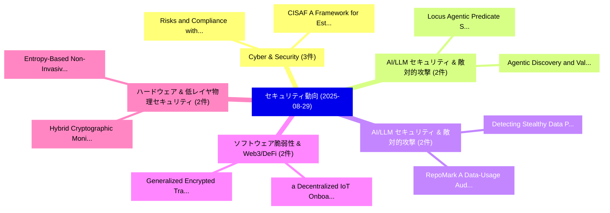

# 📅 02_daily: 日次エグゼクティブサマリー報告書 (2025-08-29)

**集計日時**: 2026-10-02 23:05:37 UTC  
**対象日付**: 2025-08-29  
**本日収集論文数**: 23 件  

---

## 💡 主要セキュリティ動向・脅威インサイト (Executive Insights)

本日の収集論文（計 23 件）において、以下の重点セキュリティ領域で活発な研究動向が確認されました：
- **Cyber & Security** (3 件): 注目論文として 「Risks and Compliance with the ...」、「CISAF: A Framework for Estimat...」 等が発表され、実務防御および攻撃検証の進展が見られます。
- **AI/LLM セキュリティ & 敵対的攻撃** (2 件): 注目論文として 「Locus: Agentic Predicate Synth...」、「Agentic Discovery and Validati...」 等が発表され、実務防御および攻撃検証の進展が見られます。
- **AI/LLM セキュリティ & 敵対的攻撃** (2 件): 注目論文として 「RepoMark: A Data-Usage Auditin...」、「Detecting Stealthy Data Poison...」 等が発表され、実務防御および攻撃検証の進展が見られます。
- **ソフトウェア脆弱性 & Web3/DeFi** (2 件): 注目論文として 「a Decentralized IoT Onboarding...」、「Generalized Encrypted Traffic ...」 等が発表され、実務防御および攻撃検証の進展が見られます。
- **ハードウェア & 低レイヤ物理セキュリティ** (2 件): 注目論文として 「Hybrid Cryptographic Monitorin...」、「Entropy-Based Non-Invasive Rel...」 等が発表され、実務防御および攻撃検証の進展が見られます。

### 🗺️ 技術・脅威トピックマインドマップ

---

## 📌 日次セキュリティ論文一覧 (日本語表形式)

| No | arXiv ID | 論文タイトル (日本語訳) | 重要キーワード | 構造化エグゼクティブ要約 (背景・提案・影響) | 脅威分類 | 詳細リンク |
|---|---|---|---|---|---|---|
| 1 | `2508.21302v3` | [Locus: Agentic Predicate Synthesis for Directed Fuzzing（セキュリティ分析論文）](../../okf/papers/2025-08-29/2508.21302.md) | `Agentic Predicate Synthesis`, `Directed Fuzzing`, `Jie Zhu` | 【提案】概要 (Overview & Key Finding) 本論文「Locus: Agentic Predicate Synthesis for Directed Fuzzing...。実証評価により経営層・セキュリティ管理者向け推奨アクション (E... | `cs.AI` | [arXiv](https://arxiv.org/abs/2508.21302v3) &#124; [OKF](../../okf/papers/2025-08-29/2508.21302.md) |
| 2 | `2508.21323v2` | [LLM-driven Provenance Forensics for Threat Investigation and Detection（セキュリティ分析論文）](../../okf/papers/2025-08-29/2508.21323.md) | `Provenance Forensics`, `Threat Investigation`, `LLM-driven Provenance` | 【提案】概要 (Overview & Key Finding) 本論文「LLM-driven Provenance Forensics for 脅威 Investigation an...。実証評価により経営層・セキュリティ管理者向け推奨アクション (E... | `cybersecurity` | [arXiv](https://arxiv.org/abs/2508.21323v2) &#124; [OKF](../../okf/papers/2025-08-29/2508.21323.md) |
| 3 | `2508.21386v1` | [Risks and Compliance with the EU's Core Cyber Security Legislation（セキュリティ分析論文）](../../okf/papers/2025-08-29/2508.21386.md) | `Core Cyber Security Legislation`, `Jukka Ruohonen`, `Raw Meta` | 【提案】概要 (Overview & Key Finding) 本論文「Risks and Compliance with the EU's Core Cyber Security ...。実証評価により経営層・セキュリティ管理者向け推奨アクション (E... | `executive-summary` | [arXiv](https://arxiv.org/abs/2508.21386v1) &#124; [OKF](../../okf/papers/2025-08-29/2508.21386.md) |
| 4 | `2508.21393v3` | [VeriLoRA: Fine-Tuning 大規模言語モデル with Verifiable Security via Zero-Knowledge Proofs](../../okf/papers/2025-08-29/2508.21393.md) | `Verifiable Security`, `Knowledge Proofs`, `Zero-Knowledge Proofs` | 【提案】概要 (Overview & Key Finding) 本論文「VeriLoRA: Fine-Tuning 大規模言語モデル with Verifiable Security...。実証評価により経営層・セキュリティ管理者向け推奨アクション (E... | `cs.AI` | [arXiv](https://arxiv.org/abs/2508.21393v3) &#124; [OKF](../../okf/papers/2025-08-29/2508.21393.md) |
| 5 | `2508.21417v1` | [Vulnerable Package Dependencies in LLM Repositoriesの実証研究](../../okf/papers/2025-08-29/2508.21417.md) | `Vulnerable Package Dependencies`, `Shuhan Liu`, `Xing Hu` | 【提案】概要 (Overview & Key Finding) 本論文「Vulnerable Package Dependencies in LLM Repositoriesの実証研...。実証評価により経営層・セキュリティ管理者向け推奨アクション (E... | `executive-summary` | [arXiv](https://arxiv.org/abs/2508.21417v1) &#124; [OKF](../../okf/papers/2025-08-29/2508.21417.md) |
| 6 | `2508.21432v3` | [RepoMark: A Data-Usage Auditing Framework for Code 大規模言語モデル](../../okf/papers/2025-08-29/2508.21432.md) | `Data-Usage Auditing`, `Code Large Language Models`, `Wenjie Qu` | 【提案】概要 (Overview & Key Finding) 本論文「RepoMark: A Data-Usage Auditing Framework for Code 大規模言...。実証評価によりWang, Jinyuan Jia, Jiahen... | `executive-summary` | [arXiv](https://arxiv.org/abs/2508.21432v3) &#124; [OKF](../../okf/papers/2025-08-29/2508.21432.md) |
| 7 | `2508.21440v1` | [Time Tells All: Deanonymization of Blockchain RPC Users with Zero Transaction Fee (Extended Version)（セキュリティ分析論文）](../../okf/papers/2025-08-29/2508.21440.md) | `Zero Transaction Fee`, `Extended Version`, `Shan Wang` | 【提案】概要 (Overview & Key Finding) 本論文「Time Tells All: Deanonymization of Blockchain RPC Users...。実証評価により経営層・セキュリティ管理者向け推奨アクション (E... | `cybersecurity` | [arXiv](https://arxiv.org/abs/2508.21440v1) &#124; [OKF](../../okf/papers/2025-08-29/2508.21440.md) |
| 8 | `2508.21457v3` | [SoK: Exposing the Generation and Detection Gaps in LLM-Generated Phishing（セキュリティ分析論文）](../../okf/papers/2025-08-29/2508.21457.md) | `Detection Gaps`, `Generated Phishing`, `LLM-Generated Phishing` | 【提案】概要 (Overview & Key Finding) 本論文「SoK: Exposing the Generation and Detection Gaps in LLM-...。実証評価により経営層・セキュリティ管理者向け推奨アクション (E... | `cybersecurity` | [arXiv](https://arxiv.org/abs/2508.21457v3) &#124; [OKF](../../okf/papers/2025-08-29/2508.21457.md) |
| 9 | `2508.21480v1` | [a Decentralized IoT Onboarding for Smart Homes Using Consortium Blockchainに向けて](../../okf/papers/2025-08-29/2508.21480.md) | `Smart Homes Using Consortium Blockchain`, `Smart Homes Using Consortium`, `Narges Dadkhah` | 【提案】概要 (Overview & Key Finding) 本論文「a Decentralized IoT Onboarding for Smart Homes Using Co...。実証評価により経営層・セキュリティ管理者向け推奨アクション (E... | `cs.NI` | [arXiv](https://arxiv.org/abs/2508.21480v1) &#124; [OKF](../../okf/papers/2025-08-29/2508.21480.md) |
| 10 | `2508.21558v1` | [Generalized Encrypted Traffic Classification Using Inter-Flow Signals（セキュリティ分析論文）](../../okf/papers/2025-08-29/2508.21558.md) | `Generalized Encrypted Traffic Classification Using Inter`, `Flow Signals`, `Inter-Flow Signals` | 【提案】概要 (Overview & Key Finding) 本論文「Generalized Encrypted Traffic Classification Using Inte...。実証評価により経営層・セキュリティ管理者向け推奨アクション (E... | `cs.NI` | [arXiv](https://arxiv.org/abs/2508.21558v1) &#124; [OKF](../../okf/papers/2025-08-29/2508.21558.md) |
| 11 | `2508.21579v1` | [Agentic Discovery and Validation of Android App Vulnerabilities（セキュリティ分析論文）](../../okf/papers/2025-08-29/2508.21579.md) | `Android App Vulnerabilities`, `Agentic Discovery`, `Ziyue Wang` | 【提案】概要 (Overview & Key Finding) 本論文「Agentic Discovery and Validation of Android App Vulnera...。実証評価により経営層・セキュリティ管理者向け推奨アクション (E... | `cybersecurity` | [arXiv](https://arxiv.org/abs/2508.21579v1) &#124; [OKF](../../okf/papers/2025-08-29/2508.21579.md) |
| 12 | `2508.21602v3` | [Condense to Conduct and Conduct to Condense（セキュリティ分析論文）](../../okf/papers/2025-08-29/2508.21602.md) | `Tomasz Kazana`, `Raw Meta`, `Executive Summary` | 【提案】概要 (Overview & Key Finding) 本論文「Condense to Conduct and Conduct to Condense（セキュリティ分析論文）...。実証評価により経営層・セキュリティ管理者向け推奨アクション (E... | `executive-summary` | [arXiv](https://arxiv.org/abs/2508.21602v3) &#124; [OKF](../../okf/papers/2025-08-29/2508.21602.md) |
| 13 | `2508.21606v1` | [Hybrid Cryptographic Monitoring System for Side-Channel Attack Detection on PYNQ SoCs（セキュリティ分析論文）](../../okf/papers/2025-08-29/2508.21606.md) | `Hybrid Cryptographic Monitoring System`, `Channel Attack Detection`, `Side-Channel Attack` | 【提案】概要 (Overview & Key Finding) 本論文「Hybrid Cryptographic Monitoring System for サイドチャネル攻撃 De...。実証評価により経営層・セキュリティ管理者向け推奨アクション (E... | `cybersecurity` | [arXiv](https://arxiv.org/abs/2508.21606v1) &#124; [OKF](../../okf/papers/2025-08-29/2508.21606.md) |
| 14 | `2508.21636v1` | [Detecting Stealthy Data Poisoning Attacks in AI Code Generators（セキュリティ分析論文）](../../okf/papers/2025-08-29/2508.21636.md) | `Detecting Stealthy Data Poisoning Attacks`, `Code Generators`, `Cristina Improta` | 【提案】概要 (Overview & Key Finding) 本論文「Detecting Stealthy Data Poisoning Attacks in AI Code Ge...。実証評価により経営層・セキュリティ管理者向け推奨アクション (E... | `executive-summary` | [arXiv](https://arxiv.org/abs/2508.21636v1) &#124; [OKF](../../okf/papers/2025-08-29/2508.21636.md) |
| 15 | `2508.21653v1` | [Analogy between Learning With Error Problem and Ill-Posed Inverse Problems（セキュリティ分析論文）](../../okf/papers/2025-08-29/2508.21653.md) | `Posed Inverse Problems`, `Ill-Posed Inverse`, `Gaurav Mittal` | 【提案】概要 (Overview & Key Finding) 本論文「Analogy between Learning With Error Problem and Ill-Pos...。実証評価により経営層・セキュリティ管理者向け推奨アクション (E... | `executive-summary` | [arXiv](https://arxiv.org/abs/2508.21653v1) &#124; [OKF](../../okf/papers/2025-08-29/2508.21653.md) |
| 16 | `2508.21654v1` | [I Stolenly Swear That I Am Up to (No) Good: Design and Evaluation of Model Stealing Attacks（セキュリティ分析論文）](../../okf/papers/2025-08-29/2508.21654.md) | `Model Stealing Attacks`, `Daryna Oliynyk`, `Rudolf Mayer` | 【提案】概要 (Overview & Key Finding) 本論文「I Stolenly Swear That I Am Up to (No) Good: Design and ...。実証評価により経営層・セキュリティ管理者向け推奨アクション (E... | `executive-summary` | [arXiv](https://arxiv.org/abs/2508.21654v1) &#124; [OKF](../../okf/papers/2025-08-29/2508.21654.md) |
| 17 | `2508.21669v2` | [サイバーセキュリティ AI: Hacking the AI Hackers via Prompt Injection](../../okf/papers/2025-08-29/2508.21669.md) | `Prompt Injection`, `Per Mannermaa Rynning`, `Raw Meta` | 【提案】概要 (Overview & Key Finding) 本論文「サイバーセキュリティ AI: Hacking the AI Hackers via プロンプトインジェクション...。実証評価により経営層・セキュリティ管理者向け推奨アクション (E... | `cybersecurity` | [arXiv](https://arxiv.org/abs/2508.21669v2) &#124; [OKF](../../okf/papers/2025-08-29/2508.21669.md) |
| 18 | `2508.21715v1` | [Entropy-Based Non-Invasive Reliability Monitoring of Convolutional Neural Networks（セキュリティ分析論文）](../../okf/papers/2025-08-29/2508.21715.md) | `Invasive Reliability Monitoring`, `Convolutional Neural Networks`, `Based Non` | 【提案】概要 (Overview & Key Finding) 本論文「Entropy-Based Non-Invasive Reliability Monitoring of Co...。実証評価により経営層・セキュリティ管理者向け推奨アクション (E... | `cs.AI` | [arXiv](https://arxiv.org/abs/2508.21715v1) &#124; [OKF](../../okf/papers/2025-08-29/2508.21715.md) |
| 19 | `2508.21727v1` | [OptMark: Robust Multi-bit Diffusion Watermarking via Inference Time Optimization（セキュリティ分析論文）](../../okf/papers/2025-08-29/2508.21727.md) | `Inference Time Optimization`, `Robust Multi`, `Diffusion Watermarking` | 【提案】概要 (Overview & Key Finding) 本論文「OptMark: Robust Multi-bit Diffusion Watermarking via In...。実証評価により経営層・セキュリティ管理者向け推奨アクション (E... | `cs.AI` | [arXiv](https://arxiv.org/abs/2508.21727v1) &#124; [OKF](../../okf/papers/2025-08-29/2508.21727.md) |
| 20 | `2508.21797v2` | [DynaMark: A Reinforcement Learning Framework for Dynamic Watermarking in Industrial Machine Tool Controllers（セキュリティ分析論文）](../../okf/papers/2025-08-29/2508.21797.md) | `Industrial Machine Tool Controllers`, `Dynamic Watermarking`, `Navid Aftabi` | 【提案】概要 (Overview & Key Finding) 本論文「DynaMark: A Reinforcement Learning Framework for Dynami...。実証評価により経営層・セキュリティ管理者向け推奨アクション (E... | `cs.AI` | [arXiv](https://arxiv.org/abs/2508.21797v2) &#124; [OKF](../../okf/papers/2025-08-29/2508.21797.md) |
| 21 | `2509.00124v1` | [A Whole New World: Creating a Parallel-Poisoned Web Only AI-Agents Can See（セキュリティ分析論文）](../../okf/papers/2025-08-29/2509.00124.md) | `Whole New World`, `Agents Can See`, `Parallel-Poisoned Web` | 【提案】概要 (Overview & Key Finding) 本論文「A Whole New World: Creating a Parallel-Poisoned Web Onl...。実証評価により経営層・セキュリティ管理者向け推奨アクション (E... | `cs.AI` | [arXiv](https://arxiv.org/abs/2509.00124v1) &#124; [OKF](../../okf/papers/2025-08-29/2509.00124.md) |
| 22 | `2509.00266v2` | [CISAF: A Framework for Estimating the Security Posture of Academic and Research Cyberinfrastructure（セキュリティ分析論文）](../../okf/papers/2025-08-29/2509.00266.md) | `Security Posture`, `Research Cyberinfrastructure`, `Qishen Liang` | 【提案】概要 (Overview & Key Finding) 本論文「CISAF: A Framework for Estimating the Security Posture ...。実証評価により経営層・セキュリティ管理者向け推奨アクション (E... | `cybersecurity` | [arXiv](https://arxiv.org/abs/2509.00266v2) &#124; [OKF](../../okf/papers/2025-08-29/2509.00266.md) |
| 23 | `2509.10482v2` | [AegisShield: Democratizing Cyber Threat Modeling with Generative AI（セキュリティ分析論文）](../../okf/papers/2025-08-29/2509.10482.md) | `Democratizing Cyber Threat Modeling`, `Matthew Grofsky`, `Raw Meta` | 【提案】概要 (Overview & Key Finding) 本論文「AegisShield: Democratizing Cyber 脅威 Modeling with Gener...。実証評価により経営層・セキュリティ管理者向け推奨アクション (E... | `cs.AI` | [arXiv](https://arxiv.org/abs/2509.10482v2) &#124; [OKF](../../okf/papers/2025-08-29/2509.10482.md) |

