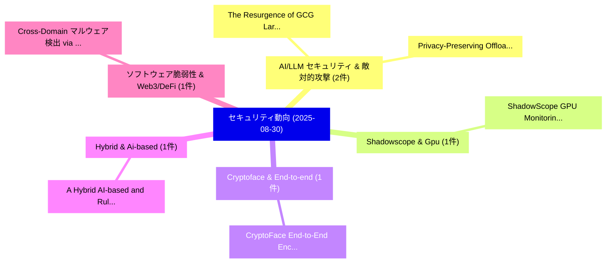

# 📅 02_daily: 日次エグゼクティブサマリー報告書 (2025-08-30)

**集計日時**: 2026-10-02 23:05:37 UTC  
**対象日付**: 2025-08-30  
**本日収集論文数**: 13 件  

---

## 💡 主要セキュリティ動向・脅威インサイト (Executive Insights)

本日の収集論文（計 13 件）において、以下の重点セキュリティ領域で活発な研究動向が確認されました：
- **AI/LLM セキュリティ & 敵対的攻撃** (2 件): 注目論文として 「The Resurgence of GCG Large La...」、「Privacy-Preserving Offloading ...」 等が発表され、実務防御および攻撃検証の進展が見られます。
- **Shadowscope & Gpu** (1 件): 注目論文として 「ShadowScope: GPU Monitoring an...」 等が発表され、実務防御および攻撃検証の進展が見られます。
- **Cryptoface & End-to-end** (1 件): 注目論文として 「CryptoFace: End-to-End Encrypt...」 等が発表され、実務防御および攻撃検証の進展が見られます。
- **Hybrid & Ai-based** (1 件): 注目論文として 「A Hybrid AI-based and Rule-bas...」 等が発表され、実務防御および攻撃検証の進展が見られます。
- **ソフトウェア脆弱性 & Web3/DeFi** (1 件): 注目論文として 「Cross-Domain マルウェア検出 via Proba...」 等が発表され、実務防御および攻撃検証の進展が見られます。

### 🗺️ 技術・脅威トピックマインドマップ

---

## 📌 日次セキュリティ論文一覧 (日本語表形式)

| No | arXiv ID | 論文タイトル (日本語訳) | 重要キーワード | 構造化エグゼクティブ要約 (背景・提案・影響) | 脅威分類 | 詳細リンク |
|---|---|---|---|---|---|---|
| 1 | `2509.00300v2` | [ShadowScope: GPU Monitoring and Validation via Composable Side Channel Signals（セキュリティ分析論文）](../../okf/papers/2025-08-30/2509.00300.md) | `Composable Side Channel Signals`, `Yu David Liu`, `Ghadeer Almusaddar` | 【提案】概要 (Overview & Key Finding) 本論文「ShadowScope: GPU Monitoring and Validation via Composab...。実証評価により経営層・セキュリティ管理者向け推奨アクション (E... | `cybersecurity` | [arXiv](https://arxiv.org/abs/2509.00300v2) &#124; [OKF](../../okf/papers/2025-08-30/2509.00300.md) |
| 2 | `2509.00332v1` | [CryptoFace: End-to-End Encrypted Face Recognition（セキュリティ分析論文）](../../okf/papers/2025-08-30/2509.00332.md) | `End Encrypted Face Recognition`, `Vishnu Naresh Boddeti`, `Wei Ao` | 【提案】概要 (Overview & Key Finding) 本論文「CryptoFace: End-to-End Encrypted Face Recognition（セキュリテ...。実証評価により経営層・セキュリティ管理者向け推奨アクション (E... | `cs.CV` | [arXiv](https://arxiv.org/abs/2509.00332v1) &#124; [OKF](../../okf/papers/2025-08-30/2509.00332.md) |
| 3 | `2509.00391v1` | [The Resurgence of GCG Large Language Modelsに対する敵対的攻撃](../../okf/papers/2025-08-30/2509.00391.md) | `Large Language Models`, `Adversarial Attacks`, `Large Language` | 【提案】概要 (Overview & Key Finding) 本論文「The Resurgence of GCG Large Language Modelsに対する敵対的攻撃」（原...。実証評価により経営層・セキュリティ管理者向け推奨アクション (E... | `cs.AI` | [arXiv](https://arxiv.org/abs/2509.00391v1) &#124; [OKF](../../okf/papers/2025-08-30/2509.00391.md) |
| 4 | `2509.00437v1` | [A Hybrid AI-based and Rule-based Approach to DICOM De-identification: A Solution for the MIDI-B Challenge（セキュリティ分析論文）](../../okf/papers/2025-08-30/2509.00437.md) | `MIDI-B Challenge`, `Hamideh Haghiri`, `Rajesh Baidya` | 【提案】概要 (Overview & Key Finding) 本論文「A Hybrid AI-based and Rule-based Approach to DICOM De-i...。実証評価により経営層・セキュリティ管理者向け推奨アクション (E... | `cybersecurity` | [arXiv](https://arxiv.org/abs/2509.00437v1) &#124; [OKF](../../okf/papers/2025-08-30/2509.00437.md) |
| 5 | `2509.00476v1` | [Cross-Domain マルウェア検出 via Probability-Level Fusion of Lightweight Gradient Boosting Models](../../okf/papers/2025-08-30/2509.00476.md) | `Lightweight Gradient Boosting Models`, `Level Fusion`, `Probability-Level Fusion` | 【提案】概要 (Overview & Key Finding) 本論文「Cross-Domain マルウェア検出 via Probability-Level Fusion of Li...。実証評価により経営層・セキュリティ管理者向け推奨アクション (E... | `cs.AI` | [arXiv](https://arxiv.org/abs/2509.00476v1) &#124; [OKF](../../okf/papers/2025-08-30/2509.00476.md) |
| 6 | `2509.00540v1` | [FedThief: Harming Others to Benefit Oneself in Self-Centered 連合学習](../../okf/papers/2025-08-30/2509.00540.md) | `Harming Others`, `Benefit Oneself`, `Centered Federated Learning` | 【提案】概要 (Overview & Key Finding) 本論文「FedThief: Harming Others to Benefit Oneself in Self-Cen...。実証評価により経営層・セキュリティ管理者向け推奨アクション (E... | `executive-summary` | [arXiv](https://arxiv.org/abs/2509.00540v1) &#124; [OKF](../../okf/papers/2025-08-30/2509.00540.md) |
| 7 | `2509.00561v1` | [FreeTalk:A plug-and-play and black-box defense against speech synthesis attacks（セキュリティ分析論文）](../../okf/papers/2025-08-30/2509.00561.md) | `black-box defense`, `Yuwen Pu`, `Zhou Feng` | 【提案】概要 (Overview & Key Finding) 本論文「FreeTalk:A plug-and-play and black-box defense against ...。実証評価により経営層・セキュリティ管理者向け推奨アクション (E... | `cybersecurity` | [arXiv](https://arxiv.org/abs/2509.00561v1) &#124; [OKF](../../okf/papers/2025-08-30/2509.00561.md) |
| 8 | `2509.00615v1` | [Federated Survival Analysis with Node-Level Differential Privacy: Private Kaplan-Meier Curves（セキュリティ分析論文）](../../okf/papers/2025-08-30/2509.00615.md) | `Level Differential Privacy`, `Private Kaplan`, `Meier Curves` | 【提案】概要 (Overview & Key Finding) 本論文「Federated Survival Analysis with Node-Level 差分プライバシー: P...。実証評価により経営層・セキュリティ管理者向け推奨アクション (E... | `cs.AI` | [arXiv](https://arxiv.org/abs/2509.00615v1) &#124; [OKF](../../okf/papers/2025-08-30/2509.00615.md) |
| 9 | `2509.00634v1` | [Enabling Trustworthy 連合学習 via Remote Attestation for Mitigating Byzantine Threats](../../okf/papers/2025-08-30/2509.00634.md) | `Mitigating Byzantine Threats`, `Remote Attestation`, `Enabling Trustworthy Federated Learning` | 【提案】概要 (Overview & Key Finding) 本論文「Enabling Trustworthy 連合学習 via Remote Attestation for Mi...。実証評価により経営層・セキュリティ管理者向け推奨アクション (E... | `cs.AI` | [arXiv](https://arxiv.org/abs/2509.00634v1) &#124; [OKF](../../okf/papers/2025-08-30/2509.00634.md) |
| 10 | `2509.05318v1` | [Backdoor Samples Detection Based on Perturbation Discrepancy Consistency in Pre-trained Language Models（セキュリティ分析論文）](../../okf/papers/2025-08-30/2509.05318.md) | `Backdoor Samples Detection Based`, `Perturbation Discrepancy Consistency`, `Language Models` | 【提案】概要 (Overview & Key Finding) 本論文「Backdoor Samples Detection Based on Perturbation Discre...。実証評価により経営層・セキュリティ管理者向け推奨アクション (E... | `cs.AI` | [arXiv](https://arxiv.org/abs/2509.05318v1) &#124; [OKF](../../okf/papers/2025-08-30/2509.05318.md) |
| 11 | `2509.05320v1` | [Privacy-Preserving Offloading for 大規模言語モデル in 6G Vehicular Networks](../../okf/papers/2025-08-30/2509.05320.md) | `Preserving Offloading`, `Vehicular Networks`, `Privacy-Preserving Offloading` | 【提案】概要 (Overview & Key Finding) 本論文「Privacy-Preserving Offloading for 大規模言語モデル in 6G Vehicu...。実証評価により経営層・セキュリティ管理者向け推奨アクション (E... | `executive-summary` | [arXiv](https://arxiv.org/abs/2509.05320v1) &#124; [OKF](../../okf/papers/2025-08-30/2509.05320.md) |
| 12 | `2509.05326v2` | [Zero-Knowledge Proofs in Sublinear Space（セキュリティ分析論文）](../../okf/papers/2025-08-30/2509.05326.md) | `Knowledge Proofs`, `Sublinear Space`, `Zero-Knowledge Proofs` | 【提案】概要 (Overview & Key Finding) 本論文「Zero-Knowledge Proofs in Sublinear Space（セキュリティ分析論文）」（原...。実証評価により経営層・セキュリティ管理者向け推奨アクション (E... | `cs.AI` | [arXiv](https://arxiv.org/abs/2509.05326v2) &#124; [OKF](../../okf/papers/2025-08-30/2509.05326.md) |
| 13 | `2509.10488v1` | [Turning CVEs into Educational Labs:Insights and Challenges（セキュリティ分析論文）](../../okf/papers/2025-08-30/2509.10488.md) | `Educational Labs`, `Trueye Tafese`, `Raw Meta` | 【提案】概要 (Overview & Key Finding) 本論文「Turning CVEs into Educational Labs:Insights and Challen...。実証評価により経営層・セキュリティ管理者向け推奨アクション (E... | `cybersecurity` | [arXiv](https://arxiv.org/abs/2509.10488v1) &#124; [OKF](../../okf/papers/2025-08-30/2509.10488.md) |

