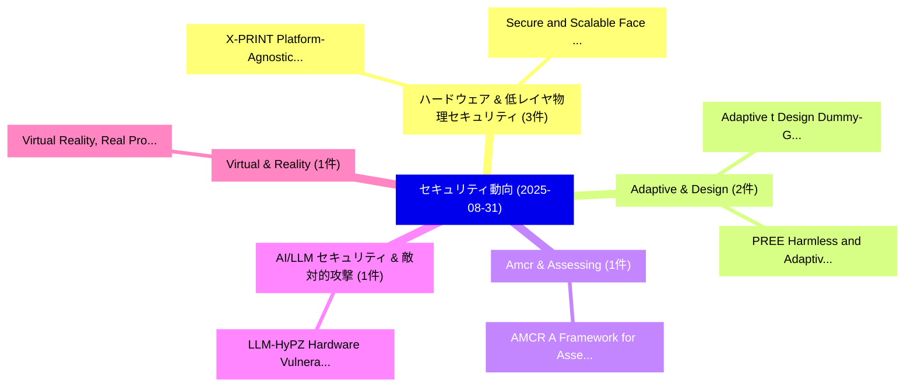

# 📅 02_daily: 日次エグゼクティブサマリー報告書 (2025-08-31)

**集計日時**: 2026-10-02 23:05:37 UTC  
**対象日付**: 2025-08-31  
**本日収集論文数**: 16 件  

---

## 💡 主要セキュリティ動向・脅威インサイト (Executive Insights)

本日の収集論文（計 16 件）において、以下の重点セキュリティ領域で活発な研究動向が確認されました：
- **ハードウェア & 低レイヤ物理セキュリティ** (3 件): 注目論文として 「X-PRINT:Platform-Agnostic and ...」、「Secure and Scalable Face Retri...」 等が発表され、実務防御および攻撃検証の進展が見られます。
- **Adaptive & Design** (2 件): 注目論文として 「Adaptive t Design Dummy-Gate O...」、「PREE: Harmless and Adaptive Fi...」 等が発表され、実務防御および攻撃検証の進展が見られます。
- **Amcr & Assessing** (1 件): 注目論文として 「AMCR: A Framework for Assessin...」 等が発表され、実務防御および攻撃検証の進展が見られます。
- **AI/LLM セキュリティ & 敵対的攻撃** (1 件): 注目論文として 「LLM-HyPZ: Hardware Vulnerabili...」 等が発表され、実務防御および攻撃検証の進展が見られます。
- **Virtual & Reality** (1 件): 注目論文として 「Virtual Reality, Real Problems...」 等が発表され、実務防御および攻撃検証の進展が見られます。

### 🗺️ 技術・脅威トピックマインドマップ

---

## 📌 日次セキュリティ論文一覧 (日本語表形式)

| No | arXiv ID | 論文タイトル (日本語訳) | 重要キーワード | 構造化エグゼクティブ要約 (背景・提案・影響) | 脅威分類 | 詳細リンク |
|---|---|---|---|---|---|---|
| 1 | `2509.00641v1` | [AMCR: A Framework for Assessing and Mitigating Copyright Risks in Generative Models（セキュリティ分析論文）](../../okf/papers/2025-08-31/2509.00641.md) | `Mitigating Copyright Risks`, `Generative Models`, `Zhipeng Yin` | 【提案】概要 (Overview & Key Finding) 本論文「AMCR: A Framework for Assessing and Mitigating Copyrigh...。実証評価により経営層・セキュリティ管理者向け推奨アクション (E... | `cs.CV` | [arXiv](https://arxiv.org/abs/2509.00641v1) &#124; [OKF](../../okf/papers/2025-08-31/2509.00641.md) |
| 2 | `2509.00647v1` | [LLM-HyPZ: Hardware Vulnerability Discovery using an LLM-Assisted Hybrid Platform for Zero-Shot Knowledge Extraction and Refinement（セキュリティ分析論文）](../../okf/papers/2025-08-31/2509.00647.md) | `Hardware Vulnerability Discovery`, `Assisted Hybrid Platform`, `Shot Knowledge Extraction` | 【提案】概要 (Overview & Key Finding) 本論文「LLM-HyPZ: Hardware 脆弱性 Discovery using an LLM-Assisted ...。実証評価により経営層・セキュリティ管理者向け推奨アクション (E... | `cs.AI` | [arXiv](https://arxiv.org/abs/2509.00647v1) &#124; [OKF](../../okf/papers/2025-08-31/2509.00647.md) |
| 3 | `2509.00662v2` | [Virtual Reality, Real Problems: A Longitudinal Security VR Firmwareの分析](../../okf/papers/2025-08-31/2509.00662.md) | `Virtual Reality`, `Real Problems`, `Longitudinal Security` | 【提案】概要 (Overview & Key Finding) 本論文「Virtual Reality, Real Problems: A Longitudinal Security...。実証評価により経営層・セキュリティ管理者向け推奨アクション (E... | `cybersecurity` | [arXiv](https://arxiv.org/abs/2509.00662v2) &#124; [OKF](../../okf/papers/2025-08-31/2509.00662.md) |
| 4 | `2509.00706v1` | [X-PRINT:Platform-Agnostic and Scalable Fine-Grained Encrypted Traffic Fingerprinting（セキュリティ分析論文）](../../okf/papers/2025-08-31/2509.00706.md) | `Grained Encrypted Traffic Fingerprinting`, `Scalable Fine`, `Fine-Grained Encrypted` | 【提案】概要 (Overview & Key Finding) 本論文「X-PRINT:Platform-Agnostic and Scalable Fine-Grained Enc...。実証評価により経営層・セキュリティ管理者向け推奨アクション (E... | `cybersecurity` | [arXiv](https://arxiv.org/abs/2509.00706v1) &#124; [OKF](../../okf/papers/2025-08-31/2509.00706.md) |
| 5 | `2509.00770v2` | [Bayesian and Multi-Objective Decision Support for Real-Time Incident Mitigation in Critical Infrastructure（セキュリティ分析論文）](../../okf/papers/2025-08-31/2509.00770.md) | `Objective Decision Support`, `Time Incident Mitigation`, `Multi-Objective Decision` | 【提案】概要 (Overview & Key Finding) 本論文「Bayesian and Multi-Objective Decision Support for Real-...。実証評価により経営層・セキュリティ管理者向け推奨アクション (E... | `cybersecurity` | [arXiv](https://arxiv.org/abs/2509.00770v2) &#124; [OKF](../../okf/papers/2025-08-31/2509.00770.md) |
| 6 | `2509.00781v1` | [Secure and Scalable Face Retrieval via Cancelable Product Quantization（セキュリティ分析論文）](../../okf/papers/2025-08-31/2509.00781.md) | `Scalable Face Retrieval`, `Cancelable Product Quantization`, `Haomiao Tang` | 【提案】概要 (Overview & Key Finding) 本論文「Secure and Scalable Face Retrieval via Cancelable Produ...。実証評価により経営層・セキュリティ管理者向け推奨アクション (E... | `cs.CV` | [arXiv](https://arxiv.org/abs/2509.00781v1) &#124; [OKF](../../okf/papers/2025-08-31/2509.00781.md) |
| 7 | `2509.00811v1` | [MAESTROCUT: Dynamic, Noise-Adaptive, and Secure Quantum Circuit Cutting on Near-Term Hardware（セキュリティ分析論文）](../../okf/papers/2025-08-31/2509.00811.md) | `Secure Quantum Circuit Cutting`, `Term Hardware`, `Near-Term Hardware` | 【提案】概要 (Overview & Key Finding) 本論文「MAESTROCUT: Dynamic, Noise-Adaptive, and Secure 量子 Circ...。実証評価により経営層・セキュリティ管理者向け推奨アクション (E... | `cybersecurity` | [arXiv](https://arxiv.org/abs/2509.00811v1) &#124; [OKF](../../okf/papers/2025-08-31/2509.00811.md) |
| 8 | `2509.00812v1` | [Adaptive t Design Dummy-Gate Obfuscation for Cryogenic Scale Enforcement（セキュリティ分析論文）](../../okf/papers/2025-08-31/2509.00812.md) | `Cryogenic Scale Enforcement`, `Design Dummy`, `Gate Obfuscation` | 【提案】概要 (Overview & Key Finding) 本論文「Adaptive t Design Dummy-Gate Obfuscation for Cryogenic ...。実証評価により経営層・セキュリティ管理者向け推奨アクション (E... | `cybersecurity` | [arXiv](https://arxiv.org/abs/2509.00812v1) &#124; [OKF](../../okf/papers/2025-08-31/2509.00812.md) |
| 9 | `2509.00820v1` | [Unlocking the Effectiveness of LoRA-FP for Seamless Transfer Implantation of Fingerprints in Downstream Models（セキュリティ分析論文）](../../okf/papers/2025-08-31/2509.00820.md) | `Seamless Transfer Implantation`, `Downstream Models`, `Zhenhua Xu` | 【提案】概要 (Overview & Key Finding) 本論文「Unlocking the Effectiveness of LoRA-FP for Seamless Tra...。実証評価により経営層・セキュリティ管理者向け推奨アクション (E... | `cybersecurity` | [arXiv](https://arxiv.org/abs/2509.00820v1) &#124; [OKF](../../okf/papers/2025-08-31/2509.00820.md) |
| 10 | `2509.00882v5` | [VULSOLVER: 脆弱性検出 via LLM-Driven Constraint Solving](../../okf/papers/2025-08-31/2509.00882.md) | `Driven Constraint Solving`, `LLM-Driven Constraint`, `Vulnerability Detection` | 【提案】概要 (Overview & Key Finding) 本論文「VULSOLVER: 脆弱性検出 via LLM-Driven Constraint Solving」（原題:...。実証評価により経営層・セキュリティ管理者向け推奨アクション (E... | `cybersecurity` | [arXiv](https://arxiv.org/abs/2509.00882v5) &#124; [OKF](../../okf/papers/2025-08-31/2509.00882.md) |
| 11 | `2509.00896v2` | [AI-Enhanced Intelligent NIDS Framework: Leveraging Metaheuristic Optimization for Robust Attack Detection and Prevention（セキュリティ分析論文）](../../okf/papers/2025-08-31/2509.00896.md) | `Leveraging Metaheuristic Optimization`, `Robust Attack Detection`, `Enhanced Intelligent` | 【提案】概要 (Overview & Key Finding) 本論文「AI-Enhanced Intelligent NIDS Framework: Leveraging Meta...。実証評価により経営層・セキュリティ管理者向け推奨アクション (E... | `executive-summary` | [arXiv](https://arxiv.org/abs/2509.00896v2) &#124; [OKF](../../okf/papers/2025-08-31/2509.00896.md) |
| 12 | `2509.00918v1` | [PREE: Harmless and Adaptive Fingerprint Editing in Large Language Models via Knowledge Prefix Enhancementに向けて](../../okf/papers/2025-08-31/2509.00918.md) | `Adaptive Fingerprint Editing`, `Large Language Models`, `Knowledge Prefix Enhancement` | 【提案】概要 (Overview & Key Finding) 本論文「PREE: Harmless and Adaptive Fingerprint Editing in Larg...。実証評価により経営層・セキュリティ管理者向け推奨アクション (E... | `cybersecurity` | [arXiv](https://arxiv.org/abs/2509.00918v1) &#124; [OKF](../../okf/papers/2025-08-31/2509.00918.md) |
| 13 | `2509.00973v1` | [Clone What You Can't Steal: Black-Box LLM Replication via Logit Leakage and Distillation（セキュリティ分析論文）](../../okf/papers/2025-08-31/2509.00973.md) | `Logit Leakage`, `Black-Box LLM`, `Shafika Showkat Moni` | 【提案】背景とセキュリティ上の課題 (Background & Problem) 本研究はサイバー脅威環境におけるセキュリティ構造・脆弱性の検証を目的としています。(主要検出項目: ...。実証評価により経営層・セキュリティ管理者向け推奨アクション (E... | `cs.AI` | [arXiv](https://arxiv.org/abs/2509.00973v1) &#124; [OKF](../../okf/papers/2025-08-31/2509.00973.md) |
| 14 | `2509.05331v1` | [ForensicsData: A Digital Forensics Dataset for 大規模言語モデル](../../okf/papers/2025-08-31/2509.05331.md) | `Digital Forensics Dataset`, `Large Language Models`, `Youssef Chakir` | 【提案】概要 (Overview & Key Finding) 本論文「ForensicsData: A Digital Forensics Dataset for 大規模言語モデル...。実証評価により経営層・セキュリティ管理者向け推奨アクション (E... | `cs.AI` | [arXiv](https://arxiv.org/abs/2509.05331v1) &#124; [OKF](../../okf/papers/2025-08-31/2509.05331.md) |
| 15 | `2509.05332v1` | [Integrated Simulation Framework for Autonomous Vehiclesに対する敵対的攻撃](../../okf/papers/2025-08-31/2509.05332.md) | `Adversarial Attacks`, `Autonomous Vehicles`, `Christos Anagnostopoulos` | 【提案】概要 (Overview & Key Finding) 本論文「Integrated Simulation Framework for Autonomous Vehicles...。実証評価により経営層・セキュリティ管理者向け推奨アクション (E... | `cs.AI` | [arXiv](https://arxiv.org/abs/2509.05332v1) &#124; [OKF](../../okf/papers/2025-08-31/2509.05332.md) |
| 16 | `2509.10492v2` | [Investigation Of The Distinguishability Of Giraud-Verneuil Atomic Blocks（セキュリティ分析論文）](../../okf/papers/2025-08-31/2509.10492.md) | `Verneuil Atomic Blocks`, `Giraud-Verneuil Atomic`, `Philip Laryea Doku` | 【提案】概要 (Overview & Key Finding) 本論文「Investigation Of The Distinguishability Of Giraud-Verne...。実証評価により経営層・セキュリティ管理者向け推奨アクション (E... | `cybersecurity` | [arXiv](https://arxiv.org/abs/2509.10492v2) &#124; [OKF](../../okf/papers/2025-08-31/2509.10492.md) |

