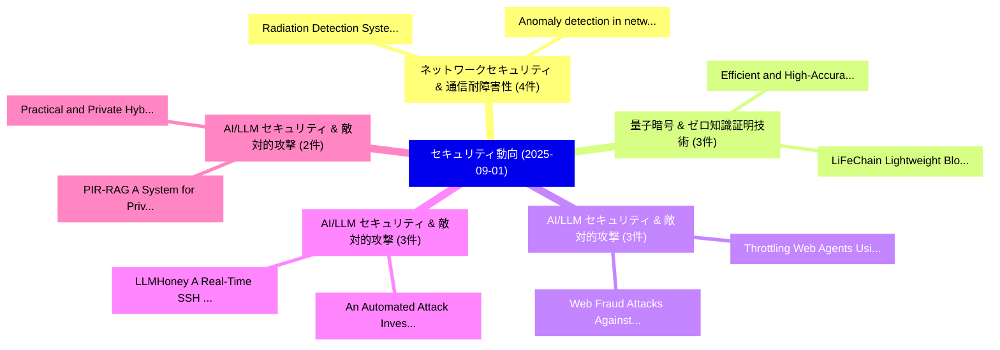

# 📅 02_daily: 日次エグゼクティブサマリー報告書 (2025-09-01)

**集計日時**: 2026-10-02 23:05:38 UTC  
**対象日付**: 2025-09-01  
**本日収集論文数**: 24 件  

---

## 💡 主要セキュリティ動向・脅威インサイト (Executive Insights)

本日の収集論文（計 24 件）において、以下の重点セキュリティ領域で活発な研究動向が確認されました：
- **ネットワークセキュリティ & 通信耐障害性** (4 件): 注目論文として 「Anomaly detection in network f...」、「Radiation Detection Systems wi...」 等が発表され、実務防御および攻撃検証の進展が見られます。
- **量子暗号 & ゼロ知識証明技術** (3 件): 注目論文として 「Efficient and High-Accuracy Se...」、「LiFeChain: Lightweight Blockch...」 等が発表され、実務防御および攻撃検証の進展が見られます。
- **AI/LLM セキュリティ & 敵対的攻撃** (3 件): 注目論文として 「Web Fraud Attacks Against LLM-...」、「Throttling Web Agents Using Re...」 等が発表され、実務防御および攻撃検証の進展が見られます。
- **AI/LLM セキュリティ & 敵対的攻撃** (3 件): 注目論文として 「An Automated Attack Investigat...」、「LLMHoney: A Real-Time SSH Hone...」 等が発表され、実務防御および攻撃検証の進展が見られます。
- **AI/LLM セキュリティ & 敵対的攻撃** (2 件): 注目論文として 「Practical and Private Hybrid M...」、「PIR-RAG: A System for Private ...」 等が発表され、実務防御および攻撃検証の進展が見られます。

### 🗺️ 技術・脅威トピックマインドマップ

---

## 📌 日次セキュリティ論文一覧 (日本語表形式)

| No | arXiv ID | 論文タイトル (日本語訳) | 重要キーワード | 構造化エグゼクティブ要約 (背景・提案・影響) | 脅威分類 | 詳細リンク |
|---|---|---|---|---|---|---|
| 1 | `2509.01046v2` | [Lightening the Load: A Cluster-Based Framework for A Lower-Overhead, Provable Website Fingerprinting Defense（セキュリティ分析論文）](../../okf/papers/2025-09-01/2509.01046.md) | `Provable Website Fingerprinting Defense`, `Provable Website Fingerprinting Defens`, `Khashayar Khajavi` | 【提案】概要 (Overview & Key Finding) 本論文「Lightening the Load: A Cluster-Based Framework for A Lo...。実証評価により経営層・セキュリティ管理者向け推奨アクション (E... | `cybersecurity` | [arXiv](https://arxiv.org/abs/2509.01046v2) &#124; [OKF](../../okf/papers/2025-09-01/2509.01046.md) |
| 2 | `2509.01178v1` | [Efficient and High-Accuracy Secure Two-Party Protocols for a Class of Functions with Real-number Inputs（セキュリティ分析論文）](../../okf/papers/2025-09-01/2509.01178.md) | `Accuracy Secure Two`, `High-Accuracy Secure`, `Party Protocols` | 【提案】概要 (Overview & Key Finding) 本論文「Efficient and High-Accuracy Secure Two-Party Protocols ...。実証評価により経営層・セキュリティ管理者向け推奨アクション (E... | `cybersecurity` | [arXiv](https://arxiv.org/abs/2509.01178v1) &#124; [OKF](../../okf/papers/2025-09-01/2509.01178.md) |
| 3 | `2509.01211v2` | [Web Fraud Attacks Against LLM-Driven Multi-Agent Systems（セキュリティ分析論文）](../../okf/papers/2025-09-01/2509.01211.md) | `Driven Multi`, `Agent Systems`, `LLM-Driven Multi` | 【提案】概要 (Overview & Key Finding) 本論文「Web Fraud Attacks Against LLM-Driven Multi-Agent System...。実証評価により経営層・セキュリティ管理者向け推奨アクション (E... | `cs.AI` | [arXiv](https://arxiv.org/abs/2509.01211v2) &#124; [OKF](../../okf/papers/2025-09-01/2509.01211.md) |
| 4 | `2509.01253v1` | [Practical and Private Hybrid ML Inference with Fully Homomorphic Encryption（セキュリティ分析論文）](../../okf/papers/2025-09-01/2509.01253.md) | `Fully Homomorphic Encryption`, `Private Hybrid`, `Fully Homomorphic Enc` | 【提案】概要 (Overview & Key Finding) 本論文「Practical and Private Hybrid ML Inference with Fully 準同...。実証評価により経営層・セキュリティ管理者向け推奨アクション (E... | `executive-summary` | [arXiv](https://arxiv.org/abs/2509.01253v1) &#124; [OKF](../../okf/papers/2025-09-01/2509.01253.md) |
| 5 | `2509.01271v1` | [An Automated Attack Investigation Approach Leveraging Threat-Knowledge-Augmented 大規模言語モデル](../../okf/papers/2025-09-01/2509.01271.md) | `Augmented Large Language Models`, `Rujie Dai`, `Peizhuo Lv` | 【提案】概要 (Overview & Key Finding) 本論文「An Automated Attack Investigation Approach Leveraging 脅...。実証評価により経営層・セキュリティ管理者向け推奨アクション (E... | `cybersecurity` | [arXiv](https://arxiv.org/abs/2509.01271v1) &#124; [OKF](../../okf/papers/2025-09-01/2509.01271.md) |
| 6 | `2509.01375v1` | [Anomaly detection in network flows using unsupervised online machine learning（セキュリティ分析論文）](../../okf/papers/2025-09-01/2509.01375.md) | `Alberto Miguel`, `Manuel Guerrero`, `Raw Meta` | 【提案】概要 (Overview & Key Finding) 本論文「Anomaly detection in network flows using unsupervised o...。実証評価により経営層・セキュリティ管理者向け推奨アクション (E... | `cs.AI` | [arXiv](https://arxiv.org/abs/2509.01375v1) &#124; [OKF](../../okf/papers/2025-09-01/2509.01375.md) |
| 7 | `2509.01434v2` | [LiFeChain: Lightweight Blockchain for Secure and Efficient Federated Lifelong Learning in IoT（セキュリティ分析論文）](../../okf/papers/2025-09-01/2509.01434.md) | `Efficient Federated Lifelong Learning`, `Lightweight Blockchain`, `Handi Chen` | 【提案】概要 (Overview & Key Finding) 本論文「LiFeChain: Lightweight Blockchain for Secure and Effici...。実証評価により経営層・セキュリティ管理者向け推奨アクション (E... | `executive-summary` | [arXiv](https://arxiv.org/abs/2509.01434v2) &#124; [OKF](../../okf/papers/2025-09-01/2509.01434.md) |
| 8 | `2509.01463v1` | [LLMHoney: A Real-Time SSH Honeypot with Large Language Model-Driven Dynamic Response Generation（セキュリティ分析論文）](../../okf/papers/2025-09-01/2509.01463.md) | `Driven Dynamic Response Generation`, `Large Language Model`, `Real-Time SSH` | 【提案】概要 (Overview & Key Finding) 本論文「LLMHoney: A Real-Time SSH Honeypot with Large Language ...。実証評価により経営層・セキュリティ管理者向け推奨アクション (E... | `cybersecurity` | [arXiv](https://arxiv.org/abs/2509.01463v1) &#124; [OKF](../../okf/papers/2025-09-01/2509.01463.md) |
| 9 | `2509.01470v1` | [Privacy-preserving authentication for military 5G networks（セキュリティ分析論文）](../../okf/papers/2025-09-01/2509.01470.md) | `Privacy-preserving authentication`, `Raw Meta`, `Executive Summary` | 【提案】概要 (Overview & Key Finding) 本論文「Privacy-preserving authentication for military 5G netwo...。実証評価によりValenti - **公開日時**: `2025... | `cybersecurity` | [arXiv](https://arxiv.org/abs/2509.01470v1) &#124; [OKF](../../okf/papers/2025-09-01/2509.01470.md) |
| 10 | `2509.01509v1` | [Insight-LLM: LLM-enhanced Multi-view Fusion in Insider Threat Detection（セキュリティ分析論文）](../../okf/papers/2025-09-01/2509.01509.md) | `Insider Threat Detection`, `LLM-enhanced Multi`, `Chengyu Song` | 【提案】概要 (Overview & Key Finding) 本論文「Insight-LLM: LLM-enhanced Multi-view Fusion in Insider ...。実証評価により経営層・セキュリティ管理者向け推奨アクション (E... | `cybersecurity` | [arXiv](https://arxiv.org/abs/2509.01509v1) &#124; [OKF](../../okf/papers/2025-09-01/2509.01509.md) |
| 11 | `2509.01592v1` | [Radiation Detection Systems with an Efficient TinyML-Based IDS for Edge Devicesのセキュリティ強化](../../okf/papers/2025-09-01/2509.01592.md) | `TinyML-Based IDS`, `Securing Radiation Detection Systems`, `Radiation Detection Systems` | 【提案】概要 (Overview & Key Finding) 本論文「Radiation Detection Systems with an Efficient TinyML-Ba...。実証評価により経営層・セキュリティ管理者向け推奨アクション (E... | `cs.AI` | [arXiv](https://arxiv.org/abs/2509.01592v1) &#124; [OKF](../../okf/papers/2025-09-01/2509.01592.md) |
| 12 | `2509.01597v2` | [Statistics-Friendly Confidentiality Protection for Establishment Data, with Applications to the QCEW（セキュリティ分析論文）](../../okf/papers/2025-09-01/2509.01597.md) | `Friendly Confidentiality Protection`, `Establishment Data`, `Statistics-Friendly Confidentiality` | 【提案】概要 (Overview & Key Finding) 本論文「Statistics-Friendly Confidentiality Protection for Esta...。実証評価により経営層・セキュリティ管理者向け推奨アクション (E... | `executive-summary` | [arXiv](https://arxiv.org/abs/2509.01597v2) &#124; [OKF](../../okf/papers/2025-09-01/2509.01597.md) |
| 13 | `2509.01599v1` | [An Efficient Intrusion Detection System for Safeguarding Radiation Detection Systems（セキュリティ分析論文）](../../okf/papers/2025-09-01/2509.01599.md) | `Safeguarding Radiation Detection Systems`, `Khalil El Khatib`, `Mehmet Yavuz Yagci` | 【提案】概要 (Overview & Key Finding) 本論文「An Efficient Intrusion Detection System for Safeguardin...。実証評価により経営層・セキュリティ管理者向け推奨アクション (E... | `cs.AI` | [arXiv](https://arxiv.org/abs/2509.01599v1) &#124; [OKF](../../okf/papers/2025-09-01/2509.01599.md) |
| 14 | `2509.01619v1` | [Throttling Web Agents Using Reasoning Gates（セキュリティ分析論文）](../../okf/papers/2025-09-01/2509.01619.md) | `Throttling Web Agents Using Reasoning Gates`, `Abhinav Kumar`, `Jaechul Roh` | 【提案】概要 (Overview & Key Finding) 本論文「Throttling Web Agents Using Reasoning Gates（セキュリティ分析論文）...。実証評価により経営層・セキュリティ管理者向け推奨アクション (E... | `cs.AI` | [arXiv](https://arxiv.org/abs/2509.01619v1) &#124; [OKF](../../okf/papers/2025-09-01/2509.01619.md) |
| 15 | `2509.01701v3` | [AmphiKey: A Dual-Mode Secure Authenticated Key Encapsulation Protocol for Smart Grid（セキュリティ分析論文）](../../okf/papers/2025-09-01/2509.01701.md) | `Mode Secure Authenticated Key Encapsulation Protocol`, `Smart Grid`, `Dual-Mode Secure` | 【提案】概要 (Overview & Key Finding) 本論文「AmphiKey: A Dual-Mode Secure Authenticated Key Encapsul...。実証評価により経営層・セキュリティ管理者向け推奨アクション (E... | `cybersecurity` | [arXiv](https://arxiv.org/abs/2509.01701v3) &#124; [OKF](../../okf/papers/2025-09-01/2509.01701.md) |
| 16 | `2509.01717v1` | [Designing a Layered Framework to Secure Data via Improved Multi Stage Lightweight Cryptography in IoT Cloud Systems（セキュリティ分析論文）](../../okf/papers/2025-09-01/2509.01717.md) | `Improved Multi Stage Lightweight Cryptography`, `Secure Data`, `Cloud Systems` | 【提案】概要 (Overview & Key Finding) 本論文「Designing a Layered Framework to Secure Data via Improv...。実証評価により経営層・セキュリティ管理者向け推奨アクション (E... | `executive-summary` | [arXiv](https://arxiv.org/abs/2509.01717v1) &#124; [OKF](../../okf/papers/2025-09-01/2509.01717.md) |
| 17 | `2509.01724v1` | [An intrusion detection system in internet of things using grasshopper optimization algorithm and machine learning algorithms（セキュリティ分析論文）](../../okf/papers/2025-09-01/2509.01724.md) | `Shiva Sattarpour`, `Ali Barati`, `Hamid Barati` | 【提案】概要 (Overview & Key Finding) 本論文「An intrusion detection system in internet of things usi...。実証評価により経営層・セキュリティ管理者向け推奨アクション (E... | `executive-summary` | [arXiv](https://arxiv.org/abs/2509.01724v1) &#124; [OKF](../../okf/papers/2025-09-01/2509.01724.md) |
| 18 | `2509.01731v1` | [Are Enterprises Ready for Quantum-Safe サイバーセキュリティ?](../../okf/papers/2025-09-01/2509.01731.md) | `Safe Cybersecurity`, `Quantum-Safe Cybersecurity`, `Tran Duc Le` | 【提案】### (日本語題名: Are Enterprises Ready for 量子-Safe サイバーセキュリティ?)  > [!NOTE] > **OKF Metadata*...。実証評価により経営層・セキュリティ管理者向け推奨アクション (E... | `cybersecurity` | [arXiv](https://arxiv.org/abs/2509.01731v1) &#124; [OKF](../../okf/papers/2025-09-01/2509.01731.md) |
| 19 | `2509.01742v2` | [BOLT: Bandwidth-Optimized Lightning-Fast Oblivious Map powered by Secure HBM Accelerators（セキュリティ分析論文）](../../okf/papers/2025-09-01/2509.01742.md) | `Fast Oblivious Map`, `Optimized Lightning`, `Bandwidth-Optimized Lightning` | 【提案】概要 (Overview & Key Finding) 本論文「BOLT: Bandwidth-Optimized Lightning-Fast Oblivious Map ...。実証評価により経営層・セキュリティ管理者向け推奨アクション (E... | `executive-summary` | [arXiv](https://arxiv.org/abs/2509.01742v2) &#124; [OKF](../../okf/papers/2025-09-01/2509.01742.md) |
| 20 | `2509.01791v2` | [E-PhishGen: Unlocking Novel Research in Phishing Email Detection（セキュリティ分析論文）](../../okf/papers/2025-09-01/2509.01791.md) | `Phishing Email Detection`, `Luca Pajola`, `Eugenio Caripoti` | 【提案】概要 (Overview & Key Finding) 本論文「E-PhishGen: Unlocking Novel Research in Phishing Email ...。実証評価により経営層・セキュリティ管理者向け推奨アクション (E... | `cs.AI` | [arXiv](https://arxiv.org/abs/2509.01791v2) &#124; [OKF](../../okf/papers/2025-09-01/2509.01791.md) |
| 21 | `2509.01835v2` | [From CVE Entries to Verifiable Exploits: An Automated Multi-Agent Framework for Reproducing CVEs（セキュリティ分析論文）](../../okf/papers/2025-09-01/2509.01835.md) | `Verifiable Exploits`, `Saad Ullah`, `Praneeth Balasubramanian` | 【提案】概要 (Overview & Key Finding) 本論文「From CVE Entries to Verifiable Exploits: An Automated M...。実証評価により経営層・セキュリティ管理者向け推奨アクション (E... | `cybersecurity` | [arXiv](https://arxiv.org/abs/2509.01835v2) &#124; [OKF](../../okf/papers/2025-09-01/2509.01835.md) |
| 22 | `2509.08838v1` | [Adtech and Real-Time Bidding under European Data Protection Law（セキュリティ分析論文）](../../okf/papers/2025-09-01/2509.08838.md) | `European Data Protection Law`, `Time Bidding`, `Real-Time Bidding` | 【提案】概要 (Overview & Key Finding) 本論文「Adtech and Real-Time Bidding under European Data Protec...。実証評価により経営層・セキュリティ管理者向け推奨アクション (E... | `executive-summary` | [arXiv](https://arxiv.org/abs/2509.08838v1) &#124; [OKF](../../okf/papers/2025-09-01/2509.08838.md) |
| 23 | `2509.21325v1` | [PIR-RAG: A System for Private Information Retrieval in Retrieval-Augmented Generation（セキュリティ分析論文）](../../okf/papers/2025-09-01/2509.21325.md) | `Private Information Retrieval`, `Augmented Generation`, `Retrieval-Augmented Generation` | 【提案】概要 (Overview & Key Finding) 本論文「PIR-RAG: A System for Private Information Retrieval in ...。実証評価により経営層・セキュリティ管理者向け推奨アクション (E... | `cs.AI` | [arXiv](https://arxiv.org/abs/2509.21325v1) &#124; [OKF](../../okf/papers/2025-09-01/2509.21325.md) |
| 24 | `2509.22662v1` | [GPS Spoofing Attacks and Pilot Responses Using a Flight Simulator Environment（セキュリティ分析論文）](../../okf/papers/2025-09-01/2509.22662.md) | `Pilot Responses Using`, `Flight Simulator Environment`, `Spoofing Attacks` | 【提案】概要 (Overview & Key Finding) 本論文「GPS Spoofing Attacks and Pilot Responses Using a Flight...。実証評価により経営層・セキュリティ管理者向け推奨アクション (E... | `cybersecurity` | [arXiv](https://arxiv.org/abs/2509.22662v1) &#124; [OKF](../../okf/papers/2025-09-01/2509.22662.md) |

