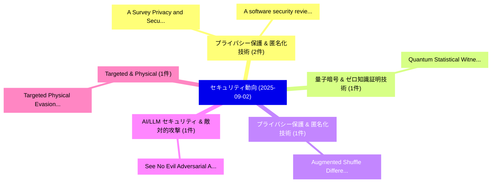

# 📅 02_daily: 日次エグゼクティブサマリー報告書 (2025-09-02)

**集計日時**: 2026-10-02 23:05:38 UTC  
**対象日付**: 2025-09-02  
**本日収集論文数**: 24 件  

---

## 💡 主要セキュリティ動向・脅威インサイト (Executive Insights)

本日の収集論文（計 24 件）において、以下の重点セキュリティ領域で活発な研究動向が確認されました：
- **プライバシー保護 & 匿名化技術** (2 件): 注目論文として 「A Survey: Privacy and Security...」、「A software security review on ...」 等が発表され、実務防御および攻撃検証の進展が見られます。
- **量子暗号 & ゼロ知識証明技術** (1 件): 注目論文として 「Quantum Statistical Witness In...」 等が発表され、実務防御および攻撃検証の進展が見られます。
- **プライバシー保護 & 匿名化技術** (1 件): 注目論文として 「Augmented Shuffle Differential...」 等が発表され、実務防御および攻撃検証の進展が見られます。
- **AI/LLM セキュリティ & 敵対的攻撃** (1 件): 注目論文として 「See No Evil: Adversarial Attac...」 等が発表され、実務防御および攻撃検証の進展が見られます。
- **Targeted & Physical** (1 件): 注目論文として 「Targeted Physical Evasion Atta...」 等が発表され、実務防御および攻撃検証の進展が見られます。

### 🗺️ 技術・脅威トピックマインドマップ

---

## 📌 日次セキュリティ論文一覧 (日本語表形式)

| No | arXiv ID | 論文タイトル (日本語訳) | 重要キーワード | 構造化エグゼクティブ要約 (背景・提案・影響) | 脅威分類 | 詳細リンク |
|---|---|---|---|---|---|---|
| 1 | `2509.01945v1` | [Quantum Statistical Witness Indistinguishability（セキュリティ分析論文）](../../okf/papers/2025-09-02/2509.01945.md) | `Quantum Statistical Witness Indistinguishability`, `Shafik Nassar`, `Ronak Ramachandran` | 【提案】概要 (Overview & Key Finding) 本論文「量子 Statistical Witness Indistinguishability（セキュリティ分析論文）...。実証評価により経営層・セキュリティ管理者向け推奨アクション (E... | `cs.CC` | [arXiv](https://arxiv.org/abs/2509.01945v1) &#124; [OKF](../../okf/papers/2025-09-02/2509.01945.md) |
| 2 | `2509.02004v1` | [Augmented Shuffle Differential Privacy Protocols for Large-Domain Categorical and Key-Value Data（セキュリティ分析論文）](../../okf/papers/2025-09-02/2509.02004.md) | `Augmented Shuffle Differential Privacy Protocols`, `Domain Categorical`, `Value Data` | 【提案】概要 (Overview & Key Finding) 本論文「Augmented Shuffle 差分プライバシー Protocols for Large-Domain C...。実証評価により経営層・セキュリティ管理者向け推奨アクション (E... | `cybersecurity` | [arXiv](https://arxiv.org/abs/2509.02004v1) &#124; [OKF](../../okf/papers/2025-09-02/2509.02004.md) |
| 3 | `2509.02028v3` | [See No Evil: Adversarial Attacks Against Linguistic-Visual Association in Referring Multi-Object Tracking Systems（セキュリティ分析論文）](../../okf/papers/2025-09-02/2509.02028.md) | `Object Tracking Systems`, `Visual Association`, `Referring Multi` | 【提案】概要 (Overview & Key Finding) 本論文「See No Evil: 敵対的攻撃s Against Linguistic-Visual Associati...。実証評価により経営層・セキュリティ管理者向け推奨アクション (E... | `cs.CV` | [arXiv](https://arxiv.org/abs/2509.02028v3) &#124; [OKF](../../okf/papers/2025-09-02/2509.02028.md) |
| 4 | `2509.02042v1` | [Targeted Physical Evasion Attacks in the Near-Infrared Domain（セキュリティ分析論文）](../../okf/papers/2025-09-02/2509.02042.md) | `Targeted Physical Evasion Attacks`, `Infrared Domain`, `Near-Infrared Domain` | 【提案】概要 (Overview & Key Finding) 本論文「Targeted Physical Evasion Attacks in the Near-Infrared ...。実証評価により経営層・セキュリティ管理者向け推奨アクション (E... | `cybersecurity` | [arXiv](https://arxiv.org/abs/2509.02042v1) &#124; [OKF](../../okf/papers/2025-09-02/2509.02042.md) |
| 5 | `2509.02048v1` | [Privacy-Utility Trade-off in Data Publication: A Bilevel Optimization Framework with Curvature-Guided Perturbation（セキュリティ分析論文）](../../okf/papers/2025-09-02/2509.02048.md) | `Utility Trade`, `Privacy-Utility Trade`, `Data Publication` | 【提案】概要 (Overview & Key Finding) 本論文「Privacy-Utility Trade-off in Data Publication: A Bileve...。実証評価により経営層・セキュリティ管理者向け推奨アクション (E... | `cs.AI` | [arXiv](https://arxiv.org/abs/2509.02048v1) &#124; [OKF](../../okf/papers/2025-09-02/2509.02048.md) |
| 6 | `2509.02076v1` | [Forecasting Future DDoS Attacks Using Long Short Term Memory (LSTM) Model（セキュリティ分析論文）](../../okf/papers/2025-09-02/2509.02076.md) | `Attacks Using Long Short Term Memory`, `Forecasting Future`, `Kong Mun Yeen` | 【提案】概要 (Overview & Key Finding) 本論文「Forecasting Future DDoS Attacks Using Long Short Term M...。実証評価により経営層・セキュリティ管理者向け推奨アクション (E... | `cs.AI` | [arXiv](https://arxiv.org/abs/2509.02076v1) &#124; [OKF](../../okf/papers/2025-09-02/2509.02076.md) |
| 7 | `2509.02077v2` | [From Attack Descriptions to Vulnerabilities: A Sentence Transformer-Based Approach（セキュリティ分析論文）](../../okf/papers/2025-09-02/2509.02077.md) | `Sentence Transformer`, `Refat Othman`, `Diaeddin Rimawi` | 【提案】概要 (Overview & Key Finding) 本論文「From Attack Descriptions to Vulnerabilities: A Sentence...。実証評価により経営層・セキュリティ管理者向け推奨アクション (E... | `executive-summary` | [arXiv](https://arxiv.org/abs/2509.02077v2) &#124; [OKF](../../okf/papers/2025-09-02/2509.02077.md) |
| 8 | `2509.02083v2` | [Performance common browser extensions for cryptojacking detectionの分析](../../okf/papers/2025-09-02/2509.02083.md) | `Dmitry Tanana`, `Raw Meta`, `Executive Summary` | 【提案】概要 (Overview & Key Finding) 本論文「Performance common browser extensions for cryptojacking...。実証評価により経営層・セキュリティ管理者向け推奨アクション (E... | `cybersecurity` | [arXiv](https://arxiv.org/abs/2509.02083v2) &#124; [OKF](../../okf/papers/2025-09-02/2509.02083.md) |
| 9 | `2509.02113v2` | [HiGraph: A Large-Scale Hierarchical Graph Dataset for Malware Analysis（セキュリティ分析論文）](../../okf/papers/2025-09-02/2509.02113.md) | `Scale Hierarchical Graph Dataset`, `Large-Scale Hierarchical`, `Han Chen` | 【提案】概要 (Overview & Key Finding) 本論文「HiGraph: A Large-Scale Hierarchical Graph Dataset for マ...。実証評価により経営層・セキュリティ管理者向け推奨アクション (E... | `cs.AI` | [arXiv](https://arxiv.org/abs/2509.02113v2) &#124; [OKF](../../okf/papers/2025-09-02/2509.02113.md) |
| 10 | `2509.02189v1` | [A Gentle Introduction to Blind signatures: From RSA to Lattice-based Cryptography（セキュリティ分析論文）](../../okf/papers/2025-09-02/2509.02189.md) | `Gentle Introduction`, `Lattice-based Cryptography`, `Aditya Bhardwaj` | 【提案】概要 (Overview & Key Finding) 本論文「A Gentle Introduction to Blind signatures: From RSA to ...。実証評価により経営層・セキュリティ管理者向け推奨アクション (E... | `cybersecurity` | [arXiv](https://arxiv.org/abs/2509.02189v1) &#124; [OKF](../../okf/papers/2025-09-02/2509.02189.md) |
| 11 | `2509.02289v2` | [Passwords and FIDO2 Are Meant To Be Secret: A Practical Secure Authentication Channel for Web Browsers（セキュリティ分析論文）](../../okf/papers/2025-09-02/2509.02289.md) | `Practical Secure Authentication Channel`, `Web Browsers`, `Practical Secure Authentication` | 【提案】概要 (Overview & Key Finding) 本論文「Passwords and FIDO2 Are Meant To Be Secret: A Practical...。実証評価により経営層・セキュリティ管理者向け推奨アクション (E... | `cybersecurity` | [arXiv](https://arxiv.org/abs/2509.02289v2) &#124; [OKF](../../okf/papers/2025-09-02/2509.02289.md) |
| 12 | `2509.02372v3` | [Scam2Prompt: A Scalable Framework for Auditing Malicious Scam Endpoints in Production LLMs（セキュリティ分析論文）](../../okf/papers/2025-09-02/2509.02372.md) | `Auditing Malicious Scam Endpoints`, `Zhiyang Chen`, `Tara Saba` | 【提案】概要 (Overview & Key Finding) 本論文「Scam2Prompt: A Scalable Framework for Auditing Maliciou...。実証評価により経営層・セキュリティ管理者向け推奨アクション (E... | `cs.AI` | [arXiv](https://arxiv.org/abs/2509.02372v3) &#124; [OKF](../../okf/papers/2025-09-02/2509.02372.md) |
| 13 | `2509.02387v1` | [Real-time ML-based Defense Against Malicious Payload in Reconfigurable Embedded Systems（セキュリティ分析論文）](../../okf/papers/2025-09-02/2509.02387.md) | `Reconfigurable Embedded Systems`, `Real-time ML`, `Rye Stahle` | 【提案】概要 (Overview & Key Finding) 本論文「Real-time ML-based Defense Against Malicious Payload in...。実証評価により経営層・セキュリティ管理者向け推奨アクション (E... | `cs.AI` | [arXiv](https://arxiv.org/abs/2509.02387v1) &#124; [OKF](../../okf/papers/2025-09-02/2509.02387.md) |
| 14 | `2509.02411v1` | [A Survey: Privacy and Security in Mobile Large Language Modelsに向けて](../../okf/papers/2025-09-02/2509.02411.md) | `Mobile Large Language Models`, `Mobile Large Language`, `Towards Privacy` | 【提案】概要 (Overview & Key Finding) 本論文「A Survey: Privacy and Security in Mobile Large Language...。実証評価により経営層・セキュリティ管理者向け推奨アクション (E... | `cs.AI` | [arXiv](https://arxiv.org/abs/2509.02411v1) &#124; [OKF](../../okf/papers/2025-09-02/2509.02411.md) |
| 15 | `2509.02412v1` | [APEX: Automatic Event Sequence Generation for Android Applications（セキュリティ分析論文）](../../okf/papers/2025-09-02/2509.02412.md) | `Automatic Event Sequence Generation`, `Android Applications`, `Wenhao Chen` | 【提案】概要 (Overview & Key Finding) 本論文「APEX: Automatic Event Sequence Generation for Android A...。実証評価により経営層・セキュリティ管理者向け推奨アクション (E... | `cybersecurity` | [arXiv](https://arxiv.org/abs/2509.02412v1) &#124; [OKF](../../okf/papers/2025-09-02/2509.02412.md) |
| 16 | `2509.02413v3` | [A Secure, Confidential, and Verifiable Decision Support System（セキュリティ分析論文）](../../okf/papers/2025-09-02/2509.02413.md) | `Verifiable Decision Support System`, `Eugenio Nerio Nemmi`, `Claudio Di Ciccio` | 【提案】概要 (Overview & Key Finding) 本論文「A Secure, Confidential, and Verifiable Decision Support...。実証評価により経営層・セキュリティ管理者向け推奨アクション (E... | `cybersecurity` | [arXiv](https://arxiv.org/abs/2509.02413v3) &#124; [OKF](../../okf/papers/2025-09-02/2509.02413.md) |
| 17 | `2509.02824v2` | [GPS Spoofing Attacks on Automated Frequency Coordination System in Wi-Fi 6E and Beyond（セキュリティ分析論文）](../../okf/papers/2025-09-02/2509.02824.md) | `Automated Frequency Coordination System`, `Spoofing Attacks`, `Wi-Fi 6E` | 【提案】概要 (Overview & Key Finding) 本論文「GPS Spoofing Attacks on Automated Frequency Coordinatio...。実証評価により経営層・セキュリティ管理者向け推奨アクション (E... | `cs.NI` | [arXiv](https://arxiv.org/abs/2509.02824v2) &#124; [OKF](../../okf/papers/2025-09-02/2509.02824.md) |
| 18 | `2509.02856v1` | [Managing Correlations in Data and Privacy Demand（セキュリティ分析論文）](../../okf/papers/2025-09-02/2509.02856.md) | `Managing Correlations`, `Privacy Demand`, `Syomantak Chaudhuri` | 【提案】概要 (Overview & Key Finding) 本論文「Managing Correlations in Data and Privacy Demand（セキュリティ...。実証評価によりCourtade - **公開日時**: `202... | `executive-summary` | [arXiv](https://arxiv.org/abs/2509.02856v1) &#124; [OKF](../../okf/papers/2025-09-02/2509.02856.md) |
| 19 | `2509.02899v1` | [Safe Sharing of Fast Kernel-Bypass I/O Among Nontrusting Applications（セキュリティ分析論文）](../../okf/papers/2025-09-02/2509.02899.md) | `Among Nontrusting Applications`, `Safe Sharing`, `Fast Kernel` | 【提案】概要 (Overview & Key Finding) 本論文「Safe Sharing of Fast Kernel-Bypass I/O Among Nontrustin...。実証評価によりScott, John Criswell - **... | `executive-summary` | [arXiv](https://arxiv.org/abs/2509.02899v1) &#124; [OKF](../../okf/papers/2025-09-02/2509.02899.md) |
| 20 | `2509.03545v1` | [A software security review on Uganda's Mobile Money Services: Dr. Jim Spire's tweets sentiment analysis（セキュリティ分析論文）](../../okf/papers/2025-09-02/2509.03545.md) | `Mobile Money Services`, `Jim Spire`, `Nsengiyumva Wilberforce` | 【提案】Jim Spire's tweets sentiment analysis ### (日本語題名: A software security review on Uganda'...。実証評価により経営層・セキュリティ管理者向け推奨アクション (E... | `cs.AI` | [arXiv](https://arxiv.org/abs/2509.03545v1) &#124; [OKF](../../okf/papers/2025-09-02/2509.03545.md) |
| 21 | `2509.05350v1` | [Ensembling Membership Inference Attacks Against Tabular Generative Models（セキュリティ分析論文）](../../okf/papers/2025-09-02/2509.05350.md) | `Joshua Ward`, `Yuxuan Yang`, `Hua Wang` | 【提案】概要 (Overview & Key Finding) 本論文「Ensembling Membership Inference Attacks Against Tabular...。実証評価により経営層・セキュリティ管理者向け推奨アクション (E... | `executive-summary` | [arXiv](https://arxiv.org/abs/2509.05350v1) &#124; [OKF](../../okf/papers/2025-09-02/2509.05350.md) |
| 22 | `2509.08841v1` | [Die Verarbeitung medizinischer Forschungsdaten ohne datenschutzrechtliche Einwilligung: Der Korridor zwischen Anonymisierung und der Forschungsausnahme in Österreich（セキュリティ分析論文）](../../okf/papers/2025-09-02/2509.08841.md) | `Die Verarbeitung`, `Der Korridor`, `Saskia Kaltenbrunner` | 【提案】概要 (Overview & Key Finding) 本論文「Die Verarbeitung medizinischer Forschungsdaten ohne dat...。実証評価により経営層・セキュリティ管理者向け推奨アクション (E... | `executive-summary` | [arXiv](https://arxiv.org/abs/2509.08841v1) &#124; [OKF](../../okf/papers/2025-09-02/2509.08841.md) |
| 23 | `2509.10511v1` | [LogGuardQ: A Cognitive-Enhanced Reinforcement Learning Framework for サイバーセキュリティ Anomaly Detection in Security Logs](../../okf/papers/2025-09-02/2509.10511.md) | `Cognitive-Enhanced Reinforcement`, `Security Logs`, `Cybersecurity Anomaly Detection` | 【提案】概要 (Overview & Key Finding) 本論文「LogGuardQ: A Cognitive-Enhanced Reinforcement Learning ...。実証評価により経営層・セキュリティ管理者向け推奨アクション (E... | `cs.AI` | [arXiv](https://arxiv.org/abs/2509.10511v1) &#124; [OKF](../../okf/papers/2025-09-02/2509.10511.md) |
| 24 | `2509.22663v1` | [Security Friction Quotient for Zero Trust Identity Policy with Empirical Validation（セキュリティ分析論文）](../../okf/papers/2025-09-02/2509.22663.md) | `Zero Trust Identity Policy`, `Security Friction Quotient`, `Empirical Validation` | 【提案】概要 (Overview & Key Finding) 本論文「Security Friction Quotient for ゼロトラスト Identity Policy w...。実証評価により経営層・セキュリティ管理者向け推奨アクション (E... | `executive-summary` | [arXiv](https://arxiv.org/abs/2509.22663v1) &#124; [OKF](../../okf/papers/2025-09-02/2509.22663.md) |

