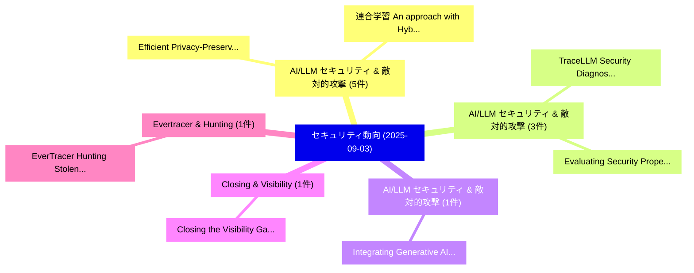

# 📅 02_daily: 日次エグゼクティブサマリー報告書 (2025-09-03)

**集計日時**: 2026-10-02 23:05:38 UTC  
**対象日付**: 2025-09-03  
**本日収集論文数**: 22 件  

---

## 💡 主要セキュリティ動向・脅威インサイト (Executive Insights)

本日の収集論文（計 22 件）において、以下の重点セキュリティ領域で活発な研究動向が確認されました：
- **AI/LLM セキュリティ & 敵対的攻撃** (5 件): 注目論文として 「Efficient Privacy-Preserving R...」、「連合学習: An approach with Hybrid ...」 等が発表され、実務防御および攻撃検証の進展が見られます。
- **AI/LLM セキュリティ & 敵対的攻撃** (3 件): 注目論文として 「TraceLLM: Security Diagnosis T...」、「Evaluating Security Properties...」 等が発表され、実務防御および攻撃検証の進展が見られます。
- **AI/LLM セキュリティ & 敵対的攻撃** (1 件): 注目論文として 「Integrating Generative AI into...」 等が発表され、実務防御および攻撃検証の進展が見られます。
- **Closing & Visibility** (1 件): 注目論文として 「Closing the Visibility Gap: A ...」 等が発表され、実務防御および攻撃検証の進展が見られます。
- **Evertracer & Hunting** (1 件): 注目論文として 「EverTracer: Hunting Stolen 大規模...」 等が発表され、実務防御および攻撃検証の進展が見られます。

### 🗺️ 技術・脅威トピックマインドマップ

---

## 📌 日次セキュリティ論文一覧 (日本語表形式)

| No | arXiv ID | 論文タイトル (日本語訳) | 重要キーワード | 構造化エグゼクティブ要約 (背景・提案・影響) | 脅威分類 | 詳細リンク |
|---|---|---|---|---|---|---|
| 1 | `2509.02998v1` | [Integrating Generative AI into サイバーセキュリティ Education: A Study of OCR and Multimodal LLM-assisted Instruction](../../okf/papers/2025-09-03/2509.02998.md) | `Integrating Generative`, `LLM-assisted Instruction`, `Cybersecurity Education` | 【提案】概要 (Overview & Key Finding) 本論文「Integrating Generative AI into サイバーセキュリティ Education: A ...。実証評価により経営層・セキュリティ管理者向け推奨アクション (E... | `executive-summary` | [arXiv](https://arxiv.org/abs/2509.02998v1) &#124; [OKF](../../okf/papers/2025-09-03/2509.02998.md) |
| 2 | `2509.03000v1` | [Closing the Visibility Gap: A Monitoring Framework for Verifiable Open RAN Operations（セキュリティ分析論文）](../../okf/papers/2025-09-03/2509.03000.md) | `Visibility Gap`, `Verifiable Open`, `Md Mohaimin Al Barat` | 【提案】概要 (Overview & Key Finding) 本論文「Closing the Visibility Gap: A Monitoring Framework for ...。実証評価により経営層・セキュリティ管理者向け推奨アクション (E... | `cs.NI` | [arXiv](https://arxiv.org/abs/2509.03000v1) &#124; [OKF](../../okf/papers/2025-09-03/2509.03000.md) |
| 3 | `2509.03024v1` | [Efficient Privacy-Preserving Recommendation on Sparse Data using Fully Homomorphic Encryption（セキュリティ分析論文）](../../okf/papers/2025-09-03/2509.03024.md) | `Fully Homomorphic Encryption`, `Efficient Privacy`, `Preserving Recommendation` | 【提案】概要 (Overview & Key Finding) 本論文「Efficient Privacy-Preserving Recommendation on Sparse D...。実証評価により経営層・セキュリティ管理者向け推奨アクション (E... | `cs.AI` | [arXiv](https://arxiv.org/abs/2509.03024v1) &#124; [OKF](../../okf/papers/2025-09-03/2509.03024.md) |
| 4 | `2509.03037v1` | [TraceLLM: Security Diagnosis Through Traces and Smart Contracts in Ethereum（セキュリティ分析論文）](../../okf/papers/2025-09-03/2509.03037.md) | `Smart Contracts`, `Shuzheng Wang`, `Yue Huang` | 【提案】概要 (Overview & Key Finding) 本論文「TraceLLM: Security Diagnosis Through Traces and スマートコント...。実証評価により経営層・セキュリティ管理者向け推奨アクション (E... | `cs.ET` | [arXiv](https://arxiv.org/abs/2509.03037v1) &#124; [OKF](../../okf/papers/2025-09-03/2509.03037.md) |
| 5 | `2509.03058v1` | [EverTracer: Hunting Stolen 大規模言語モデル via Stealthy and Robust Probabilistic Fingerprint](../../okf/papers/2025-09-03/2509.03058.md) | `Robust Probabilistic Fingerprint`, `Hunting Stolen Large Language Models`, `Hunting Stolen` | 【提案】概要 (Overview & Key Finding) 本論文「EverTracer: Hunting Stolen 大規模言語モデル via Stealthy and Ro...。実証評価により経営層・セキュリティ管理者向け推奨アクション (E... | `cybersecurity` | [arXiv](https://arxiv.org/abs/2509.03058v1) &#124; [OKF](../../okf/papers/2025-09-03/2509.03058.md) |
| 6 | `2509.03098v1` | [Compressed verification for post-quantum signatures with long-term public keys（セキュリティ分析論文）](../../okf/papers/2025-09-03/2509.03098.md) | `post-quantum signatures`, `long-term public`, `Gustavo Banegas` | 【提案】概要 (Overview & Key Finding) 本論文「Compressed verification for post-量子 signatures with lon...。実証評価により経営層・セキュリティ管理者向け推奨アクション (E... | `cybersecurity` | [arXiv](https://arxiv.org/abs/2509.03098v1) &#124; [OKF](../../okf/papers/2025-09-03/2509.03098.md) |
| 7 | `2509.03117v3` | [PromptCOS: Content-only System Prompt Copyright Auditing for LLMsに向けて](../../okf/papers/2025-09-03/2509.03117.md) | `System Prompt Copyright Auditing`, `Content-only System`, `Towards Content` | 【提案】概要 (Overview & Key Finding) 本論文「PromptCOS: Content-only System Prompt Copyright Auditin...。実証評価により経営層・セキュリティ管理者向け推奨アクション (E... | `cybersecurity` | [arXiv](https://arxiv.org/abs/2509.03117v3) &#124; [OKF](../../okf/papers/2025-09-03/2509.03117.md) |
| 8 | `2509.03123v2` | [Kangaroo: A Private and Amortized Inference Framework over WAN for Large-Scale Decision Tree Evaluation（セキュリティ分析論文）](../../okf/papers/2025-09-03/2509.03123.md) | `Large-Scale Decision`, `Wei Xu`, `Hui Zhu` | 【提案】概要 (Overview & Key Finding) 本論文「Kangaroo: A Private and Amortized Inference Framework o...。実証評価により経営層・セキュリティ管理者向け推奨アクション (E... | `cybersecurity` | [arXiv](https://arxiv.org/abs/2509.03123v2) &#124; [OKF](../../okf/papers/2025-09-03/2509.03123.md) |
| 9 | `2509.03294v3` | [A Comprehensive Guide to Differential Privacy: From Theory to User Expectations（セキュリティ分析論文）](../../okf/papers/2025-09-03/2509.03294.md) | `Comprehensive Guide`, `Differential Privacy`, `User Expectations` | 【提案】概要 (Overview & Key Finding) 本論文「A Comprehensive Guide to 差分プライバシー: From Theory to User ...。実証評価により経営層・セキュリティ管理者向け推奨アクション (E... | `cs.AI` | [arXiv](https://arxiv.org/abs/2509.03294v3) &#124; [OKF](../../okf/papers/2025-09-03/2509.03294.md) |
| 10 | `2509.03306v2` | [Evaluating Security Properties in the Execution of Quantum Circuits（セキュリティ分析論文）](../../okf/papers/2025-09-03/2509.03306.md) | `Evaluating Security Properties`, `Quantum Circuits`, `Paolo Bernardi` | 【提案】概要 (Overview & Key Finding) 本論文「Evaluating Security Properties in the Execution of 量子 C...。実証評価により経営層・セキュリティ管理者向け推奨アクション (E... | `executive-summary` | [arXiv](https://arxiv.org/abs/2509.03306v2) &#124; [OKF](../../okf/papers/2025-09-03/2509.03306.md) |
| 11 | `2509.03331v1` | [VulnRepairEval: An Exploit-Based Evaluation Framework for Assessing Large Language Model Vulnerability Repair Capabilities（セキュリティ分析論文）](../../okf/papers/2025-09-03/2509.03331.md) | `Assessing Large Language Model Vulnerability Repair Capabilities`, `Weizhe Wang`, `Wei Ma` | 【提案】概要 (Overview & Key Finding) 本論文「VulnRepairEval: An エクスプロイト-Based Evaluation Framework f...。実証評価により経営層・セキュリティ管理者向け推奨アクション (E... | `executive-summary` | [arXiv](https://arxiv.org/abs/2509.03331v1) &#124; [OKF](../../okf/papers/2025-09-03/2509.03331.md) |
| 12 | `2509.03350v1` | [Exposing Privacy Risks in Anonymizing Clinical Data: Combinatorial Refinement Attacks on k-Anonymity Without Auxiliary Information（セキュリティ分析論文）](../../okf/papers/2025-09-03/2509.03350.md) | `Anonymity Without Auxiliary Information`, `Exposing Privacy Risks`, `Anonymizing Clinical Data` | 【提案】背景とセキュリティ上の課題 (Background & Problem) 本研究はサイバー脅威環境におけるセキュリティ構造・脆弱性の検証を目的としています。(主要検出項目: ...。実証評価により経営層・セキュリティ管理者向け推奨アクション (E... | `cybersecurity` | [arXiv](https://arxiv.org/abs/2509.03350v1) &#124; [OKF](../../okf/papers/2025-09-03/2509.03350.md) |
| 13 | `2509.03427v1` | [連合学習: An approach with Hybrid Homomorphic Encryption](../../okf/papers/2025-09-03/2509.03427.md) | `Hybrid Homomorphic Encryption`, `Federated Learning`, `Pedro Correia` | 【提案】概要 (Overview & Key Finding) 本論文「連合学習: An approach with Hybrid 準同型暗号」（原題: Federated Lear...。実証評価により経営層・セキュリティ管理者向け推奨アクション (E... | `cybersecurity` | [arXiv](https://arxiv.org/abs/2509.03427v1) &#124; [OKF](../../okf/papers/2025-09-03/2509.03427.md) |
| 14 | `2509.03442v2` | [Feature-Oriented IoT Malware Analysis: Extraction, Classification, and Future Directions（セキュリティ分析論文）](../../okf/papers/2025-09-03/2509.03442.md) | `Future Directions`, `Feature-Oriented IoT`, `Zhuoyun Qian` | 【提案】概要 (Overview & Key Finding) 本論文「Feature-Oriented IoT マルウェア Analysis: Extraction, Classi...。実証評価により経営層・セキュリティ管理者向け推奨アクション (E... | `cybersecurity` | [arXiv](https://arxiv.org/abs/2509.03442v2) &#124; [OKF](../../okf/papers/2025-09-03/2509.03442.md) |
| 15 | `2509.03487v2` | [SafeProtein: Red-Teaming Framework and Benchmark for Protein Foundation Models（セキュリティ分析論文）](../../okf/papers/2025-09-03/2509.03487.md) | `Protein Foundation Models`, `Jigang Fan`, `Zhenghong Zhou` | 【提案】概要 (Overview & Key Finding) 本論文「SafeProtein: Red-Teaming Framework and Benchmark for Pr...。実証評価により経営層・セキュリティ管理者向け推奨アクション (E... | `cs.AI` | [arXiv](https://arxiv.org/abs/2509.03487v2) &#124; [OKF](../../okf/papers/2025-09-03/2509.03487.md) |
| 16 | `2509.03711v1` | [Reactive Bottom-Up Testing（セキュリティ分析論文）](../../okf/papers/2025-09-03/2509.03711.md) | `Reactive Bottom`, `Bottom-Up Testing`, `Siddharth Muralee` | 【提案】概要 (Overview & Key Finding) 本論文「Reactive Bottom-Up Testing（セキュリティ分析論文）」（原題: Reactive Bo...。実証評価によりDavis, Antonio Bianchi, A... | `executive-summary` | [arXiv](https://arxiv.org/abs/2509.03711v1) &#124; [OKF](../../okf/papers/2025-09-03/2509.03711.md) |
| 17 | `2509.03744v1` | [A Quantum Genetic Algorithm-Enhanced Self-Supervised Intrusion Detection System for Wireless Sensor Networks in the Internet of Things（セキュリティ分析論文）](../../okf/papers/2025-09-03/2509.03744.md) | `Supervised Intrusion Detection System`, `Quantum Genetic Algorithm`, `Wireless Sensor Networks` | 【提案】概要 (Overview & Key Finding) 本論文「A 量子 Genetic Algorithm-Enhanced Self-Supervised Intrusi...。実証評価により経営層・セキュリティ管理者向け推奨アクション (E... | `cybersecurity` | [arXiv](https://arxiv.org/abs/2509.03744v1) &#124; [OKF](../../okf/papers/2025-09-03/2509.03744.md) |
| 18 | `2509.08746v1` | [Stealth by Conformity: Evading Robust Aggregation through Adaptive Poisoning（セキュリティ分析論文）](../../okf/papers/2025-09-03/2509.08746.md) | `Evading Robust Aggregation`, `Adaptive Poisoning`, `Jesus Martinez` | 【提案】概要 (Overview & Key Finding) 本論文「Stealth by Conformity: Evading Robust Aggregation throu...。実証評価により経営層・セキュリティ管理者向け推奨アクション (E... | `cybersecurity` | [arXiv](https://arxiv.org/abs/2509.08746v1) &#124; [OKF](../../okf/papers/2025-09-03/2509.08746.md) |
| 19 | `2509.08747v2` | [Silent Until Sparse: Backdoor Attacks on Semi-Structured Sparsity（セキュリティ分析論文）](../../okf/papers/2025-09-03/2509.08747.md) | `Backdoor Attacks`, `Structured Sparsity`, `Semi-Structured Sparsity` | 【提案】概要 (Overview & Key Finding) 本論文「Silent Until Sparse: Backdoor Attacks on Semi-Structure...。実証評価により経営層・セキュリティ管理者向け推奨アクション (E... | `cybersecurity` | [arXiv](https://arxiv.org/abs/2509.08747v2) &#124; [OKF](../../okf/papers/2025-09-03/2509.08747.md) |
| 20 | `2509.08748v2` | [Prototype-Guided Robust Learning against Backdoor Attacks（セキュリティ分析論文）](../../okf/papers/2025-09-03/2509.08748.md) | `Guided Robust Learning`, `Backdoor Attacks`, `Prototype-Guided Robust` | 【提案】概要 (Overview & Key Finding) 本論文「Prototype-Guided Robust Learning against Backdoor Attac...。実証評価により経営層・セキュリティ管理者向け推奨アクション (E... | `cybersecurity` | [arXiv](https://arxiv.org/abs/2509.08748v2) &#124; [OKF](../../okf/papers/2025-09-03/2509.08748.md) |
| 21 | `2509.19304v1` | [Raspberry Pi Pico as a Radio Transmitter（セキュリティ分析論文）](../../okf/papers/2025-09-03/2509.19304.md) | `Raspberry Pi Pico`, `Radio Transmitter`, `Raw Meta` | 【提案】概要 (Overview & Key Finding) 本論文「Raspberry Pi Pico as a Radio Transmitter（セキュリティ分析論文）」（原...。実証評価によりAndrecut - **公開日時**: `202... | `executive-summary` | [arXiv](https://arxiv.org/abs/2509.19304v1) &#124; [OKF](../../okf/papers/2025-09-03/2509.19304.md) |
| 22 | `2509.22664v1` | [Security Issues on the OpenPLC project and corresponding solutions（セキュリティ分析論文）](../../okf/papers/2025-09-03/2509.22664.md) | `Security Issues`, `Chaerin Kim`, `Raw Meta` | 【提案】概要 (Overview & Key Finding) 本論文「Security Issues on the OpenPLC project and correspondin...。実証評価により経営層・セキュリティ管理者向け推奨アクション (E... | `cybersecurity` | [arXiv](https://arxiv.org/abs/2509.22664v1) &#124; [OKF](../../okf/papers/2025-09-03/2509.22664.md) |

