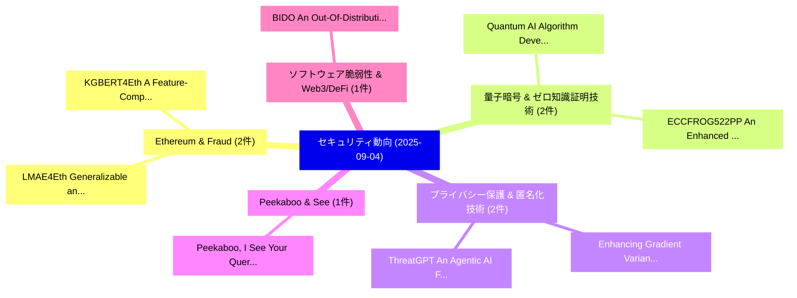

# 📅 02_daily: 日次エグゼクティブサマリー報告書 (2025-09-04)

**集計日時**: 2026-10-02 23:05:38 UTC  
**対象日付**: 2025-09-04  
**本日収集論文数**: 29 件  

---

## 💡 主要セキュリティ動向・脅威インサイト (Executive Insights)

本日の収集論文（計 29 件）において、以下の重点セキュリティ領域で活発な研究動向が確認されました：
- **Ethereum & Fraud** (2 件): 注目論文として 「KGBERT4Eth: A Feature-Complete...」、「LMAE4Eth: Generalizable and Ro...」 等が発表され、実務防御および攻撃検証の進展が見られます。
- **量子暗号 & ゼロ知識証明技術** (2 件): 注目論文として 「ECCFROG522PP: An Enhanced 522-...」、「Quantum AI Algorithm Developme...」 等が発表され、実務防御および攻撃検証の進展が見られます。
- **プライバシー保護 & 匿名化技術** (2 件): 注目論文として 「Enhancing Gradient Variance an...」、「ThreatGPT: An Agentic AI Frame...」 等が発表され、実務防御および攻撃検証の進展が見られます。
- **Peekaboo & See** (1 件): 注目論文として 「Peekaboo, I See Your Queries: ...」 等が発表され、実務防御および攻撃検証の進展が見られます。
- **ソフトウェア脆弱性 & Web3/DeFi** (1 件): 注目論文として 「BIDO: An Out-Of-Distribution R...」 等が発表され、実務防御および攻撃検証の進展が見られます。

### 🗺️ 技術・脅威トピックマインドマップ

---

## 📌 日次セキュリティ論文一覧 (日本語表形式)

| No | arXiv ID | 論文タイトル (日本語訳) | 重要キーワード | 構造化エグゼクティブ要約 (背景・提案・影響) | 脅威分類 | 詳細リンク |
|---|---|---|---|---|---|---|
| 1 | `2509.03806v1` | [Peekaboo, I See Your Queries: Passive Attacks Against DSSE Via Intermittent Observations（セキュリティ分析論文）](../../okf/papers/2025-09-04/2509.03806.md) | `Via Intermittent Observations`, `Hao Nie`, `Wei Wang` | 【提案】概要 (Overview & Key Finding) 本論文「Peekaboo, I See Your Queries: Passive Attacks Against D...。実証評価により経営層・セキュリティ管理者向け推奨アクション (E... | `cybersecurity` | [arXiv](https://arxiv.org/abs/2509.03806v1) &#124; [OKF](../../okf/papers/2025-09-04/2509.03806.md) |
| 2 | `2509.03807v2` | [BIDO: An Out-Of-Distribution Resistant Image-based Malware Detector（セキュリティ分析論文）](../../okf/papers/2025-09-04/2509.03807.md) | `Distribution Resistant Image`, `Malware Detector`, `Image-based Malware` | 【提案】概要 (Overview & Key Finding) 本論文「BIDO: An Out-Of-Distribution Resistant Image-based マルウェ...。実証評価により経営層・セキュリティ管理者向け推奨アクション (E... | `executive-summary` | [arXiv](https://arxiv.org/abs/2509.03807v2) &#124; [OKF](../../okf/papers/2025-09-04/2509.03807.md) |
| 3 | `2509.03821v2` | [Rethinking Tamper-Evident Logging: A High-Performance, Co-Designed Auditing System（セキュリティ分析論文）](../../okf/papers/2025-09-04/2509.03821.md) | `Designed Auditing System`, `Rethinking Tamper`, `Evident Logging` | 【提案】概要 (Overview & Key Finding) 本論文「Rethinking Tamper-Evident Logging: A High-Performance, ...。実証評価により経営層・セキュリティ管理者向け推奨アクション (E... | `cybersecurity` | [arXiv](https://arxiv.org/abs/2509.03821v2) &#124; [OKF](../../okf/papers/2025-09-04/2509.03821.md) |
| 4 | `2509.03860v1` | [KGBERT4Eth: A Feature-Complete Transformer Powered by Knowledge Graph for Multi-Task Ethereum Fraud Detection（セキュリティ分析論文）](../../okf/papers/2025-09-04/2509.03860.md) | `Task Ethereum Fraud Detection`, `Complete Transformer Powered`, `Knowledge Graph` | 【提案】概要 (Overview & Key Finding) 本論文「KGBERT4Eth: A Feature-Complete Transformer Powered by K...。実証評価により経営層・セキュリティ管理者向け推奨アクション (E... | `cybersecurity` | [arXiv](https://arxiv.org/abs/2509.03860v1) &#124; [OKF](../../okf/papers/2025-09-04/2509.03860.md) |
| 5 | `2509.03871v1` | [A Comprehensive Survey on Trustworthiness in Reasoning with 大規模言語モデル](../../okf/papers/2025-09-04/2509.03871.md) | `Comprehensive Survey`, `Large Language Models`, `Yanbo Wang` | 【提案】概要 (Overview & Key Finding) 本論文「A Comprehensive Survey on Trustworthiness in Reasoning ...。実証評価により経営層・セキュリティ管理者向け推奨アクション (E... | `cs.AI` | [arXiv](https://arxiv.org/abs/2509.03871v1) &#124; [OKF](../../okf/papers/2025-09-04/2509.03871.md) |
| 6 | `2509.03879v1` | [ShieldMMU: Detecting and Defending against Controlled-Channel Attacks in Shielding Memory System（セキュリティ分析論文）](../../okf/papers/2025-09-04/2509.03879.md) | `Shielding Memory System`, `Channel Attacks`, `Controlled-Channel Attacks` | 【提案】概要 (Overview & Key Finding) 本論文「ShieldMMU: Detecting and Defending against Controlled-C...。実証評価により経営層・セキュリティ管理者向け推奨アクション (E... | `executive-summary` | [arXiv](https://arxiv.org/abs/2509.03879v1) &#124; [OKF](../../okf/papers/2025-09-04/2509.03879.md) |
| 7 | `2509.03900v2` | [The Auth Shim: A Lightweight Architectural Pattern for Integrating Enterprise SSO with Standalone Open-Source Applications（セキュリティ分析論文）](../../okf/papers/2025-09-04/2509.03900.md) | `Lightweight Architectural Pattern`, `Integrating Enterprise`, `Standalone Open` | 【提案】概要 (Overview & Key Finding) 本論文「The Auth Shim: A Lightweight Architectural Pattern for ...。実証評価により経営層・セキュリティ管理者向け推奨アクション (E... | `executive-summary` | [arXiv](https://arxiv.org/abs/2509.03900v2) &#124; [OKF](../../okf/papers/2025-09-04/2509.03900.md) |
| 8 | `2509.03939v1` | [LMAE4Eth: Generalizable and Robust Ethereum Fraud Detection by Exploring Transaction Semantics and Masked Graph Embedding（セキュリティ分析論文）](../../okf/papers/2025-09-04/2509.03939.md) | `Robust Ethereum Fraud Detection`, `Exploring Transaction Semantics`, `Masked Graph Embedding` | 【提案】概要 (Overview & Key Finding) 本論文「LMAE4Eth: Generalizable and Robust Ethereum Fraud Detec...。実証評価により経営層・セキュリティ管理者向け推奨アクション (E... | `executive-summary` | [arXiv](https://arxiv.org/abs/2509.03939v1) &#124; [OKF](../../okf/papers/2025-09-04/2509.03939.md) |
| 9 | `2509.03985v2` | [NeuroBreak: Unveil Internal Jailbreak Mechanisms in 大規模言語モデル](../../okf/papers/2025-09-04/2509.03985.md) | `Unveil Internal Jailbreak Mechanisms`, `Large Language Models`, `Chuhan Zhang` | 【提案】概要 (Overview & Key Finding) 本論文「NeuroBreak: Unveil Internal ジェイルブレイク Mechanisms in 大規模言...。実証評価により経営層・セキュリティ管理者向け推奨アクション (E... | `cs.AI` | [arXiv](https://arxiv.org/abs/2509.03985v2) &#124; [OKF](../../okf/papers/2025-09-04/2509.03985.md) |
| 10 | `2509.04010v1` | [Systematic Timing Leakage NIST PQDSS Candidates: Tooling and Lessons Learnedの分析](../../okf/papers/2025-09-04/2509.04010.md) | `Systematic Timing Leakage`, `Lessons Learned`, `Mahmudul Faisal Al Ameen` | 【提案】概要 (Overview & Key Finding) 本論文「Systematic Timing Leakage NIST PQDSS Candidates: Toolin...。実証評価により経営層・セキュリティ管理者向け推奨アクション (E... | `cybersecurity` | [arXiv](https://arxiv.org/abs/2509.04010v1) &#124; [OKF](../../okf/papers/2025-09-04/2509.04010.md) |
| 11 | `2509.04070v1` | [Error Detection Schemes for Barrett Reduction of CT-BU on FPGA in Post Quantum Cryptography（セキュリティ分析論文）](../../okf/papers/2025-09-04/2509.04070.md) | `Error Detection Schemes`, `Post Quantum Cryptography`, `Barrett Reduction` | 【提案】概要 (Overview & Key Finding) 本論文「Error Detection Schemes for Barrett Reduction of CT-BU ...。実証評価により経営層・セキュリティ管理者向け推奨アクション (E... | `executive-summary` | [arXiv](https://arxiv.org/abs/2509.04070v1) &#124; [OKF](../../okf/papers/2025-09-04/2509.04070.md) |
| 12 | `2509.04080v1` | [ICSLure: A Very High Interaction Honeynet for PLC-based Industrial Control Systems（セキュリティ分析論文）](../../okf/papers/2025-09-04/2509.04080.md) | `Industrial Control Systems`, `PLC-based Industrial`, `Francesco Aurelio Pironti` | 【提案】概要 (Overview & Key Finding) 本論文「ICSLure: A Very High Interaction Honeynet for PLC-based...。実証評価により経営層・セキュリティ管理者向け推奨アクション (E... | `cybersecurity` | [arXiv](https://arxiv.org/abs/2509.04080v1) &#124; [OKF](../../okf/papers/2025-09-04/2509.04080.md) |
| 13 | `2509.04091v2` | [Revisiting Third-Party Library Detection: A Ground Truth Dataset and Its Implications Across Security Tasks（セキュリティ分析論文）](../../okf/papers/2025-09-04/2509.04091.md) | `Party Library Detection`, `Ground Truth Dataset`, `Revisiting Third` | 【提案】概要 (Overview & Key Finding) 本論文「Revisiting Third-Party Library Detection: A Ground Trut...。実証評価により経営層・セキュリティ管理者向け推奨アクション (E... | `cybersecurity` | [arXiv](https://arxiv.org/abs/2509.04091v2) &#124; [OKF](../../okf/papers/2025-09-04/2509.04091.md) |
| 14 | `2509.04097v3` | [ECCFROG522PP: An Enhanced 522-bit Weierstrass Elliptic Curve（セキュリティ分析論文）](../../okf/papers/2025-09-04/2509.04097.md) | `Weierstrass Elliptic Curve`, `522-bit Weierstrass`, `Duarte Melo` | 【提案】概要 (Overview & Key Finding) 本論文「ECCFROG522PP: An Enhanced 522-bit Weierstrass Elliptic ...。実証評価によりBuchanan - **公開日時**: `202... | `cybersecurity` | [arXiv](https://arxiv.org/abs/2509.04097v3) &#124; [OKF](../../okf/papers/2025-09-04/2509.04097.md) |
| 15 | `2509.04191v1` | [KubeGuard: LLM-Assisted Kubernetes Hardening via Configuration Files and Runtime Logs Analysis（セキュリティ分析論文）](../../okf/papers/2025-09-04/2509.04191.md) | `Assisted Kubernetes Hardening`, `Configuration Files`, `LLM-Assisted Kubernetes` | 【提案】概要 (Overview & Key Finding) 本論文「KubeGuard: LLM-Assisted Kubernetes Hardening via Config...。実証評価により経営層・セキュリティ管理者向け推奨アクション (E... | `executive-summary` | [arXiv](https://arxiv.org/abs/2509.04191v1) &#124; [OKF](../../okf/papers/2025-09-04/2509.04191.md) |
| 16 | `2509.04214v1` | [An Automated, Scalable Machine Learning Model Inversion Assessment Pipeline（セキュリティ分析論文）](../../okf/papers/2025-09-04/2509.04214.md) | `Scalable Machine Learning Model Inversion Assessment Pipeline`, `Tyler Shumaker`, `Jessica Carpenter` | 【提案】概要 (Overview & Key Finding) 本論文「An Automated, Scalable Machine Learning モデル反転攻撃 Assessm...。実証評価により経営層・セキュリティ管理者向け推奨アクション (E... | `cybersecurity` | [arXiv](https://arxiv.org/abs/2509.04214v1) &#124; [OKF](../../okf/papers/2025-09-04/2509.04214.md) |
| 17 | `2509.04260v1` | [Vulnerabilities in Python Packages and Their Detectionの実証研究](../../okf/papers/2025-09-04/2509.04260.md) | `Python Packages`, `Terry Yue Zhuo`, `Haowei Quan` | 【提案】概要 (Overview & Key Finding) 本論文「Vulnerabilities in Python Packages and Their Detectionの...。実証評価により経営層・セキュリティ管理者向け推奨アクション (E... | `cs.AI` | [arXiv](https://arxiv.org/abs/2509.04260v1) &#124; [OKF](../../okf/papers/2025-09-04/2509.04260.md) |
| 18 | `2509.04403v2` | [Self-adaptive Dataset Construction for Real-World Multimodal Safety Scenarios（セキュリティ分析論文）](../../okf/papers/2025-09-04/2509.04403.md) | `World Multimodal Safety Scenarios`, `Dataset Construction`, `Self-adaptive Dataset` | 【提案】概要 (Overview & Key Finding) 本論文「Self-adaptive Dataset Construction for Real-World Multi...。実証評価により経営層・セキュリティ管理者向け推奨アクション (E... | `cs.CV` | [arXiv](https://arxiv.org/abs/2509.04403v2) &#124; [OKF](../../okf/papers/2025-09-04/2509.04403.md) |
| 19 | `2509.04615v1` | [Breaking to Build: A Threat Model of Prompt-Based Attacks for LLMsのセキュリティ強化](../../okf/papers/2025-09-04/2509.04615.md) | `Threat Model`, `Based Attacks`, `Prompt-Based Attacks` | 【提案】概要 (Overview & Key Finding) 本論文「Breaking to Build: A 脅威 Model of Prompt-Based Attacks f...。実証評価により経営層・セキュリティ管理者向け推奨アクション (E... | `executive-summary` | [arXiv](https://arxiv.org/abs/2509.04615v1) &#124; [OKF](../../okf/papers/2025-09-04/2509.04615.md) |
| 20 | `2509.04710v1` | [Network-Aware Differential Privacy（セキュリティ分析論文）](../../okf/papers/2025-09-04/2509.04710.md) | `Aware Differential Privacy`, `Network-Aware Differential`, `Zhou Li` | 【提案】概要 (Overview & Key Finding) 本論文「Network-Aware 差分プライバシー（セキュリティ分析論文）」（原題: Network-Aware 差...。実証評価により経営層・セキュリティ管理者向け推奨アクション (E... | `cybersecurity` | [arXiv](https://arxiv.org/abs/2509.04710v1) &#124; [OKF](../../okf/papers/2025-09-04/2509.04710.md) |
| 21 | `2509.05362v4` | [AI-in-the-Loop: Privacy Preserving Real-Time Scam Detection and Conversational Scambaiting by Leveraging LLMs and 連合学習](../../okf/papers/2025-09-04/2509.05362.md) | `Privacy Preserving Real`, `Time Scam Detection`, `Conversational Scambaiting` | 【提案】概要 (Overview & Key Finding) 本論文「AI-in-the-Loop: Privacy Preserving Real-Time Scam Detec...。実証評価により経営層・セキュリティ管理者向け推奨アクション (E... | `cs.AI` | [arXiv](https://arxiv.org/abs/2509.05362v4) &#124; [OKF](../../okf/papers/2025-09-04/2509.05362.md) |
| 22 | `2509.05366v1` | [A Framework for Detection and Classification of Attacks on Surveillance Cameras under IoT Networks（セキュリティ分析論文）](../../okf/papers/2025-09-04/2509.05366.md) | `Surveillance Cameras`, `Umair Amjid`, `Umar Khan` | 【提案】概要 (Overview & Key Finding) 本論文「A Framework for Detection and Classification of Attacks...。実証評価により経営層・セキュリティ管理者向け推奨アクション (E... | `cs.NI` | [arXiv](https://arxiv.org/abs/2509.05366v1) &#124; [OKF](../../okf/papers/2025-09-04/2509.05366.md) |
| 23 | `2509.05367v5` | [Between a Rock and a Hard Place: The Tension Between Ethical Reasoning and Safety Alignment in LLMs（セキュリティ分析論文）](../../okf/papers/2025-09-04/2509.05367.md) | `Hard Place`, `Safety Alignment`, `Shei Pern Chua` | 【提案】概要 (Overview & Key Finding) 本論文「Between a Rock and a Hard Place: The Tension Between Et...。実証評価により経営層・セキュリティ管理者向け推奨アクション (E... | `cs.AI` | [arXiv](https://arxiv.org/abs/2509.05367v5) &#124; [OKF](../../okf/papers/2025-09-04/2509.05367.md) |
| 24 | `2509.05370v1` | [Quantum AI Algorithm Development for Enhanced Cybersecurity: A Hybrid Approach to マルウェア検出](../../okf/papers/2025-09-04/2509.05370.md) | `Algorithm Development`, `Enhanced Cybersecurity`, `Malware Detection` | 【提案】概要 (Overview & Key Finding) 本論文「量子 AI Algorithm Development for Enhanced Cybersecurity:...。実証評価により経営層・セキュリティ管理者向け推奨アクション (E... | `cs.ET` | [arXiv](https://arxiv.org/abs/2509.05370v1) &#124; [OKF](../../okf/papers/2025-09-04/2509.05370.md) |
| 25 | `2509.05376v1` | [Privacy Preservation and Identity Tracing Prevention in AI-Driven Eye Tracking for Interactive Learning Environments（セキュリティ分析論文）](../../okf/papers/2025-09-04/2509.05376.md) | `Identity Tracing Prevention`, `Driven Eye Tracking`, `Interactive Learning Environments` | 【提案】概要 (Overview & Key Finding) 本論文「Privacy Preservation and Identity Tracing Prevention in...。実証評価により経営層・セキュリティ管理者向け推奨アクション (E... | `cs.AI` | [arXiv](https://arxiv.org/abs/2509.05376v1) &#124; [OKF](../../okf/papers/2025-09-04/2509.05376.md) |
| 26 | `2509.05377v1` | [Enhancing Gradient Variance and Differential Privacy in Quantum 連合学習](../../okf/papers/2025-09-04/2509.05377.md) | `Enhancing Gradient Variance`, `Differential Privacy`, `Quantum Federated Learning` | 【提案】概要 (Overview & Key Finding) 本論文「Enhancing Gradient Variance and 差分プライバシー in 量子 連合学習」（原題...。実証評価により経営層・セキュリティ管理者向け推奨アクション (E... | `executive-summary` | [arXiv](https://arxiv.org/abs/2509.05377v1) &#124; [OKF](../../okf/papers/2025-09-04/2509.05377.md) |
| 27 | `2509.05379v1` | [ThreatGPT: An Agentic AI Framework for Enhancing Public Safety through Threat Modeling（セキュリティ分析論文）](../../okf/papers/2025-09-04/2509.05379.md) | `Enhancing Public Safety`, `Threat Modeling`, `Sharif Noor Zisad` | 【提案】概要 (Overview & Key Finding) 本論文「ThreatGPT: An Agentic AI Framework for Enhancing Public...。実証評価により経営層・セキュリティ管理者向け推奨アクション (E... | `cs.AI` | [arXiv](https://arxiv.org/abs/2509.05379v1) &#124; [OKF](../../okf/papers/2025-09-04/2509.05379.md) |
| 28 | `2509.05380v1` | [Cumplimiento del Reglamento (UE) 2024/1689 en robótica y sistemas autónomos: una revisión sistemática de la literatura（セキュリティ分析論文）](../../okf/papers/2025-09-04/2509.05380.md) | `Yoana Pita Lorenzo`, `Raw Meta`, `Executive Summary` | 【提案】概要 (Overview & Key Finding) 本論文「Cumplimiento del Reglamento (UE) 2024/1689 en robótica ...。実証評価により経営層・セキュリティ管理者向け推奨アクション (E... | `cs.AI` | [arXiv](https://arxiv.org/abs/2509.05380v1) &#124; [OKF](../../okf/papers/2025-09-04/2509.05380.md) |
| 29 | `2509.12221v1` | [MEUV: Achieving Fine-Grained Capability Activation in 大規模言語モデル via Mutually Exclusive Unlock Vectors](../../okf/papers/2025-09-04/2509.12221.md) | `Grained Capability Activation`, `Mutually Exclusive Unlock Vectors`, `Achieving Fine` | 【提案】概要 (Overview & Key Finding) 本論文「MEUV: Achieving Fine-Grained Capability Activation in 大...。実証評価により経営層・セキュリティ管理者向け推奨アクション (E... | `cs.AI` | [arXiv](https://arxiv.org/abs/2509.12221v1) &#124; [OKF](../../okf/papers/2025-09-04/2509.12221.md) |

