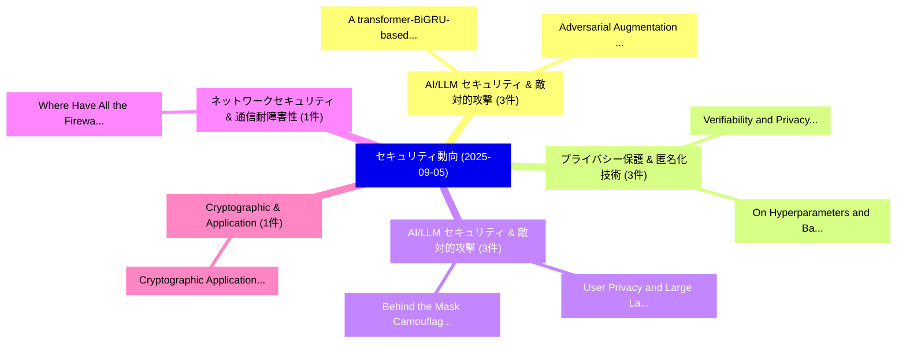

# 📅 02_daily: 日次エグゼクティブサマリー報告書 (2025-09-05)

**集計日時**: 2026-10-02 23:05:38 UTC  
**対象日付**: 2025-09-05  
**本日収集論文数**: 20 件  

---

## 💡 主要セキュリティ動向・脅威インサイト (Executive Insights)

本日の収集論文（計 20 件）において、以下の重点セキュリティ領域で活発な研究動向が確認されました：
- **AI/LLM セキュリティ & 敵対的攻撃** (3 件): 注目論文として 「A transformer-BiGRU-based fram...」、「Adversarial Augmentation and A...」 等が発表され、実務防御および攻撃検証の進展が見られます。
- **プライバシー保護 & 匿名化技術** (3 件): 注目論文として 「Verifiability and Privacy in 連...」、「On Hyperparameters and Backdoo...」 等が発表され、実務防御および攻撃検証の進展が見られます。
- **AI/LLM セキュリティ & 敵対的攻撃** (3 件): 注目論文として 「User Privacy and Large Languag...」、「Behind the Mask: Camouflaged J...」 等が発表され、実務防御および攻撃検証の進展が見られます。
- **ネットワークセキュリティ & 通信耐障害性** (1 件): 注目論文として 「Where Have All the Firewalls G...」 等が発表され、実務防御および攻撃検証の進展が見られます。
- **Cryptographic & Application** (1 件): 注目論文として 「Cryptographic Application of E...」 等が発表され、実務防御および攻撃検証の進展が見られます。

### 🗺️ 技術・脅威トピックマインドマップ

---

## 📌 日次セキュリティ論文一覧 (日本語表形式)

| No | arXiv ID | 論文タイトル (日本語訳) | 重要キーワード | 構造化エグゼクティブ要約 (背景・提案・影響) | 脅威分類 | 詳細リンク |
|---|---|---|---|---|---|---|
| 1 | `2509.04792v1` | [Where Have All the Firewalls Gone? Security Consequences of Residential IPv6 Transition（セキュリティ分析論文）](../../okf/papers/2025-09-05/2509.04792.md) | `Firewalls Gone`, `Security Consequences`, `Erik Rye` | 【提案】Security Consequences of Residential IPv6 Transition ### (日本語題名: Where Have All the Fir...。実証評価により経営層・セキュリティ管理者向け推奨アクション (E... | `cs.NI` | [arXiv](https://arxiv.org/abs/2509.04792v1) &#124; [OKF](../../okf/papers/2025-09-05/2509.04792.md) |
| 2 | `2509.04925v1` | [A transformer-BiGRU-based framework with data augmentation and confident learning for network intrusion detection（セキュリティ分析論文）](../../okf/papers/2025-09-05/2509.04925.md) | `Jiale Zhang`, `Fei Li`, `Kewei Li` | 【提案】概要 (Overview & Key Finding) 本論文「A transformer-BiGRU-based framework with data augmentat...。実証評価により経営層・セキュリティ管理者向け推奨アクション (E... | `executive-summary` | [arXiv](https://arxiv.org/abs/2509.04925v1) &#124; [OKF](../../okf/papers/2025-09-05/2509.04925.md) |
| 3 | `2509.04941v1` | [Cryptographic Application of Elliptic Curve with High Rank（セキュリティ分析論文）](../../okf/papers/2025-09-05/2509.04941.md) | `Cryptographic Application`, `Elliptic Curve`, `High Rank` | 【提案】概要 (Overview & Key Finding) 本論文「Cryptographic Application of Elliptic Curve with High R...。実証評価により経営層・セキュリティ管理者向け推奨アクション (E... | `cybersecurity` | [arXiv](https://arxiv.org/abs/2509.04941v1) &#124; [OKF](../../okf/papers/2025-09-05/2509.04941.md) |
| 4 | `2509.04967v1` | [FuzzRDUCC: Fuzzing with Reconstructed Def-Use Chain Coverage（セキュリティ分析論文）](../../okf/papers/2025-09-05/2509.04967.md) | `Use Chain Coverage`, `Reconstructed Def`, `Def-Use Chain` | 【提案】概要 (Overview & Key Finding) 本論文「FuzzRDUCC: Fuzzing with Reconstructed Def-Use Chain Cov...。実証評価により経営層・セキュリティ管理者向け推奨アクション (E... | `executive-summary` | [arXiv](https://arxiv.org/abs/2509.04967v1) &#124; [OKF](../../okf/papers/2025-09-05/2509.04967.md) |
| 5 | `2509.04999v1` | [Adversarial Augmentation and Active Sampling for Robust Cyber Anomaly Detection（セキュリティ分析論文）](../../okf/papers/2025-09-05/2509.04999.md) | `Robust Cyber Anomaly Detection`, `Adversarial Augmentation`, `Active Sampling` | 【提案】概要 (Overview & Key Finding) 本論文「Adversarial Augmentation and Active Sampling for Robust...。実証評価により経営層・セキュリティ管理者向け推奨アクション (E... | `cs.AI` | [arXiv](https://arxiv.org/abs/2509.04999v1) &#124; [OKF](../../okf/papers/2025-09-05/2509.04999.md) |
| 6 | `2509.05104v2` | [From Protest to Power Plant: Interpreting the Role of Escalatory Hacktivism in Cyber Conflict（セキュリティ分析論文）](../../okf/papers/2025-09-05/2509.05104.md) | `Power Plant`, `Escalatory Hacktivism`, `Cyber Conflict` | 【提案】概要 (Overview & Key Finding) 本論文「From Protest to Power Plant: Interpreting the Role of E...。実証評価により経営層・セキュリティ管理者向け推奨アクション (E... | `executive-summary` | [arXiv](https://arxiv.org/abs/2509.05104v2) &#124; [OKF](../../okf/papers/2025-09-05/2509.05104.md) |
| 7 | `2509.05149v3` | [Odoo-based Subcontract Inter-site Access Control Mechanism for Construction Projects（セキュリティ分析論文）](../../okf/papers/2025-09-05/2509.05149.md) | `Access Control Mechanism`, `Subcontract Inter`, `Odoo-based Subcontract` | 【提案】概要 (Overview & Key Finding) 本論文「Odoo-based Subcontract Inter-site アクセス制御 Mechanism for ...。実証評価により経営層・セキュリティ管理者向け推奨アクション (E... | `cybersecurity` | [arXiv](https://arxiv.org/abs/2509.05149v3) &#124; [OKF](../../okf/papers/2025-09-05/2509.05149.md) |
| 8 | `2509.05150v1` | [Reinforcing Secure Live Migration through Verifiable State Management（セキュリティ分析論文）](../../okf/papers/2025-09-05/2509.05150.md) | `Reinforcing Secure Live Migration`, `Verifiable State Management`, `Stefanos Vasileaidis` | 【提案】概要 (Overview & Key Finding) 本論文「Reinforcing Secure Live Migration through Verifiable St...。実証評価により経営層・セキュリティ管理者向け推奨アクション (E... | `cybersecurity` | [arXiv](https://arxiv.org/abs/2509.05150v1) &#124; [OKF](../../okf/papers/2025-09-05/2509.05150.md) |
| 9 | `2509.05161v1` | [Jamming Smarter, Not Harder: Exploiting O-RAN Y1 RAN Analytics for Efficient Interference（セキュリティ分析論文）](../../okf/papers/2025-09-05/2509.05161.md) | `Jamming Smarter`, `O-RAN Y1`, `Efficient Interference` | 【提案】背景とセキュリティ上の課題 (Background & Problem) 本研究はサイバー脅威環境におけるセキュリティ構造・脆弱性の検証を目的としています。(主要検出項目: ...。実証評価により経営層・セキュリティ管理者向け推奨アクション (E... | `cybersecurity` | [arXiv](https://arxiv.org/abs/2509.05161v1) &#124; [OKF](../../okf/papers/2025-09-05/2509.05161.md) |
| 10 | `2509.05162v2` | [Verifiability and Privacy in 連合学習 through Context-Hiding Multi-Key Homomorphic Authenticators](../../okf/papers/2025-09-05/2509.05162.md) | `Key Homomorphic Authenticators`, `Hiding Multi`, `Context-Hiding Multi` | 【提案】概要 (Overview & Key Finding) 本論文「Verifiability and Privacy in 連合学習 through Context-Hidin...。実証評価により経営層・セキュリティ管理者向け推奨アクション (E... | `cybersecurity` | [arXiv](https://arxiv.org/abs/2509.05162v2) &#124; [OKF](../../okf/papers/2025-09-05/2509.05162.md) |
| 11 | `2509.05192v2` | [On Hyperparameters and Backdoor-Resistance in Horizontal 連合学習](../../okf/papers/2025-09-05/2509.05192.md) | `Horizontal Federated Learning`, `Simon Lachnit`, `Ghassan Karame` | 【提案】概要 (Overview & Key Finding) 本論文「On Hyperparameters and Backdoor-Resistance in Horizonta...。実証評価により経営層・セキュリティ管理者向け推奨アクション (E... | `cybersecurity` | [arXiv](https://arxiv.org/abs/2509.05192v2) &#124; [OKF](../../okf/papers/2025-09-05/2509.05192.md) |
| 12 | `2509.05259v1` | [A Kolmogorov-Arnold Network for Interpretable Cyberattack Detection in AGC Systems（セキュリティ分析論文）](../../okf/papers/2025-09-05/2509.05259.md) | `Interpretable Cyberattack Detection`, `Arnold Network`, `Kolmogorov-Arnold Network` | 【提案】概要 (Overview & Key Finding) 本論文「A Kolmogorov-Arnold Network for Interpretable Cyberatta...。実証評価により経営層・セキュリティ管理者向け推奨アクション (E... | `executive-summary` | [arXiv](https://arxiv.org/abs/2509.05259v1) &#124; [OKF](../../okf/papers/2025-09-05/2509.05259.md) |
| 13 | `2509.05265v1` | [On Evaluating the Poisoning Robustness of 連合学習 under Local Differential Privacy](../../okf/papers/2025-09-05/2509.05265.md) | `Local Differential Privacy`, `Poisoning Robustness`, `Federated Learning` | 【提案】概要 (Overview & Key Finding) 本論文「On Evaluating the Poisoning Robustness of 連合学習 under Lo...。実証評価により経営層・セキュリティ管理者向け推奨アクション (E... | `executive-summary` | [arXiv](https://arxiv.org/abs/2509.05265v1) &#124; [OKF](../../okf/papers/2025-09-05/2509.05265.md) |
| 14 | `2509.05382v1` | [User Privacy and Large Language Models: An Frontier Developers' Privacy Policiesの分析](../../okf/papers/2025-09-05/2509.05382.md) | `Large Language Models`, `User Privacy`, `Frontier Developers` | 【提案】概要 (Overview & Key Finding) 本論文「User Privacy and Large Language Models: An Frontier Dev...。実証評価により経営層・セキュリティ管理者向け推奨アクション (E... | `cs.AI` | [arXiv](https://arxiv.org/abs/2509.05382v1) &#124; [OKF](../../okf/papers/2025-09-05/2509.05382.md) |
| 15 | `2509.05429v3` | [Safeguarding Graph Neural Networks against Topology Inference Attacks（セキュリティ分析論文）](../../okf/papers/2025-09-05/2509.05429.md) | `Safeguarding Graph Neural Networks`, `Topology Inference Attacks`, `Wendy Hui Wang` | 【提案】概要 (Overview & Key Finding) 本論文「Safeguarding Graph Neural Networks against Topology Inf...。実証評価により経営層・セキュリティ管理者向け推奨アクション (E... | `executive-summary` | [arXiv](https://arxiv.org/abs/2509.05429v3) &#124; [OKF](../../okf/papers/2025-09-05/2509.05429.md) |
| 16 | `2509.05471v1` | [Behind the Mask: Camouflaged Jailbreaks in Large Language Modelsのベンチマーク評価](../../okf/papers/2025-09-05/2509.05471.md) | `Benchmarking Camouflaged Jailbreaks`, `Large Language Models`, `Camouflaged Jailbreaks` | 【提案】概要 (Overview & Key Finding) 本論文「Behind the Mask: Camouflaged ジェイルブレイクs in Large Languag...。実証評価により経営層・セキュリティ管理者向け推奨アクション (E... | `cs.AI` | [arXiv](https://arxiv.org/abs/2509.05471v1) &#124; [OKF](../../okf/papers/2025-09-05/2509.05471.md) |
| 17 | `2509.05496v1` | [What is サイバーセキュリティ in Space?](../../okf/papers/2025-09-05/2509.05496.md) | `Jacques Bou Abdo`, `Charbel Mattar`, `Abdallah Makhoul` | 【提案】### (日本語題名: What is サイバーセキュリティ in Space?)  > [!NOTE] > **OKF Metadata**: Type = `securi...。実証評価により経営層・セキュリティ管理者向け推奨アクション (E... | `cybersecurity` | [arXiv](https://arxiv.org/abs/2509.05496v1) &#124; [OKF](../../okf/papers/2025-09-05/2509.05496.md) |
| 18 | `2509.05498v1` | [Bi-Level Game-Theoretic Planning of Cyber Deception for Cognitive Arbitrage（セキュリティ分析論文）](../../okf/papers/2025-09-05/2509.05498.md) | `Level Game`, `Theoretic Planning`, `Cyber Deception` | 【提案】概要 (Overview & Key Finding) 本論文「Bi-Level Game-Theoretic Planning of Cyber Deception for...。実証評価により経営層・セキュリティ管理者向け推奨アクション (E... | `executive-summary` | [arXiv](https://arxiv.org/abs/2509.05498v1) &#124; [OKF](../../okf/papers/2025-09-05/2509.05498.md) |
| 19 | `2509.09706v1` | [Differential Robustness in Transformer Language Models: Empirical Evaluation Under Adversarial Text Attacks（セキュリティ分析論文）](../../okf/papers/2025-09-05/2509.09706.md) | `Transformer Language Models`, `Differential Robustness`, `Taniya Gidatkar` | 【提案】概要 (Overview & Key Finding) 本論文「Differential Robustness in Transformer Language Models:...。実証評価により経営層・セキュリティ管理者向け推奨アクション (E... | `cs.AI` | [arXiv](https://arxiv.org/abs/2509.09706v1) &#124; [OKF](../../okf/papers/2025-09-05/2509.09706.md) |
| 20 | `2509.12223v1` | [Ratio1 -- AI meta-OS（セキュリティ分析論文）](../../okf/papers/2025-09-05/2509.12223.md) | `Alessandro De Franceschi`, `Andrei Damian`, `Petrica Butusina` | 【提案】概要 (Overview & Key Finding) 本論文「Ratio1 -- AI meta-OS（セキュリティ分析論文）」（原題: Ratio1 -- AI meta...。実証評価により経営層・セキュリティ管理者向け推奨アクション (E... | `cs.AI` | [arXiv](https://arxiv.org/abs/2509.12223v1) &#124; [OKF](../../okf/papers/2025-09-05/2509.12223.md) |

