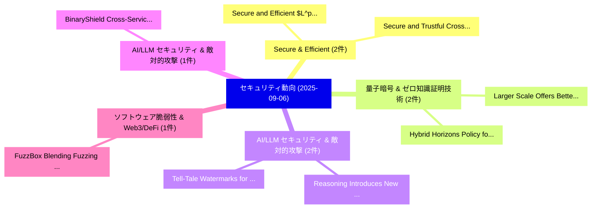

# 📅 02_daily: 日次エグゼクティブサマリー報告書 (2025-09-06)

**集計日時**: 2026-10-02 23:05:38 UTC  
**対象日付**: 2025-09-06  
**本日収集論文数**: 15 件  

---

## 💡 主要セキュリティ動向・脅威インサイト (Executive Insights)

本日の収集論文（計 15 件）において、以下の重点セキュリティ領域で活発な研究動向が確認されました：
- **Secure & Efficient** (2 件): 注目論文として 「Secure and Efficient $L^p$-Nor...」、「Secure and Trustful Cross-doma...」 等が発表され、実務防御および攻撃検証の進展が見られます。
- **量子暗号 & ゼロ知識証明技術** (2 件): 注目論文として 「Larger Scale Offers Better Sec...」、「Hybrid Horizons: Policy for Po...」 等が発表され、実務防御および攻撃検証の進展が見られます。
- **AI/LLM セキュリティ & 敵対的攻撃** (2 件): 注目論文として 「Reasoning Introduces New Poiso...」、「Tell-Tale Watermarks for Expla...」 等が発表され、実務防御および攻撃検証の進展が見られます。
- **AI/LLM セキュリティ & 敵対的攻撃** (1 件): 注目論文として 「BinaryShield: Cross-Service Th...」 等が発表され、実務防御および攻撃検証の進展が見られます。
- **ソフトウェア脆弱性 & Web3/DeFi** (1 件): 注目論文として 「FuzzBox: Blending Fuzzing into...」 等が発表され、実務防御および攻撃検証の進展が見られます。

### 🗺️ 技術・脅威トピックマインドマップ

---

## 📌 日次セキュリティ論文一覧 (日本語表形式)

| No | arXiv ID | 論文タイトル (日本語訳) | 重要キーワード | 構造化エグゼクティブ要約 (背景・提案・影響) | 脅威分類 | 詳細リンク |
|---|---|---|---|---|---|---|
| 1 | `2509.05552v1` | [Secure and Efficient $L^p$-Norm Computation for Two-Party Learning Applications（セキュリティ分析論文）](../../okf/papers/2025-09-06/2509.05552.md) | `Party Learning Applications`, `Norm Computation`, `Two-Party Learning` | 【提案】概要 (Overview & Key Finding) 本論文「Secure and Efficient $L^p$-Norm Computation for Two-Par...。実証評価により経営層・セキュリティ管理者向け推奨アクション (E... | `cybersecurity` | [arXiv](https://arxiv.org/abs/2509.05552v1) &#124; [OKF](../../okf/papers/2025-09-06/2509.05552.md) |
| 2 | `2509.05608v2` | [BinaryShield: Cross-Service Threat Intelligence in LLM Services using Privacy-Preserving Fingerprints（セキュリティ分析論文）](../../okf/papers/2025-09-06/2509.05608.md) | `Service Threat Intelligence`, `Cross-Service Threat`, `Preserving Fingerprints` | 【提案】概要 (Overview & Key Finding) 本論文「BinaryShield: Cross-Service 脅威 Intelligence in LLM Serv...。実証評価により経営層・セキュリティ管理者向け推奨アクション (E... | `cs.AI` | [arXiv](https://arxiv.org/abs/2509.05608v2) &#124; [OKF](../../okf/papers/2025-09-06/2509.05608.md) |
| 3 | `2509.05643v1` | [FuzzBox: Blending Fuzzing into Emulation for Binary-Only Embedded Targets（セキュリティ分析論文）](../../okf/papers/2025-09-06/2509.05643.md) | `Blending Fuzzing`, `Binary-Only Embedded`, `Carmine Cesarano` | 【提案】概要 (Overview & Key Finding) 本論文「FuzzBox: Blending Fuzzing into Emulation for Binary-Onl...。実証評価により経営層・セキュリティ管理者向け推奨アクション (E... | `executive-summary` | [arXiv](https://arxiv.org/abs/2509.05643v1) &#124; [OKF](../../okf/papers/2025-09-06/2509.05643.md) |
| 4 | `2509.05671v1` | [GraMFedDHAR: Graph Based Multimodal Differentially Private Federated HAR（セキュリティ分析論文）](../../okf/papers/2025-09-06/2509.05671.md) | `Graph Based Multimodal Differentially Private Federated`, `Labani Halder`, `Tanmay Sen` | 【提案】概要 (Overview & Key Finding) 本論文「GraMFedDHAR: Graph Based Multimodal Differentially Priv...。実証評価により経営層・セキュリティ管理者向け推奨アクション (E... | `cs.AI` | [arXiv](https://arxiv.org/abs/2509.05671v1) &#124; [OKF](../../okf/papers/2025-09-06/2509.05671.md) |
| 5 | `2509.05681v1` | [SEASONED: Semantic-Enhanced Self-Counterfactual Explainable Adversarial Exploiter Contractsの検出](../../okf/papers/2025-09-06/2509.05681.md) | `Enhanced Self`, `Semantic-Enhanced Self`, `Counterfactual Explainable Adversarial Exploiter` | 【提案】概要 (Overview & Key Finding) 本論文「SEASONED: Semantic-Enhanced Self-Counterfactual Explain...。実証評価により経営層・セキュリティ管理者向け推奨アクション (E... | `cs.AI` | [arXiv](https://arxiv.org/abs/2509.05681v1) &#124; [OKF](../../okf/papers/2025-09-06/2509.05681.md) |
| 6 | `2509.05698v1` | [KnowHow: Automatically Applying High-Level CTI Knowledge for Interpretable and Accurate Provenance Analysis（セキュリティ分析論文）](../../okf/papers/2025-09-06/2509.05698.md) | `Automatically Applying High`, `High-Level CTI`, `Yuhan Meng` | 【提案】概要 (Overview & Key Finding) 本論文「KnowHow: Automatically Applying High-Level CTI Knowledg...。実証評価により経営層・セキュリティ管理者向け推奨アクション (E... | `cybersecurity` | [arXiv](https://arxiv.org/abs/2509.05698v1) &#124; [OKF](../../okf/papers/2025-09-06/2509.05698.md) |
| 7 | `2509.05708v4` | [Larger Scale Offers Better Security in the Nakamoto-style Blockchain（セキュリティ分析論文）](../../okf/papers/2025-09-06/2509.05708.md) | `Larger Scale Offers Better Security`, `Nakamoto-style Blockchain`, `Junjie Hu` | 【提案】概要 (Overview & Key Finding) 本論文「Larger Scale Offers Better Security in the Nakamoto-sty...。実証評価により経営層・セキュリティ管理者向け推奨アクション (E... | `cybersecurity` | [arXiv](https://arxiv.org/abs/2509.05708v4) &#124; [OKF](../../okf/papers/2025-09-06/2509.05708.md) |
| 8 | `2509.05739v1` | [Reasoning Introduces New Poisoning Attacks Yet Makes Them More Complicated（セキュリティ分析論文）](../../okf/papers/2025-09-06/2509.05739.md) | `Reasoning Introduces New Poisoning Attacks Yet Makes`, `Hanna Foerster`, `Ilia Shumailov` | 【提案】概要 (Overview & Key Finding) 本論文「Reasoning Introduces New Poisoning Attacks Yet Makes Th...。実証評価により経営層・セキュリティ管理者向け推奨アクション (E... | `cs.AI` | [arXiv](https://arxiv.org/abs/2509.05739v1) &#124; [OKF](../../okf/papers/2025-09-06/2509.05739.md) |
| 9 | `2509.05753v2` | [Tell-Tale Watermarks for Explanatory Reasoning in Synthetic Media Forensics（セキュリティ分析論文）](../../okf/papers/2025-09-06/2509.05753.md) | `Synthetic Media Forensics`, `Tale Watermarks`, `Explanatory Reasoning` | 【提案】概要 (Overview & Key Finding) 本論文「Tell-Tale Watermarks for Explanatory Reasoning in Synth...。実証評価により経営層・セキュリティ管理者向け推奨アクション (E... | `cs.AI` | [arXiv](https://arxiv.org/abs/2509.05753v2) &#124; [OKF](../../okf/papers/2025-09-06/2509.05753.md) |
| 10 | `2509.05755v6` | [Red-Teaming Coding Agents from a Tool-Invocation Perspective: An Empirical Security Assessment（セキュリティ分析論文）](../../okf/papers/2025-09-06/2509.05755.md) | `Teaming Coding Agents`, `Invocation Perspective`, `Red-Teaming Coding` | 【提案】概要 (Overview & Key Finding) 本論文「Red-Teaming Coding Agents from a Tool-Invocation Perspe...。実証評価により経営層・セキュリティ管理者向け推奨アクション (E... | `cs.AI` | [arXiv](https://arxiv.org/abs/2509.05755v6) &#124; [OKF](../../okf/papers/2025-09-06/2509.05755.md) |
| 11 | `2509.05797v1` | [Secure and Trustful Cross-domain Communication with Decentralized Identifiers in 5G and Beyond（セキュリティ分析論文）](../../okf/papers/2025-09-06/2509.05797.md) | `Trustful Cross`, `Decentralized Identifiers`, `Cross-domain Communication` | 【提案】概要 (Overview & Key Finding) 本論文「Secure and Trustful Cross-domain Communication with Dec...。実証評価により経営層・セキュリティ管理者向け推奨アクション (E... | `cybersecurity` | [arXiv](https://arxiv.org/abs/2509.05797v1) &#124; [OKF](../../okf/papers/2025-09-06/2509.05797.md) |
| 12 | `2509.05831v3` | [Decoding Latent Attack Surfaces in LLMs: Prompt Injection via HTML in Web Summarization（セキュリティ分析論文）](../../okf/papers/2025-09-06/2509.05831.md) | `Decoding Latent Attack Surfaces`, `Prompt Injection`, `Web Summarization` | 【提案】概要 (Overview & Key Finding) 本論文「Decoding Latent Attack Surfaces in LLMs: プロンプトインジェクション ...。実証評価により経営層・セキュリティ管理者向け推奨アクション (E... | `cs.AI` | [arXiv](https://arxiv.org/abs/2509.05831v3) &#124; [OKF](../../okf/papers/2025-09-06/2509.05831.md) |
| 13 | `2509.05835v2` | [Yours or Mine? Overwriting Attacks Against Neural Audio Watermarking（セキュリティ分析論文）](../../okf/papers/2025-09-06/2509.05835.md) | `Lingfeng Yao`, `Chenpei Huang`, `Shengyao Wang` | 【提案】Overwriting Attacks Against Neural Audio Watermarking ### (日本語題名: Yours or Mine?。実証評価により経営層・セキュリティ管理者向け推奨アクション (Executive R... | `executive-summary` | [arXiv](https://arxiv.org/abs/2509.05835v2) &#124; [OKF](../../okf/papers/2025-09-06/2509.05835.md) |
| 14 | `2509.10540v1` | [EchoLeak: The First Real-World Zero-Click Prompt Injection Exploit in a Production LLM System（セキュリティ分析論文）](../../okf/papers/2025-09-06/2509.10540.md) | `Click Prompt Injection Exploit`, `World Zero`, `Real-World Zero` | 【提案】概要 (Overview & Key Finding) 本論文「EchoLeak: The First Real-World Zero-Click プロンプトインジェクション...。実証評価により経営層・セキュリティ管理者向け推奨アクション (E... | `cs.AI` | [arXiv](https://arxiv.org/abs/2509.10540v1) &#124; [OKF](../../okf/papers/2025-09-06/2509.10540.md) |
| 15 | `2510.02317v1` | [Hybrid Horizons: Policy for Post-Quantum Security（セキュリティ分析論文）](../../okf/papers/2025-09-06/2510.02317.md) | `Hybrid Horizons`, `Quantum Security`, `Post-Quantum Security` | 【提案】概要 (Overview & Key Finding) 本論文「Hybrid Horizons: Policy for Post-量子 Security（セキュリティ分析論文...。実証評価により経営層・セキュリティ管理者向け推奨アクション (E... | `cybersecurity` | [arXiv](https://arxiv.org/abs/2510.02317v1) &#124; [OKF](../../okf/papers/2025-09-06/2510.02317.md) |

