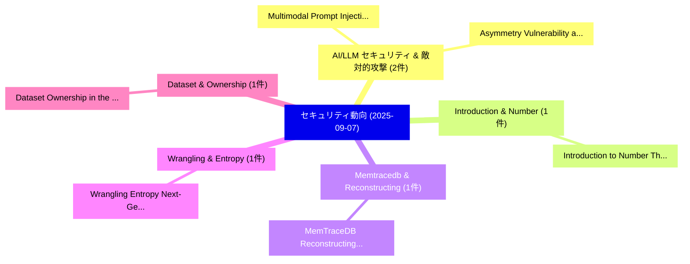

# 📅 02_daily: 日次エグゼクティブサマリー報告書 (2025-09-07)

**集計日時**: 2026-10-02 23:05:38 UTC  
**対象日付**: 2025-09-07  
**本日収集論文数**: 16 件  

---

## 💡 主要セキュリティ動向・脅威インサイト (Executive Insights)

本日の収集論文（計 16 件）において、以下の重点セキュリティ領域で活発な研究動向が確認されました：
- **AI/LLM セキュリティ & 敵対的攻撃** (2 件): 注目論文として 「Multimodal Prompt Injection At...」、「Asymmetry Vulnerability and Ph...」 等が発表され、実務防御および攻撃検証の進展が見られます。
- **Introduction & Number** (1 件): 注目論文として 「Introduction to Number Theoret...」 等が発表され、実務防御および攻撃検証の進展が見られます。
- **Memtracedb & Reconstructing** (1 件): 注目論文として 「MemTraceDB: Reconstructing MyS...」 等が発表され、実務防御および攻撃検証の進展が見られます。
- **Wrangling & Entropy** (1 件): 注目論文として 「Wrangling Entropy: Next-Genera...」 等が発表され、実務防御および攻撃検証の進展が見られます。
- **Dataset & Ownership** (1 件): 注目論文として 「Dataset Ownership in the Era o...」 等が発表され、実務防御および攻撃検証の進展が見られます。

### 🗺️ 技術・脅威トピックマインドマップ

---

## 📌 日次セキュリティ論文一覧 (日本語表形式)

| No | arXiv ID | 論文タイトル (日本語訳) | 重要キーワード | 構造化エグゼクティブ要約 (背景・提案・影響) | 脅威分類 | 詳細リンク |
|---|---|---|---|---|---|---|
| 1 | `2509.05883v1` | [Multimodal Prompt Injection Attacks: Risks and Defenses for Modern LLMs（セキュリティ分析論文）](../../okf/papers/2025-09-07/2509.05883.md) | `Multimodal Prompt Injection Attacks`, `Andrew Yeo`, `Daeseon Choi` | 【提案】概要 (Overview & Key Finding) 本論文「Multimodal プロンプトインジェクション Attacks: Risks and Defenses fo...。実証評価により経営層・セキュリティ管理者向け推奨アクション (E... | `cs.AI` | [arXiv](https://arxiv.org/abs/2509.05883v1) &#124; [OKF](../../okf/papers/2025-09-07/2509.05883.md) |
| 2 | `2509.05884v1` | [Introduction to Number Theoretic Transform（セキュリティ分析論文）](../../okf/papers/2025-09-07/2509.05884.md) | `Number Theoretic Transform`, `Banhirup Sengupta`, `Peenal Gupta` | 【提案】概要 (Overview & Key Finding) 本論文「Introduction to Number Theoretic Transform（セキュリティ分析論文）」...。実証評価により経営層・セキュリティ管理者向け推奨アクション (E... | `executive-summary` | [arXiv](https://arxiv.org/abs/2509.05884v1) &#124; [OKF](../../okf/papers/2025-09-07/2509.05884.md) |
| 3 | `2509.05891v1` | [MemTraceDB: Reconstructing MySQL User Activity Using ActiviTimeTrace Algorithm（セキュリティ分析論文）](../../okf/papers/2025-09-07/2509.05891.md) | `User Activity Using`, `Raw Meta`, `Executive Summary` | 【提案】概要 (Overview & Key Finding) 本論文「MemTraceDB: Reconstructing MySQL User Activity Using Ac...。実証評価により経営層・セキュリティ管理者向け推奨アクション (E... | `cs.DB` | [arXiv](https://arxiv.org/abs/2509.05891v1) &#124; [OKF](../../okf/papers/2025-09-07/2509.05891.md) |
| 4 | `2509.05893v1` | [Wrangling Entropy: Next-Generation Multi-Factor Key Derivation, Credential Hashing, and Credential Generation Functions（セキュリティ分析論文）](../../okf/papers/2025-09-07/2509.05893.md) | `Factor Key Derivation`, `Credential Generation Functions`, `Wrangling Entropy` | 【提案】概要 (Overview & Key Finding) 本論文「Wrangling Entropy: Next-Generation Multi-Factor Key Der...。実証評価により経営層・セキュリティ管理者向け推奨アクション (E... | `cybersecurity` | [arXiv](https://arxiv.org/abs/2509.05893v1) &#124; [OKF](../../okf/papers/2025-09-07/2509.05893.md) |
| 5 | `2509.05921v1` | [Dataset Ownership in the Era of 大規模言語モデル](../../okf/papers/2025-09-07/2509.05921.md) | `Dataset Ownership`, `Large Language Models`, `Kun Li` | 【提案】概要 (Overview & Key Finding) 本論文「Dataset Ownership in the Era of 大規模言語モデル」（原題: Dataset O...。実証評価により経営層・セキュリティ管理者向け推奨アクション (E... | `cybersecurity` | [arXiv](https://arxiv.org/abs/2509.05921v1) &#124; [OKF](../../okf/papers/2025-09-07/2509.05921.md) |
| 6 | `2509.06026v1` | [DCMI: A Differential Calibration Membership Inference Attack Against Retrieval-Augmented Generation（セキュリティ分析論文）](../../okf/papers/2025-09-07/2509.06026.md) | `Augmented Generation`, `Retrieval-Augmented Generation`, `Xinyu Gao` | 【提案】概要 (Overview & Key Finding) 本論文「DCMI: A Differential Calibration Membership Inference A...。実証評価により経営層・セキュリティ管理者向け推奨アクション (E... | `cs.AI` | [arXiv](https://arxiv.org/abs/2509.06026v1) &#124; [OKF](../../okf/papers/2025-09-07/2509.06026.md) |
| 7 | `2509.06052v1` | [Empirical Study of Code 大規模言語モデル for Binary Security Patch Detection](../../okf/papers/2025-09-07/2509.06052.md) | `Binary Security Patch Detection`, `Code Large Language Models`, `Qingyuan Li` | 【提案】概要 (Overview & Key Finding) 本論文「Empirical Study of Code 大規模言語モデル for Binary Security Pa...。実証評価により経営層・セキュリティ管理者向け推奨アクション (E... | `cs.AI` | [arXiv](https://arxiv.org/abs/2509.06052v1) &#124; [OKF](../../okf/papers/2025-09-07/2509.06052.md) |
| 8 | `2509.06071v1` | [Asymmetry Vulnerability and Physical Attacks on Online Map Construction for Autonomous Driving（セキュリティ分析論文）](../../okf/papers/2025-09-07/2509.06071.md) | `Online Map Construction`, `Asymmetry Vulnerability`, `Physical Attacks` | 【提案】概要 (Overview & Key Finding) 本論文「Asymmetry 脆弱性 and Physical Attacks on Online Map Constr...。実証評価により経営層・セキュリティ管理者向け推奨アクション (E... | `cybersecurity` | [arXiv](https://arxiv.org/abs/2509.06071v1) &#124; [OKF](../../okf/papers/2025-09-07/2509.06071.md) |
| 9 | `2509.06112v1` | [Reliable Service Provisioning for Dynamic UAV Clusters in Low-Altitude Economy Networksに向けて](../../okf/papers/2025-09-07/2509.06112.md) | `Low-Altitude Economy`, `Reliable Service Provisioning`, `Towards Reliable Service Provisioning` | 【提案】概要 (Overview & Key Finding) 本論文「Reliable Service Provisioning for Dynamic UAV Clusters ...。実証評価により経営層・セキュリティ管理者向け推奨アクション (E... | `cybersecurity` | [arXiv](https://arxiv.org/abs/2509.06112v1) &#124; [OKF](../../okf/papers/2025-09-07/2509.06112.md) |
| 10 | `2509.06127v1` | [CSI-IBBS: Identity-Based Blind Signature using CSIDH（セキュリティ分析論文）](../../okf/papers/2025-09-07/2509.06127.md) | `Based Blind Signature`, `Identity-Based Blind`, `Rohit Raj Sharma` | 【提案】概要 (Overview & Key Finding) 本論文「CSI-IBBS: Identity-Based Blind Signature using CSIDH（セキ...。実証評価により経営層・セキュリティ管理者向け推奨アクション (E... | `cybersecurity` | [arXiv](https://arxiv.org/abs/2509.06127v1) &#124; [OKF](../../okf/papers/2025-09-07/2509.06127.md) |
| 11 | `2509.06133v1` | [VehiclePassport: A GAIA-X-Aligned, Blockchain-Anchored Privacy-Preserving, Zero-Knowledge Digital Passport for Smart Vehicles（セキュリティ分析論文）](../../okf/papers/2025-09-07/2509.06133.md) | `Knowledge Digital Passport`, `Anchored Privacy`, `Smart Vehicles` | 【提案】概要 (Overview & Key Finding) 本論文「VehiclePassport: A GAIA-X-Aligned, Blockchain-Anchored ...。実証評価により経営層・セキュリティ管理者向け推奨アクション (E... | `executive-summary` | [arXiv](https://arxiv.org/abs/2509.06133v1) &#124; [OKF](../../okf/papers/2025-09-07/2509.06133.md) |
| 12 | `2509.06136v2` | ["Abuse Risks are Often Inherent to Product Features": Exploring AI Vendors' Bug Bounty and Responsible Disclosure Policies（セキュリティ分析論文）](../../okf/papers/2025-09-07/2509.06136.md) | `Responsible Disclosure Policies`, `Abuse Risks`, `Often Inherent` | 【提案】概要 (Overview & Key Finding) 本論文「"Abuse Risks are Often Inherent to Product Features": E...。実証評価により経営層・セキュリティ管理者向け推奨アクション (E... | `cybersecurity` | [arXiv](https://arxiv.org/abs/2509.06136v2) &#124; [OKF](../../okf/papers/2025-09-07/2509.06136.md) |
| 13 | `2509.06202v1` | [Lightweight Intrusion Detection System Using a Hybrid CNN and ConvNeXt-Tiny Model for Internet of Things Networks（セキュリティ分析論文）](../../okf/papers/2025-09-07/2509.06202.md) | `Lightweight Intrusion Detection System Using`, `Tiny Model`, `Things Networks` | 【提案】概要 (Overview & Key Finding) 本論文「Lightweight Intrusion Detection System Using a Hybrid C...。実証評価により経営層・セキュリティ管理者向け推奨アクション (E... | `cybersecurity` | [arXiv](https://arxiv.org/abs/2509.06202v1) &#124; [OKF](../../okf/papers/2025-09-07/2509.06202.md) |
| 14 | `2509.07016v1` | [Random Forest Stratified K-Fold Cross Validation on SYN DoS Attack SD-IoV（セキュリティ分析論文）](../../okf/papers/2025-09-07/2509.07016.md) | `Random Forest Stratified`, `Fold Cross Validation`, `K-Fold Cross` | 【提案】概要 (Overview & Key Finding) 本論文「Random Forest Stratified K-Fold Cross Validation on SYN...。実証評価により経営層・セキュリティ管理者向け推奨アクション (E... | `cs.AI` | [arXiv](https://arxiv.org/abs/2509.07016v1) &#124; [OKF](../../okf/papers/2025-09-07/2509.07016.md) |
| 15 | `2509.10543v1` | [Robust DDoS-Attack Classification with 3D CNNs Against Adversarial Methods（セキュリティ分析論文）](../../okf/papers/2025-09-07/2509.10543.md) | `Attack Classification`, `DDoS-Attack Classification`, `Landon Bragg` | 【提案】概要 (Overview & Key Finding) 本論文「Robust DDoS-Attack Classification with 3D CNNs Against ...。実証評価により経営層・セキュリティ管理者向け推奨アクション (E... | `cs.AI` | [arXiv](https://arxiv.org/abs/2509.10543v1) &#124; [OKF](../../okf/papers/2025-09-07/2509.10543.md) |
| 16 | `2509.10545v2` | [Decentralized Identity Management on Ripple: A Conceptual Framework for High-Speed, Low-Cost Identity Transactions in Attestation-Based Attribute-Based Identity（セキュリティ分析論文）](../../okf/papers/2025-09-07/2509.10545.md) | `Decentralized Identity Management`, `Cost Identity Transactions`, `Based Attribute` | 【提案】概要 (Overview & Key Finding) 本論文「Decentralized Identity Management on Ripple: A Conceptu...。実証評価により経営層・セキュリティ管理者向け推奨アクション (E... | `executive-summary` | [arXiv](https://arxiv.org/abs/2509.10545v2) &#124; [OKF](../../okf/papers/2025-09-07/2509.10545.md) |

