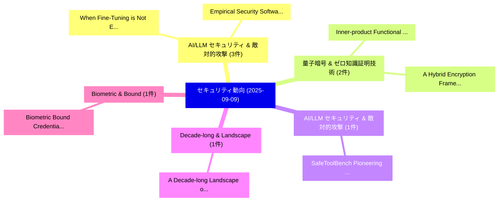

# 📅 02_daily: 日次エグゼクティブサマリー報告書 (2025-09-09)

**集計日時**: 2026-10-02 23:05:39 UTC  
**対象日付**: 2025-09-09  
**本日収集論文数**: 23 件  

---

## 💡 主要セキュリティ動向・脅威インサイト (Executive Insights)

本日の収集論文（計 23 件）において、以下の重点セキュリティ領域で活発な研究動向が確認されました：
- **AI/LLM セキュリティ & 敵対的攻撃** (3 件): 注目論文として 「When Fine-Tuning is Not Enough...」、「Empirical Security Software-ba...」 等が発表され、実務防御および攻撃検証の進展が見られます。
- **量子暗号 & ゼロ知識証明技術** (2 件): 注目論文として 「Inner-product Functional Encry...」、「A Hybrid Encryption Framework ...」 等が発表され、実務防御および攻撃検証の進展が見られます。
- **AI/LLM セキュリティ & 敵対的攻撃** (1 件): 注目論文として 「SafeToolBench: Pioneering a Pr...」 等が発表され、実務防御および攻撃検証の進展が見られます。
- **Decade-long & Landscape** (1 件): 注目論文として 「A Decade-long Landscape of Adv...」 等が発表され、実務防御および攻撃検証の進展が見られます。
- **Biometric & Bound** (1 件): 注目論文として 「Biometric Bound Credentials fo...」 等が発表され、実務防御および攻撃検証の進展が見られます。

### 🗺️ 技術・脅威トピックマインドマップ

---

## 📌 日次セキュリティ論文一覧 (日本語表形式)

| No | arXiv ID | 論文タイトル (日本語訳) | 重要キーワード | 構造化エグゼクティブ要約 (背景・提案・影響) | 脅威分類 | 詳細リンク |
|---|---|---|---|---|---|---|
| 1 | `2509.07315v1` | [SafeToolBench: Pioneering a Prospective Benchmark to Evaluating Tool Utilization Safety in LLMs（セキュリティ分析論文）](../../okf/papers/2025-09-09/2509.07315.md) | `Evaluating Tool Utilization Safety`, `Prospective Benchmark`, `Hongfei Xia` | 【提案】概要 (Overview & Key Finding) 本論文「SafeToolBench: Pioneering a Prospective Benchmark to Ev...。実証評価により経営層・セキュリティ管理者向け推奨アクション (E... | `executive-summary` | [arXiv](https://arxiv.org/abs/2509.07315v1) &#124; [OKF](../../okf/papers/2025-09-09/2509.07315.md) |
| 2 | `2509.07323v1` | [When Fine-Tuning is Not Enough: Lessons from HSAD on Hybrid and Adversarial Audio Spoof Detection（セキュリティ分析論文）](../../okf/papers/2025-09-09/2509.07323.md) | `Adversarial Audio Spoof Detection`, `Bin Hu`, `Kunyang Huang` | 【提案】背景とセキュリティ上の課題 (Background & Problem) 本研究はサイバー脅威環境におけるセキュリティ構造・脆弱性の検証を目的としています。(主要検出項目: ...。実証評価により経営層・セキュリティ管理者向け推奨アクション (E... | `executive-summary` | [arXiv](https://arxiv.org/abs/2509.07323v1) &#124; [OKF](../../okf/papers/2025-09-09/2509.07323.md) |
| 3 | `2509.07457v2` | [A Decade-long Landscape of Advanced Persistent Threats: Longitudinal Analysis and Global Trends（セキュリティ分析論文）](../../okf/papers/2025-09-09/2509.07457.md) | `Advanced Persistent Threats`, `Global Trends`, `Decade-long Landscape` | 【提案】概要 (Overview & Key Finding) 本論文「A Decade-long Landscape of Advanced Persistent Threats:...。実証評価により経営層・セキュリティ管理者向け推奨アクション (E... | `cybersecurity` | [arXiv](https://arxiv.org/abs/2509.07457v2) &#124; [OKF](../../okf/papers/2025-09-09/2509.07457.md) |
| 4 | `2509.07465v1` | [Biometric Bound Credentials for Age Verification（セキュリティ分析論文）](../../okf/papers/2025-09-09/2509.07465.md) | `Biometric Bound Credentials`, `Age Verification`, `Norman Poh` | 【提案】概要 (Overview & Key Finding) 本論文「Biometric Bound Credentials for Age Verification（セキュリティ...。実証評価により経営層・セキュリティ管理者向け推奨アクション (E... | `cybersecurity` | [arXiv](https://arxiv.org/abs/2509.07465v1) &#124; [OKF](../../okf/papers/2025-09-09/2509.07465.md) |
| 5 | `2509.07504v1` | [Backdoor Attacks and Defenses in Computer Vision Domain: A Survey（セキュリティ分析論文）](../../okf/papers/2025-09-09/2509.07504.md) | `Computer Vision Domain`, `Backdoor Attacks`, `Bilal Hussain Abbasi` | 【提案】概要 (Overview & Key Finding) 本論文「Backdoor Attacks and Defenses in Computer Vision Domain...。実証評価により経営層・セキュリティ管理者向け推奨アクション (E... | `cybersecurity` | [arXiv](https://arxiv.org/abs/2509.07504v1) &#124; [OKF](../../okf/papers/2025-09-09/2509.07504.md) |
| 6 | `2509.07505v1` | [Extension of Spatial k-Anonymity: New Metrics for Assessing the Anonymity of Geomasked Data Considering Realistic Attack Scenarios（セキュリティ分析論文）](../../okf/papers/2025-09-09/2509.07505.md) | `Geomasked Data Considering Realistic Attack Scenarios`, `New Metrics`, `Simon Cremer` | 【提案】概要 (Overview & Key Finding) 本論文「Extension of Spatial k-Anonymity: New Metrics for Asses...。実証評価により経営層・セキュリティ管理者向け推奨アクション (E... | `cybersecurity` | [arXiv](https://arxiv.org/abs/2509.07505v1) &#124; [OKF](../../okf/papers/2025-09-09/2509.07505.md) |
| 7 | `2509.07540v1` | [PatchSeeker: Mapping NVD Records to their Vulnerability-fixing Commits with LLM Generated Commits and Embeddings（セキュリティ分析論文）](../../okf/papers/2025-09-09/2509.07540.md) | `Generated Commits`, `Vulnerability-fixing Commits`, `Huu Hung Nguyen` | 【提案】概要 (Overview & Key Finding) 本論文「PatchSeeker: Mapping NVD Records to their 脆弱性-fixing Co...。実証評価により経営層・セキュリティ管理者向け推奨アクション (E... | `executive-summary` | [arXiv](https://arxiv.org/abs/2509.07540v1) &#124; [OKF](../../okf/papers/2025-09-09/2509.07540.md) |
| 8 | `2509.07606v1` | [Enhanced cast-128 with adaptive s-box optimization via neural networks for image protection（セキュリティ分析論文）](../../okf/papers/2025-09-09/2509.07606.md) | `s-box optimization`, `Fadhil Abbas Fadhil`, `Maryam Mahdi Alhusseini` | 【提案】概要 (Overview & Key Finding) 本論文「Enhanced cast-128 with adaptive s-box optimization via ...。実証評価により経営層・セキュリティ管理者向け推奨アクション (E... | `cybersecurity` | [arXiv](https://arxiv.org/abs/2509.07606v1) &#124; [OKF](../../okf/papers/2025-09-09/2509.07606.md) |
| 9 | `2509.07615v1` | [FlexEmu: Flexible MCU Peripheral Emulation (Extended Version)に向けて](../../okf/papers/2025-09-09/2509.07615.md) | `Peripheral Emulation`, `Extended Version`, `Towards Flexible` | 【提案】概要 (Overview & Key Finding) 本論文「FlexEmu: Flexible MCU Peripheral Emulation (Extended Ve...。実証評価により経営層・セキュリティ管理者向け推奨アクション (E... | `cybersecurity` | [arXiv](https://arxiv.org/abs/2509.07615v1) &#124; [OKF](../../okf/papers/2025-09-09/2509.07615.md) |
| 10 | `2509.07637v1` | [Embedded Off-Switches for AI Compute（セキュリティ分析論文）](../../okf/papers/2025-09-09/2509.07637.md) | `James Petrie`, `Raw Meta`, `Executive Summary` | 【提案】概要 (Overview & Key Finding) 本論文「Embedded Off-Switches for AI Compute（セキュリティ分析論文）」（原題: E...。実証評価により経営層・セキュリティ管理者向け推奨アクション (E... | `cybersecurity` | [arXiv](https://arxiv.org/abs/2509.07637v1) &#124; [OKF](../../okf/papers/2025-09-09/2509.07637.md) |
| 11 | `2509.07649v1` | [Leveraging Digital Twin-as-a-Service Continuous and Automated Cybersecurity Certificationに向けて](../../okf/papers/2025-09-09/2509.07649.md) | `Leveraging Digital Twin`, `Service Towards Continuous`, `Automated Cybersecurity Certification` | 【提案】概要 (Overview & Key Finding) 本論文「Leveraging Digital Twin-as-a-Service Continuous and Aut...。実証評価により経営層・セキュリティ管理者向け推奨アクション (E... | `executive-summary` | [arXiv](https://arxiv.org/abs/2509.07649v1) &#124; [OKF](../../okf/papers/2025-09-09/2509.07649.md) |
| 12 | `2509.07755v2` | [Factuality Beyond Coherence: Evaluating LLM Watermarking Methods for Medical Texts（セキュリティ分析論文）](../../okf/papers/2025-09-09/2509.07755.md) | `Factuality Beyond Coherence`, `Watermarking Methods`, `Medical Texts` | 【提案】概要 (Overview & Key Finding) 本論文「Factuality Beyond Coherence: Evaluating LLM Watermarkin...。実証評価により経営層・セキュリティ管理者向け推奨アクション (E... | `executive-summary` | [arXiv](https://arxiv.org/abs/2509.07755v2) &#124; [OKF](../../okf/papers/2025-09-09/2509.07755.md) |
| 13 | `2509.07757v2` | [Empirical Security Software-based Fault Isolation through Controlled Fault Injectionの分析](../../okf/papers/2025-09-09/2509.07757.md) | `Fault Isolation`, `Software-based Fault`, `Empirical Security Software` | 【提案】概要 (Overview & Key Finding) 本論文「Empirical Security Software-based Fault Isolation throu...。実証評価により経営層・セキュリティ管理者向け推奨アクション (E... | `cybersecurity` | [arXiv](https://arxiv.org/abs/2509.07757v2) &#124; [OKF](../../okf/papers/2025-09-09/2509.07757.md) |
| 14 | `2509.07764v1` | [AgentSentinel: An End-to-End and Real-Time Security Defense Framework for Computer-Use Agents（セキュリティ分析論文）](../../okf/papers/2025-09-09/2509.07764.md) | `Use Agents`, `Real-Time Security`, `Computer-Use Agents` | 【提案】概要 (Overview & Key Finding) 本論文「AgentSentinel: An End-to-End and Real-Time Security Def...。実証評価により経営層・セキュリティ管理者向け推奨アクション (E... | `cybersecurity` | [arXiv](https://arxiv.org/abs/2509.07764v1) &#124; [OKF](../../okf/papers/2025-09-09/2509.07764.md) |
| 15 | `2509.07804v1` | [Inner-product Functional Encryption with Fine-grained Revocation for Flexible EHR Sharing（セキュリティ分析論文）](../../okf/papers/2025-09-09/2509.07804.md) | `Functional Encryption`, `Inner-product Functional`, `Fine-grained Revocation` | 【提案】概要 (Overview & Key Finding) 本論文「Inner-product Functional Encryption with Fine-grained R...。実証評価により経営層・セキュリティ管理者向け推奨アクション (E... | `cybersecurity` | [arXiv](https://arxiv.org/abs/2509.07804v1) &#124; [OKF](../../okf/papers/2025-09-09/2509.07804.md) |
| 16 | `2509.07924v1` | [A Non-Monotonic Relationship: An Empirical Hybrid Quantum Classifiers for Unseen Ransomware Detectionの分析](../../okf/papers/2025-09-09/2509.07924.md) | `Monotonic Relationship`, `Non-Monotonic Relationship`, `Hybrid Quantum Classifiers` | 【提案】概要 (Overview & Key Finding) 本論文「A Non-Monotonic Relationship: An Empirical Hybrid 量子 Cl...。実証評価により経営層・セキュリティ管理者向け推奨アクション (E... | `executive-summary` | [arXiv](https://arxiv.org/abs/2509.07924v1) &#124; [OKF](../../okf/papers/2025-09-09/2509.07924.md) |
| 17 | `2509.07939v2` | [Guided Reasoning in LLM-Driven Penetration Testing Using Structured Attack Trees（セキュリティ分析論文）](../../okf/papers/2025-09-09/2509.07939.md) | `Driven Penetration Testing Using Structured Attack Trees`, `Guided Reasoning`, `LLM-Driven Penetration` | 【提案】概要 (Overview & Key Finding) 本論文「Guided Reasoning in LLM-Driven Penetration Testing Usin...。実証評価により経営層・セキュリティ管理者向け推奨アクション (E... | `executive-summary` | [arXiv](https://arxiv.org/abs/2509.07939v2) &#124; [OKF](../../okf/papers/2025-09-09/2509.07939.md) |
| 18 | `2509.07941v1` | [ImportSnare: Directed "Code Manual" Hijacking in Retrieval-Augmented Code Generation（セキュリティ分析論文）](../../okf/papers/2025-09-09/2509.07941.md) | `Augmented Code Generation`, `Code Manual`, `Retrieval-Augmented Code` | 【提案】概要 (Overview & Key Finding) 本論文「ImportSnare: Directed "Code Manual" Hijacking in Retrie...。実証評価により経営層・セキュリティ管理者向け推奨アクション (E... | `cs.AI` | [arXiv](https://arxiv.org/abs/2509.07941v1) &#124; [OKF](../../okf/papers/2025-09-09/2509.07941.md) |
| 19 | `2509.08083v1` | [Establishing a Baseline of Software Supply Chain Security Task Adoption by Software Organizations（セキュリティ分析論文）](../../okf/papers/2025-09-09/2509.08083.md) | `Software Supply Chain Security Task Adoption`, `Software Organizations`, `Software Supply Ch` | 【提案】概要 (Overview & Key Finding) 本論文「Establishing a Baseline of Software Supply Chain Securi...。実証評価により経営層・セキュリティ管理者向け推奨アクション (E... | `cybersecurity` | [arXiv](https://arxiv.org/abs/2509.08083v1) &#124; [OKF](../../okf/papers/2025-09-09/2509.08083.md) |
| 20 | `2509.08089v2` | [Hammer and Anvil: Toward a Theory of Backdoors in 連合学習](../../okf/papers/2025-09-09/2509.08089.md) | `Federated Learning`, `Lucas Fenaux`, `Zheng Wang` | 【提案】概要 (Overview & Key Finding) 本論文「Hammer and Anvil: Toward a Theory of Backdoors in 連合学習」...。実証評価により経営層・セキュリティ管理者向け推奨アクション (E... | `executive-summary` | [arXiv](https://arxiv.org/abs/2509.08089v2) &#124; [OKF](../../okf/papers/2025-09-09/2509.08089.md) |
| 21 | `2509.08091v1` | [SAGE: Sample-Aware Guarding Engine for Robust Intrusion Detection Against Adversarial Attacks（セキュリティ分析論文）](../../okf/papers/2025-09-09/2509.08091.md) | `Aware Guarding Engine`, `Sample-Aware Guarding`, `Aware Guarding Engi` | 【提案】概要 (Overview & Key Finding) 本論文「SAGE: Sample-Aware Guarding Engine for Robust Intrusion...。実証評価により経営層・セキュリティ管理者向け推奨アクション (E... | `cybersecurity` | [arXiv](https://arxiv.org/abs/2509.08091v1) &#124; [OKF](../../okf/papers/2025-09-09/2509.08091.md) |
| 22 | `2509.10550v2` | [Auditable Early Stopping for Agentic Routing: Ledger-Verified Run-Wise Certificates under Local DP（セキュリティ分析論文）](../../okf/papers/2025-09-09/2509.10550.md) | `Auditable Early Stopping`, `Agentic Routing`, `Verified Run` | 【提案】概要 (Overview & Key Finding) 本論文「Auditable Early Stopping for Agentic Routing: Ledger-Ve...。実証評価により経営層・セキュリティ管理者向け推奨アクション (E... | `executive-summary` | [arXiv](https://arxiv.org/abs/2509.10550v2) &#124; [OKF](../../okf/papers/2025-09-09/2509.10550.md) |
| 23 | `2509.10551v1` | [A Hybrid Encryption Framework Combining Classical, Post-Quantum, and QKD Methods（セキュリティ分析論文）](../../okf/papers/2025-09-09/2509.10551.md) | `Amal Raj`, `Vivek Balachandran`, `Raw Meta` | 【提案】概要 (Overview & Key Finding) 本論文「A Hybrid Encryption Framework Combining Classical, Post...。実証評価により経営層・セキュリティ管理者向け推奨アクション (E... | `executive-summary` | [arXiv](https://arxiv.org/abs/2509.10551v1) &#124; [OKF](../../okf/papers/2025-09-09/2509.10551.md) |

